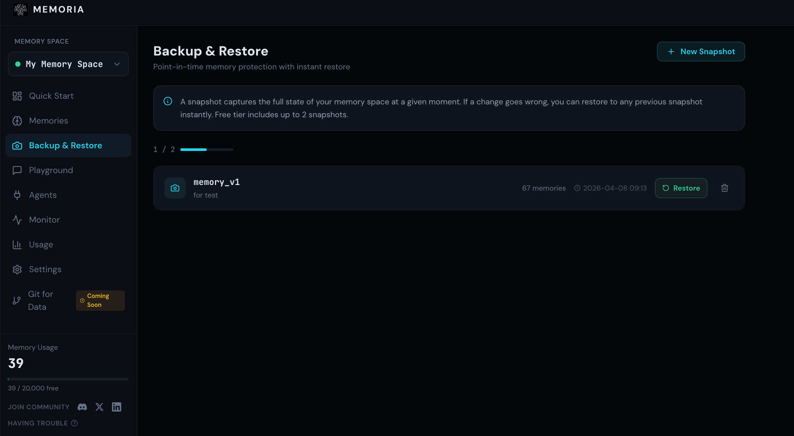
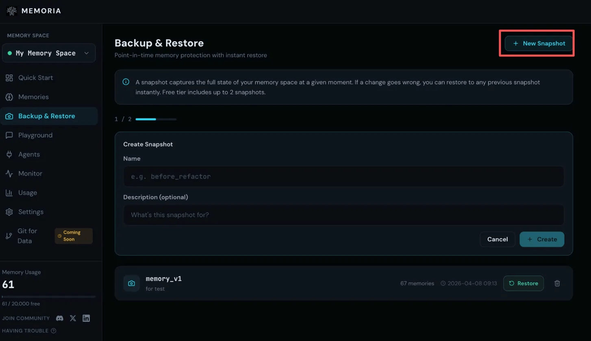
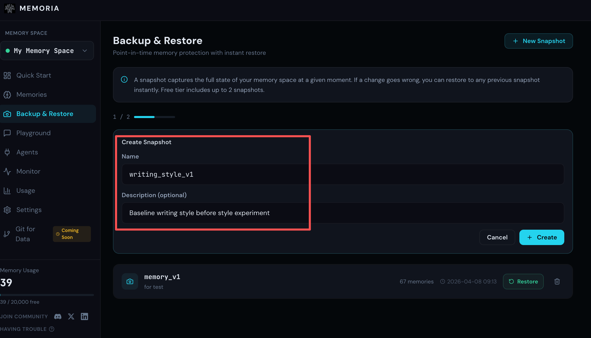
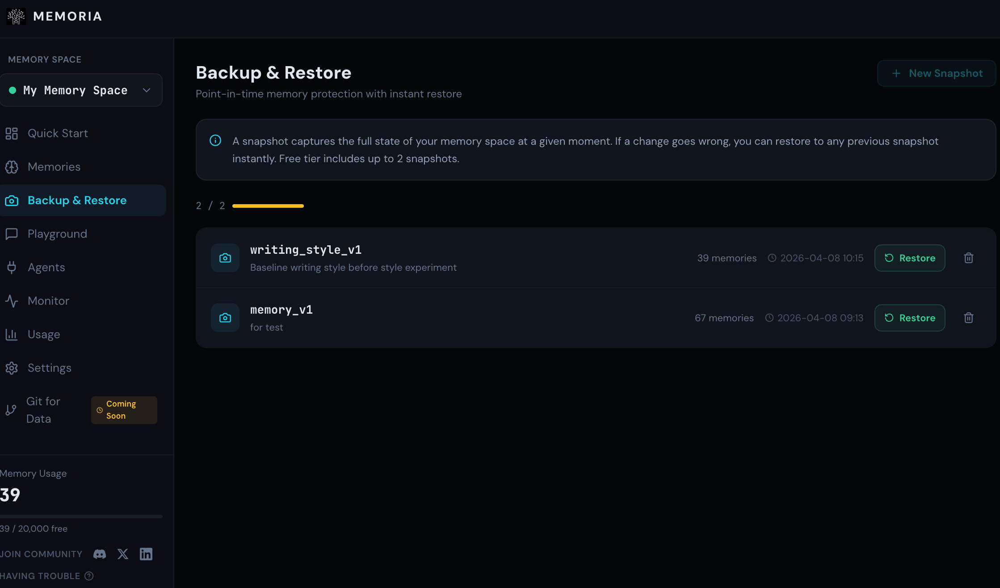
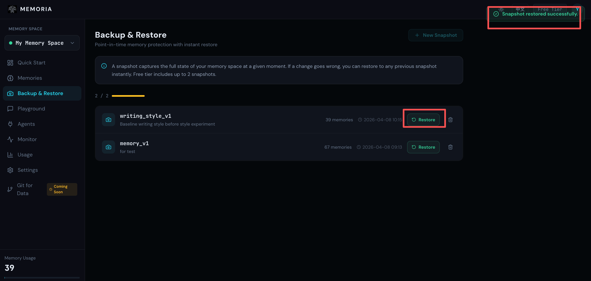

# Memoria Backup and Restore Is Now Available: Your Agent Finally Has Save Points

Memoria's backup and restore feature is now available. You can snapshot an Agent's memory at any point in time and restore it instantly when something goes wrong. The free version provides two snapshots.

But before introducing how to use it, we want to talk about why we built this feature.

There is a kind of problem that is hard to notice when it happens.

It is not a sudden failure, but a gradual drift: a temporary task that steers a conversation in an unexpected direction, a prompt you casually tested, or a session you can barely remember. Your Agent did not do anything wrong. It simply remembered everything as usual. The problem is that not every conversation is something you truly want it to learn from, and it has no way to distinguish that.

More troublesome still, this deviation has no clear source. You cannot point to one conversation and say, "This is where it went wrong." It is often the result of many interactions accumulating over time. By the time you notice something is wrong, the ideal version you carefully tuned is already gone.

So you open the memory list and face hundreds or thousands of records, checking them one by one. Delete too much, and you lose genuinely important content. Delete too little, and nothing improves. You are not really repairing anything; you are guessing blindly.

### Tuning an Ideal Agent Is Harder Than It Looks

The investment involved is easy to underestimate.

It is not as simple as entering a few rules. It is the accumulated result of dozens of subtle adjustments: how it phrases things, how it understands your real intent, and even how it grasps what you mean before you finish speaking. You are gradually transferring your way of working to the intelligent Agent. That value is hard to quantify, but you know how much effort went into it.

High-risk moments come with that.

You want to try something new: a new workflow, a prompt strategy whose effect is uncertain, or an idea worth exploring. You know it may affect memory, but you cannot isolate the experiment from the original state. Either you try carefully and hope the impact is minimal, or you give up exploring altogether.

Or perhaps you finally tune it to the perfect state. After a long period of "almost there," everything feels right: tone, knowledge base, and the way it handles your specific work. But it is still running, still learning, and still drifting. That perfect moment has nowhere to be saved.

What these problems have in common is not functional failure, but the lack of a fallback plan.

### States Worth Keeping Should Be Preserved Properly

We have always been good at protecting important things: photos are backed up, and important files are uploaded to the cloud. Long ago, we learned that for things we cannot afford to lose, simply hoping "it should still be there" is not enough.

Agent memory has long been an overlooked blind spot. It runs, grows, and accumulates memories, but has no underlying protection mechanism. Backup and restore was built to solve exactly this problem.

## Quick Start Tutorial

Suppose you have spent weeks tuning a writing Agent: restrained tone, no exclamation marks, developer-oriented audience, and paragraphs kept to three or four lines. One day, you want to test whether it can switch to a completely different writing style. Before starting, create a snapshot.

### Step 1: Go to the Backup and Restore Page and Click "New Snapshot" in the Upper Right Corner

### Step 2: Name the Snapshot and Add Notes About the Current Saved State

Done. Now you can experiment with confidence.

A few days later, the experiment is over. The Agent has learned the new style. Its memory now contains things like:
"Using exclamation marks makes the writing more energetic"
"Question-style titles work better"
"The tone can be more casual and relaxed"

This is not the effect you wanted. Open Backup and Restore and find the snapshot you saved earlier.

### Step 3: The List Shows All Snapshots, Including Memory Count and Timestamp

### Step 4: Click Restore and Confirm

The memory will be restored to the state before the experiment. The newly added style records will be removed, and the Agent will return to the version you carefully tuned. The entire process takes less than a minute. There is no need to inspect memories one by one or guess blindly about what to delete.

Knowing that you can roll back at any time completely changes how you collaborate with an Agent. Want to try something new? Go ahead. Want to test an uncertain idea? Validate it freely. The worst outcome is no longer "I messed it up and do not know how to fix it," but simply "restore the snapshot and start again."

For Agents that are used long term and iterated repeatedly, this feature can become a fundamental part of the workflow. Create snapshots at key moments. If something goes wrong, you do not need to rebuild from scratch; you only need to return to the last state you trusted.

If you have an Agent you have truly tuned with care, now is a good time to save its current state.

You cannot predict what the next conversation will change, but you can preserve this perfect moment.
