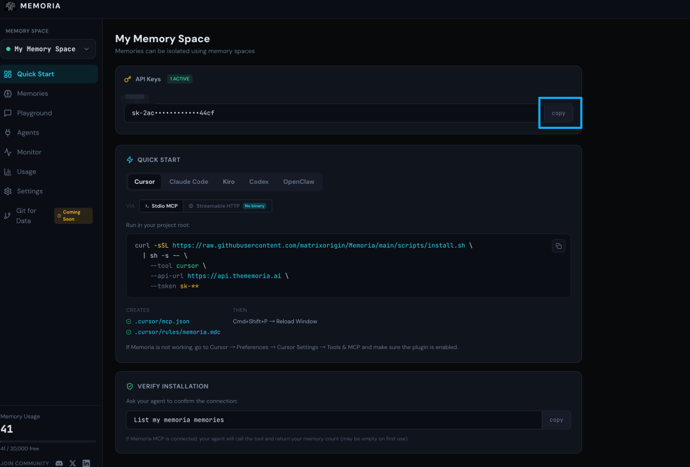
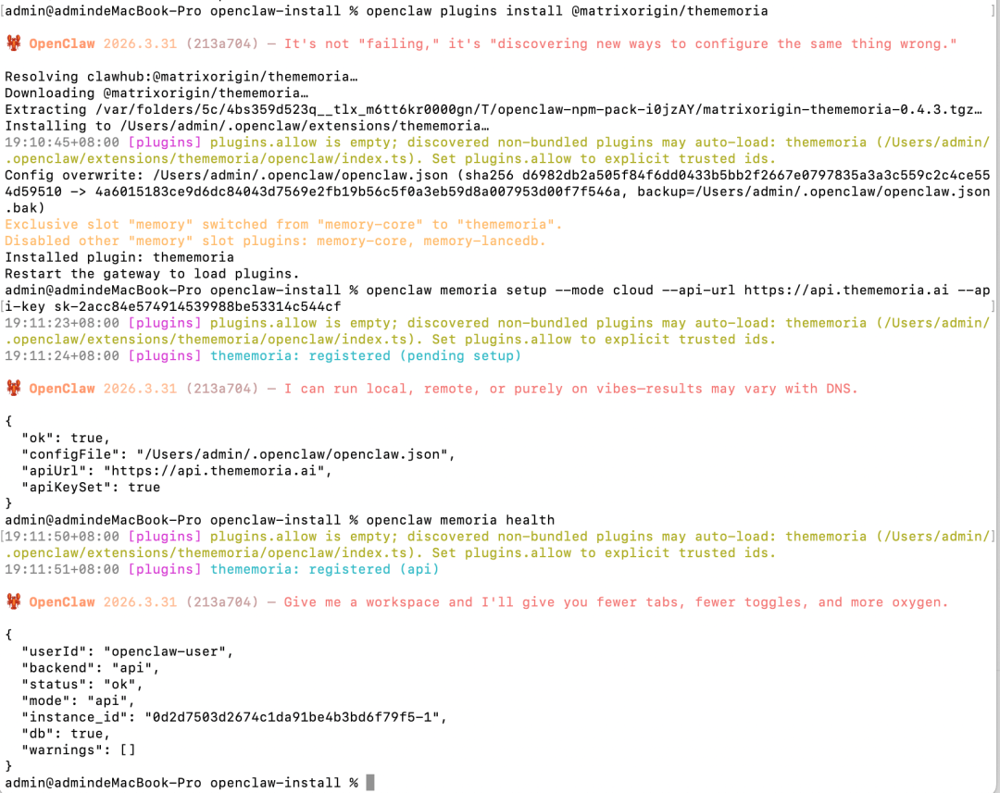
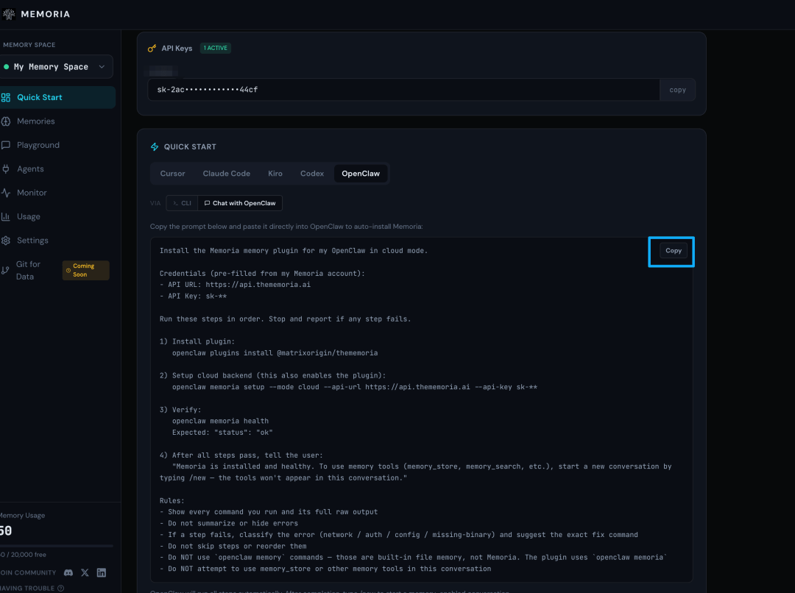
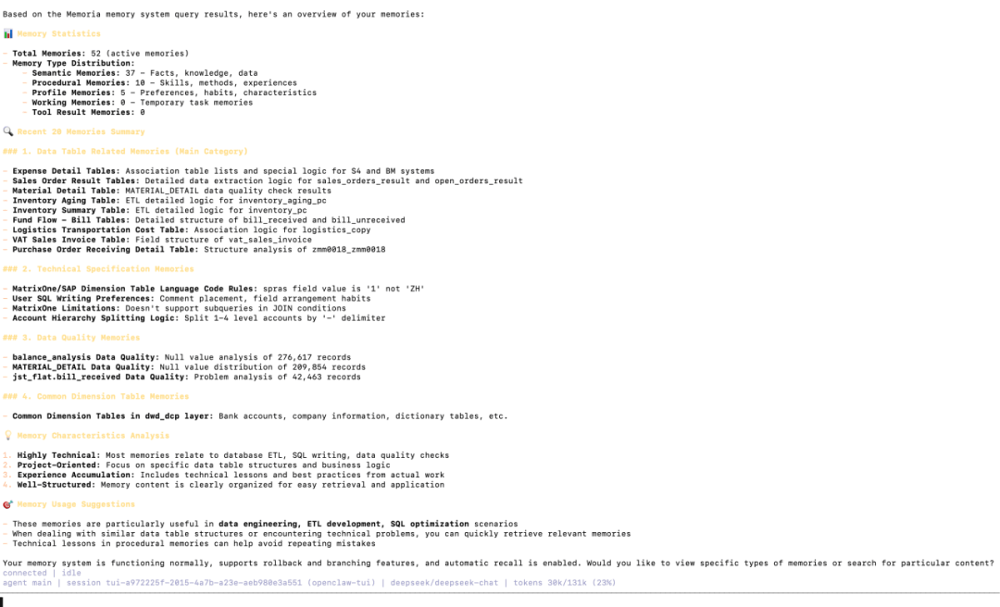

# Get Started in 1 Minute: Connect Memoria to OpenClaw

One command, intelligent memory, and **70%+ lower Token usage**.

## Why You Need It

OpenClaw's built-in memory works, but its cost keeps growing.

**It loads everything every time**
By default, OpenClaw loads `MEMORY.md` and related files into the context window at the start of each session. The longer you use it, the more it accumulates: past preferences, old decisions, outdated background information. Everything is injected at once, whether the current task needs it or not. Every session pays the full Token bill.

**Files have limits, and overflow is silent**
Memory files have character limits. Once the limit is exceeded, content is silently truncated. The Agent will not tell you. It simply "forgets."

**Retrieval quality degrades over time**
On Monday you write down "Alice owns the auth team." On Friday you ask, "Who handles permission issues?" OpenClaw's default search may find both fragments, but it cannot establish the relationship. Keyword search plus vector search cannot handle relational reasoning at scale.

**Context compression can quietly damage memory**
When a long session triggers compression, memory file content injected into the context may be rewritten or discarded. You thought it was saved, but it may already be gone.

Memoria solves all these problems. It replaces full-file loading with on-demand semantic retrieval, injecting only the memories relevant to the current task. The result: **more than 70% less memory-related Token usage**, higher recall accuracy, and no more silent data loss.

**The whole setup takes less than one minute.** Log in, copy your API key, run one command, and you are done.

## Step 1 - Get Your API Key



Go to thememoria.ai, sign in with one click (GitHub and Google are supported), and copy your API key from the console.

No database setup. No self-hosted backend.

Then make sure OpenClaw is running:

```bash
openclaw status
```

## Step 2 - Connect Memoria

There are two installation methods: run commands in the terminal, or paste a prompt directly into the OpenClaw chat box.

### Option A: Install from the Terminal

Run the following command in your terminal:

```bash
openclaw plugins install @matrixorigin/thememoria
```

Then configure the cloud backend:

```bash
openclaw memoria setup \
  --mode cloud \
  --api-url https://api.thememoria.ai \
  --api-key sk-YOUR_API_KEY
```

Verify that the connection is working:

```bash
openclaw memoria health
```

If you see `"status": "ok"`, the setup succeeded.



### Option B: Paste into the OpenClaw Chat Box



Copy the prompt below, replace `sk-YOUR_API_KEY` with your actual key, and send it directly to OpenClaw. The Agent will run all steps and report the result.

```text
Install the Memoria memory plugin for my OpenClaw in cloud mode.
Credentials (pre-filled from my Memoria account):
- API URL: https://api.thememoria.ai
- API Key: sk-YOUR_API_KEY
Run these steps in order. Stop and report if any step fails.
1) Install plugin:
   openclaw plugins install @matrixorigin/thememoria
2) Setup cloud backend(this also enables the plugin):
   openclaw memoria setup --mode cloud --api-url https://api.thememoria.ai --api-key sk-YOUR_API_KEY
3) Verify:
   openclaw memoria health
   Expected: "status": "ok"
4) After all steps pass, tell the user:
   "Memoria is installed and healthy. To use memory tools(memory_store, memory_search, etc.), start a new conversation by typing /new - the tools won't appear in this conversation."
Rules:
- Show every command you run and its full raw output
- Do not summarize or hide errors
- If a step fails, classify the error(network / auth / config / missing-binary)and suggest the exact fix command
- Do not skip steps or reorder them
- Do NOT use `openclaw memory` commands - those are built-in file memory, not Memoria. The plugin uses `openclaw memoria`
- Do NOT attempt to use memory_store or other memory tools in this conversation
```

If any step fails, the Agent will automatically classify the error and provide the exact fix command. You do not need to troubleshoot it manually.

## Step 3 - Verify That It Works

In any OpenClaw conversation, enter:

```text
List my memoria memories
```

If Memoria is connected successfully, the Agent will call the memory tools and return the current number of memories. An empty list is normal on first use.



If the list is empty, go to Memoria Playground and store a few memories, such as your name, preferred programming language, or current project. Then ask the Agent again. You should see it accurately recall what you stored, confirming that the end-to-end connection is working.

## That's It

One command, smarter retrieval.

No more Token waste.

No more lost context.

No more repeating the same background at the start of every session.
