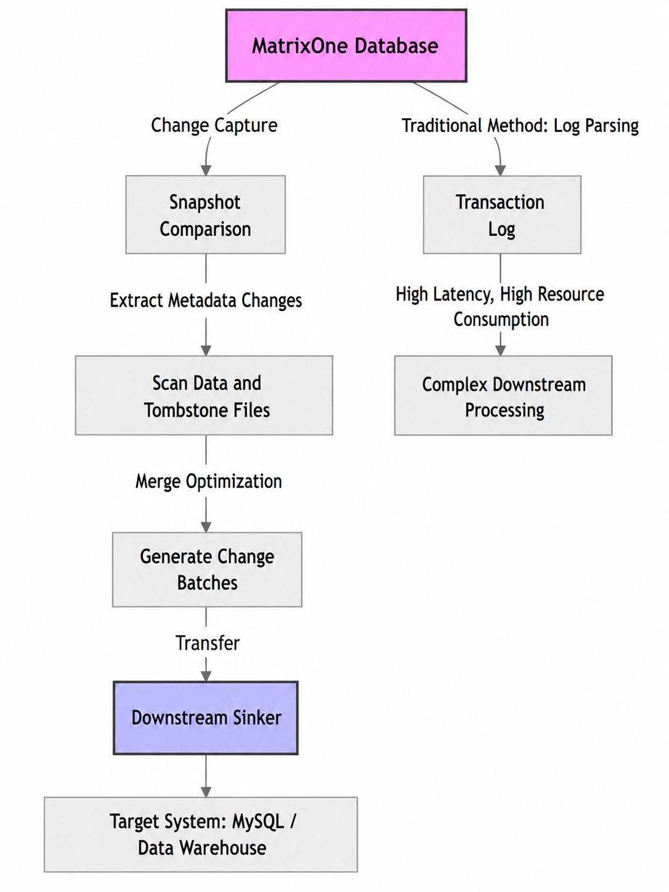
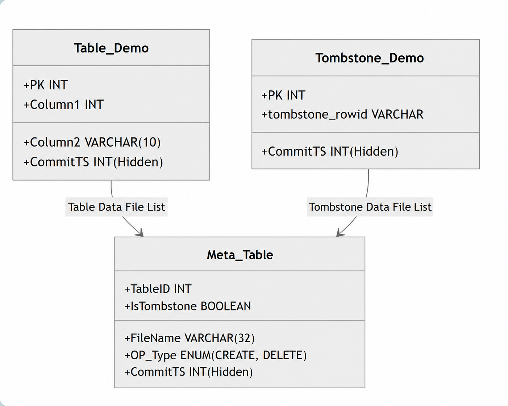
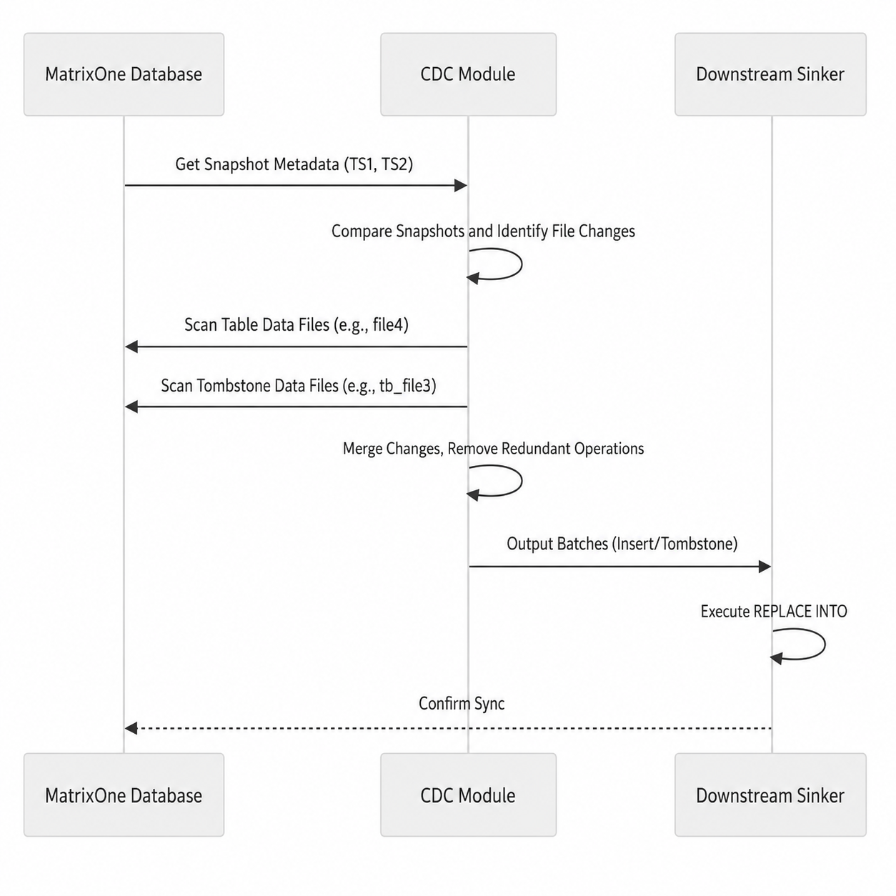
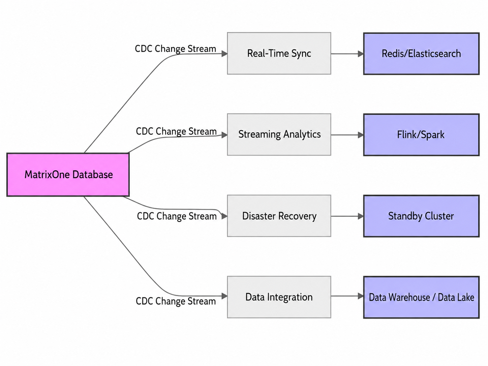

In modern databases, cross-system data synchronization is critical for real-time analytics, disaster recovery, and data integration. Change Data Capture (CDC) tracks insert, update, and delete operations in a database and sends those changes to other systems. It is a key technology for achieving this goal. Traditional `CDC` methods rely on transaction log parsing and face performance bottlenecks in Hybrid Transactional/Analytical Processing (HTAP) scenarios, especially when handling massive data volumes. As a distributed database built for `HTAP`, `MatrixOne` introduces a snapshot-based `CDC` method as a complement to traditional log parsing, significantly improving the efficiency of data change capture. This article explores the core advantages, technical principles, and practical application scenarios of `MatrixOne` `CDC`.

## CDC Introduction: Why Is It Important?

`CDC`, or Change Data Capture, is a technology used to monitor database changes, including inserts, updates, deletes, and schema changes, and deliver those changes to other systems in a consumable format. It acts as a bridge between databases and downstream applications such as caches, data warehouses, or search engines, and is widely used in real-time synchronization, analytics, disaster recovery, and other scenarios.

Traditional `CDC` relies on parsing database transaction logs, such as `MySQL` `binlog` or `PostgreSQL` `WAL`. Although this approach performs reasonably well in transactional scenarios, it exposes many problems in complex environments such as `HTAP`:

- **Parsing latency**: Large log files take a long time to parse, causing change-capture delays.
- **Resource overhead**: Log parsing requires large amounts of CPU and memory, affecting database performance.
- **Poor HTAP adaptability**: In massive-data scenarios, logs may record only metadata changes, making it complex and inefficient to infer real data changes.
- **Redundant historical operations**: Downstream systems need to process large amounts of historical data, increasing complexity and storage cost.
- **Long-term traceability difficulty**: Long-cycle changes, such as changes spanning months or years, require retaining all historical states, leading to a sharp increase in storage and processing costs.

These issues are especially prominent in distributed `HTAP` databases such as `MatrixOne`, because they must handle high-concurrency transactions and large-scale analytical tasks at the same time. The `CDC` module in `MatrixOne` effectively addresses these challenges and improves capture efficiency through a snapshot-based complementary approach.

## MatrixOne's Snapshot-Based CDC: Technical Innovation

Based on its columnar storage architecture and distributed design, **MatrixOne** moves away from the traditional log-dependent `CDC` paradigm and instead captures changed data directly from the database kernel through snapshots. This method is especially suitable for `HTAP` scenarios and can efficiently handle batch data changes and metadata operations.

### How It Works (Brief Overview)

MatrixOne stores table data and "tombstone data" (which marks delete operations) separately, and manages file lists through a metadata table. This metadata table is essentially a regular table that records file creation and deletion operations. It can be queried through `SQL`, and consistency is guaranteed by the database transaction engine.

When capturing changes between two time points, such as TS1 to TS2, the process is as follows:

1. **Snapshot comparison**: Compare the metadata snapshots of `TS1` and `TS2` to identify newly added or deleted files.
2. **Data scan**: Scan only the relevant files, extract insert operations (new data) and tombstone operations (deletes), and filter them by time range.
3. **Merge optimization**: Merge changes and eliminate redundant historical operations. For example, if a row is inserted and deleted multiple times, the final output may include only the net effect, such as a single insert, reducing downstream data volume.

This approach greatly reduces latency and resource consumption. Update operations are split into delete-and-insert operation pairs, and results are sent downstream in batches. It supports syntax such as `MySQL` `REPLACE INTO` to ensure eventual consistency.

Core advantages:

- **No log parsing overhead**: Directly accesses kernel data, reducing latency and resource usage.
- **HTAP optimization**: Easily handles batch changes while reducing complexity and latency.
- **Reduced downstream burden**: Merges historical operations to reduce downstream data volume and simplify ETL processes.
- **Efficient snapshots**: No need to store all historical states, significantly reducing storage and processing costs for long-term change traceability.

`MatrixOne` `CDC` supports single-table transaction atomicity, update-order consistency, and `DDL` event capture such as `CREATE TABLE`. Through the `mo-backup` tool, users can easily manage `CDC` processes and set point-in-time recovery (PITR) durations to prevent files from being garbage-collected.

  
**Figure 1: Overall MatrixOne CDC process**, showing a comparison between snapshot-based capture and traditional methods.

  
**Figure 2: Table data and tombstone data structure**, showing the logical view of data storage in `MatrixOne`.

  
**Figure 3: Snapshot-based change-capture process**, describing the steps for capturing changes in detail.

## Practical Application Scenarios: Unlocking the Potential of CDC

`MatrixOne` `CDC` is not only technically impressive, but also delivers strong value in real scenarios. Below are several typical applications:

1. **Real-time data synchronization**: In an e-commerce platform, inventory changes in `MatrixOne` can be synchronized in real time to a `Redis` cache or `Elasticsearch` index through `CDC`, ensuring data freshness for search and recommendation systems. This is critical for high-traffic applications and helps avoid sales losses caused by stale data.

2. **Streaming analytics pipelines**: Push `CDC` events to `Apache Flink` or `Spark` for real-time fraud detection or user behavior analysis. In `HTAP` scenarios, `MatrixOne` can process massive data without interfering with transactions, making it suitable for fintech, IoT, and other scenarios that require instant decision-making.

3. **Disaster recovery and backup**: `CDC` supports replicating data to standby clusters to ensure eventual consistency. For compliance-sensitive industries such as finance and healthcare, this provides a reliable audit trail without the resource overhead of full backups.

4. **Heterogeneous data integration**: Synchronize `MatrixOne` data to data warehouses such as `Snowflake` or data lakes such as `S3`, supporting scenarios such as unstructured indexing and full-text search. The flexibility of `CDC` makes it suitable for tasks with lower consistency requirements but high construction costs.

5. **Customized ETL processes**: Users can subscribe to specific tables or filter events, and can even capture schema changes by subscribing to `mo_catalog.mo_tables`. This flexibility is suitable for dynamically changing data architectures.

  
**Figure 4: CDC application scenarios**, showing the data flow of `CDC` across different use cases.

## Summary: The Future of CDC for Distributed Databases

As a powerful complement to traditional log parsing, `MatrixOne`'s snapshot-based `CDC` provides an efficient, low-overhead data change capture solution for distributed `HTAP` environments. By solving latency and resource usage problems, it makes it possible for developers to build more flexible and scalable data ecosystems. If your project involves `HTAP` workloads or requires efficient data synchronization, consider trying `MatrixOne`. Visit the official documentation or use the `mo-backup` tool to get started and make data synchronization smarter.
