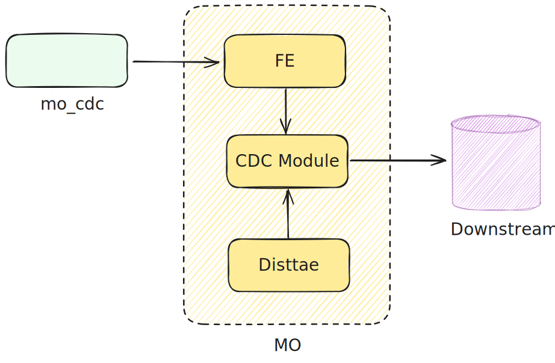
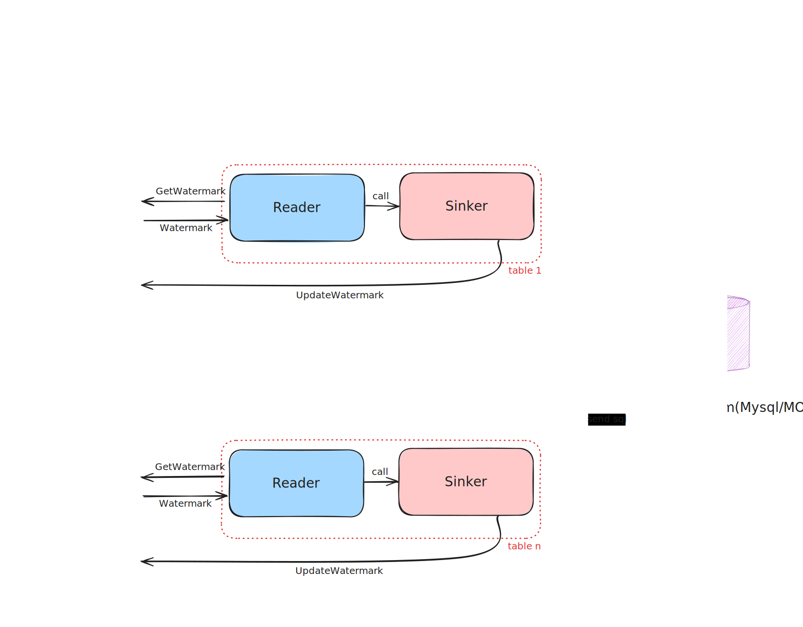
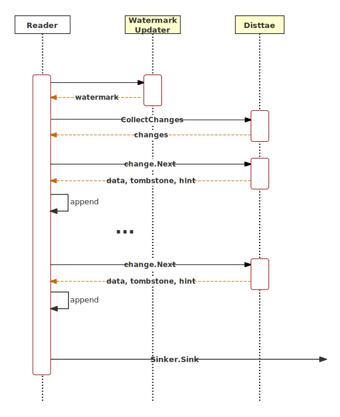
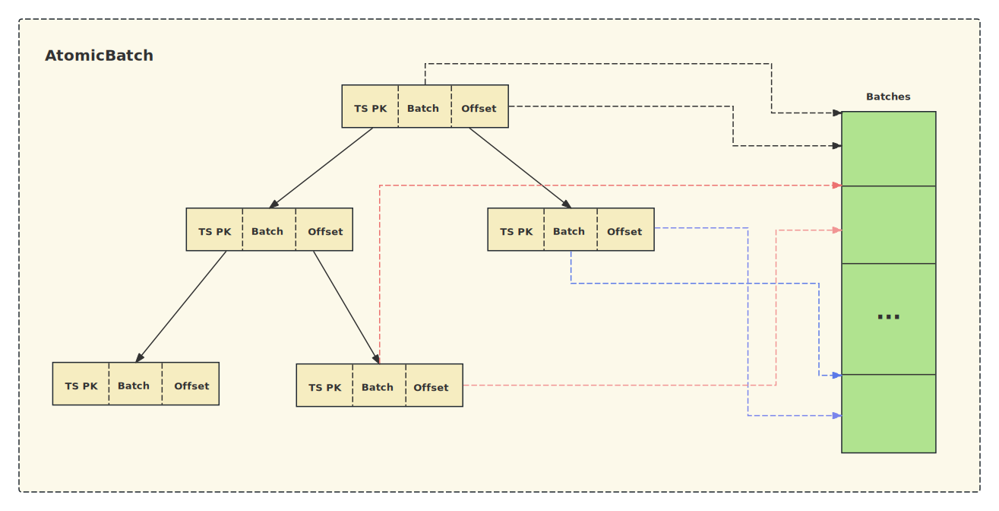
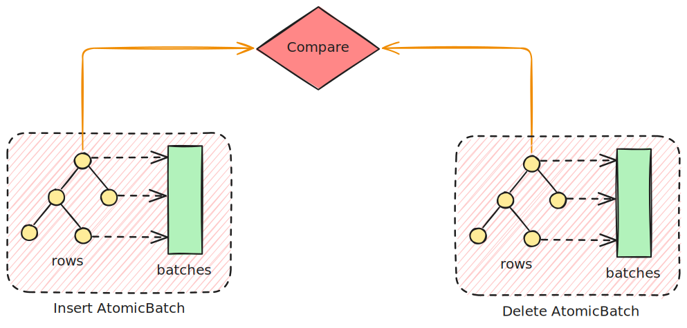
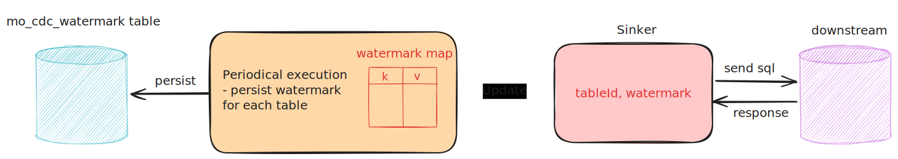
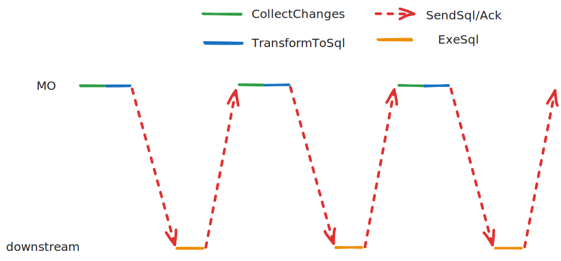
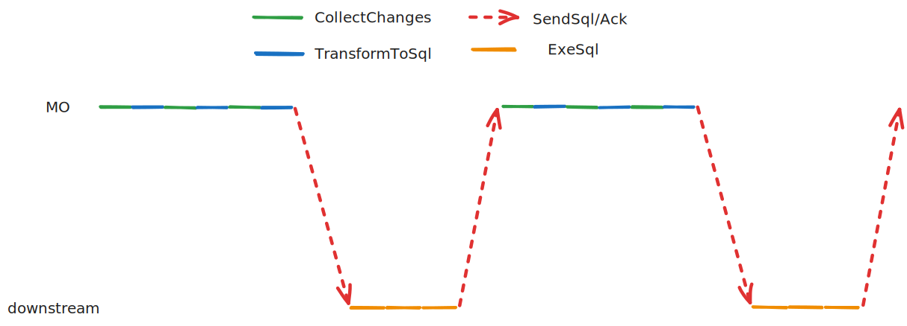
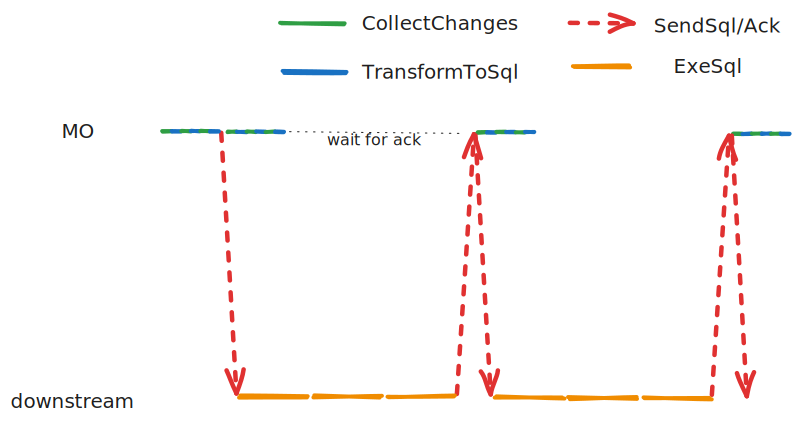

**CDC (Change Data Capture)** is a technology that captures data changes in a database in real time, recording insert, update, and delete operations. By monitoring database changes, it enables real-time synchronization and incremental processing of data, ensuring data consistency across different systems. CDC is suitable for scenarios such as real-time data synchronization, data migration, disaster recovery, and audit tracking. By reading transaction logs and using other methods, it reduces the pressure of full data replication and improves system performance and efficiency.

MO has supported CDC since version 2.0.0. This article briefly introduces the principles, implementation, and optimization of the MO CDC module.

## Overall Structure

This section briefly introduces the position of the CDC module in MO and the simplified overall architecture of the CDC module.

### CDC's Position in MO



The position of the CDC module in MO is roughly shown in the figure above. The modules in the figure are:

- `mo_cdc`: A small tool developed by MO to make it easier for users to operate CDC functions. It accepts simple commands, generates SQL statements, sends them to MO for execution, and displays execution results. Of course, you can also operate CDC tasks directly through SQL statements without using this tool.
- FE: The frontend layer in MO. In the CDC module described in this article, it is responsible for maintaining CDC task create, read, update, and delete operations.
- CDC: For running tasks, periodically queries recent modifications from the storage layer, converts them into SQL, and sends them to the sink.
- Disttae: MO's storage layer, providing data changes within a specified time range, including newly added and deleted data.
- Downstream: The downstream system that receives synchronized data. Currently supported downstream types are MySQL and MO.

A typical CDC task control flow is:

1. The user creates a CDC task through `mo_cdc` and specifies task parameters.
2. The MO frontend receives the create command and starts the CDC task.
3. The CDC Module periodically queries the MO storage layer for data changes during the time period.
4. The CDC Module processes changed data and converts it into SQL statements.
5. The SQL statements are sent downstream for execution. After successful execution, synchronization records are updated.

### CDC Module Framework



The general framework of the CDC module is shown above and consists of the following components:

- The reader is responsible for periodically reading the latest data changes from the storage layer.
- The sinker is responsible for converting the read information into SQL statements **in order** and sending them downstream.
- One reader and one sinker form a pipeline (the red dashed box in the figure). One pipeline corresponds to the synchronization task for one table. Pipelines are **independent** of each other and do not affect one another.
- Each CDC task has a WatermarkUpdater, which records synchronization progress for each table.

## CDC Component Introduction

This section introduces the workflow of each CDC component in detail.

### Reader

Reader data-reading timeline:



The Reader periodically reads data changes from the storage layer within the current time interval, once every 200 ms. The specific operations are:

1. Get the current watermark information (From) from WatermarkUpdate.
2. Call the storage `CollectChanges(From, Now)` interface to obtain a `changes` object, which can be considered an iterator.
3. Repeatedly call the `Next` interface of `changes` to obtain data.
4. Append the obtained **newly added and deleted** data to two `AtomicBatch` objects respectively.
5. After all data from `changes` is obtained, send the data to the Sinker.

The `AtomicBatch` mentioned in step 4 is defined as follows:

```go
type AtomicBatch struct {
    Mp       *mpool.MPool
    From, To types.TS
    Batches  []*batch.Batch
    Rows     *btree.BTreeG[AtomicBatchRow]
}

type AtomicBatchRow struct {
    Ts     types.TS    // (Ts, Pk) is the key for compare
    Pk     []byte
    Offset int
    Batch  *batch.Batch
}
```

It mainly consists of two parts:

1. `Batches` stores the actual data.
2. `Rows` is a balanced binary tree (we use a B+ tree here), arranging each record in `Batches` by `Ts` and `Pk`.

Sorting is needed because, for performance reasons, the storage layer does not necessarily return data in order. To ensure correctness, we need to sort data by the timestamp of transaction commits first.

When adding data, we insert it into the tree using `(Ts, Pk)` as the key. In subsequent operations, the Sinker can retrieve batch data in order.



### Sinker



As described above, the Reader places the read data changes (inserts and deletes) into two `AtomicBatch` objects. Each `AtomicBatch` contains a B+ tree, from which we can read each record in ascending order of `(Ts, Pk)`.

The Sinker reads data through a process similar to merge sort. It compares the top element of the insert/delete `AtomicBatch` trees, that is, the smallest element, determines the record with the smallest transaction commit timestamp among the remaining data, pops that record to generate the corresponding SQL, and then continues the comparison. When one `AtomicBatch` becomes empty, it pops the data from the other `AtomicBatch` in order.

### WatermarkUpdater



WatermarkUpdater maintains an in-memory map that records the synchronization progress of each table in the CDC task. After the Sinker sends data downstream and receives a successful execution response from the downstream system, it updates the latest progress in the map. At the same time, MO has a metadata table for storing these progress values. WatermarkUpdater has a scheduled task that periodically persists the progress values of each table from the map to the metadata table, ensuring that if the CDC task stops unexpectedly, such as due to an MO process crash or power outage, already synchronized data does not need to be synchronized again after restart.

## Performance Optimization

Now we have a simple prototype of the CDC module, but this prototype has poor performance and still has much room for improvement. This section briefly introduces several performance optimizations we made for the CDC module.

### Optimization 1: Merge and Send SQL

The current sequence for MO preparing data, network transmission, and downstream SQL execution is roughly as follows:



We know that batch SQL execution is much more efficient than splitting SQL into multiple statements and executing them multiple times. Currently, MO CDC converts data within one batch (up to 8,192 rows) into one SQL statement. We can concatenate as much data as possible within a `(From, To)` time interval into one SQL statement until reaching the maximum network packet size specified by the downstream system, such as the `max_allowed_packet` system variable in MySQL. At the same time, every communication with the downstream system has fixed overhead. After SQL is merged, the number of communications with the downstream system is reduced, thereby reducing this type of overhead.

The sequence after SQL merging is roughly as follows:



### Optimization 2: Non-Blocking SQL Generation

After observing the sequence diagram after Optimization 1, we found that every time the Sinker sends SQL, it blocks in place and waits for the downstream response. Only after receiving the downstream ack does it start reading the next round of data changes and converting them into SQL. This wastes the time spent waiting for the downstream response. In large-data scenarios, after the merged SQL optimization is applied, preparing SQL takes a relatively long time, making this problem even more obvious.

Therefore, while MO is waiting for downstream SQL execution results, it can start preparing the next round of data. After the downstream response returns, it can immediately send the SQL for the next round. The sequence looks like this:



### Optimization 3: Customized MySQL Driver

MO CDC mainly supports downstream databases compatible with the MySQL protocol. We use [MySQL Driver](https://github.com/go-sql-driver/mysql) to connect to downstream databases. After studying the driver source code, we found that according to the protocol, the driver needs to add a 5-byte flag before the SQL statement we pass in. The implementation steps are: allocate space of `len(sql) + 5`, fill the first 5 bytes with the corresponding status bits, and then copy the SQL into the remaining space.

To make room for 5 bytes before the SQL as status control bits, new space must be allocated and a large amount of data must be copied, which is expensive. By studying the call chain for SQL execution, we found a tricky method: define a new `sql.NamedArg`, use the SQL statement with the first 5 bytes reserved as the value, and pass the SQL to the Driver. When the Driver recognizes this special `NamedArg`, it directly sets the status bits in the first few bytes of the SQL.

```go
reuseQueryArg := sql.NamedArg{
    Name:  mysql.ReuseQueryBuf,
    // Leave the first 5 bytes empty
    Value: sqlBuf,
}
```

### Optimization Results

We used the `lineitem` table from the TPC-H 10G database for full-table synchronization testing. The detailed data is shown in the table below. As you can see, with the three optimizations above, synchronization time can be reduced to less than 50% of the original:

| Optimization | Synchronization Time |
| ------------ | -------------------- |
| No optimization | 37 min 30 s |
| Optimization 1 | 25 min 30 s |
| Optimization 1 + Optimization 2 | 18 min |
| Optimization 1 + Optimization 2 + Optimization 3 | 17 min |

## Summary

This article briefly introduced the functional responsibilities of the CDC module, its position and role in MO, the design and implementation of CDC components, and performance optimization measures. Due to space limitations and the complexity of MO's specific implementation, many parts are explained with easy-to-understand diagrams and cannot fully show all details, though this does not affect understanding of the CDC module's principles and runtime process.

If you are interested in more implementation details, you can read the source code on GitHub. If you have suggestions for CDC design or optimization, we welcome discussion.
