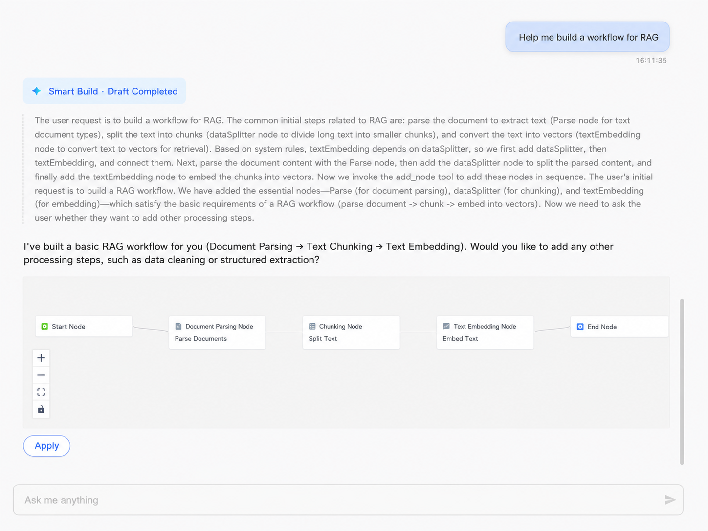
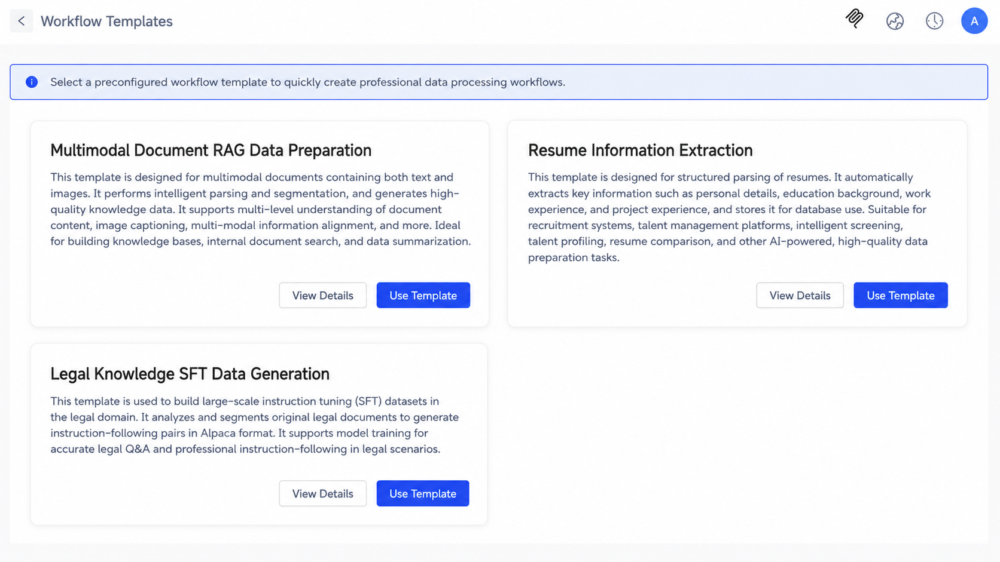
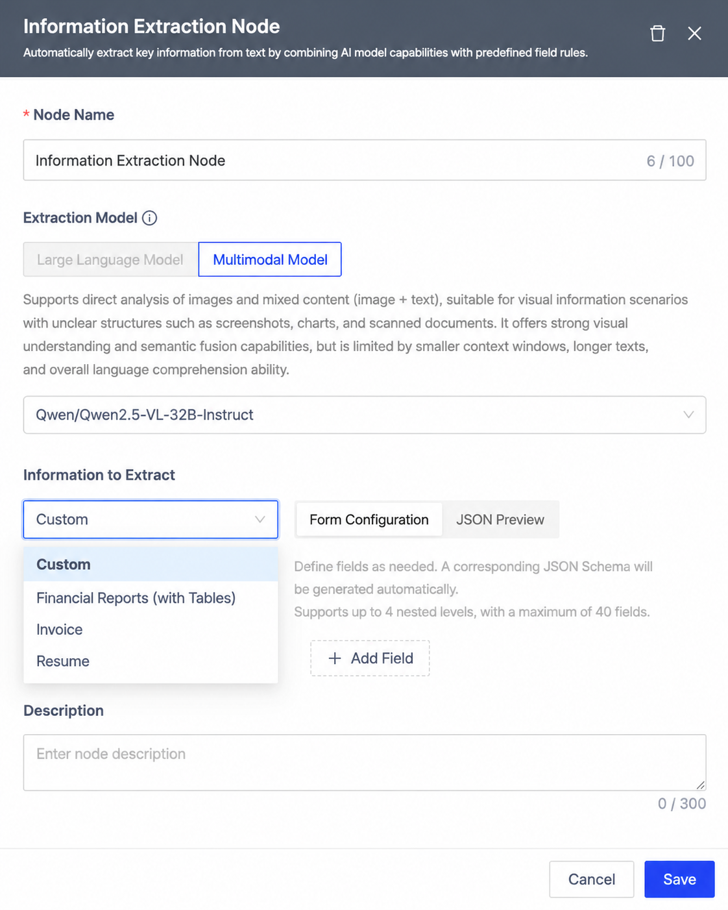
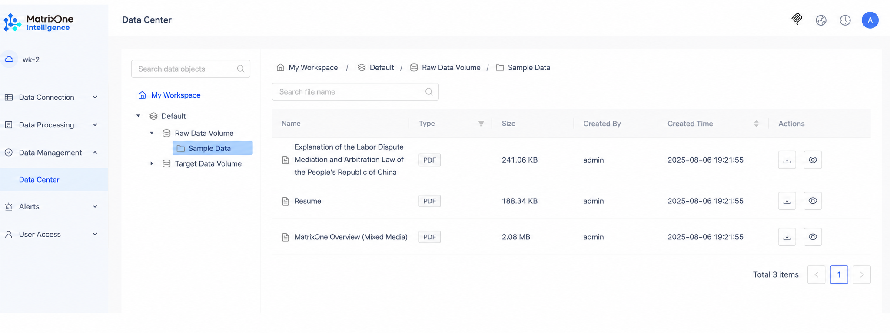
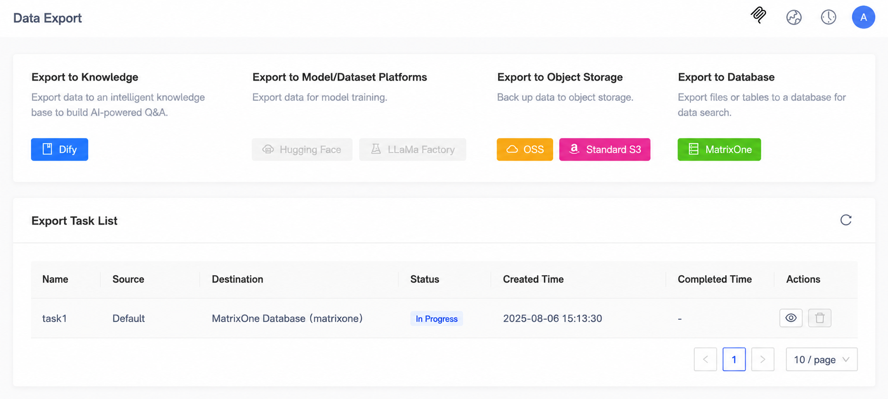
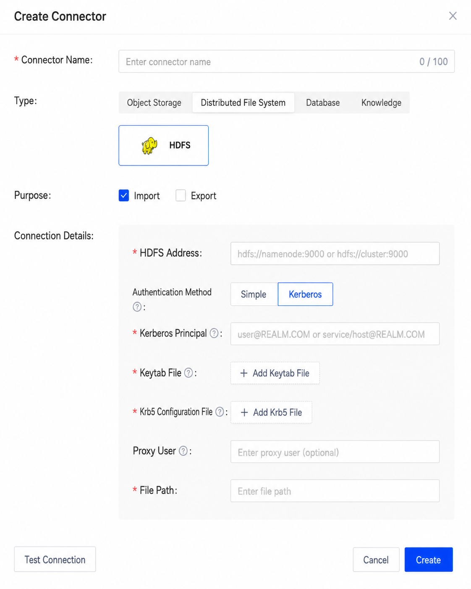
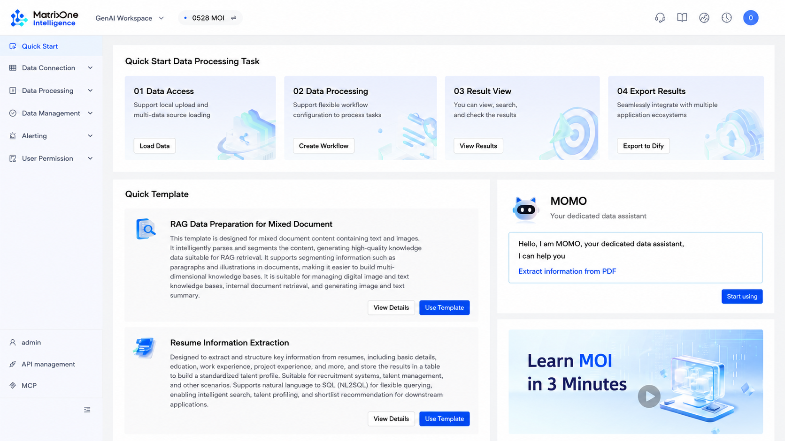

# MatrixOne Intelligence 4.0 Upgrade: Making Data Intelligence Within Reach

## Introduction to MatrixOne Intelligence

MatrixOne Intelligence is an AI data intelligence platform for multimodal data, designed to help enterprises address challenges such as data fragmentation, complex multimodal data integration, and difficult GenAI application implementation. Through data access, intelligent parsing, data workflows, and a hyper-converged lakehouse foundation, MatrixOne Intelligence provides enterprises with a one-stop end-to-end platform that turns their internal proprietary data into AI-Ready data for GenAI applications. Based on an innovative cloud-native architecture and a storage-compute separation design, the platform supports unified management and efficient processing of structured and unstructured data. It also provides highly flexible deployment capabilities across public cloud, private cloud, and on-premises data center environments.

MatrixOne Intelligence is committed to helping enterprises fully mine and release the potential of private-domain data, so that enterprise private-domain data can be fully utilized in the AI era and become a key source of unique competitiveness.

## Core Upgrade Highlights: Comprehensive Support for Enterprise Digital Transformation

### 1. Intelligent Workflow Upgrade: Free Your Hands and Complete Complex Tasks Automatically

The newly introduced Agent mode enables the system to automatically select the optimal execution path based on user intent and data characteristics. Users no longer need to manually design complex logical flows. The platform automatically senses business requirements, makes intelligent decisions, and executes tasks, creating intelligent tasks with "perception + decision + action" capabilities and significantly reducing operational complexity and time cost.

### 2. Rich Workflow Templates for Rapid Automation Setup

For different business scenarios, multiple out-of-the-box workflow templates have been added, covering typical applications such as text parsing, data extraction, and content generation. Users can quickly build automated workflows without starting configuration from scratch.

Typical application examples:

- **Multimodal document RAG data preparation**: Supports data generation for mixed image-and-text content and helps build multimodal Q&A systems.
- **Talent resume information extraction**: Automatically extracts core fields from resumes, enabling structured resume-data management and helping HR screen candidates efficiently.
- **Legal knowledge data generation**: Extracts high-quality question-answer pairs from massive legal texts to support fine-tuning and optimization of legal large models.

### 3. More Powerful Multimodal Information Extraction

The newly upgraded information extraction node includes multiple intelligent templates for scenarios such as financial reports, invoices, and resumes. Users no longer need to manually define complex schemas; accurate structured results can be obtained with one click. Combined with the latest multimodal model technologies, it enables deep understanding and extraction of mixed image-and-text content, greatly improving extraction accuracy and efficiency.

### 4. Further Evolution of the Data Center Structure

To better manage multimodal data, MOI has introduced a three-level data center structure: Catalog -> Database -> Volume. This design supports more flexible data isolation and permission management, meeting multi-level governance needs across different lifecycles and business scenarios.

- **Catalog**: The highest layer of data governance, supporting lifecycle segmentation such as production, development, and sensitive data.
- **Database**: Organizes structured and unstructured data, flexibly categorized by business or stage.
- **Volume**: A logical container for unstructured files, providing efficient storage and access.

### 5. More Accurate Complex Document Parsing and More Flexible File Processing

New intelligent recognition and parsing support for complex table structures enriches data dimensions and depth. At the same time, file-processing granularity has become more refined. In one-time processing mode, users can now precisely select and operate on individual files, greatly improving processing flexibility and control. Whether for batch processing or precise operations on specific files, MatrixOne Intelligence can meet diverse needs and help you easily handle complex and varied data content.

### 6. Enhanced Data Integration Capabilities

New support has been added for directly exporting processing results to platforms such as MatrixOne, standard S3, and Alibaba Cloud OSS, helping enterprises achieve more efficient data flow and management across multiple systems.

### 7. HDFS Connector Supports Kerberos Authentication

The new HDFS connector now supports enterprise-grade Kerberos security authentication, ensuring data security and compliance while remaining compatible with simple authentication mode for more flexible switching.

### 8. Comprehensive User Experience Refresh

To improve user experience, the platform has made the following optimizations:

- **Account system upgrade**: Supports registration and login by mobile phone or email, enabling unified use of official website and MOI accounts. One login provides access to multiple platforms.
- **Separation of product workspaces**: MatrixOne and GenAI workspaces are independent, with clear product boundaries and seamless switching.
- **Quick-start module**: A new quick-start feature integrates core processes and functions to help users quickly become familiar with the product.
- **Process assistance optimization**: Operation assistance and help prompts have been added to data processing and workflows, making the user flow smoother and more intuitive.

