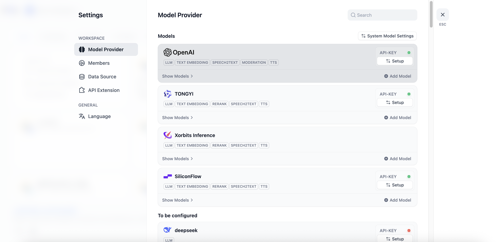
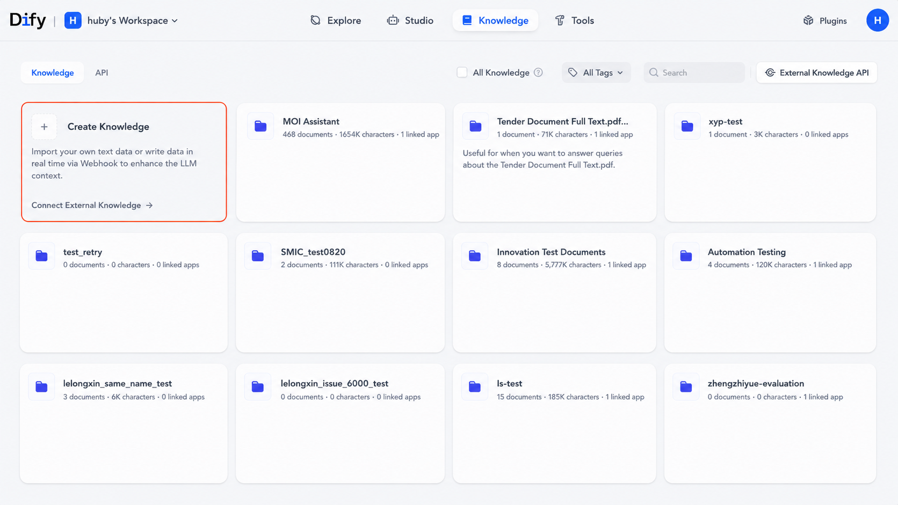
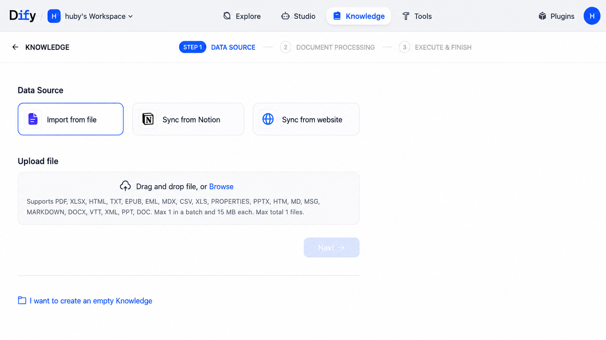
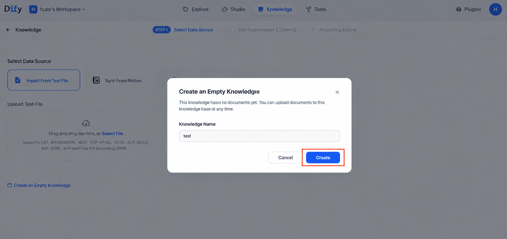
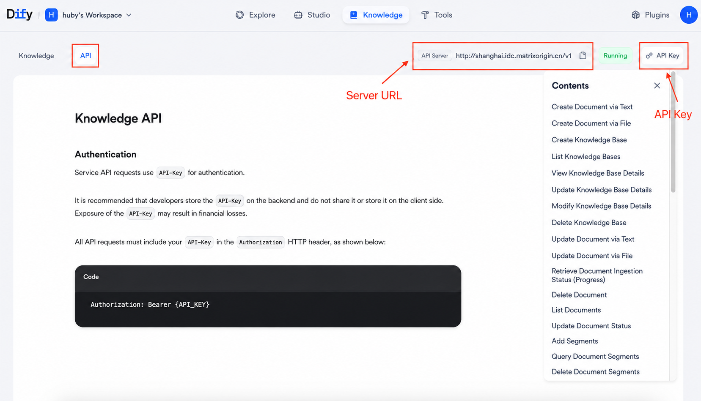
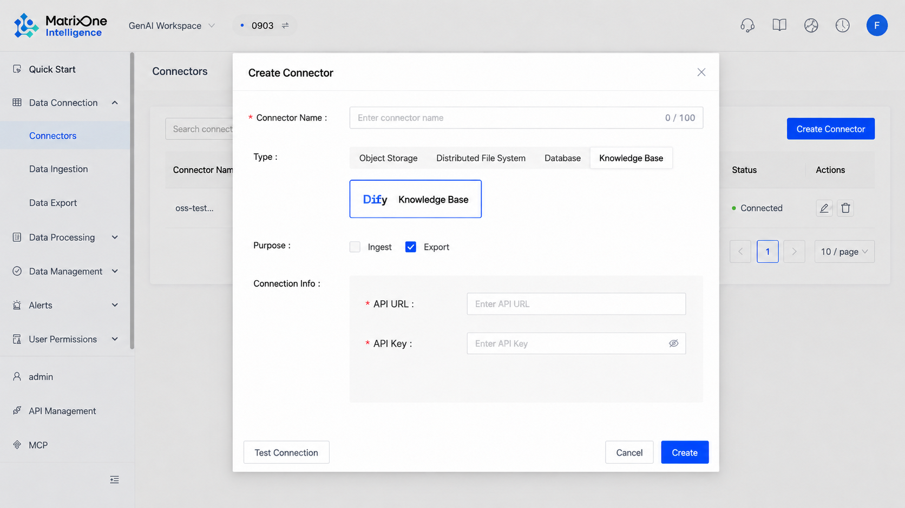
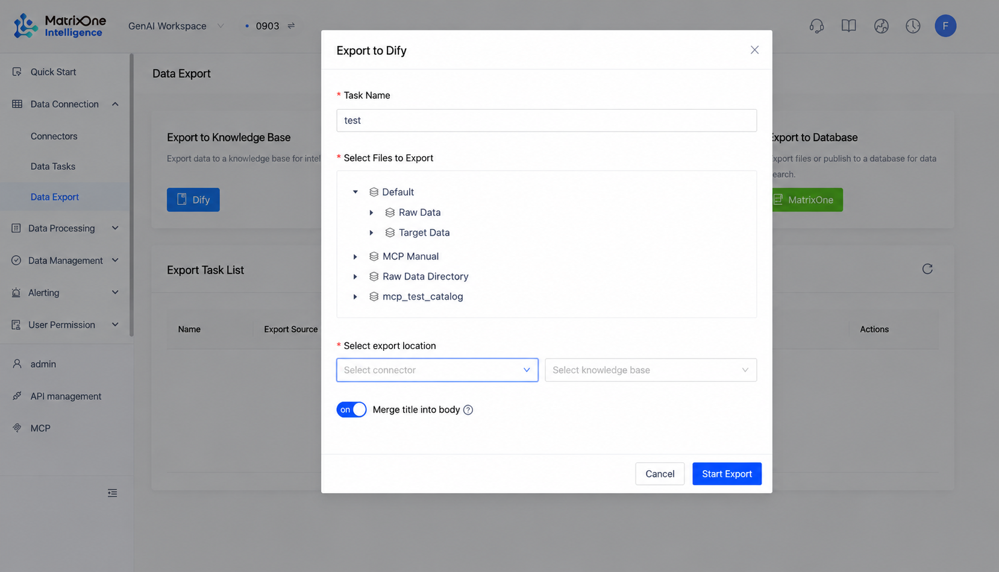
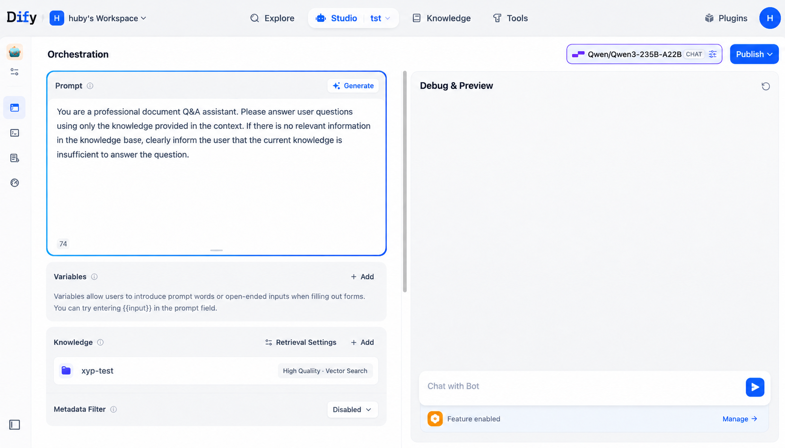

## Overview

This tutorial walks you through a complete data processing and application workflow. First, we integrate the Dify platform with the MatrixOne (MO) database and use MatrixOne as Dify's vector storage backend. Next, we demonstrate how to export processed chunk data from MatrixOne Intelligence (MOI) into a newly created Dify knowledge base. Finally, we use the imported data to quickly build an intelligent chat application.

Through this tutorial, you will learn:

- How to configure Dify to use MatrixOne as its vector database.
- How to establish a data connection between MOI and Dify.
- How to export MOI data to a Dify knowledge base.
- How to build a usable AI Agent based on imported knowledge base data.

## Part 1: Environment Preparation and Dify-MO Integration

Before you begin, make sure your local development environment is ready.

### 1.1 Install Git

Git is an essential version control tool. We will use it to clone the Dify source code.

**1. Install Git**

Refer to the official Git documentation, [Git - Downloading Package](https://git-scm.com/downloads/mac), and install it according to your operating system.

**2. Verify the installation**

Open a terminal and run the following command to check whether Git was installed successfully.

If you see output similar to `git version 2.40.0`, the installation succeeded.

### 1.2 Install Docker

Docker, see [Get Docker | Docker Docs](https://docs.docker.com/get-started/get-docker/), is used to create and manage containerized application environments. Dify deployment depends on Docker.

**1. Install Docker Desktop**

Visit the official Get Docker page, download Docker Desktop for your operating system, and install it. Docker version 20.10.18 or later is recommended.

**2. Verify the installation**

After installation, run the following command in the terminal to verify the Docker version.

If you see output similar to `Docker version 20.10.18, build 100c701`, the installation succeeded.

**3. Start Docker**

Make sure the Docker Desktop application has been started and is running in the background.

### 1.3 Configure and Start Dify

Next, we will obtain the Dify source code and configure it to use the MatrixOne database.

**1. Get the Dify source code**

Clone the latest Dify source code to your local machine.

**2. Build a Docker image that supports MatrixOne**

We need to build a special Docker image that includes the dependencies required to connect to MatrixOne.

_(Note: This step may take some time because it downloads dependencies and builds the image.)_

**3. Configure environment variables**

Go to the `docker` directory and copy a new environment variable configuration file from the template.

**4. Edit the `.env` file**

Open the `.env` file with your preferred text editor, such as VS Code or Vim, and find and modify the following configuration to connect to your MatrixOne instance.

**5. Modify the Docker Compose configuration**

Edit `docker-compose.yaml` and replace the images for the `api` and `worker` services with the `langgenius/dify-api:mo` image we just built.

Find the following two sections and modify the `image` field:

**6. Start the Dify service**

Everything is now ready. You can start the Dify platform.

Service startup takes some time. You can use `docker compose logs -f` to view real-time logs.

**7. Initialize the Dify platform**

- Visit `http://localhost/install` in your browser and follow the page instructions to initialize the administrator account.
- After logging in, go to "Settings -> Model Provider" and configure API keys for your large language model (LLM) and embedding model, such as Ollama, OpenAI, Anthropic, and others.

At this point, your Dify platform has been successfully set up and integrated with MatrixOne.

## Part 2: Core Workflow - Export Data from MOI to Dify

Now we will export data from the MOI platform to Dify.

### 2.1 Prepare a Knowledge Base in Dify

First, create an empty knowledge base in Dify as the receiving container for the data.

1. Log in to the Dify platform.
2. Go to the "Knowledge Base" module.
3. Click "Create Knowledge Base," enter a name such as `moi_data_repository`, and click "Create."

### 2.2 Configure the Dify Connector in MOI

To allow MOI to send data to Dify, you need to configure a connector.

1. Log in to the MOI platform.
2. Go to "Data Connection -> Connectors."
3. Click "New Connector" and choose Dify as the type.
4. Fill in the following configuration:
   - **API server address**:
     - Return to the Dify platform and go to the "Knowledge Base" module.
     - Click "API Access" in the upper-right corner of the page.
     - Copy the "API Server Address" and make sure it is a publicly accessible HTTPS address. If the protocol is not HTTPS, add it manually, for example `https://...`.
   - **API key**:
     - On the same "API Access" page in Dify, copy the "Personal API Token."
5. Save the connector.

### 2.3 Create and Run an Export Task in MOI

After the connector is configured, you can create an export task.

1. In the MOI platform, go to "Data Connection -> Data Export."
2. Click "New Export" and configure the following options:
   - **Task name**: Define a custom task name.
   - **Select file**: Choose a file that has been processed by a workflow and **contains chunk data**. This is required for export to the vector database.
   - **Select connector**: Choose the Dify connector created in the previous step.
   - **Select knowledge base**: The system automatically loads the knowledge base list from Dify. Select the empty knowledge base we just created, such as `moi_data_repository`.
   - **Embedding model**: If this is the first export to this knowledge base, choose an embedding model. Make sure it is consistent with or compatible with the embedding model configured in Dify.
3. After clicking "Create," the export task starts. Wait for the task status to change from "In Progress" to "Completed."

### 2.4 Verify That Data Was Imported Successfully

After the export is complete, verify that the data has been written into the Dify knowledge base.

**Method 1: Verify through the Dify UI (recommended)**

1. Return to the Dify platform and open the knowledge base you created.
2. Click the "Documents" tab. You should see the list of documents exported from MOI.
3. Click the "Chunks" tab. You can see the specific data entries into which the documents were split, indicating that the data has been vectorized and stored successfully.

**Method 2: Verify through the database (optional, advanced)**

If you want to check the backend directly, connect to the MatrixOne database.

1. Use a MySQL client to connect to the MatrixOne instance.
2. Switch to the Dify database and inspect its tables.
3. Check the table schema and row counts to confirm that data has been written.

If the result of `COUNT(*)` is greater than 0, the data has been written successfully.

## Part 3: Application Practice - Build an Agent Based on Imported Data

After the data is successfully imported into the Dify knowledge base, you can use it to build an intelligent chat assistant that answers questions based on your uploaded knowledge.

### 3.1 Create a Chat Assistant Application

1. On the Dify home page, click "Create App."
2. Select "Chat Assistant" as the application type.
3. Name your application, such as "MOI Knowledge Q&A Assistant," and click "Create."

### 3.2 Orchestrate the Application and Link the Knowledge Base

After creation, you will enter the application's "Orchestration" page. This is the core area for configuring AI behavior.

**1. Fill in the prompt:**

In the "Prompt" section, define the assistant's role and task. For example:

**2. Link the knowledge base (key step):**

In the "Context" module, click "Add" and select the knowledge base we created and imported data into earlier, `moi_data_repository`. This enables the AI to retrieve and reference content from the knowledge base when answering questions.

**3. Configure an opening statement (optional):**

At the bottom of the page under "Add Features," you can enable "Conversation Opening" to provide users with a friendly greeting and sample questions.

### 3.3 Debug and Publish

1. In the "Preview and Debug" window on the right side of the page, enter questions related to your knowledge base and test the assistant's responses.
2. If the result is satisfactory, click "Publish" in the upper-right corner.
3. After publishing, you can obtain a public WebApp link or use the API to integrate it into your own product.

For more detailed application orchestration techniques, such as variables and tool calls, refer to https://docs.dify.ai/v/zh-hans/guides/application-orchestrate/chatbot-application

At this point, you have completed the full workflow from environment setup and data export to Agent construction.

---

### Watch the Replay for a More Detailed Practical Demo and Content Walkthrough

### Live Q&A

**Q: Compared with other open-source solutions, such as LangChain + Chroma, what are the advantages?**

**A:** The core difference lies in positioning. LangChain + Chroma is a "developer toolkit," while our solution is an "integrated enterprise-grade platform." With a toolkit, developers still need to write a large amount of code to connect data processing, storage, and application logic, resulting in high development and maintenance costs. In real projects, unstructured data processing is often the most complex and labor-intensive part, and this is precisely the core problem MOI is designed to solve.

**Q: Is the connection between Dify and MOI real-time?**

**A:** In this demo, we showed a "data export task." However, MOI's core advantage lies in its automated workflows. This task can be configured to trigger on a schedule, such as every five minutes, or by external API events, such as a new file upload. Although this mechanism is not millisecond-level streaming synchronization, its near-real-time nature is sufficient for enterprise RAG knowledge update requirements and can effectively solve the common pain point of delayed knowledge updates.

**Q: Which formats does MOI support for multimodal processing?**

**A:** The MOI platform provides powerful multimodal data processing capabilities and natively supports documents, images, audio, video, and other types of unstructured data.
