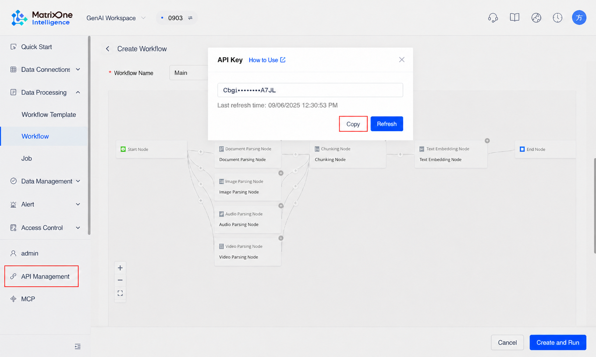
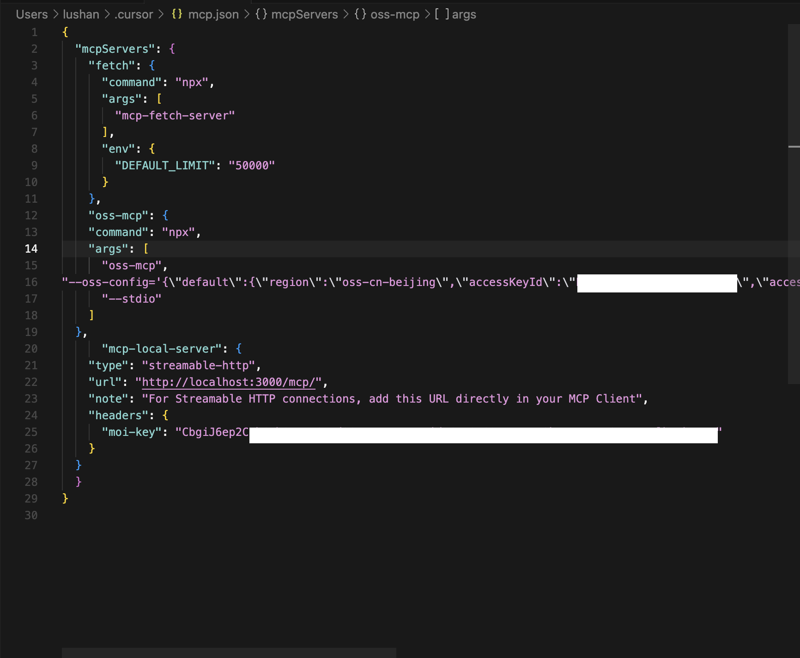
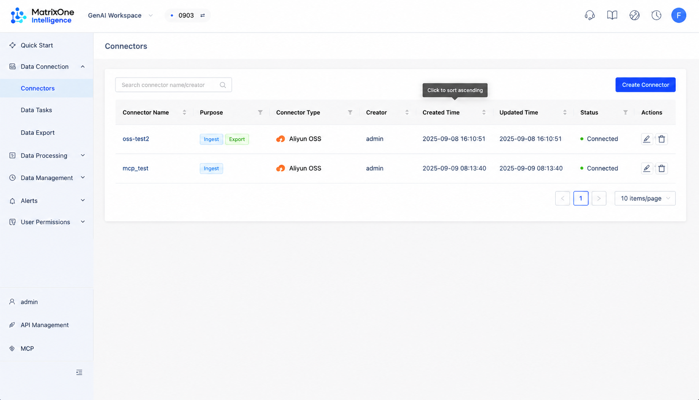
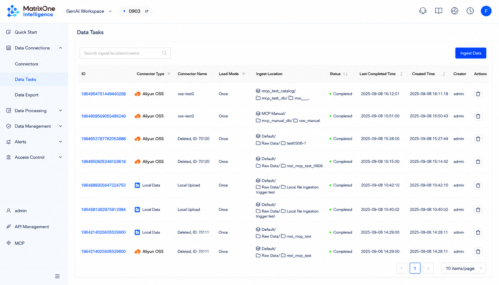
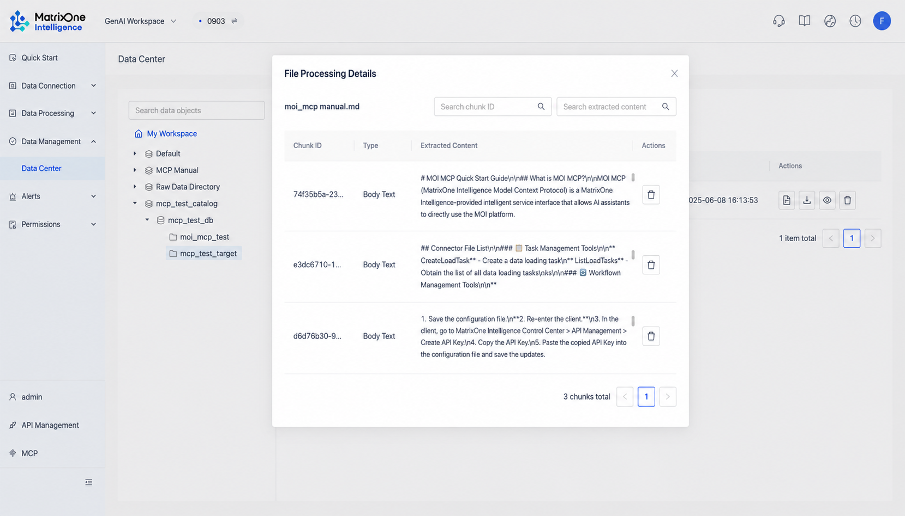

## Introduction

Today, web crawlers can help you "crawl fast," but the real efficiency bottleneck lies in what comes next: "processing fast." If the captured data cannot be processed efficiently and automatically, even the fastest data collection loses much of its value.

This tutorial focuses on solving that core pain point. We will demonstrate how to use **MOI MCP as the core engine**, connect it with a web-crawler MCP and an object-storage MCP, and build an end-to-end automated pipeline from data acquisition to value extraction. The goal is not only to collect data, but also to **eliminate waiting time in data processing** and enable a truly real-time data workflow.

We will follow the core process below to accelerate the entire path from acquisition to processing:

1. **Configure the environment**: Set up and integrate MOI MCP, the crawler MCP, and the OSS MCP.

2. **Acquire data**: Use the crawler MCP to fetch information from a specified URL and save it as a local file.

3. **Transfer data**: Use the OSS MCP to upload the local file to Alibaba Cloud Object Storage.

4. **Ingest and process data**: Use MOI MCP to create connectors, load tasks, and workflows, automatically parse and process the data, and finally generate datasets that can be used for analytical applications (Chunks or Datasets).

## Part 1: MCP Toolchain Configuration

Before starting the automated process, we need to configure all required MCP services. This includes MOI's own service and external services for crawling and uploading.

### 1.1 MOI MCP Configuration

MOI MCP ([MCP User Guide - MatrixOne Intelligence Documentation](https://docs.matrixorigin.cn/zh/m1intelligence/MatrixOne-Intelligence/mcp/mcp/#1-mcp)) is the core interface for interacting with the MatrixOne Intelligence platform. Public-cloud configuration is simple and fast, making it suitable for quick onboarding and most online use cases.

#### **Public-Cloud Configuration**

You only need to add the following JSON configuration to your MCP client to connect to the MOI public-cloud service. This approach requires no local deployment and works out of the box.

_Note_: Be sure to replace the value of `moi-key` with the actual `moi-key` of your target workspace.



**Client JSON configuration**:

```json
{
  "mcpServers": {
    "mcp-moi-server": {
      "type": "streamable-http",
      "url": "https://mcp.moi.matrixorigin.cn/mcp/",
      "note": "Connect to the MOI public-cloud MCP service",
      "headers": {
        "moi-key": "<your-moi-key>"
      }
    }
  }
}
```

#### **Main MOI MCP Tools**

- **Catalog management**: CreateCatalog, GetCatalogInfo, GetCatalogTree, and more.

- **Database management**: CreateDatabase, GetDatabaseInfo, GetDatabaseList, and more.

- **Volume management**: CreateVolume, GetVolumeInfo, DeleteVolume, and more.

- **File management**: GetFileList, DownloadFile, and more.

- **Connector management**: CreateConnector, ListConnectors, ListConnectorFiles, and more.

- **Task management**: CreateLoadTask, ListLoadTasks, and more.

- **Workflow management**: CreateWorkflowMeta, CreateWorkflowBranch, UpdateWorkflowBranch, and more.

### 1.2 Crawler MCP (Fetch MCP) Configuration

This tool is responsible for fetching text content such as HTML, JSON, or Markdown from the web.

- **Project repository**: [GitHub - zcaceres/fetch-mcp: A flexible HTTP fetching Model Context Protocol server.](https://github.com/zcaceres/fetch-mcp)

- **Client JSON configuration**:

```json
{
  "mcpServers": {
    "fetch": {
      "command": "npx",
      "args": ["mcp-fetch-server"],
      "env": {
        "DEFAULT_LIMIT": "50000"
      }
    }
  }
}
```

- **Main tools**: fetch_html, fetch_json, fetch_txt, fetch_markdown.

### 1.3 Alibaba Cloud OSS MCP Configuration

This tool is used to upload files to Alibaba Cloud Object Storage Service (OSS).

- **Project repository**: [GitHub - 1yhy/oss-mcp: Alibaba Cloud OSS MCP server for uploading files to Alibaba Cloud OSS, with support for multiple configurations and directory specification](https://github.com/1yhy/oss-mcp)

- Client JSON configuration:

Note: Replace `accessKeyId`, `accessKeySecret`, `bucket`, and other values below with your own configuration.

```json
{
  "mcpServers": {
    "oss-mcp": {
      "command": "npx",
      "args": [
        "oss-mcp",
        "--oss-config='{\"default\":{\"region\":\"oss-cn-beijing\",\"accessKeyId\":\"<Your-Access-Key-Id>\",\"accessKeySecret\":\"<Your-Access-Key-Secret>\",\"bucket\":\"<Your-Bucket-Name>\",\"endpoint\":\"oss-cn-beijing.aliyuncs.com\"}}'",
        "--stdio"
      ]
    }
  }
}
```

- **Main tools**:

  - upload_to_oss: Upload files to OSS.

  - list_oss_configs: List available OSS configurations.

## Part 2: Hands-On Automated Data Flow

After the configuration is complete, we can execute the full automated process.

### STEP 1: Integrate and Enable All MCP Services

Merge all configurations from Part 1 into a single JSON file and load it into your MCP client.



**Integrated configuration example:**

```json
{
  "mcpServers": {
    "fetch": {
      "command": "npx",
      "args": ["mcp-fetch-server"],
      "env": { "DEFAULT_LIMIT": "50000" }
    },
    "oss-mcp": {
      "command": "npx",
      "args": [
        "oss-mcp",
        "--oss-config='{\"default\":{\"region\":\"oss-cn-beijing\",\"accessKeyId\":\"<Your-Access-Key-Id>\",\"accessKeySecret\":\"<Your-Access-Key-Secret>\",\"bucket\":\"<Your-Bucket-Name>\",\"endpoint\":\"oss-cn-beijing.aliyuncs.com\"}}'",
        "--stdio"
      ]
    },
    "mcp-moi-server": {
      "type": "streamable-http",
      "url": "https://mcp.moi.matrixorigin.cn/mcp/",
      "note": "Connect to the MOI public-cloud MCP service",
      "headers": {
        "moi-key": "<your-moi-key>"
      }
    }
  }
}
```

### STEP 2: Crawl Website Information

Use the fetch MCP tool to fetch a specified page from the MOI user manual, convert it to Markdown, and save it locally.

**Input instruction:**

Fetch the data from https://docs.matrixorigin.cn/zh/m1intelligence/MatrixOne-Intelligence/mcp/mcp/#\_8, convert it to Markdown format, and save it locally as `moi_mcp_manual.md`.

The MCP client will call the `fetch_markdown` tool from the fetch service to complete this task.

### STEP 3: Upload the File to OSS

Use the `oss-mcp` tool to upload the local file generated in the previous step, `moi_mcp_manual.md`, to your preset Alibaba Cloud OSS bucket.

**Input instruction:**

Upload the file `moi_mcp_manual.md` to OSS.

The MCP client will call the `upload_to_oss` tool from the `oss-mcp` service.

### STEP 4: Create an MOI Connector and Raw Data Volume

Now that the data is in the cloud, we need to let the MOI platform access it. First, create a connector pointing to the OSS bucket, and then create a volume for storing raw data.

**Input instruction:**

Create a connector named `mcp_test` with the following configuration: {\"name\": \"oss-test2\", \"source_type\": 4, \"config\": {\"oss\": {\"endpoint\": \"oss-cn-beijing.aliyuncs.com\", \"access_key_id\": \"\<Your-Access-Key-Id\>\", \"access_key_secret\": \"\<Your-Access-Key-Secret\>\", \"bucket_name\": \"\<Your-Bucket-Name\>\"}}}. Then create a raw data volume named `moi_mcp_test`.

This instruction will call the `CreateConnector` and `CreateVolume` tools of `mcp-moi-server`.



### STEP 5: Create a Data Loading Task

After the connector is created, create a load task to load the `moi_mcp_manual.md` file from OSS into the newly created `moi_mcp_test` volume.

**Input instruction:**

Load the file `moi_mcp_manual.md` from the `mcp_test` connector I just created into the `moi_mcp_test` volume.

This instruction will call the `CreateLoadTask` tool of `mcp-moi-server`.



### STEP 6: Create a Workflow to Process the Data

After the data enters the MOI platform, the final step is to create a workflow to process it automatically. Two common processing paths are provided below.

#### **Path A: Parsing + Chunking (Generating Chunks)**

This workflow parses the raw Markdown file and splits it into text chunks suitable for Retrieval-Augmented Generation (RAG) applications.

**Input instruction:**

Create a workflow named `moi_mcp_test_workflow`. The task of this workflow is to process all files in the `moi_mcp_test` data volume, generate chunks suitable for RAG, and store the results in a newly created processed-data volume named `moi_mcp_target_chunks`.



#### **Path B: Parsing + Chunking + Enhancement (Generating Datasets)**

This workflow adds an "enhancement" step on top of Path A, such as entity recognition and summary generation, and finally outputs structured datasets.

**Input instruction:**

Create a workflow named `moi_mcp_test_workflow_enhanced`. The task of this workflow is to process all files in the `moi_mcp_test` data volume, generate datasets, and store the results in a newly created processed-data volume named `moi_mcp_target_dataset`.

## Summary: Unlocking the Potential of Combined Tools

Through the steps above, we demonstrated how to combine MOI MCP with an external MCP toolchain (crawler and cloud storage) to build a powerful automated data processing flow. The core advantages of this model are its **modularity** and **scalability**: you can freely replace or add MCP tools at any stage as needed, such as replacing the crawler with a database-fetching tool or replacing OSS with another cloud storage service, so you can flexibly handle complex data scenarios.

Mastering this combined-tool practice will help you and your team build more efficient and intelligent data applications on the MatrixOne Intelligence platform.
