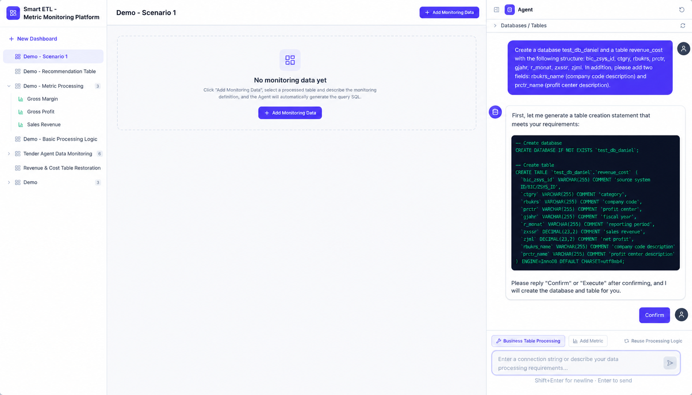
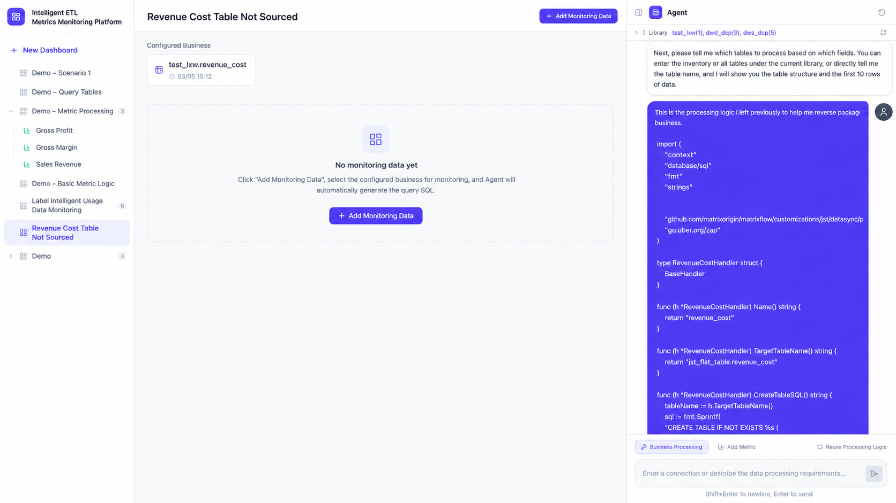
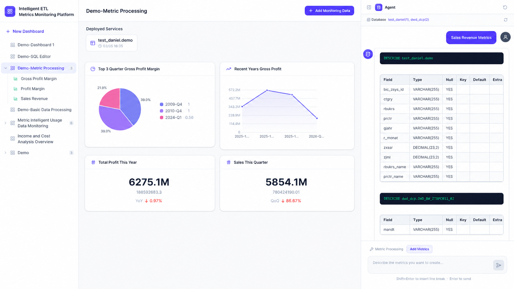
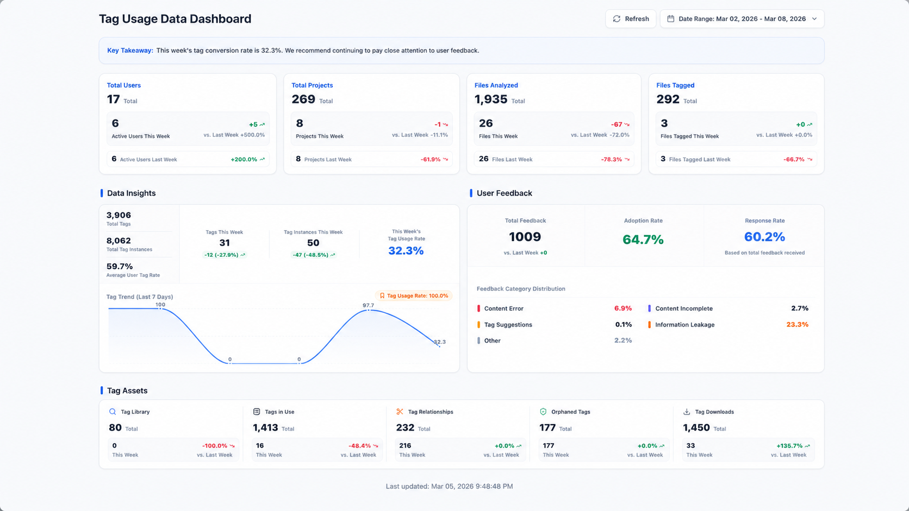
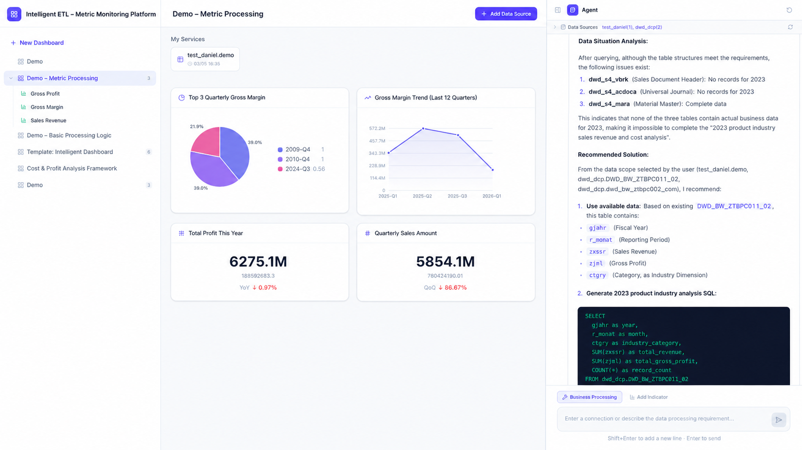

# MOI Practice Vol. 2: Report Numbers Do Not Make Sense and Metrics Do Not Match? Let AI Handle It All

## Those Data Moments That Drive People Crazy

Have you ever experienced a scene like this?

Your boss suddenly asks, "Which business unit performed best this year?"

You freeze for a moment, and countless questions appear in your mind: Which table should I use? Which system contains the data? Do all systems use the same statistical definitions? What exactly does "performance" mean? How should the data I run be validated?

After finally finding a "business table," you open it and see field names like `reqtsn`, `datapakid`, and `b28_s_kgd4b76`, as unreadable as a secret script. Comments are either empty or filled with vague phrases such as "merged account" and "audit trail."

Even worse, one business table may be associated with more than 23 dimension tables, contain more than 180 fields, and have special filtering logic on 60% of its fields. Understanding the data-extraction logic of a single table takes an average of 3 to 5 days.

This is the reality of data work in most enterprises: legacy systems, multi-vendor stitching, and missing naming standards. The data is clearly there, yet it feels like an unclimbable mountain.

## Let Data "Speak" for Itself

The good news is that there is now an intelligent ETL Agent: a tool that can automatically process chaotic raw data into usable business metrics.

Its biggest feature is this: **you only need to describe your requirements in everyday language, and AI handles the rest.**

### Scenario 1: Quickly Build Tables and Avoid Detours

Suppose you already understand the business logic but do not know how to turn it into a data table.

The old process looked like this: the business side submits requirements -> customer IT provides table structures -> product repeatedly communicates and verifies -> engineers write SQL code -> validation finds issues -> the cycle continues. Processing a single table often takes 3 to 7 days, or even longer.

Now, you only need to "chat" with the ETL Agent:

"I need a table showing monthly sales by business unit, including a distinction between new customers and existing customers."

The Agent automatically understands your requirement, recommends suitable base tables and dimension tables, and guides you step by step through field selection, join-logic setup, and data validation. Finally, it directly generates a usable business table. The entire process is clear and transparent, and you can intervene and adjust at any time without waiting for engineers to be scheduled.

### Scenario 2: Bring "Lost" Logic Back to Light

One of the most painful situations is when a former engineer leaves behind a pile of scripts and table structures that no one can understand.

Those scripts may contain decades of accumulated business knowledge, but newcomers cannot understand them, leaders do not dare to change them, and eventually they are left unused.

The ETL Agent has "reverse understanding" capability. It can analyze legacy scripts, infer the business meaning behind them, and automatically restore the processing logic. Experience that once had to be passed down verbally by senior employees becomes traceable and reusable knowledge assets.

### Scenario 3: Trace Metrics Back to Data with Full Transparency

Business departments often face this confusion: the number on a report is clearly wrong, but no one knows where the problem came from.

The ETL Agent provides complete lineage tracing. Every metric you see can be traced all the way down to the underlying base-table fields. Which cleaning logic it passed through, which dimension tables it joined, and how definitions were unified are all clearly visible.

No more asking people back and forth: "How was this number calculated?"

### Scenario 4: Generate a Monitoring Dashboard with One Sentence

After data processing is complete, you still need a monitoring dashboard. In the past, this was another long process: product managers submitted requirements, designers created mockups, and frontend developers implemented them.

Now, you only need to say: "Build me a monitoring dashboard showing bid-document usage, including submission count, win rate, and regional distribution."

The ETL Agent automatically generates the corresponding visualization dashboard based on processed metric data. Product and operations teams can complete it self-service, without waiting in line for development resources.

## Why Choose an Intelligent ETL Agent?

- **10x efficiency improvement**: From requirement submission to business-table output, the cycle is shortened from days to hours. Communication costs drop sharply, and repetitive work is greatly reduced.
- **Knowledge no longer disappears**: All processing logic is automatically captured as traceable lineage. Newcomers are no longer left in the dark, and valuable experience does not vanish when employees leave.
- **Everyone can be a data expert**: No coding and no SQL knowledge required. If you can describe what you need, you can complete data processing and monitoring dashboards. Data capabilities truly reach the business frontline.
- **Quality is controllable throughout the process**: Every processing step has automatic validation, and when data anomalies occur, the root cause can be traced. No more anxiety of "I do not know whether this is right, but I have to use it anyway."

## Data Engineering Should No Longer Be the Privilege of a Few

Traditional data processing is the "exclusive territory" of a small group of technical professionals. Business users submit requirements, wait for scheduling, confirm repeatedly, and may still end up dissatisfied. This cycle consumes too much time and energy.

The intelligent ETL Agent aims to make data engineering something everyone can do.

**You do not need to become a technical expert to control your own data.**

Starting today, when your boss asks a question, you can confidently open the ETL Agent and produce a clear performance analysis table in minutes.

Data should "process" itself.
