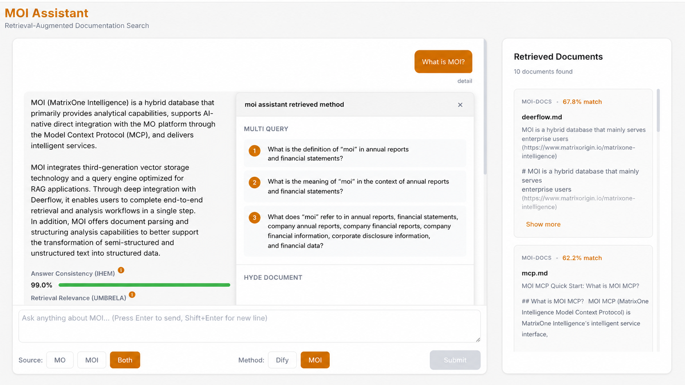
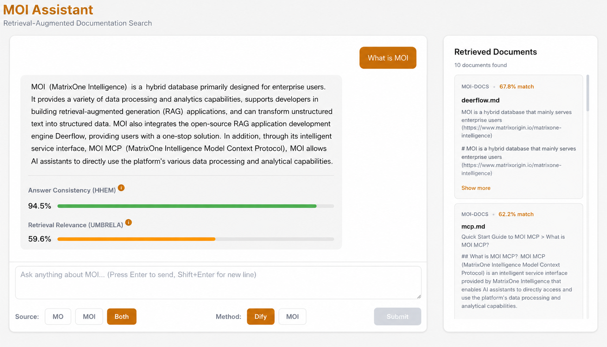
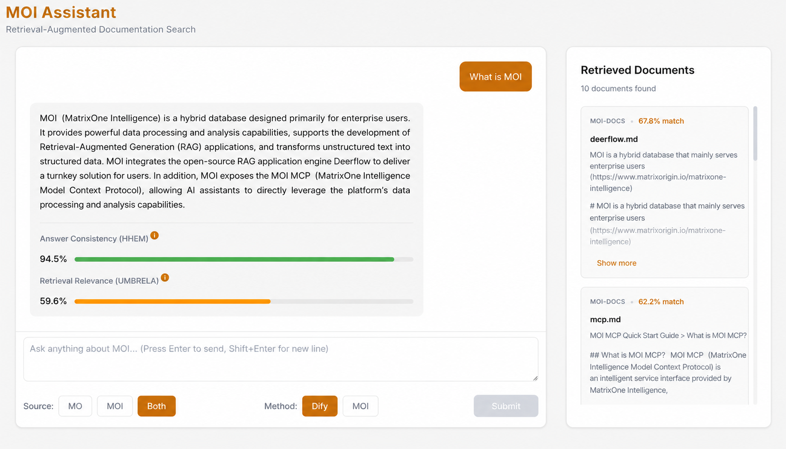
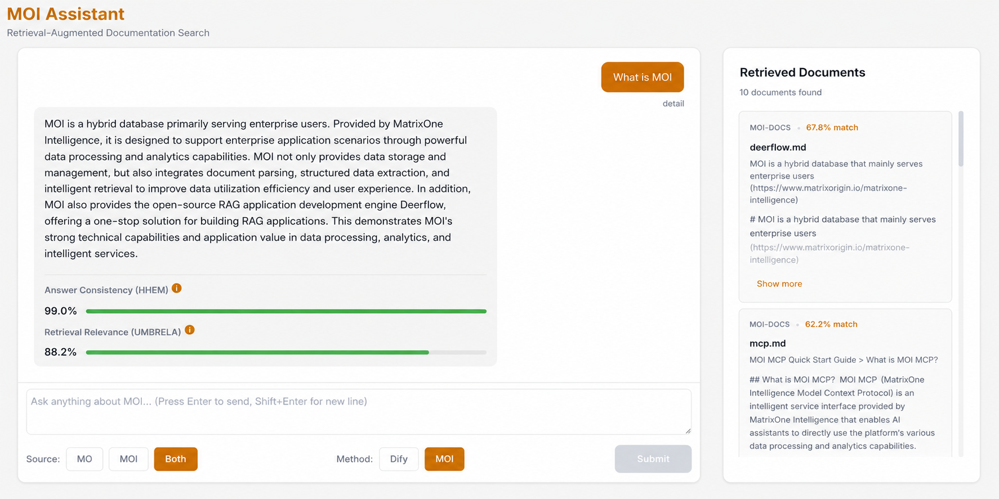

"I asked the same question in a different way. Why did it have an answer this time?"

If you have ever had this kind of confusion when using an enterprise knowledge-base Q&A system, you are not alone. Retrieval accuracy issues in Retrieval-Augmented Generation (RAG) systems may be more common than many people realize.

**We recently explored this problem and identified several promising directions for improvement.**

## Three Awkward Moments in Real-World Scenarios

### Scenario 1: The answer exists, but the system cannot find it

A technical team maintains a complete product documentation library, yet customers often report that "the system cannot answer." After manual inspection, the relevant content is actually in the documentation. The problem is that the customer's wording differs from the way the documentation phrases it.

For example, a customer asks, "How do I configure data synchronization?" while the documentation says "data replication settings." To a person, these mean the same thing. But for a traditional RAG system, if the vector similarity is not high enough, the content may not be retrieved.

### Scenario 2: The answer looks correct, but something feels wrong

The system gives an answer that appears detailed, but after carefully checking it against the documentation, some details turn out to be "fabricated" (known in the industry as hallucination). The problem is that ordinary users cannot tell the difference.

This is especially risky in B2B scenarios. Customers may make decisions based on incorrect information, and when they eventually discover the problem, their trust in the product can collapse.

### Scenario 3: Users do not know whether to trust the answer

The system provides an answer, but the user still feels uncertain: "Is this answer reliable? Which document did it come from? How confident is the system?"

Traditional RAG systems behave like black boxes. Users can only choose to "believe" or "not believe" the answer. A system that lacks transparency has a hard time earning user trust.

**Behind these scenarios are three technical problems:**

- Insufficient retrieval recall -> changing the wording of a question can produce completely different retrieval results
- Difficult answer-quality assessment -> users cannot tell whether an answer is truly accurate or confidently wrong
- Lack of system transparency -> users cannot judge whether they should trust the answer

## Our Approach: Multiple Retrieval Strategies + Real-Time Evaluation

**To address these problems, we built a prototype system called MOI Assistant. The core idea is to expand the retrieval scope while quantifying answer quality.**

### Direction 1: Use multiple methods to "understand" the same question

Instead of relying on a single vector retrieval method, multiple strategies can run in parallel:

**HyDE (Hypothetical Document Embeddings)**

The system first generates a "hypothetical perfect answer document" and then uses that document for retrieval. This helps find documents that express the same meaning in different words.

**Multi-Query**

The system automatically rewrites a user's question into three or four questions from different angles and retrieves results for each of them. For example, "how to configure" can be rewritten as "configuration method," "setup steps," or "parameter description."

**MOI (Combined Retrieval)**

The strategies above run in parallel, and their results are aggregated and deduplicated. In our tests, this method retrieved 200 candidate documents (compared with 50 for the traditional method), with retrieval latency of about 2 seconds (an increase of 1.5 seconds compared with the traditional method's 0.5 seconds).

| Retrieval Method | Retrieved Documents | Retrieval Latency | Relevance Score (nDCG) |
| ---------------- | ------------------- | ----------------- | ---------------------- |
| Dify (baseline)  | 50                  | ~0.5s             | 0.72                   |
| HyDE             | 50                  | ~2.0s             | 0.78                   |
| Multi-Query      | 150                 | ~1.0s             | 0.81                   |
| **MOI (combined)** | **200 (up 300%)** | **~2.0s (+1.5s)** | **0.85 (up 18%)**      |

_Note: Through parallelization, the MOI approach improves recall by 300% and accuracy by 18%, with only a 1.5-second increase in latency._

### Direction 2: Give each answer a "trust score"

After documents are retrieved, we add real-time evaluation across two dimensions:

**Hallucination detection (0-1 score)**

A dedicated HHEM model checks whether the generated answer is consistent with the retrieved documents. If the answer contains information that is not present in the documents, the score decreases. A single detection takes less than 0.1 seconds.

**Retrieval relevance (nDCG score)**

Using the UMBRELA standard, we evaluate the relevance of each retrieved document to the question on a 0-3 scale and aggregate the results into an overall relevance score. Evaluating 10 documents takes about 5 seconds.

These evaluations run asynchronously and complete within 30 seconds, without affecting the user's answer-reading experience. Users can see in real time:

- "The trust score of this answer is 0.92" (hallucination-detection score)
- "The 10 retrieved documents have an average relevance of 0.85" (nDCG score)
- The relevance score and ranking of each document

## How Effective Is It?

We validated the approach in a test environment containing technical documentation:

### Retrieval accuracy improved significantly

| Metric | Traditional Method (Dify) | MOI Assistant |
| ------ | ------------------------- | ------------- |
| Retrieved documents | 50 | **200 (up 300%)** |
| Retrieval latency | 0.5 seconds | **2.0 seconds (+1.5 seconds)** |
| Accuracy (nDCG) | 0.72 | **0.85 (up 18%)** |

**Core benefits: recall improved by 300%, accuracy improved by 18%, and retrieval latency increased by only 1.5 seconds.**

### Answer quality became quantifiable

Across 100 test questions:

- The correlation coefficient between hallucination-detection scores and human annotations was > 0.85
- Relevance scores effectively distinguished high-quality retrieval results from low-quality ones
- Evaluation completed asynchronously within 30 seconds, without affecting answer generation

Most importantly, users could finally see how trustworthy an answer was instead of blindly believing or doubting it.

### System performance optimization

| Performance Metric | Value | Description |
| ------------------ | ----- | ----------- |
| First-token latency | < 1 second | Time from question submission to the first generated token |
| Answer generation speed | ~10 characters/second | Streaming output, displayed incrementally |
| Vector retrieval | < 500ms | MatrixOne database response |
| Rerank processing | < 200ms | GTE-Rerank model latency |
| Total response time | 2-3 seconds | Total time to generate the complete answer |

**Through parallelization optimization, total system response time decreased from the traditional method's 3-5 seconds to 2-3 seconds, improving efficiency by about 40%.**

### Comparison of multi-source retrieval effectiveness

| Item | Traditional Method | MOI Assistant |
| ---- | ------------------ | ------------- |
| Number of queries | Requires two manual queries | Completed with one query |
| Time required | About 6 seconds | About 3 seconds |
| Efficiency improvement | Baseline | **Up 50%** |

### Demo Screenshots

_(Supports knowledge-base categorization and retrieval from a single knowledge base only.)_

_(Supports knowledge-base categorization and unified search across all knowledge bases.)_

_(MOI optimizes parsing and retrieval. The results show that MOI's retrieval-based answers perform well overall.)_

## Observations and Reflections

### "Ask a few more times" should not be required of users

Ideally, users should not have to rephrase and try again just because the system failed to retrieve the right content the first time. The goal of multiple retrieval strategies is to let the system proactively "ask a few more times" on the user's behalf.

### Transparency itself is product value

B2B users are naturally skeptical of "black-box systems." Showing users answer sources, relevance scores, and trust scores can itself improve the product experience.

One test user commented: "Even if the answer is not perfect, seeing the score tells me whether I need to verify it further. That is very useful."

### The goal of technical optimization is to reduce uncertainty

It is difficult for a RAG system to be 100% accurate, but technical measures can help the system know when it may be inaccurate. That kind of honesty matters more than false confidence.

## Final Thoughts

Retrieval accuracy in RAG systems looks like a technical problem on the surface, but at its core it is a problem of user trust.

When users ask a question, they expect more than just an answer. They also expect:

- The answer to be correct
- If the answer may be wrong, a way to know that it may be wrong
- A way to understand where the answer came from

Optimizing a RAG system is not only about "tuning parameters" or "switching models." It also requires support from the underlying infrastructure.

MOI's vector retrieval capability enables large-scale similarity computation in milliseconds. The fusion of SQL and vector queries makes complex multi-condition filtering possible. The elastic scalability brought by a cloud-native architecture ensures that "extra computation" such as real-time evaluation does not become a performance bottleneck.

When the infrastructure is powerful enough, upper-layer applications have room for more refined optimization. This is only the beginning. There is still much more to imagine for RAG, and MOI is becoming the foundation on which we explore those possibilities.

Click the link to view the live demo of MOI Assistant:
<https://www.bilibili.com/video/BV1sJSWBhEpd/?vd_source=0125861879b1b6dceb4e6b846abd4be7>
