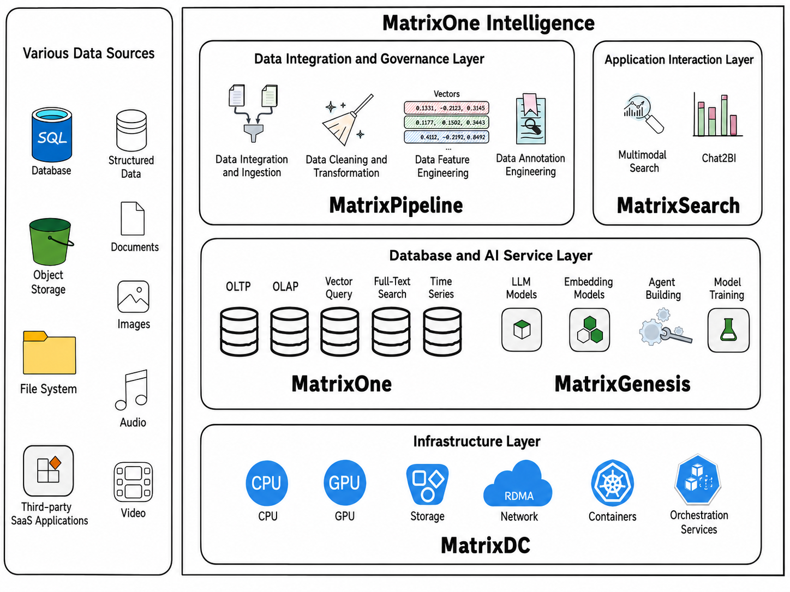

  <h1><strong>MatrixOne Intelligence</strong></h1>
  <h1><strong>Multimodal AI Data Intelligence Solution White Paper</strong></h1>
  <h3>Your Data for Your AI</h3>

[Part 1 -- Industry Status, Challenges, and Solution Architecture](/posts/moi-whitepaper1)

[Part 2 -- Detailed Technical Process of the Solution](/posts/moi-whitepaper2)

[Part 3 -- Industry Case Studies](/posts/moi-whitepaper3)

## Preface

In today's era, Generative Artificial Intelligence (Generative AI, or GenAI) is sweeping the world at unprecedented speed and has become an important force driving technological progress and industrial transformation. From the emergence of ChatGPT to the broad application of various large models, GenAI has not only achieved breakthrough progress at the technical level, but also created far-reaching impact at the business and social levels. From text generation and image creation to video production, GenAI application scenarios are becoming increasingly rich, bringing unprecedented opportunities and challenges to all industries.

According to a report by the McKinsey Global Institute, AI technology is expected to contribute up to USD 13 trillion in global GDP growth by 2030. Gartner predicts that by 2026, more than 80% of enterprises will use generative AI (GenAI) application programming interfaces (APIs) or models, or deploy GenAI-enabled applications in related production environments. This figure was less than 5% in 2023, meaning that in just three years, the number of enterprises adopting or creating generative AI models is expected to grow 16 times.

In the GenAI architecture, data processing plays an especially critical role. The close relationship between AI technology and data is obvious: massive datasets train powerful AI models, and the capabilities of those models can further optimize data processing. Even so, while the industry has deeply explored the capabilities and technical solutions of the compute layer, model layer, and application layer in the GenAI technology stack, the data-processing layer still receives insufficient attention. As general foundation models become increasingly widespread, the mining and utilization of enterprises' own data will become the most critical factor in implementing GenAI in enterprise-grade applications.

As a startup in the Data + AI field, MatrixOrigin has accumulated more than ten years of industry experience in data and AI. From MatrixOrigin's professional perspective, this white paper deeply analyzes the latest trends and challenges in the Data + AI field, and provides a detailed blueprint for how to deeply mine and utilize enterprises' own data, enabling GenAI applications that better match real enterprise business value.

## Data Challenges in the GenAI Era

### The Rise of Human-Brain-Like Computing Capability

The core driver of GenAI technology is large language models (LLMs). In essence, LLMs use computers to build huge neural network structures that simulate the human brain, then compress massive amounts of textual knowledge into a neural network with an enormous number of parameters. This architecture gives computers human-like interaction capabilities: they can understand human language and needs, then generate data that is easy for humans to understand.

GenAI's human-brain-like computing capability is fundamentally different from the high-speed mathematical computing traditionally associated with computers:

1. Traditional computing can easily complete complex scientific calculations that humans find difficult to finish in a short time, and it does so with extremely high accuracy. The same task may require large amounts of manual calculation and integration by humans, and human work often contains errors. But traditional computing struggles with NLP tasks composed of human natural language, such as document understanding, dialogue understanding, and image understanding, even though these capabilities are available to human children.

2. New GenAI computing capability is designed by fully imitating the structure of the human brain, and its demonstrated capabilities are highly similar to human behavior. Through natural-language interaction, it can easily handle tasks such as document understanding, dialogue understanding, and image understanding, and it also has a certain degree of creativity, generating things that do not exist in reality. However, it is not good at complex mathematical calculation, and accuracy is an inherent weakness.

Therefore, what GenAI truly brings is a new kind of human-brain-like computing capability. Together with traditional computers' precise mathematical computing capability, it forms the new computing foundation of today's IT world.

### The Value of Unstructured Data Begins to Be Unlocked

Data, another important foundation of the IT world, has also changed dramatically with the support of GenAI's new computing capability.

Traditionally, in the data-processing field, we divide data into three categories: structured data, semi-structured data, and unstructured data:

- Structured data is quantitative data consisting of values and numbers. It is highly organized, easy to access and interpret, and often exists in the form of two-dimensional tables and databases.

- Unstructured data is qualitative data with no internal structure. It consists of text, video, and images, including office documents in various formats, images, web pages, audio/video information, and more. This data often exists as files.

- Semi-structured data lies between the two. It is generally self-describing, with structure and content mixed together and no obvious separation, such as JSON and XML data.

Over the past several decades of Data Infra development, structured and semi-structured data processing has been the absolute protagonist. Structured and semi-structured data are generated by business processes and are highly related to commercial value. These data are closely tied to enterprise processes, business, and commercialization, and the Data Infra software field has gradually evolved very mature products and processing capabilities.

However, Gartner data shows that structured and semi-structured data account for less than 20% of all data in the world, while more than 80% is unstructured data. Under past technical capabilities, unstructured data was difficult to process, and its value was difficult to mine and measure. Research shows that large amounts of office-document data may be used at most twice during their entire lifecycle. Compared with the effort invested in creating them, the value generated is extremely limited. Therefore, unstructured data has long been treated as a liability for enterprises.

Essentially, unstructured data is created to facilitate interaction between humans and computers. These formats are designed to serve humans and are closely related to human understanding capabilities and usage habits. But for traditional computers whose main capability is mathematical computing, they are difficult to parse and process.

The emergence of GenAI has completely broken this situation. On one hand, AI large models themselves are trained on massive unstructured documents and multimodal data, and enterprises can use their accumulated unstructured data for model training and fine-tuning. On the other hand, with the help of technical frameworks such as RAG, unstructured data can be parsed and structured through AI parsing and external vector databases. Users can easily implement businesses such as ChatWithPDF.

The value of unstructured data, which accounts for more than 80% of global data, can now be unlocked. The rich business insights, customer needs, and market trends contained within it can provide further data value for enterprise innovation and decision-making.

### Enterprise Data Difficulties in GenAI Implementation

Against the background of rapid GenAI technological progress over the past two years, enterprises have generally recognized the importance of intelligent upgrading based on AI large models. Many enterprises have also begun GenAI-related technical research and experimental implementation attempts. However, because general AI large models are essentially compressed from massive public knowledge, enterprise-grade implementation inevitably encounters problems in accurately understanding enterprise-specific language and business.

For most enterprises, however, the requirements for accurately solving their own business problems are high. To improve the precision of general large models in solving industry business problems, whether through fine-tuning general models for industry adaptation or through knowledge augmentation using RAG architecture, integration of high-quality enterprise-owned data is indispensable. At the same time, industry-oriented GenAI solutions usually require enterprise-owned data to be hybrid and multimodal. This includes structured and semi-structured data that already has relatively mature Data Infra processing, as well as multimodal unstructured data that has not been processed in the past. This data requirement poses enormous challenges for enterprise GenAI implementation.

After observing many enterprise GenAI experiments and implementation processes, we summarized the following issues:

#### Severe Data Fragmentation

Before the GenAI wave arrived, enterprise data processing mainly focused on integrating and optimizing structured data. Many enterprises built data middle platforms by breaking down siloed business systems. However, GenAI application scenarios require far more from data than before, especially in the integration of multimodal data, whose sources are scattered and difficult to manage. Unstructured data is usually distributed across cloud drives, internal IM tools, object storage, business systems, server file systems, and personal devices. There is often no unified management process during creation and storage. Structured data in GenAI scenarios also needs to be mixed with unstructured data, and the associations between different data types further increase fragmentation. Enterprises not only need to efficiently integrate these heterogeneous data sources, but also need to ensure hierarchical management of permissions and privacy to meet compliance and security requirements.

#### **Complexity of Heterogeneous Multimodal Data Integration**

To allow GenAI to truly create value in business scenarios, enterprises need to integrate structured, semi-structured, and unstructured data for combined use. Unstructured data is especially difficult because of its diverse formats and modalities, such as Word, PPT, PDF, JPEG, WAV, and MP4. Each format involves complex parsing and governance processes. Taking PDF as an example, its processing chain includes layout detection and segmentation, content recognition such as text, tables, and images, and feature extraction. If it needs to be further integrated with structured and semi-structured data, the complexity of the overall chain increases exponentially. For enterprises that lack deep data and AI engineering capabilities, these technical barriers are difficult to overcome.

#### High Difficulty in Scaled Deployment and Management

GenAI applications and multimodal data processing rely heavily on powerful IT infrastructure. Building a RAG demo using dozens of documents is relatively simple, but in a real large-scale production environment, enterprises usually need to process PB-level data and perform complex model fine-tuning and training. This requires not only large amounts of high-performance GPU and CPU compute power, but also large-capacity storage and high-bandwidth, low-latency network architecture. At the same time, the underlying resource software management platform must also have resource scheduling and automatic scaling capabilities, support multimodal data preprocessing and storage, and be based on a cloud-native architecture to ensure flexible deployment and efficient management across environments.

#### Limitations in Data Recall and Output Accuracy

As a core technology of GenAI, large models essentially generate output based on probability distributions. This characteristic makes it difficult for them to be fully accurate in demanding enterprise business scenarios. Insufficient accuracy directly affects commercial value, so model fine-tuning based on enterprise data or RAG (Retrieval-Augmented Generation) frameworks becomes inevitable. However, these optimization technologies themselves have high technical thresholds. For example, in RAG frameworks, basic vector semantic search performs poorly on short-word or short-sentence questions and cannot meet high-precision business requirements. Multiple search methods, such as keyword matching and full-text search, need to be introduced as supplements. In Chat2BI scenarios widely expected by enterprises, SQL generated directly by large models often has low accuracy and needs engineering methods such as syntax validation and result optimization to improve practical usability.

### Implementation Difficulties in Typical Industry Scenarios

The following three real enterprise scenarios show the main data-layer obstacles in enterprise-grade GenAI implementation:

#### Newspaper and Media Group

This group has been established for nearly 30 years. It saw GenAI's powerful capabilities in content production and hoped to empower its own content-production business by embedding AI capabilities into content-production workflows. However, general large models did not perform ideally. The group owns massive media materials, including digitized historical newspaper files, large numbers of images, audio, and video materials. It hoped to combine its massive proprietary materials with large-model capabilities and embed them into its workflows. But after sorting and inventorying the data, it found that the material data was scattered across various business systems, hard drives, cloud drives, and other spaces, with severe fragmentation. At the same time, it lacked tools to find materials related to the desired content topic. Frontline editors could only rely on memory and limited filtering to obtain a small amount of material. In addition, how to combine these materials with large models for implementation, whether through fine-tuning or RAG, also posed huge technical and resource barriers for the enterprise.

#### Large Electronics Manufacturing Company

This company is an electronics manufacturer with annual output value in the tens of billions of yuan, multiple factories, and dozens of electronics production lines. It has long collected many types of data from production lines, including structured data generated by production equipment, documents, image data, and audio/video data of employee operations. Structured data is relatively well carried by MES system databases, but other types of data have not been effectively processed. For example, to check whether workers follow operating standards at a certain process step, each workstation has cameras that capture employee operation videos. The company currently can only determine whether employees wear gloves or whether collisions occur by manually spot-checking videos. Coverage is less than 5%, and it is difficult to perform associated analysis with data from other systems. The emergence of GenAI is a new opportunity for this enterprise, but unified governance of multimodal data and linkage with large models also exceed its technical capabilities.

#### Municipal Government Planning Department

This department is the development planning department of a municipal government. The city's economy is mainly based on traditional industries, so its investment-attraction policy focus is also on high-value-added industries related to new energy. Investment-attraction personnel in the department have long needed to follow market trends across multiple niche industries and local policy developments to provide support for development decisions. For a long time, they could only manually search online for relevant information, then manually integrate and summarize it with local industry data to publish monthly reports for decision-making leaders. After GenAI technology emerged, investment-attraction personnel began using public large-model tools for further search and integration, improving work efficiency to some extent. However, for more complex and diverse data such as industry consulting reports, listed-company financial reports, and business registration information, general GenAI tools do not produce ideal results. Data related to local industrial documents, policies, statistics, and more further increases processing complexity.

### Summary

The value of GenAI has been widely recognized by enterprises and has begun to be implemented in practical applications. However, to truly solve business problems and realize commercial potential, GenAI implementation must rely on high-quality enterprise-owned data. For a long time, the potential value of unstructured data has not been fully mined. The emergence of GenAI brings new possibilities for activating this data and also increases its commercial value in enterprise applications. However, most enterprise data still does not meet the high-quality AI-Ready standard and faces challenges of engineering complexity and high resource cost. The industry urgently needs an efficient and comprehensive solution to address the integration and utilization of hybrid multimodal data.

## MatrixOne Intelligence Multimodal AI Data Intelligence Solution

### Overview of MatrixOne Intelligence

Since its founding, MatrixOrigin has taken as its mission the provision of a simple and powerful data intelligence operating system for the digital world, helping enterprises and users embrace the value of data intelligence in a simple, agile, and efficient way.

MatrixOne Intelligence is an AI data intelligence solution for multimodal data, designed to help enterprises address challenges such as data fragmentation, complex multimodal data integration, and difficult generative AI application implementation. By integrating data governance, intelligent parsing, multimodal search, and a hyper-converged data foundation, MatrixOne Intelligence provides enterprises with a one-stop end-to-end platform solution. Based on an innovative cloud-native architecture and storage-compute separation design, the platform supports unified management and efficient processing of structured, semi-structured, and unstructured data. It also provides highly flexible deployment capabilities across public cloud, private cloud, and on-premises data center environments.

MatrixOne Intelligence is committed to empowering enterprises, helping them fully mine and release the potential of their own data, and making enterprise-owned data a key source of unique competitiveness.

### Solution Architecture

In the previous sections, we discussed the data challenges faced by GenAI in enterprise-grade implementation, including data fragmentation, complex integration of heterogeneous multimodal data, and difficulty fully releasing the value of enterprise-owned data. These problems severely limit enterprise competitiveness and efficiency in the era of data intelligence. MatrixOne Intelligence, as an AI data intelligence solution for multimodal data, is designed precisely for these key pain points, providing enterprises with a new path from data to intelligence.

To solve these challenges, MatrixOne Intelligence builds an end-to-end data intelligence architecture through unified underlying resource management, full-link data governance, multimodal data fusion storage, modeling, and search capabilities. As shown in the figure below, the solution is divided from bottom to top into four layers: infrastructure layer, data integration and governance layer, database and AI service layer, and application interaction layer. These four layers are closely connected and together build a powerful data intelligence solution.

#### Infrastructure Layer

The infrastructure layer is the IT resource foundation of the entire solution. It integrates CPU and GPU computing capabilities, supports large-scale parallel processing, and ensures efficient operation of AI models and data processing. Container orchestration and management improve system scalability and flexibility, providing enterprises with efficient resource scheduling and load balancing.

#### Data Integration and Governance Layer

The data integration and governance layer is responsible for collecting, cleaning, and transforming data from various data sources on the left side, performing unified preprocessing and feature engineering. It supports integration and processing of structured, semi-structured, and unstructured data, ensuring data quality and consistency and providing a reliable data foundation for subsequent analytics and AI model training.

#### Database and AI Service Layer

The database and AI service layer provides a complete database and AI model capability foundation. It supports fused storage and modeling of structured, semi-structured, and unstructured data, while also providing LLM models, embedding models, custom model training, and workflow tool capabilities for quickly building Agents.

#### Application Interaction Layer

The application interaction layer is the interface between users and the overall solution. Users can directly use the multimodal search and Chat2BI terminal applications we provide, or build related applications themselves through APIs and workflow tools.

### Core Product Overview

As shown in the architecture diagram above, the MatrixOne Intelligence solution includes five core software products. They correspond to different layers in the solution architecture and together form a complete technical system. Through coordinated operation, these products seamlessly connect infrastructure, data integration, governance, storage, analysis, and interaction capabilities, providing a one-stop, end-to-end multimodal data intelligence solution.

Next, we introduce these five core products one by one, explaining their functional positioning and unique value at different layers, and showing how they work together to address enterprise data and intelligence challenges in generative AI implementation.

#### MatrixDC High-Performance Compute-Network Scheduling Platform

MatrixDC is a high-performance compute-network scheduling platform. As the resource foundation, it uses K8s containers, RDMA high-speed networking, object storage, and other basic capabilities to build a platform that unifies management, networking, scheduling, and operation of CPU and GPU servers. MatrixDC integrates comprehensive container orchestration and management capabilities, using cloud-native technologies such as Kubernetes to enable elastic scaling and efficient utilization of compute networks and storage resources. MatrixDC supports integration of multiple computing resources, including CPU, GPU, storage, and network resources, meeting diverse needs from small-scale experiments to large-scale production environments. Through containerization and distributed deployment architecture, MatrixDC provides enterprises with flexible resource allocation, supports serverless service invocation, and helps users greatly reduce O&M costs while handling complex computing tasks. In addition, MatrixDC provides low-latency, high-throughput network optimization capabilities, ensuring efficient communication among multiple nodes and serving as a strong technical foundation for multimodal AI task execution and large-model training.

#### MatrixOne Hyper-Converged Cloud-Native Database

MatrixOne is the core data management foundation of the MatrixOne Intelligence platform. It is designed to provide enterprises with a comprehensive hyper-converged database solution to support efficient processing of multimodal data for GenAI. It adopts a storage-compute separation and cloud-native architecture design, supporting unified storage and querying of structured, semi-structured, and unstructured data. MatrixOne has multimodal data fusion processing capabilities and can simultaneously support transactional (OLTP), analytical (OLAP), vector retrieval, full-text search, and time-series data queries, greatly simplifying enterprise management of complex data workloads. In addition, MatrixOne provides powerful snapshot capabilities, giving reliable support for data versioning of rapidly and dynamically changing training sets, validation sets, and evaluation sets in GenAI. Through deep integration with MatrixGenesis and MatrixPipeline, MatrixOne can quickly complete data parsing, vectorization, and feature engineering, and support high-performance multidimensional retrieval and recall.

#### MatrixGenesis AI Agent Application Development Platform

MatrixGenesis is the AI service module in the MatrixOne Intelligence platform, focused on providing enterprises with large-model support and intelligent application development capabilities. As a core tool for enterprise AI transformation, MatrixGenesis covers full-lifecycle management from model training and fine-tuning to inference deployment, helping enterprises quickly apply generative AI to real business scenarios. By integrating advanced large-model services, such as LLMs and multimodal models, and MaaS (Model as a Service) platforms, MatrixGenesis supports flexible configuration and expansion to meet diverse industry needs. In addition, MatrixGenesis provides powerful Agent workflow design and development capabilities, enabling enterprises to quickly build Agent applications for specific business scenarios. With efficient workflow management tools and convenient model integration capabilities, MatrixGenesis greatly lowers the technical threshold for enterprise AI application development and provides solid support for scaled implementation of generative AI.

#### MatrixPipeline Multimodal Data Engineering Platform

MatrixPipeline is the data processing and governance module in the MatrixOne Intelligence platform, designed to provide enterprises with efficient access, transformation, and management capabilities for multimodal data. As the core engine of data flow, MatrixPipeline supports unified access to structured, semi-structured, and unstructured data. Through flexible connectors and automated ETL processes, it helps enterprises easily integrate multi-source data. Its built-in preprocessing and parsing capabilities can intelligently parse, extract content, and perform feature engineering for different data formats, such as PDF, Word, JPEG, video, and audio, providing high-quality data support for subsequent model training and inference. In addition, MatrixPipeline provides data cleaning, enhancement, and annotation capabilities. Combined with embedded annotation and automated feature generation provided by large models, it greatly improves data governance efficiency and accuracy. Through deep integration with the MatrixOne database, MatrixPipeline enables seamless data-flow management and supports efficient data version management and full-lifecycle tracking. As a foundational module for enterprise data intelligence, MatrixPipeline simplifies complex data pipeline construction and significantly lowers the technical threshold of multimodal data governance.

#### MatrixSearch Multimodal Intelligent Search Engine

MatrixSearch is the multimodal intelligent search engine of the MatrixOne Intelligence platform, providing enterprises with powerful cross-modal retrieval and semantic query capabilities. By integrating vector retrieval, full-text retrieval, and structured queries, MatrixSearch supports efficient retrieval of multiple data types including text, images, audio, and video, helping enterprises quickly obtain key information from multimodal data. Its innovative hybrid search mechanism combines semantic understanding with natural-language queries and can deeply parse user intent. Whether for structured questions such as SQL queries or unstructured scenarios such as voice instructions and document Q&A, it can provide accurate retrieval results. In addition, MatrixSearch includes multi-way recall and intelligent ranking algorithms, comprehensively optimizing vector matching and keyword retrieval results to ensure relevance and accuracy. With comprehensive support for multimodal data and flexibility for deep integration with business scenarios, MatrixSearch provides important support for enterprises to achieve data-driven decision-making and intelligent generative AI applications.

### Technical Characteristics and Advantages of the Solution

MatrixOne Intelligence follows the core principles of modern IT architecture design and builds a modular, highly scalable, and highly reliable technical system, fully adapting to enterprises' diverse data and AI application needs. The entire platform is based on a cloud-native architecture, using containerization, microservices, and distributed computing technologies to enable flexible deployment and elastic scaling. The modular design allows functional components such as data integration, governance, storage, AI model services, and search engines to run independently and be freely combined, making it convenient for enterprises to quickly adjust and expand business capabilities according to needs. The MatrixOne Intelligence solution shows significant advantages in the following six aspects.

#### One-Stop End-to-End Platform Capabilities

MatrixOne Intelligence provides a highly integrated multimodal data intelligence platform covering the full process from data access and governance to analysis and application. Enterprises do not need to migrate data among multiple independent systems or perform custom development, greatly reducing implementation complexity and development costs while enabling rapid business launch.

#### Elastic and Efficient Resource Scheduling

The platform adopts a cloud-native architecture and serverless computing model, supporting on-demand scaling and dynamic scheduling of CPU, GPU, and storage resources. The storage-compute separation design further enhances flexibility and cost-effectiveness, allowing enterprises to easily respond to business fluctuations without complex resource planning and optimize the overall cost structure.

#### Hyper-Converged Data Processing Capability

MatrixOne uses a single engine to support unified storage and computing of structured, semi-structured, and unstructured data, while also supporting mixed workloads including OLTP, OLAP, vector, full-text, and time-series. Compared with traditional multi-system architectures, this hyper-converged approach simplifies data management processes, significantly reduces enterprise investment in architecture design and O&M, and quickly releases data potential.

#### Dynamic Data Version Management

MatrixOne includes powerful snapshot capabilities that can flexibly manage data versions, support recording, comparison, and rollback of multi-version data, and ensure traceability and consistency in data processing. This not only meets enterprise requirements for data auditing and regulatory compliance, but also accelerates iterative optimization of AI models and enhances data-management flexibility.

#### AI-Driven Efficient Data Governance

The platform includes built-in AI capabilities that can automatically process multimodal data such as text, images, audio, and video, completing data extraction, annotation, classification, and feature engineering, comprehensively improving data governance efficiency. Enterprises can quickly build high-quality AI-ready data assets and provide reliable support for generative AI implementation.

#### Hybrid Multimodal Search Engine

MatrixSearch integrates semantic search, full-text retrieval, and structured query capabilities, supporting retrieval across databases, documents, audio, video, and other multimodal data. Its multi-way recall and hybrid reranking algorithms ensure result relevance and accuracy, provide enterprise users with an efficient knowledge acquisition experience, and significantly improve data service capabilities.
