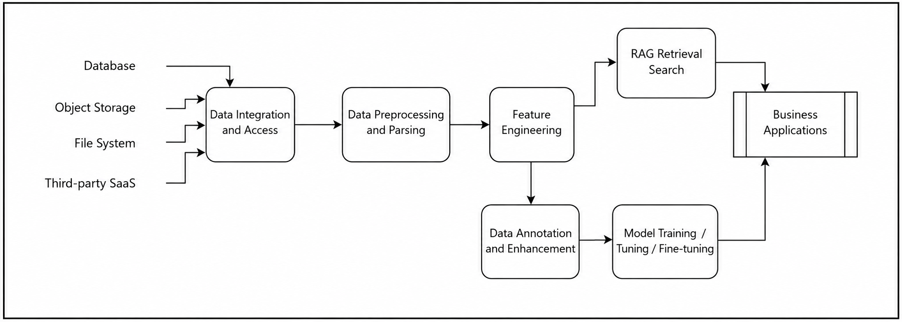

  <h1><strong>MatrixOne Intelligence</strong></h1>
  <h1><strong>Multimodal AI Data Intelligence Solution Whitepaper</strong></h1>
  <h3>Your Data for Your AI</h3>

[Part One--Industry Status, Challenges, and Solution Architecture](/posts/moi-whitepaper1)

[Part Two--Detailed Technical Process of the Solution](/posts/moi-whitepaper2)

[Part Three--Industry Use Cases](/posts/moi-whitepaper3)

## Detailed Technical Process of the Solution

After clarifying the overall architecture and core capabilities of the solution, this chapter breaks down the technical implementation process of MatrixOne Intelligence from the perspective of the Data Pipeline. It presents the full closed loop from data ingestion to intelligent applications. As an AI data intelligence platform for multimodal data, MatrixOne Intelligence covers data ingestion and integration, preprocessing and governance, annotation and feature engineering, storage and management, model training and evaluation, and finally data recall and search. Together, these stages form an efficient technical system that helps enterprises transform scattered multimodal data into intelligent assets that can drive business value.

### Overall Data Process

The goal of MatrixOne Intelligence is to turn an enterprise's proprietary internal data into AI-Ready data that can support GenAI applications and create business value. In essence, this goal is about improving the accuracy of large models in enterprise application scenarios.

There are currently four common approaches in the industry to achieve this goal: prompt engineering, RAG, model fine-tuning, and pretraining. Prompt engineering and RAG both require mining enterprise data to provide more context-aware prompts to large models. We can categorize them as inference-oriented GenAI data engineering. Model fine-tuning and pretraining use proprietary data to train more industry-specific models, which we can categorize as training-oriented GenAI data engineering. These two paths form the basic framework of an enterprise GenAI Data Pipeline. They can also coexist and complement each other. Before data is processed to serve model training or inference, there are shared data processes, such as data ingestion, data cleaning and preprocessing, data parsing, and feature engineering.

The overall Data Pipeline can be summarized in the following flowchart:

Next, we analyze the scenarios of each key stage, the technical requirements for data processing, and how the product capabilities in MatrixOne Intelligence match the needs of each stage.

### Data Ingestion and Integration

#### **Stage Overview**

As described earlier, when enterprises build GenAI application scenarios, they commonly face a new round of data silos. Various data sources may be distributed across different databases, such as relational databases and NoSQL databases; file systems, whether local or cloud storage; third-party SaaS applications, such as cloud drives and IM tools; and edge devices. These data are not only physically scattered, but also highly heterogeneous in format, covering structured data, such as database tables; semi-structured data, such as JSON and XML; and unstructured data, such as PDF documents, images, videos, and audio.

This distributed and diverse data landscape creates the following key issues and requirements:

1. **Complex data acquisition and integration**: Data is distributed across multiple systems and locations, without unified access and management. This makes data integration labor-intensive and inefficient.

2. **Pressure from unstructured data processing**: Unstructured data volumes are large, such as video and audio files. A fully centralized ingestion approach creates bandwidth bottlenecks, high latency, and high costs.

3. **Standardization of multimodal data**: Data formats are inconsistent, and parsing and standardization are cumbersome, making it difficult to directly support AI modeling and applications.

4. **Security and permission management**: Cross-department and cross-system data access requires fine-grained permission controls to ensure security and compliance during ingestion and management.

Therefore, the core goal of this stage is to address data dispersion and heterogeneity, and to build an architecture that supports unified access to multiple data sources, cloud-edge collaborative processing, and distributed management. By efficiently integrating structured, semi-structured, and unstructured data, and by providing flexible permission controls and standardization capabilities, this stage lays a solid data foundation for subsequent AI modeling and intelligent applications.

#### Technical Process

At the data ingestion and integration stage, MatrixOne Intelligence provides a comprehensive set of powerful functional modules through MatrixPipeline to integrate and manage multiple data sources efficiently and securely. The process includes the following:

##### Unified Access to Multi-source Heterogeneous Data

- Broad data source support: Supports connections to structured data, such as MySQL and PostgreSQL; semi-structured data, such as JSON and XML; and unstructured data, such as PDF, images, audio, and video. It also integrates seamlessly with mainstream third-party SaaS applications, such as Baidu Netdisk and Feishu, through standardized interfaces.

- Virtualized access: Through a Data Fabric architecture, it supports logically unified access to distributed data and enables ingestion and governance without physically migrating the data.

##### Cloud-edge Collaborative Data Processing

- Preliminary processing at the edge: For scenarios involving large volumes of unstructured data, such as video and image data, edge devices can complete data collection, filtering, and compression, then upload streamlined data to the cloud to reduce bandwidth usage and transmission latency.

- Centralized cloud management: The cloud handles complex multimodal data parsing and deep retrieval tasks, enabling cloud-edge collaboration and improving processing efficiency and data response speed.

##### Real-time and Batch Synchronization Capabilities

- Real-time data ingestion: Through real-time stream processing tools, it supports the ingestion of real-time data streams, enabling enterprises to respond promptly to dynamic business needs.

- Batch loading of historical data: Supports efficient import of historical data from traditional storage systems or data warehouses to build a complete data view for full-volume analysis.

##### Distributed Metadata Management

- Global metadata catalog: Establishes a distributed metadata index to uniformly manage and locate data across multiple locations and formats, enabling fast data retrieval without directly accessing source files.

- Intelligent data scheduling: Dynamically optimizes data access paths based on access frequency and business needs, achieving optimal resource allocation between edge and cloud.

##### Security and Permission Control

- Fine-grained permission management: A role-based access control (RBAC) mechanism provides multi-level permission configurations for different users and departments, ensuring secure and compliant data use and sharing.

- Encryption and desensitization: Supports SSL encryption during data transmission and desensitized storage of sensitive data to comprehensively protect data security.

With these capabilities, enterprises can effectively solve challenges in multimodal data ingestion and integration, establishing a solid data foundation for subsequent AI modeling and intelligent applications.

#### Product Capabilities

At the data ingestion and integration stage, MatrixOne Intelligence provides supporting capabilities through the following core products:

##### MatrixPipeline Data Connectors

- Provides flexible data connectors that support rapid access to various heterogeneous data sources.

- Includes built-in stream processing and batch data synchronization capabilities for efficient import of real-time and historical data.

- Provides data standardization tools, including format conversion, metadata generation, and permission control.

- Supports collaboration between edge nodes and the cloud, with edge devices completing preliminary data parsing and compression.

- Centrally processes complex tasks in the cloud and optimizes resource usage through intelligent scheduling.

##### MatrixOne Multimodal Data Management

- MatrixOne serves as a unified cloud-native multimodal database platform, supporting integrated storage of structured, semi-structured, and unstructured data.

- Through Datalink and Stage capabilities, MatrixOne can directly link to data in external storage and implement a Data Fabric architecture.

- MatrixOne provides ACID capabilities, ensuring exactly-once semantics during data import and transmission.

- MatrixOne provides distributed metadata management and global indexing services, supporting fast retrieval across nodes.

### Data Preprocessing and Parsing

#### Stage Overview

In the overall solution, preprocessing and parsing are key stages for transforming raw data into high-quality AI-ready data. From the previous stage, we extracted large amounts of unstructured data in various formats, including document formats such as DOCX, PPT, PDF, and Markdown; image formats such as JPG, BMP, and SVG; audio formats such as WAV, MP3, and WMA; video formats such as MP4 and MOV; and web formats such as HTML. However, because these data have diverse formats, complex content, and inconsistent quality, they cannot be directly fed into AI training or inference workflows. The goal of preprocessing and parsing is to uniformly process these multimodal data, convert them into structured or semi-structured forms, and improve data quality and consistency. This includes cleaning redundant data, repairing missing values, and extracting core content features, such as extracting text from documents, identifying objects and scenes in images, transcribing speech from audio, and extracting keyframes and tags from videos. By standardizing formats and removing noise, this stage lays a solid foundation for subsequent modeling, training, and inference. It must also support automated processing workflows to handle large-scale, multi-format, multimodal data conversion and parsing efficiently, minimizing manual work and improving processing efficiency.

#### Technical Process

At the data preprocessing and parsing stage, MatrixOne Intelligence combines MatrixPipeline's automated pipeline capabilities with MatrixGenesis's intelligent parsing capabilities to provide a complete, efficient, and flexible solution covering the full process from data cleaning to data parsing.

##### Data Preprocessing

All unstructured data files go through the following three basic processes:

1. First, format validation checks whether the file type indicated in the file name matches the actual file type.

2. Second, data deduplication is performed by checking the MD5 of files to remove duplicate data.

3. Then, data formats are normalized. Documents and web data are uniformly converted to PDF, image data to JPG, audio to WAV, and video to MP4, enabling unified management in subsequent processes.

These preprocessing tasks can be completed through the built-in data preprocessing modules in MatrixPipeline. Users can also write their own code and package custom preprocessing scripts as services registered in MatrixPipeline for execution, producing the corresponding results.

##### Document Data Parsing

After each type of data has been normalized into the corresponding format, each data type has matching parsing modules. For document data normalized to PDF, the following parsing process extracts as much effective data and metadata as possible:

1. PDF layout and information block recognition: Performs layout analysis on input PDF documents, identifies and extracts information blocks such as images, tables, charts, and text.

2. Text data parsing: Extracts text metadata and raw content, and chunks the text according to user-defined logic or system-defined logic. The chunks can later be vectorized into embeddings.

3. Image data parsing: Extracts image content from PDFs, performs visual model reverse captioning and OCR text extraction, and later vectorizes the images themselves into embeddings.

4. Table data parsing: Uses table recognition algorithms to extract structured data from tables and describes their layout through metadata, supporting recursive parsing of complex nested tables.

5. Manual adjustment and optimization: Supports manual adjustment of automated parsing results to optimize block segmentation, annotations, and metadata content, improving parsing quality.

##### Multimedia Data Parsing

For multimedia types such as images, audio, and video, additional data preprocessing is performed, after which relevant parsing processes are reused or added to form more effective structured data:

1. For JPG image data, the related parsing process used after extracting images from document data is directly reused.

2. For WAV audio data, ASR is first used to convert speech into text, and then both the audio data and text data are vectorized into embeddings.

3. For MP4 video data, the video is first split into audio and visual data. The audio data reuses the previous process, while the video data undergoes frame extraction by difference detection and then follows the image parsing process.

#### Product Capabilities

At the data preprocessing and parsing stage, the following product capabilities provide strong support for the technical processes above:

##### MatrixPipeline Data Pipeline Capabilities

- Provides automated data pipeline capabilities, supporting the configuration and execution of data preprocessing modules.

- Includes rich built-in preprocessing templates, such as data format validation, deduplication, and normalization, while allowing users to extend custom functions.

- Simplifies pipeline design through a visual operation interface, supporting parallel processing and scheduling of large-scale data.

##### MatrixOne Unified Multimodal Data Modeling

- Supports unified storage and modeling of multimodal data, including metadata, parsed data, and embedding data.

- Provides dynamic partitioning and distributed storage capabilities to ensure efficient and consistent data access.

- Includes powerful query capabilities that can quickly locate parsing results and support subsequent analysis and modeling.

##### MatrixGenesis Model Services and AI Data Parsing

- Provides intelligent parsing modules that support PDF layout analysis, OCR, ASR, and other multimodal data parsing functions.

- Integrates large model capabilities for image reverse captioning, text semantic extraction, and multimodal feature generation.

- Supports efficient execution of large-scale parsing tasks through distributed computing and GPU-accelerated parallel computing.

### Feature Engineering

#### Stage Overview

Feature engineering is the key stage that transforms data into feature representations usable by models, and it plays a central role in AI model training and inference. An efficient feature engineering process must support feature generation and management, while also solving the consistency problem between training and inference features to ensure model stability and accuracy in production environments. The previous stage parsed detailed content in various formats from multimodal data. This stage further extracts relevant data features according to the characteristics of the models that need to be trained or used for inference, forming a Feature Store.

MatrixOne Intelligence provides powerful Feature Store capabilities to build a unified feature management platform for feature generation, storage, sharing, and reuse. The Feature Store acts as a bridge between training and inference workflows. Through unified feature storage and access mechanisms, it ensures consistency of the data used in training and inference, greatly improving the development and operation efficiency of AI applications.

#### Technical Process

##### Feature Generation

- Feature extraction: Extract key features from structured and unstructured data, such as text vectors, image visual vectors, and audio spectral features.

##### Feature Processing and Derivation

- Context enhancement: For semantic embeddings, generate segment-level and document-level semantic features using a contextual window, or sliding window, strategy. Use Chain-of-Thought Prompting to generate logically enhanced features.

- Alignment and regularization: In multimodal scenarios, use Contrastive Loss to optimize embedding representations across different modalities. Standardize feature ranges to fit the input requirements of different models.

- Feature layering: For multi-task scenarios, generate task-specific features, such as label-enhanced features for classification tasks and prompt-optimized features for generation tasks.

##### Feature Storage and Version Management

- Embedding vector storage: Store text, image, and multimodal embedding vectors in a vector database for efficient retrieval and similarity calculation.

- Metadata storage: Store contextual information for feature generation, such as model version, generation time, and input characteristics, to support traceability and analysis.

- Version control: Assign version numbers to generated features to ensure that model training and inference use consistent feature versions.

##### Feature Optimization and Selection

- Semantic optimization: Denoise embedding features, for example by using dimensionality reduction techniques such as PCA or sparsification to reduce invalid information.

- Adversarial enhancement: Use adversarial samples to generate more robust features, improving model adaptability to abnormal inputs.

- Task relevance evaluation: Evaluate feature contributions to specific tasks through feature importance analysis, such as SHAP values, and optimize the feature set.

##### Feature Validation and Serving

- Consistency validation: Check feature consistency between the training stage and inference stage to ensure production stability.

- Real-time serving: Provide generated embedding features as real-time services to support online inference and similarity retrieval.

- Cross-scenario reuse: Support feature reuse across tasks and scenarios, such as sharing general semantic embeddings in search, dialogue, and recommendation scenarios.

#### Product Capabilities

At the feature engineering stage, MatrixOne Intelligence provides strong product support across multimodal storage, version management, online serving, and embedding feature generation, including:

##### MatrixOne Multimodal Storage and Version Management

- Multimodal support: The MatrixOne database can uniformly store embedding vectors and related metadata from text, images, audio, and video, supporting efficient management of multimodal features.

- High concurrency and low latency: MatrixOne supports OLTP workloads, and its distributed architecture supports large-scale feature access and high-concurrency online services, meeting the needs of real-time inference and similarity retrieval.

- Dynamic version control: MatrixOne provides snapshot mechanisms that automatically record the version state of feature generation, ensuring consistent feature data versions for training and inference.

- Rollback and traceability: Supports rollback to specific feature versions, making it easier to troubleshoot model issues and reproduce historical states.

##### MatrixGenesis Embedding Support

- Pretrained model support: MatrixGenesis includes powerful pretrained models, such as BERT, CLIP, and Wav2Vec2.0, supporting semantic embedding generation for text, images, and audio.

- Model extensibility: Supports user-loaded custom embedding models to meet the specific needs of different business scenarios.

### Data Annotation and Augmentation

#### Stage Overview

The data annotation and augmentation stage further processes, governs, and generates data on top of parsed raw data according to specific training tasks and model requirements, building high-quality training, validation, and test sets. This stage is designed to meet the fine-tuning needs of diverse models, such as large language models (LLMs), text-to-image models, and video understanding models. It also ensures that dataset formats and content meet training requirements and support flexible classification, management, and updates.

The core input of data annotation and augmentation is data that has already been parsed and preliminarily featurized. The output is a task-specific annotated dataset, with support for further augmentation and classification. Through this stage, enterprises can quickly build datasets that meet fine-tuning requirements and provide assurance for high-quality model training and evaluation.

#### Technical Process

##### Data Annotation and Training Set Generation

- Fine-tuning for large language models (LLMs): Recall relevant corpora and knowledge data from the database. Use pretrained large models to generate initial input-output data pairs. Manually review and optimize the generated results to ensure data quality and format consistency, and finally generate input-output format datasets suitable for SFT, LoRA, and other methods.

- Fine-tuning for text-to-image models, such as Stable Diffusion:
  Extract raw image data and generate keyword-style descriptions. Generate initial descriptions through reverse captioning models or optimize text content with manual annotation. Combine image-text pairs into input-text and output-image format to meet fine-tuning requirements.

- Fine-tuning for image reverse captioning models: Extract image content and generate descriptive text, emphasizing semantic and detail associations. Optimize descriptions to meet the text generation requirements of reverse captioning models and generate datasets centered on input-image and output-text pairs.

- Fine-tuning for video understanding models: Slice and integrate raw videos based on semantics, extracting keyframes as images. Generate text descriptions for each video segment, such as scene descriptions and behavior descriptions, forming input-image and output-text format data.

##### Data Augmentation

- Text data augmentation: Call large models to generate synonym-replaced versions of sentences or paragraphs while maintaining semantic consistency. Add contextual information, such as generating more complex context chains in conversational training datasets.

- Image-text data augmentation: Generate multiple versions of text descriptions for original images, including keywords, phrases, and long paragraphs. Call expansion models to generate new images similar in style to the original images, together with corresponding descriptions, to expand the training set.

- Video data augmentation: Based on existing video slices, call large models to generate new semantic descriptions. Add multiple combinations of video frame slices to increase the number and diversity of short video samples.

##### Data Classification and Version Management

- Dataset splitting: Split the augmented dataset into training, validation, and test sets according to task requirements, such as 70%-20%-10%. Use random grouping, such as ID hash or timestamp grouping, or feature-driven grouping to ensure balanced data distribution.

- Version management: Record the version of each dataset update to ensure traceability and consistency. After multiple rounds of model training and evaluation, select the best version of the training set for large-scale fine-tuning.

#### Product Capabilities

##### MatrixOne Snapshots and Grouping

- Provides snapshot and version management capabilities to ensure traceability and consistency of dataset updates.

- Efficient grouping capabilities support large-scale random data splitting operations.

##### MatrixGenesis Large Model Services

- Provides hosting capabilities for various large models used to generate image-text pairs, text descriptions, and semantically enhanced content.

- Supports manual review combined with generated results to improve data annotation efficiency and quality.

##### MatrixPipeline Data Pipeline Tasks

- Provides automated data augmentation and classification tools that complete large-scale data governance and grouping through configurable processes.

- Supports user-defined data processing logic to flexibly handle different task requirements.

### Model Training and Evaluation

#### Stage Overview

Model training and evaluation are core stages in GenAI implementation. Their purpose is to train high-quality datasets to build AI models that meet business requirements, and to validate model performance through scientific evaluation methods to ensure usability and stability in real-world scenarios. In GenAI applications, such as large language models (LLMs), text-to-image models, and video understanding models, training often involves large-scale data, deep model parameter optimization, distributed computing, and efficient resource management.

The core inputs of this stage are the training, validation, and test sets generated during data annotation and augmentation, as well as pretrained or foundation models, such as Qwen and Stable Diffusion. The core outputs are fine-tuned task-specific models and comprehensive evaluation metrics that guide model deployment and optimization.

#### Technical Process

##### Training Preparation

- **Data loading and preprocessing**: Load training, validation, and test sets from the database and organize input data by batch. Perform real-time preprocessing, such as normalization, tokenization, and completion, according to the needs of the training task, such as multimodal alignment or sequence prediction.

- **Resource scheduling**: Allocate compute resources, such as GPU clusters, and configure the distributed computing environment. Dynamically schedule storage, compute, and communication resources to maximize utilization.

##### Model Fine-tuning

- **Fine-tuning methods**: **Full-parameter fine-tuning**: For high-priority tasks, adjust the model through full-parameter training.

  - **Incremental training**: For small-scale datasets, use LoRA or parameter-efficient fine-tuning methods to improve efficiency.

  - **Prompt tuning**: Design prompt templates based on tasks and optimize input patterns to improve generation results.

- **Optimization process**: Use distributed gradient descent, such as AdamW and LAMB, to optimize model parameters.

  - Combine mixed-precision training, such as FP16/FP32, to improve training efficiency and reduce GPU memory usage.

##### Model Evaluation

- **Validation process**: After each training round, use the validation set to evaluate model performance, such as loss, accuracy, and F1 score.

  - For generation tasks, use language generation metrics such as BLEU and ROUGE, or visual generation metrics such as FID and CLIP Score.

- **Testing and analysis**: Evaluate the model's general performance and generalization capability on the test set.

  - Compare different model versions and select the best-performing version for deployment.

##### Iterative Optimization

- **Model hyperparameter tuning**: Analyze the impact of hyperparameters on performance during training, and optimize learning rate, batch size, regularization parameters, and more.

- **Data feedback**: Analyze error cases based on evaluation results, and optimize and augment the training dataset.

##### Model Storage and Version Management

- **Model storage**: Store fine-tuned models and related metadata, such as hyperparameter configurations and evaluation results, in the database.

- **Version control**: Version each model generated during training, supporting rollback, comparison, and reuse of historical model versions.

#### Product Capabilities

**MatrixOne Integrated Storage and Snapshots**

- **Efficient data loading**: Supports fast loading of training data from multimodal data storage, providing high-performance distributed query and batch data preprocessing capabilities.

- **Model and metadata storage**: Uniformly stores fine-tuned models and their related metadata, supporting version management and fast retrieval.

- **Snapshot capability**: Records the state of training data and models to ensure traceability and reproducibility during training and evaluation.

**MatrixGenesis Training Toolbox**

- **Pretrained model support**: Includes rich pretrained models, such as Qwen and Stable Diffusion, supporting multimodal and task-specific model fine-tuning.

- **Efficient optimization framework**: Provides a distributed training framework that supports efficient training and fine-tuning of large-scale models.

- **Multimodal evaluation**: Includes diverse evaluation tools for multimodal tasks involving text, images, videos, and more.

### RAG Recall and Search

#### Stage Overview

RAG, or Retrieval-Augmented Generation, is a key technology in GenAI. By combining knowledge retrieval with generative models, it enables large models to dynamically call external knowledge bases during inference, improving the accuracy and controllability of generated content.

At the RAG recall and search stage, the system's core goal is to quickly retrieve high-quality content relevant to a user query from massive data and provide it as context to the generative model to enhance generation quality. This process includes both traditional full-text search, such as keyword-based BM25 algorithms, and semantic-level vector retrieval, such as embedding-based semantic matching. Ultimately, by combining multimodal data search and retrieval optimization, the RAG system can meet diverse application needs across text, images, audio, and video.

This stage is closely connected to application-side interaction. Users submit natural language and multimodal input queries, while the system recalls the most relevant data from the user's proprietary data and returns it to the user.

#### Technical Process

##### Multimodal Data Index Construction

- Data preprocessing: Preprocess and standardize multimodal data, such as text, images, and videos, in the repository.

- Index types: Build keyword indexes for structured and text data using traditional methods such as BM25. Use embedding models to generate vectorized representations and build efficient vector indexes with tools such as FAISS and ScaNN.

- Multimodal support: Generate semantic embedding vectors for non-text data such as images and videos, supporting cross-modal retrieval.

##### Retrieval and Recall

- Retrieval strategies: Single-channel retrieval uses keyword matching or semantic matching to complete retrieval through one channel. Multi-channel recall combines full-text search and semantic search results, optimizing recall performance through hybrid ranking.

- Multimodal retrieval: Supports cross-modal queries, such as text-to-image search, image-to-video search, or hybrid queries using multiple input types.

- Dynamic updates: Dynamically updates indexes for newly added or real-time changing data, ensuring the timeliness of recall results.

##### Candidate Context Generation and Ranking

- Initial screening stage: Quickly recalls candidate content and generates an initial relevance ranking based on retrieval algorithms.

- Reranking stage: Reranks candidate results by combining multimodal features and contextual consistency to ensure strong alignment with the user's query semantics and task goals.

- Multimodal fusion: Generates the final context by fusing content from different modalities, such as text, images, and videos, based on retrieval result types.

##### Context Delivery and Model Enhancement

- Context stitching: Integrates recalled content into an input format, such as text paragraphs or embedding vectors, and provides it to the generative model.

- Feedback optimization: Uses user feedback data to optimize recall and ranking strategies, improving the precision and relevance of model inference.

#### Product Capabilities

##### MatrixOne Database Retrieval Capabilities

- Unified data storage: Supports integrated storage of structured and unstructured data, making multimodal indexing and retrieval easier.

- Combined full-text and vector retrieval: Includes full-text and vector retrieval capabilities, supporting hybrid queries and dynamic recall.

- Efficient index management: Provides distributed index construction and update mechanisms to ensure efficient retrieval performance at large scale.

##### MatrixGenesis Model Support Capabilities

- Embedding model support: Includes semantic embedding models, such as BERT and CLIP, to generate high-quality vectorized representations for text, images, audio, and video.

- Multimodal support: Supports embedding generation and modality alignment across text, images, and videos, providing the underlying support for semantic retrieval.

##### MatrixSearch Multimodal Retrieval Capabilities

- Multimodal semantic retrieval: Combines semantic and full-text retrieval to support unified queries over multimodal data, including text, images, audio, and video.

- Cross-modal query support: Enables complex queries such as text-to-image retrieval and image-to-video retrieval, meeting diverse business scenario needs.

- Distributed scaling and high concurrency performance: Supports large-scale retrieval scenarios, ensuring high-concurrency and low-latency query responses.

### Summary

Through a step-by-step breakdown of the technical process, MatrixOne Intelligence demonstrates a complete closed loop from data ingestion to intelligent applications. To address challenges enterprises face in GenAI implementation, including data dispersion, heterogeneous complexity, scalable processing, and intelligent applications, the solution provides unified data ingestion and integration, efficient preprocessing and parsing, multimodal feature engineering, precise data annotation and augmentation, and powerful model training and evaluation capabilities. Optimization at the RAG recall and search stage further improves the accuracy and business adaptability of large models during inference. With core products such as the MatrixOne database, MatrixPipeline, MatrixGenesis, and MatrixSearch, the solution enables seamless collaboration across data governance, storage, compute, and intelligent model capabilities. Designed around modularity, automation, and high performance, the overall process builds an efficient data intelligence platform for GenAI applications, accelerates AI application development and implementation, and provides strong support for enterprises to fully unlock the value of multimodal data.
