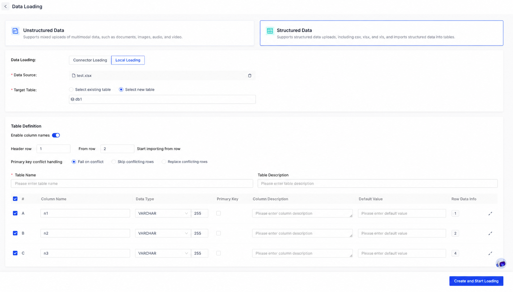
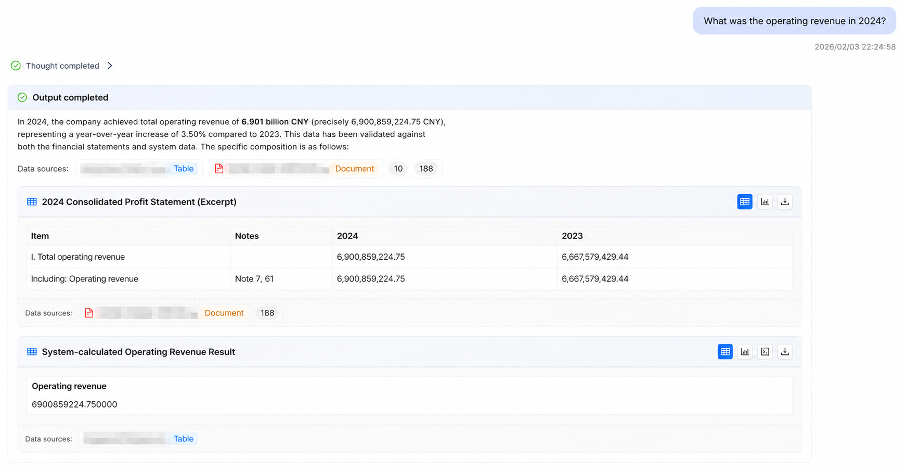
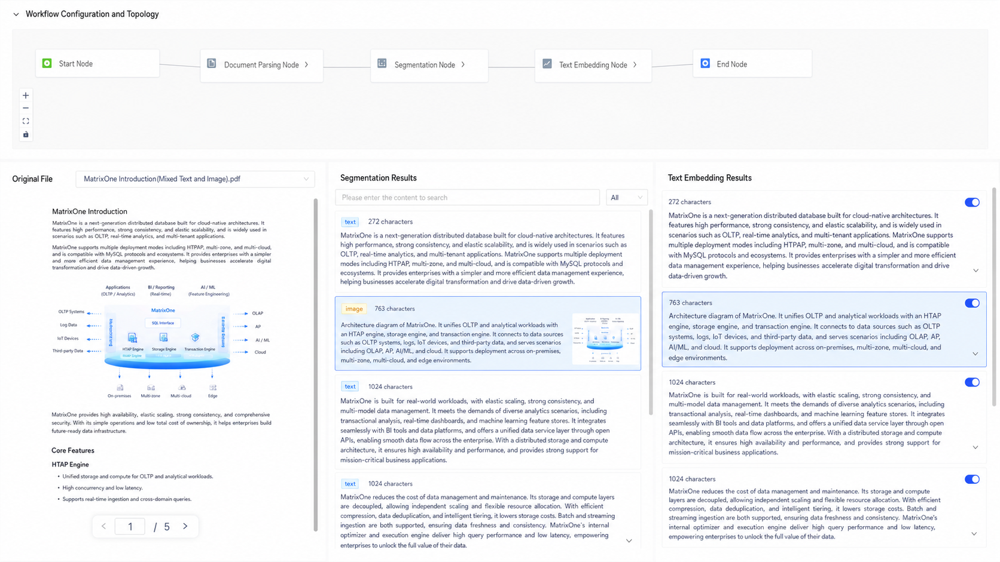
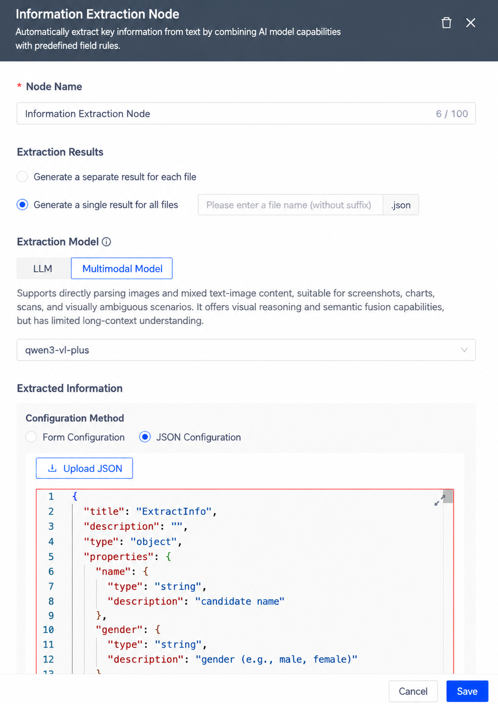
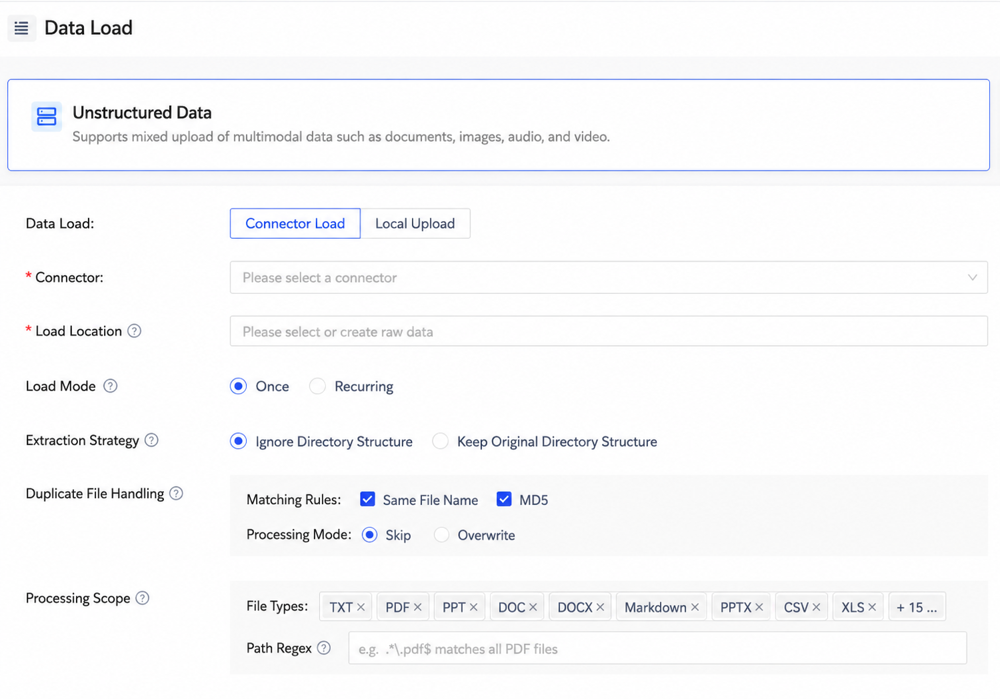

# MatrixOne Intelligence 4.1 Unlocks Data Value with AI, Making Queries Smarter and Management More Efficient

We are pleased to announce that the MatrixOne Intelligence multimodal data intelligence platform has received an important 4.1 update. This release focuses on enhancing core capabilities and improving usability, helping you unlock data value more easily through smarter queries, more efficient data integration, clearer knowledge management, and more transparent data processing.

## Introduction to MatrixOne Intelligence

MatrixOne Intelligence is an AI data intelligence platform for multimodal data, designed to help enterprises address challenges such as data fragmentation, complex multimodal data integration, and difficult GenAI application implementation. Through data access, intelligent parsing, data workflows, and a hyper-converged lakehouse foundation, MatrixOne Intelligence provides enterprises with a one-stop end-to-end platform that turns internal proprietary data into AI-Ready data for GenAI applications.

Based on an innovative cloud-native architecture and compute-storage separation design, the platform supports unified management and efficient processing of structured and unstructured data, with highly flexible deployment capabilities across public cloud, private cloud, and on-premises data center environments.

MatrixOne Intelligence is committed to helping enterprises fully explore and release the potential of private-domain data, allowing enterprise private data to be fully used in the AI era and become a key source of unique competitiveness.

## Feature Highlights

The following are the major features in this update:

### Structured Data Ingestion and Table Object Management: Easily Integrate Business Data

The GenAI workspace now supports Table objects, enabling table-level permission management for precise data access control. Users can import Excel and CSV structured files with one click. The system intelligently recognizes and generates standardized table structures and field information, so no additional table creation or manual conversion is needed before using the data for business analysis, NL2SQL, or other intelligent application scenarios.

This feature greatly lowers the barrier for data preparation and modeling, reduces manual work and error risk, and allows business users to quickly turn local data into analyzable and callable data assets. It accelerates the full workflow from "having data" to "using data," improving data utilization efficiency and the speed of intelligent application implementation.

### NL2SQL and RAG: Complete Complex Data Queries in Natural Language

The platform now fully supports NL2SQL and RAG. Users can directly issue query requests in natural language, and the system automatically generates and executes SQL, enabling cross-table and cross-database queries over multiple structured data sources, as well as hybrid queries and integrated analysis of structured data, unstructured documents, and multimodal content.

With RAG support, the platform can combine data results with textual context for comprehensive understanding and retrieval, providing more accurate query results with stronger business semantic consistency and significantly improving data access and analysis efficiency.

### Intelligent Session and Knowledge Management: Clear Isolation and Efficient Collaboration

Users can create multiple independent knowledge bases to isolate data and permissions across teams and projects, ensuring security and professionalism. Each session supports complete context memory, making task switching seamless without repeatedly explaining background information, which significantly improves conversation continuity and work efficiency.

### Visual Data Lineage: Fully Traceable, Trustworthy, and Auditable

This update adds complete tracing and visualization of source files at every processing node in the workflow, clearly showing the flow path from source to final result. Through transparent presentation of intermediate results across the entire workflow, users can intuitively understand the transformation process and dependencies at each node, significantly improving observability and debugging efficiency.

### Enhanced Information Extraction Nodes: Improve Integration Efficiency and Usability

The information extraction node has been enhanced with a new multi-file merge extraction feature, enabling unified extraction and integration of information from multiple files to meet cross-file summarization and analysis needs. It also supports uploading local JSON files to automatically generate extraction schemas, significantly reducing configuration costs in complex scenarios and improving information integration efficiency and ease of use.

### More Format Support and Automated Preprocessing

File processing capabilities have been upgraded. All imported files are automatically deduplicated and decompressed during ingestion. Excel and HTML file support has been added, allowing users to parse them directly without additional conversion, greatly improving data processing efficiency. At the same time, mathematical formulas in PDFs can be accurately recognized and converted to Markdown while preserving the original image, making analysis and proofreading of technical documents and academic papers faster and smarter.

