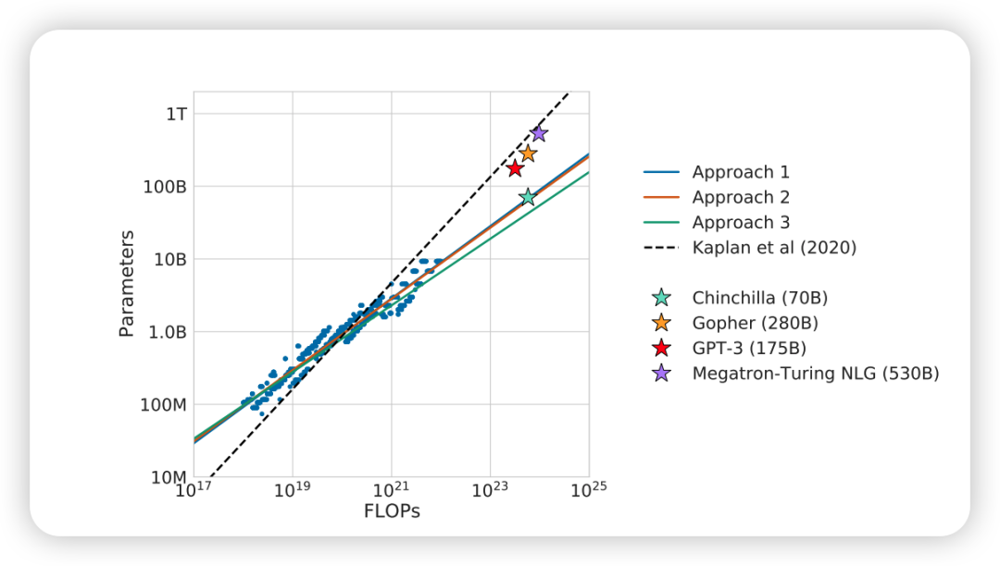
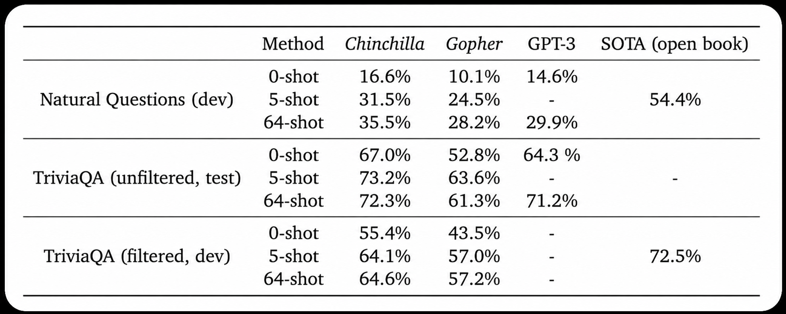
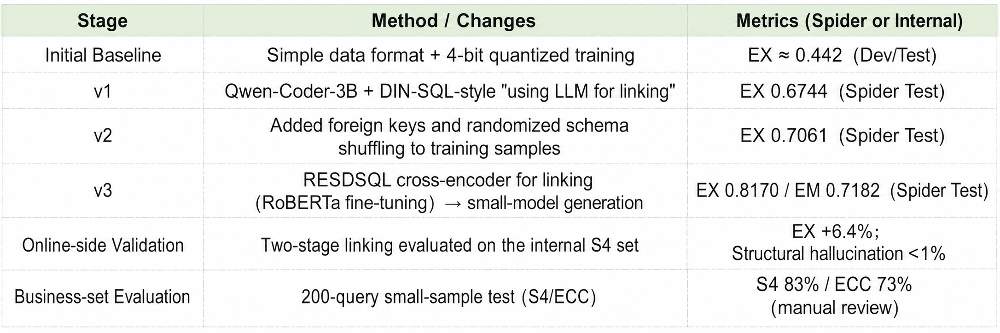
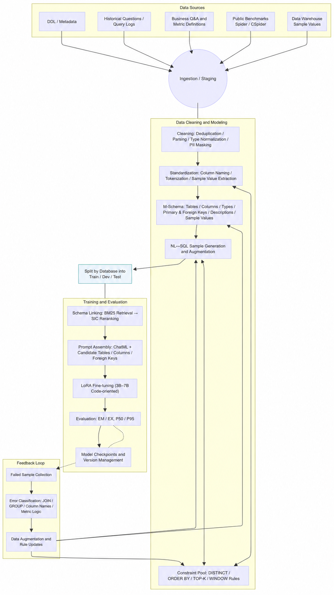

Author | MatrixOrigin

**Reposted from | InfoQ**

When NL2SQL moves from demo to production, the key is not "larger models," but a "cleaner data foundation + smaller specialized models + more controllable engineering process."

## Summary

**Data first, model second**: Turning metadata, business semantics, permissions, and sample SQL into "AI-ready data" is the first-principles issue determining whether NL2SQL can be reliably implemented.

**Small models are enough**: With 3B-7B code/SQL-friendly models, combined with LoRA fine-tuning, syntax-constrained decoding, and execution validation, strong results can be achieved.

**Implementation cost is lower**: Compared with full-size large models that often exceed 100B parameters, small models are much more feasible to implement in practice, and the compute support they require is easier for enterprises to invest in.

**Evaluation dimensions need to change**: **Execution Accuracy** is closer to real usability than Exact Match, and should form a closed loop together with replay and gray release.

**Engineering path**: Build a minimum viable system (MVP) of "Schema service -> planner (small model) -> secure execution sandbox -> observability and correction loop," then gradually introduce AST constraints, retrieval augmentation, and alignment training.

## "Large Model + Out-of-the-Box" Often Fails

**Missing business semantics**: `amt`, `dt`, and `no` mean different things in different databases. Without an **alias dictionary, metric definitions, and entity mapping**, models can only reason based on existing training materials.

**Governance and compliance are disconnected**: Multi-tenant or cross-source JOINs, rate limits, row/column permissions, auditing, and other requirements mean "can generate" does not equal "can execute." Real production environments need business-process context to support queries, and models often cannot directly obtain these meanings.

**Evaluation criteria are distorted**: Looking only at string-level Exact Match ignores "result equivalence" and "whether it can run on your database."

**Cost and latency are uncontrollable**: Feeding a large, full context into a general-purpose large model requires deep prompt optimization. Overly long context can also cause Context Rot and Lost in the Middle problems.

In real implementation scenarios, we found that **without AI-ready data, there is no implementable NL2SQL.**

## Task Properties Determine the Solution: NL2SQL Is More Like "Constrained Code Generation / Semantic Parsing"

**The output is a formal language (SQL)**: It has strong syntax constraints, a relatively small vocabulary, can be executed, and can be verified.

**The input can be structured**: Database **schema**, primary and foreign keys, candidate columns/tables, and sample values can all serve as external signals.

**The required reasoning is "structural reasoning"**: column/table selection, aggregation, condition composition, and time windows, rather than open-domain common sense.

This type of problem is suitable for "dimension reduction" through **structured constraints + external knowledge interfaces**, instead of relying solely on ever-larger general-purpose common-sense models.

## Why Choose Small Models: Theoretical Support + Engineering Evidence

### 3.1 Syntax / AST Constraints Reduce Search Entropy

Applying **syntax / AST constrained decoding** to formal languages, such as PICARD/CFG/JSON-Schema/XGrammar-style approaches, masks invalid tokens at each decoding step and turns "free generation" into "constrained search," significantly reducing invalid SQL and improving executability.

**Meaning**: When the output space can be constrained, **small model + constraints = large gains**.

### 3.2 External Structural Information Replaces "Internalized Common Sense"

Introducing **schema linking** (table/column synonyms, primary and foreign keys, sample values) and **candidate set pruning** turns "implicit knowledge" into a "callable structured interface."

**Meaning**: When external signals are sufficient, the model does not need to carry too much general knowledge. An appropriate capacity is enough.

### 3.3 The Optimal Point Across Scale, Performance, and Cost

According to scaling laws, quality is related to parameters, data, and compute. But in enterprise scenarios, **inference cost and latency** must be included in the objective function. Here, we refer to DeepMind's theory in *Training Compute-Optimal Large Language Models*: on higher-quality, denser datasets, models with fewer parameters can also outperform larger-parameter models on fixed tasks.

In the closed-book question answering scenario, the 70B Chinchilla even outperformed the 128B GPT-3.

Microsoft's phi series models also confirm this from another angle.

**Meaning**: For NL2SQL, where strong constraints and external structural information are available, the optimal point usually falls on **3B-7B code-oriented models**, rather than blindly scaling up.

### 3.4 Engineering Evidence: On Narrow-Domain Tasks, Code-Oriented Small Models Often Outperform General Large Models

**Pretraining bias**: Code/SQL corpora bring strong syntax and compositionality bias, naturally fitting SQL generation.

**Stronger determinism**: With conservative decoding (low temperature / no sampling / optional beam search) and fixed output prefixes, small models are more likely to "produce according to template."

**Latency and cost advantages**: They can be deployed locally or privately, and support localized A/B testing and gray release for small models, reducing O&M difficulty and deployment cost.

## Practice Process

On CSpider and CSpider-derived datasets, we connected the consistent chain from training to inference around **M-Schema data representation**, **constraint-pool data augmentation**, **BM25 -> SIC two-stage Schema Linking**, and **small-model LoRA fine-tuning**. On internal datasets, we significantly reduced structural and semantic hallucinations and improved execution consistency.

### 4.1 Technical Architecture Overview

**Two-step reasoning**: First perform **Schema Linking** (filtering tables/columns/foreign keys), then perform **SQL generation** on the simplified schema. This significantly reduces dimensionality and improves accuracy on large databases.

**Small-model path**: Use **Qwen2.5-Coder-3B/7B** as the base model, with lightweight **LoRA** fine-tuning; use **DeepSpeed** for VRAM and throughput optimization.

**Data-side enhancement**: Use **M-Schema** to provide field types, Chinese descriptions, primary and foreign keys, and real-value examples; introduce a **constraint pool** to automatically inject definitions such as sorting, deduplication, Top-K, and windows.

**Unified data foundation**: We recommend building the whole process on an **HTAP** database such as **MatrixOne**. Its architecture avoids the fragmented state where "metadata is in the transaction database, data is in the analytical database," integrating schema, business data, and logs from the source to provide a single trusted source for AI-ready data. Going further, **MatrixOne Intelligence** unifies schema, metadata, business dictionaries, permissions, and more on this foundation, forming an AI-oriented data asset catalog and solving the missing-semantics problem at the infrastructure layer.

### 4.2 Data and Prompt: M-Schema + Constraint Pool

**M-Schema** supplements the traditional "table/column list" with **types, primary keys, Chinese meanings, and real-value examples**, significantly improving field semantic readability and model alignment. Examples are omitted here.

In training data construction, we further extract and inject **field example values** into training samples. During inference, unreadable field names are temporarily mapped to readable names and then mapped back during post-processing, which improves actual "table/column hit" performance.

The **constraint pool** automatically identifies query semantic types (counting / aggregation / multiple rows) and injects constraints such as **deduplication, precision, sorting, and limits**, improving data diversity and robustness.

This series of "AI-ready data" preparation work, from multi-source heterogeneous data to high-quality M-Schema, is exactly where platforms such as **MatrixOne Intelligence** deliver value. It upgrades data preparation from manual workshop-style script development to a governable and reusable engineering system through the following capabilities:

**Unified access and management**: Through built-in connectors, data and metadata are automatically synchronized from data sources such as business databases, data lakes, and SaaS applications, forming a unified data asset view.

**SQL-driven data flows**: All steps such as cleaning, transformation, and feature construction (for example, concatenating fields and constructing flags) can be orchestrated into schedulable and monitorable data workflows through standard SQL, ensuring transparency and maintainability.

**Vector-assisted quality inspection**: The platform's built-in vector engine is not only used for downstream semantic retrieval, but also plays a key role in the data preparation stage. For example, business terms and field comments can be vectorized, and similarity computation can help discover synonyms, identify non-standard "shadow fields," or cluster and analyze historical query logs to find weak links in data quality.

Training and inference inputs both use the ChatML instruction format, and loss is computed only on the assistant segment to stabilize output.

### 4.3 Schema Linking: BM25 Coarse Ranking -> SIC Fine Ranking (Two Stages)

**BM25 coarse ranking**: Concatenate "table + column + comments" into documents, score the question with BM25, and take the Top-k tables. Millisecond-level latency supports online use.

**SIC fine ranking**: Load a **Schema Item Classifier (Encoder + interaction layer)** fine-tuned on in-domain data, score the relevance of tables/columns item by item, and output a simplified schema.

**Result packaging**: Serialize the simplified schema back into **M-Schema** and assemble it with the question into **RESDSQL**-style samples. The same process is used for training and inference to ensure **train-infer consistency**.

**Engineering points**: BM25 < 5 ms; SIC batch inference can process hundreds of questions per batch with VRAM < 2 GB; repeated injection of the question in the prompt reduces schema noise interference.

### 4.4 Hallucination Suppression and Results

**Problem characterization**: Three types of hallucinations, structural, semantic, and factual, lead to execution failure and incorrect answers, and are the core risk in implementation. Root causes include **missing priors, sparse data, insufficient prompts, overly random sampling, and unstable training values**.

**Our solution**:

- Two-stage linking compresses the search space from the source;
- Low-randomness inference (low temperature / beam search);
- Combine **Executor-Guided** methods with syntax constraints (optional syntax penalty / contrastive learning during training).

**Measured benefits**: Structural hallucination rate dropped from **7.9% to 1.3%**, semantic mismatch decreased by about **18%**, and **Execution Accuracy increased by 6.4%** on the internal Spider-S4 set.

## Key Results

## Process Overview

Through **M-Schema (structure and example values)**, **constraint pool (definitions and rules)**, **BM25 -> SIC two-stage linking**, and **small-model LoRA fine-tuning + train-infer consistency**, we significantly reduced structural and semantic hallucinations and improved EX metrics without relying on ultra-large general-purpose models. We also obtained stable gains on enterprise databases and small business sample sets.

## References

- Spider: https://arxiv.org/abs/1809.08887
- WikiSQL: A Comprehensive Exploration on WikiSQL with Table-Aware Word Contextualization (https://arxiv.org/pdf/1902.01069)
- Training Compute-Optimal Large Language Models (https://arxiv.org/pdf/2203.15556)
- Textbooks is all you need (https://arxiv.org/pdf/2306.11644)
- Qwen2.5-Coder Technical Report (https://arxiv.org/pdf/2409.12186)
