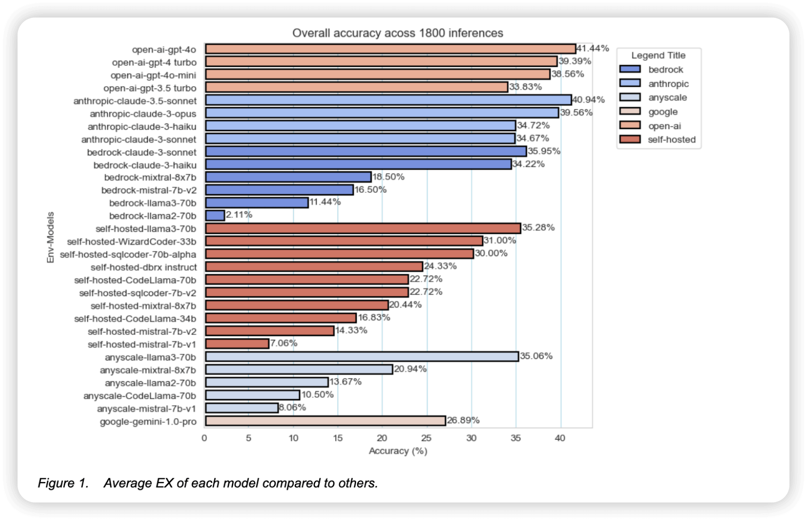
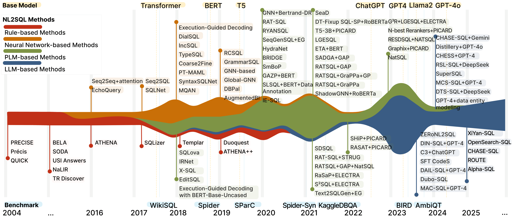

In recent years, the rise of large language models (LLMs) has driven broad progress in natural language processing (NLP) tasks, and NL2SQL (natural language to SQL), one of the popular tasks, is no exception.

As the figure below shows, different benchmarks and testing methods have grown rapidly after the T5 model.

Some SOTA models have also achieved major improvements on NL2SQL tasks compared with previous approaches:

However, these mainstream models generally have more than 100B parameters. NL2SQL is a relatively niche scenario and is closely tied to business contexts. Can models with smaller parameter counts still achieve strong performance?

## What Is the Core of NL2SQL?

We believe the core capability of NL2SQL does not lie in "language modeling" itself, but in two aspects:

1. **Understanding user intent and question context (scenario understanding)**
2. **Generating SQL correctly according to the database structure (logical reasoning + syntax generation)**

The challenge of these two tasks is not whether the model is "large" enough, but rather:

- Whether the natural-language expression is ambiguous. For example, "What is the total order volume?" may have multiple interpretations.
- Whether the database structure is complex and contains many irrelevant tables or columns.
- Whether field names are clear, whether Chinese comments are available, and whether sample data is included.

In many cases, these problems **cannot be solved directly by simply using a larger model.**

## First, the Conclusion: Key Lessons from Engineering Practice

### Bigger Is Not Always Better: **Qwen Coder 3B/7B Is Already Enough for the Task**

We tried multiple models:

- Qwen 1.7B: too few parameters, resulting in weak code-generation capability
- Qwen2.5 Coder 3B and 7B: designed specifically for code and SQL tasks, with excellent results; after fine-tuning, accuracy reached **0.81 Execution Accuracy**

This result **already exceeds SOTA methods with comparable structures** (such as the RoBERTa + T5-3B combination), while significantly reducing deployment cost.

> Conclusion: **A fine-tuned medium-sized model (3B-7B) can already solve most real-world SQL generation tasks.**

### Schema Linking Matters More Than Model Size

Many real-world databases, such as the Kingdee database, have the following issues:

- Field names are unreadable, such as `VBELN` and `ZZHYYH`
- Fields do not have clear comments
- Many tables contain repeated fields and complex relationships
- In this situation, **even a large model will suffer serious hallucinations if the schema is not filtered first**, because its attention is diluted by irrelevant fields.

We tried:

- Simple DIN-SQL-style Schema Linking ^[source](https://arxiv.org/abs/2304.11015)
- Enhanced RESDSQL cross-encoder + column enhancement layer ^[source](https://arxiv.org/abs/2302.05965)

The effect was immediate: accuracy improved from **0.44 to 0.81**, indicating that many "understanding errors" in large models are actually input-structure problems.

> Conclusion: **Scenario understanding depends on structural optimization, such as schema linking, rather than blindly adding parameters.**

### Training Sample Design, Comments, and Example Data Matter Far More Than Model Size

When training on industrial databases such as Kingdee, we found that:

- Table and column names contain little information, so comments are needed
- Without field-value examples, the model cannot infer how fields are used
- User questions vary greatly in wording, while the golden SQL may be the same

We improved accuracy significantly without switching to a larger model by:

- **Introducing field comments**
- **Injecting field examples**
- **Shuffling schema order to enhance generalization**
- **Constructing samples where different expressions map to the same SQL**

> Conclusion: **Training data quality and construction methods determine the final effect.**

### "Large Model + Hallucination + JOIN Abuse" Can Become a Risk

Without schema linking, large models are very prone to:

- Arbitrarily joining multiple tables
- Ignoring constraints, such as `DISTINCT` or returning only a specific column
- Misunderstanding ambiguous expressions and generating semantically incorrect SQL

By contrast, a smaller model with a clear input structure can be more stable and reliable.

## Back to the Question: Do You Need a Large Model to Build an NL2SQL System?

The conclusion is:

> No, **you do not need a SOTA-level large model (70B+) to do NL2SQL well.**  
> What you need is:
>
> - A good schema linking strategy
> - High-quality training samples
> - Reasonable prompt design and data augmentation
> - A medium-sized model with strong coding capability, such as Qwen2.5 Coder 3B/7B

## Outlook

Future NL2SQL systems will look more like structured "intelligent Agents":

- They can understand user intent
- They can quickly filter schemas
- They can learn constraints and preferences
- They can accurately generate SQL and self-verify

They will not be "language models" where bigger is always better. If you are building your own NL2SQL system, consider not starting with GPT-4 or GPT-4o right away. **First clarify the schema, add some sample data, and try a 3B model. It may already be good enough.**
