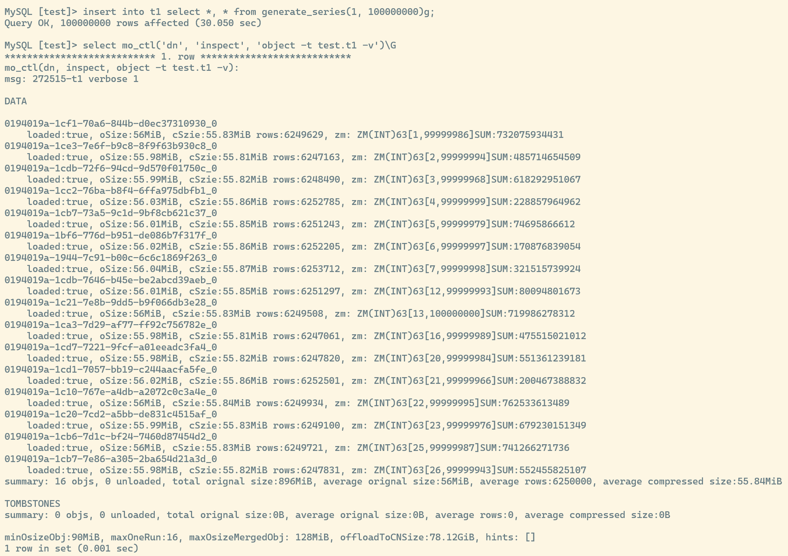
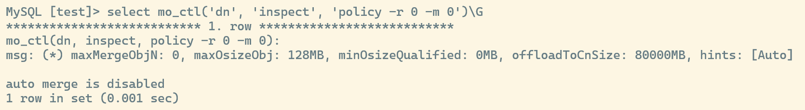
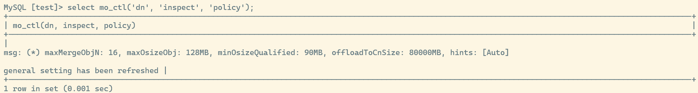
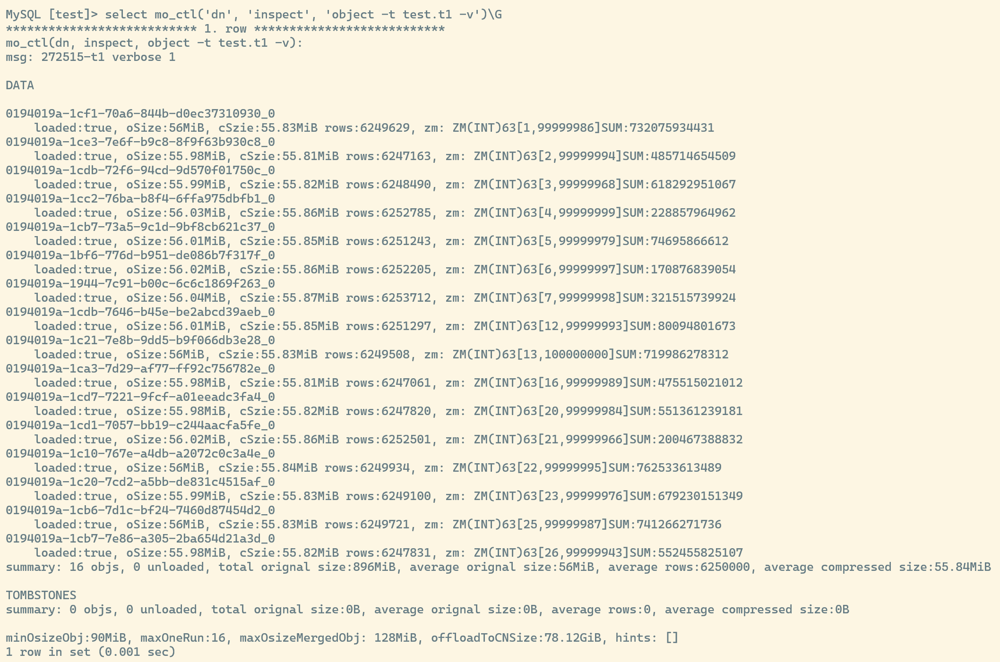
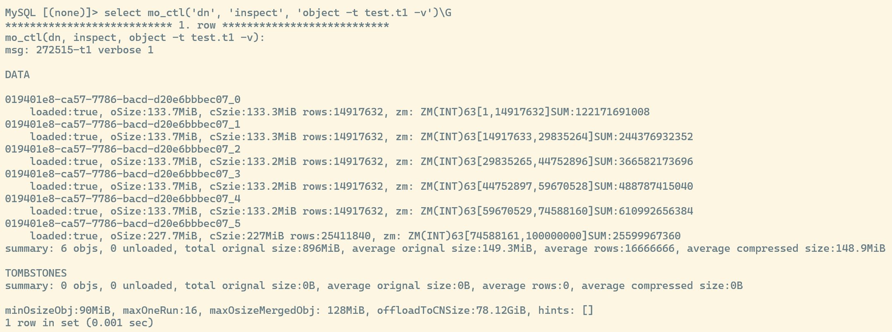
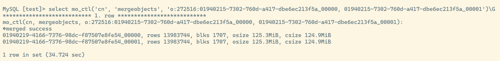
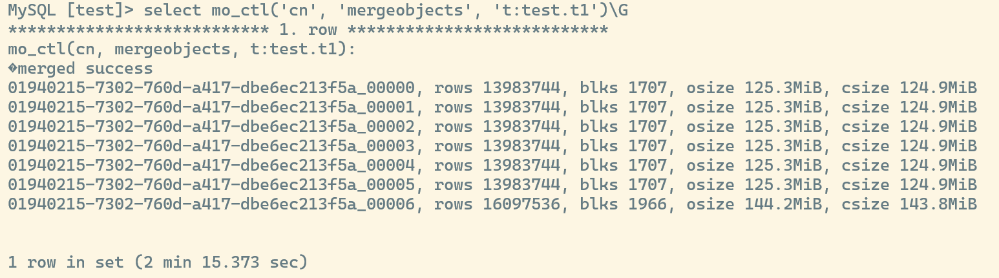

## Purpose of Object Merging

MatrixOne uses a columnar storage mechanism, and its smallest I/O operation unit is called a ColumnBlock. In a table, multiple columns are combined into a Batch, with each Batch having a maximum length of 8,192 rows. Multiple Batches are further integrated into a storage Object. The data inside these storage objects has already been sorted, and the objects themselves are immutable, meaning they cannot be modified once created. Each storage object also includes detailed metadata, covering key attributes such as the object's minimum value, maximum value, row count, and size. For data deletion, MatrixOne does not directly modify the data inside storage objects. Instead, it uses additional Tombstone objects to record deleted row information.

We can use the `mo_ctl` tool to query object metadata in a table. As shown in Figure 1, we insert 100,000,000 generated consecutive rows into the `test.t1` table, then use the `select mo_ctl(\'dn\', \'inspect\', \'object -t test.t1 -v\');` command to query detailed object information. After insertion, the table contains 16 objects and no tombstone objects. The `zm` field in the figure represents the data distribution information of the object. For example, `[1,99999986]` means the minimum value of this object is 1 and the maximum value is 99999986.

<figure>
  
  <figcaption style="text-align:center">Figure 1</figcaption>
</figure>

When the database executes a query, it first uses the minimum and maximum values of objects for preliminary filtering. It then reads data from objects that initially match the conditions, further filters rows that fully satisfy the filter conditions, and checks whether those rows have been deleted. Therefore, effectively using metadata information to maximize the number of filtered-out objects and minimizing objects that contain deleted rows has an important impact on query performance.

In summary, object merging mainly solves three problems:

1. **Turn small objects into large objects to reduce I/O**

> By merging multiple small objects into a larger object, disk I/O operations can be effectively reduced. Reading or writing a large object requires far fewer disk accesses than reading or writing multiple small objects. This not only improves data access speed, but also reduces system I/O overhead.

2. **Reduce overlap between objects and optimize metadata-based filtering**

> Object merging also reduces overlap between objects, thereby improving metadata-based filtering efficiency. When object overlap is high, retrieving specific data may require accessing multiple objects, increasing I/O overhead. After merging, overlap between objects is reduced, so the required data can be obtained with fewer accesses, improving data filtering efficiency.

3. **Apply tombstones to reduce object size**

> The merge operation deletes data that has been marked, thereby reducing the number of objects actually stored and the overall storage space, further improving storage efficiency.

## Implementation of Object Merging

Inside the MatrixOne database, there is a scheduler dedicated to merge operations. The scheduler periodically traverses the metadata of objects in each table. Based on the metadata scan results, it selects the set of objects that need to be merged. Since the data in objects is already ordered, we can directly use a min-heap for multi-way merging. The executor continuously selects the current smallest data item through the min-heap and adds it to the new object. This step ensures that data in the new object remains ordered. As merging proceeds, when the size of the new object reaches a preset threshold (currently set to 90 MB), the executor immediately writes its data to disk (flushes it), then starts a new object to continue merging the remaining data. This mechanism ensures that merged objects do not become too large, thereby optimizing overall database performance and storage management.

The merge operation itself is costly. Therefore, deciding when to merge and whether merge objects can be selected precisely is crucial for query performance optimization.

For this reason, we follow an intuitive and efficient strategy: prioritize selecting the set of objects with the highest overlap for merging. In Figure 2, the figure shows seven objects and their corresponding minimum and maximum value ranges, represented by line segments. Among them, O5, O6, and O7 have the largest overlap count, so they become our preferred merge objects.

<figure>
  
  <figcaption style="text-align:center">Figure 2</figcaption>
</figure>

After merging these three objects, the result may look like Figure 3. Although merging reduces object overlap, some objects still overlap, and these overlaps will be gradually resolved in subsequent merges.

<figure>
  
  <figcaption style="text-align:center">Figure 3</figcaption>
</figure>

However, selecting merge objects based only on overlap is not enough. On one hand, when there are many delete operations on objects or many small objects in the table that do not overlap with each other, we need to weigh whether additional merging should be performed. On the other hand, excessively pursuing complete overlap may introduce excessive cost. **The following situations should be avoided as much as possible**:

1.  Two objects have very little overlap. As shown below, the overlap range between O1 and O2 is very small. If O1 or O2 is large, the benefit from such a merge is small.

2.  The two objects differ greatly in size. When O1 and O2 differ significantly in size, merging the two objects brings little benefit. Especially when many insert, load, or update operations occur, many small objects may inevitably overlap with large objects. In this case, prioritizing the merging of small objects produces better results.

In addition, when processing large amounts of data, we also need to consider factors such as node memory conditions and current cluster load to comprehensively evaluate whether to execute merge operations. In MatrixOne, we generally base decisions on object overlap while considering many other factors to derive a relatively optimal solution.

## Merge-Related Configuration

The `mo_ctl` tool in MatrixOne provides merge-related functionality.

### 1. Enable and Disable Automatic Merging

Use the `select mo_ctl(\'dn\', \'inspect\', \'policy -r 0 -m 0\');` statement to disable automatic merging.

Use `select mo_ctl(\'dn\', \'inspect\', \'policy\');` to re-enable automatic merging.

Before automatic merging is enabled, the table has 16 objects with a large amount of overlap among them.

After automatic merging is enabled and some time has passed, the 16 objects are merged into 6 objects, and they are globally ordered.

### 2. Manual Merging

In addition to automatic merging determined by the scheduler, we can manually start scheduling through `mo_ctl`. During manual scheduling, we can specify either objects or a table for scheduling.

a) Scheduling specified objects

We can use the `select mo_ctl(\'cn\', \'mergeobjects\', \'o:tableID:objectID1, objectID2, ...\');` statement to merge specified objects.

b) Scheduling a specified table

We can use the `select mo_ctl(\'cn\', \'mergeobjects\', \'t:datable.table\');` statement to merge objects in the entire table. This statement merges all objects in the table and returns after the merge is complete.

## Summary

This article provided a detailed introduction to the storage object merging mechanism in the MatrixOne database, including its background, principles, and implementation. It discussed the purpose and specific implementation process of merging, including using a min-heap for multi-way merging, the role of the scheduler, and the strategy for selecting objects to merge. It also showed automatic and manual merge configuration methods, including how to configure and operate them through the `mo_ctl` tool. Through this content, readers can fully understand the important role of MatrixOne's object merging mechanism in improving query performance, optimizing storage management, and reducing I/O overhead.
