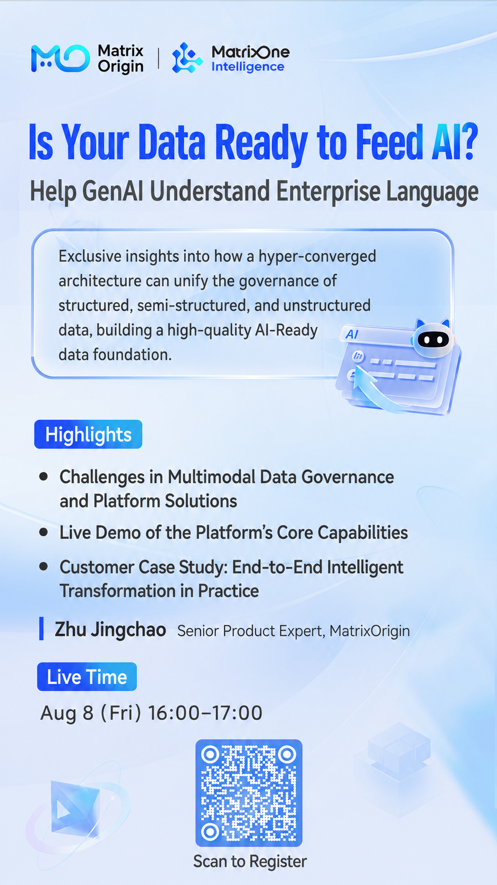

Enterprise private-domain data is complex and hard to manage. How can it truly "feed" large models?

This live session will focus on MatrixOne Intelligence, an enterprise-grade AI-native multimodal data intelligence platform, and reveal how to use a hyper-converged architecture to uniformly govern structured, semi-structured, and unstructured data, building a high-quality AI-Ready data foundation.

**August 8, 16:00-17:00**, MatrixOrigin Senior Product Expert Zhu Jingchao will start from the challenge of enterprise multimodal data governance and provide an in-depth analysis of how the platform breaks through traditional data-management bottlenecks through a hyper-converged architecture. A real-time demo will intuitively show the core capabilities of the data foundation in empowering business, along with practical cases of end-to-end intelligent transformation in real customer scenarios.

**Reserve now and explore how data can truly drive AI implementation.**

