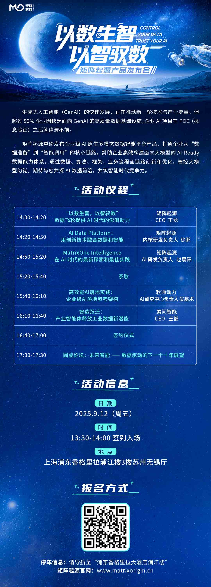

Today, as generative AI (GenAI) and large models rapidly enter mainstream enterprise applications, we are witnessing an industrial transformation driven jointly by compute capability, model capability, and data capability. The core standard for measuring enterprise AI maturity is shifting from "can it generate" to "can it produce reusable business value."

At the same time, enterprises generally face six major shortcomings:

**Severe Data Fragmentation**

In AI Agent scenarios, the need to integrate multimodal data has brought data fragmentation back in a more complex form. Unstructured data is scattered across cloud drives, IM tools, object storage, and other systems, without unified management. Structured data also needs to be mixed with unstructured data, further worsening fragmentation.

**Complex Integration of Heterogeneous Multimodal Data**

AI Agents need to process structured, semi-structured, and unstructured data together. Parsing and governing different data formats is complex, and Agents need to deeply understand data, build entity relationships, and construct dynamic knowledge graphs. This creates a major technical barrier for enterprises that lack deep data and AI engineering capabilities.

**Lack of Evaluation and Feedback Optimization Mechanisms**

Most enterprises lack effective mechanisms to capture, store, and use dynamic feedback data such as interaction data, tool usage logs, and user feedback. As a result, Agents cannot form a closed loop for optimization, and their capabilities stagnate.

**Scalability Bottlenecks from Demo to Production**

Knowledge bases grow from GB to PB scale, concurrent requests surge, and requirements for response latency and stability become strict. This requires an underlying resource platform that can efficiently schedule resources, scale elastically, and tolerate failures.

**Data Security and Governance Challenges**

When AI Agents are granted permission to access and operate on core enterprise data, enterprises must solve difficult problems such as ensuring Agents comply with data permission boundaries, auditing Agent behavior, and preventing sensitive data leakage. This requires full-chain governance capabilities.

**Technology Stack Complexity and Talent Gap**

Building an efficient AI Agent application requires an extremely complex integrated technology stack covering distributed computing, data engineering, multimodal databases, large models, and other fields. Enterprises often need to assemble many tools, resulting in bloated architectures and difficult operations. At the same time, interdisciplinary talent that understands both data and AI is extremely scarce.

### What Should Enterprises Do?

Facing the data challenges in implementing GenAI and AI Agents, what exactly should enterprises do if they want to truly unlock AI's business value?

On September 12, the MatrixOrigin Product Launch will cover products and practice, architecture and scenarios. We sincerely invite you to attend in person and explore the new commercial future of GenAI together.

Please follow our WeChat official account or official website blog to get the latest event updates and information as soon as possible.
