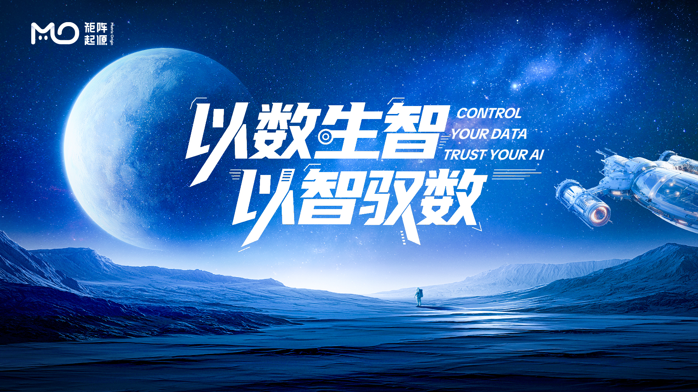
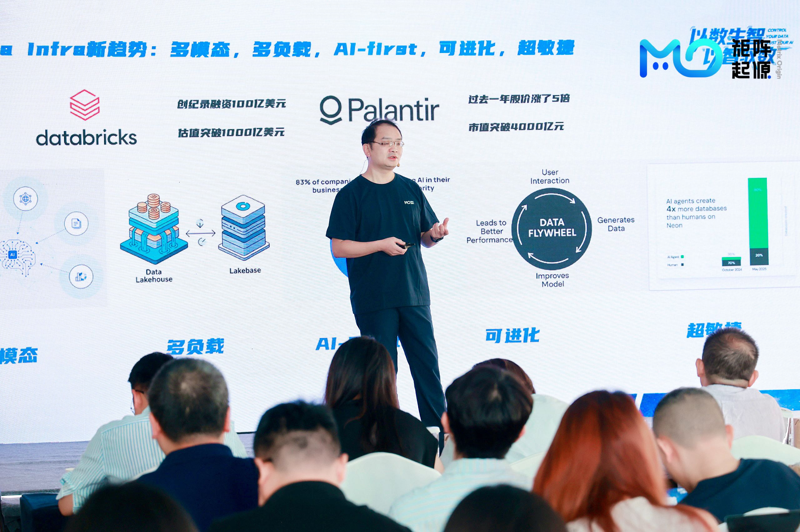
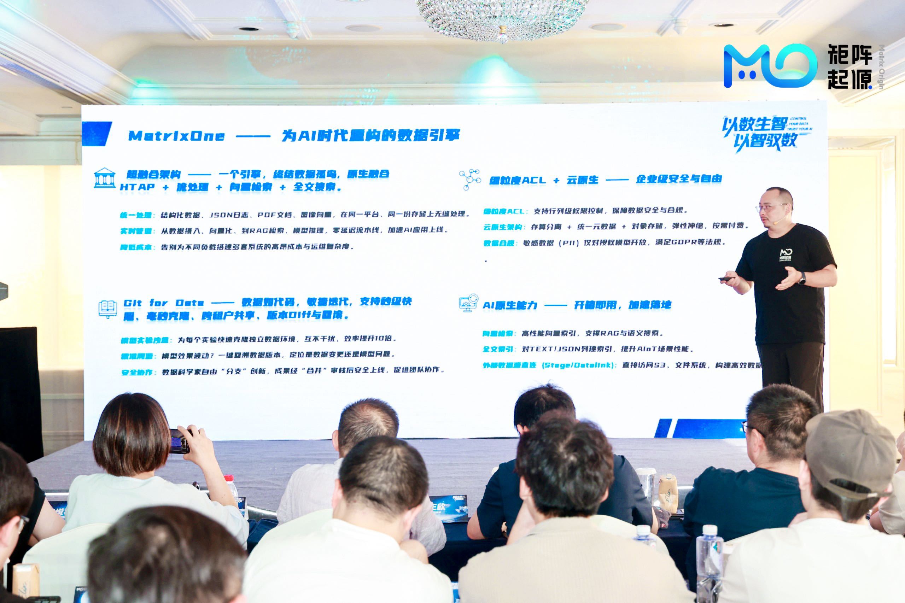
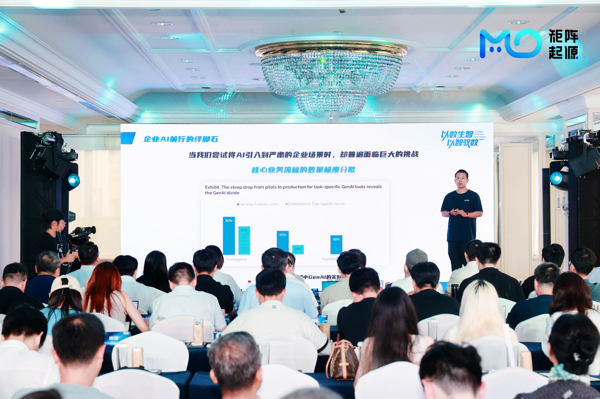
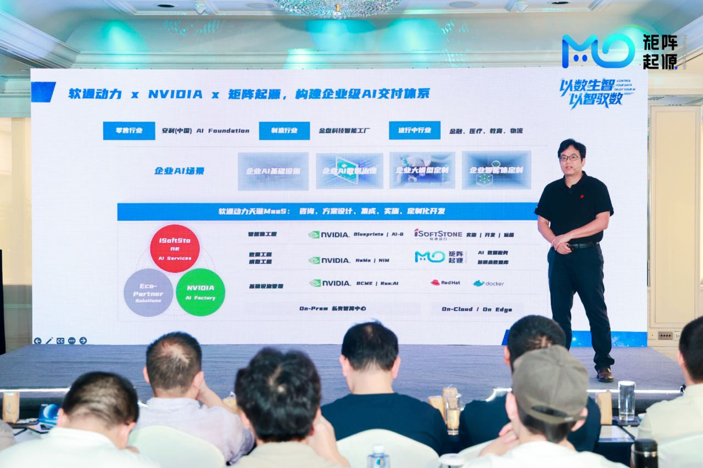
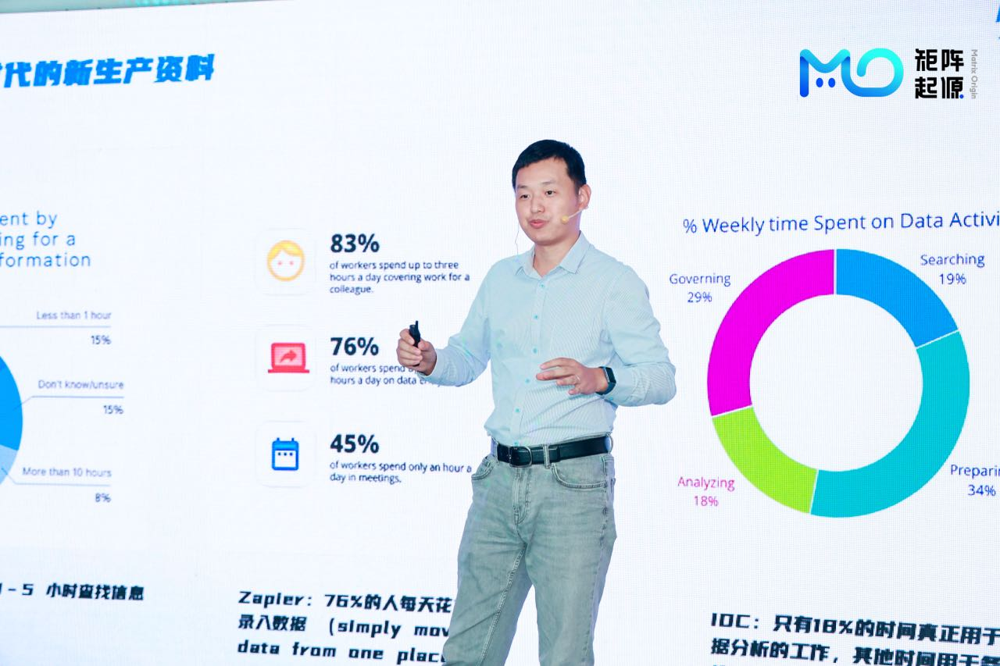
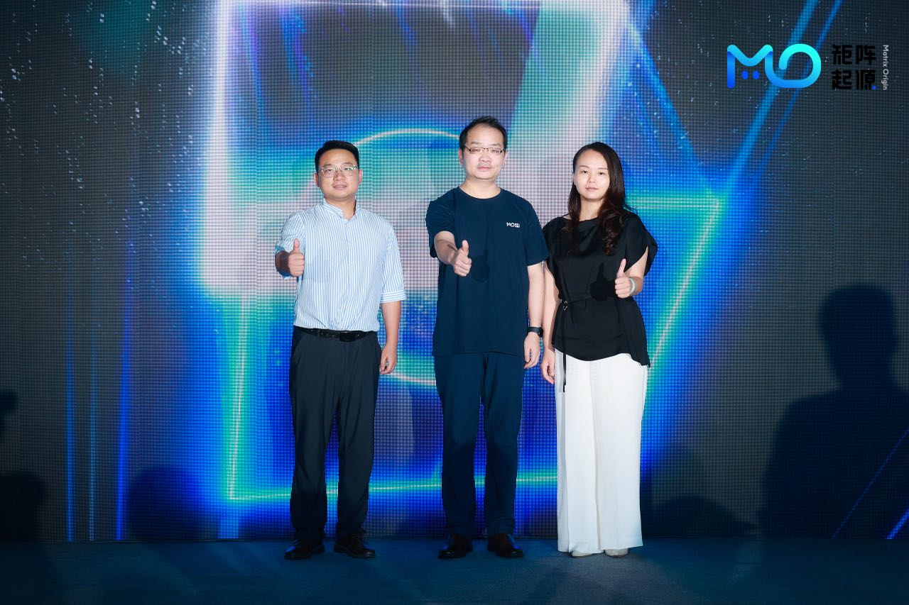
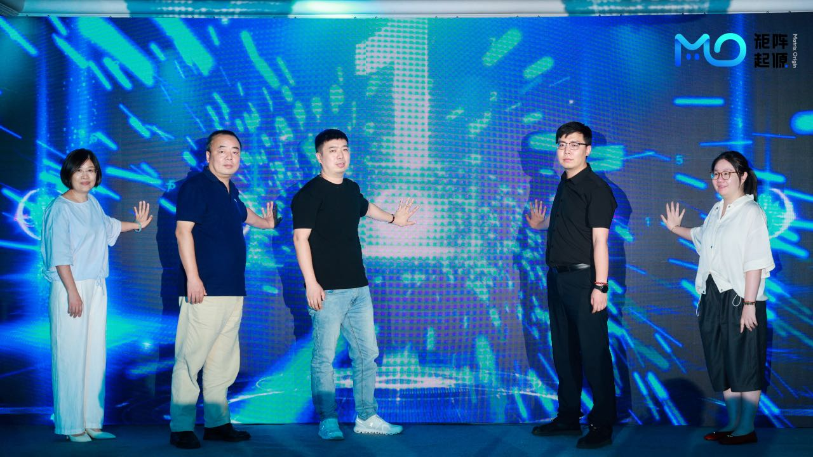
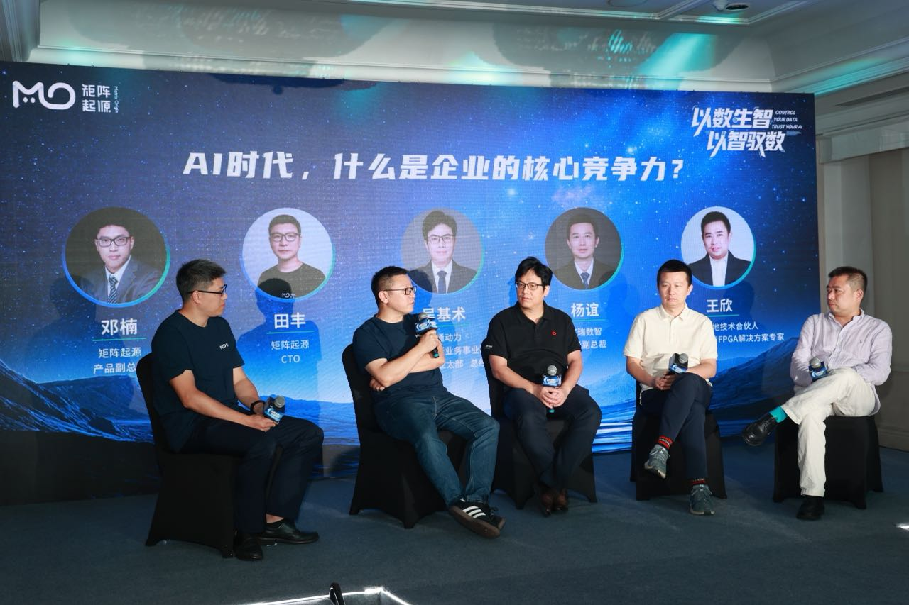

**September 12, 2025, Shanghai, China** -- Last Friday, MatrixOrigin held a major product launch event in Shanghai under the theme "From Data to Intelligence, from Intelligence to Data." At the event, MatrixOrigin officially released two strategic core products: MatrixOne (MO), a hyper-converged heterogeneous cloud-native database, and MatrixOne Intelligence (MOI), an AI-native multimodal data intelligence platform. The launch attracted enterprise representatives and media from manufacturing, finance, energy, Internet, and other industries, and featured in-depth discussions on AI industry trends, data intelligence development, and implementation challenges.

In his opening keynote, "From Data to Intelligence, from Intelligence to Data: The Data Flywheel Powers the AI Era," MatrixOrigin CEO Wang Long noted that the AI industry is shifting from a shortage of model capabilities to a shortage of infrastructure. The value realization rate of core-business AI remains only 5%. He emphasized that the key to enterprise AI implementation is solving data fragmentation. By building an AI-driven data feedback loop through a data intelligence flywheel, enterprises can improve implementation efficiency and unlock business value.

> "AI is not an isolated model, but an intelligent ecosystem centered on data. Only by building a data intelligence flywheel, where data generates intelligence and intelligence feeds back into data, can we truly realize implementable business value." -- Wang Long
> 

## Two Core Products Build the Foundation for Data Intelligence

### Hyper-Converged Database MatrixOne (MO): Reshaping the Enterprise Data Foundation for the AI Era

Xu Peng, Head of MatrixOne Kernel R&D at MatrixOrigin, said in his presentation that traditional data development is often like the "infancy" of the human brain, with data potential far from fully activated. MatrixOne provides enterprises with an evolvable, integrable, and scalable data foundation that fully releases the value of dormant data.

At the core of MatrixOne is a hyper-converged architecture that natively integrates HTAP (Hybrid Transactional/Analytical Processing), stream processing, vector retrieval, and full-text search into one engine, fundamentally eliminating the data silos that have long troubled enterprises. Another major innovation of the platform is the introduction of a new "Git for data" paradigm: by bringing software-engineering concepts such as version management, branching, rollback, and auditing into data management, MatrixOne significantly shortens AI project development cycles, accelerates cross-team collaboration, and greatly improves enterprise agility in complex data scenarios.

At the enterprise application level, MatrixOne provides fine-grained permission control and a cloud-native architecture, delivering higher security, elasticity, and cost efficiency. With built-in AI-native capabilities such as vector search and external data-source access, MatrixOne helps enterprises quickly complete the closed loop from data to intelligence, turning massive data into actionable insights and building sustainable competitive advantages.

### AI-Native Multimodal Data Intelligence Platform MatrixOne Intelligence (MOI): AI-Ready Data for Trustworthy AI

Zhao Chenyang, Head of AI R&D at MatrixOrigin, pointed out that while enterprise AI research coverage has reached as high as 80%, fewer than 5% of enterprises have truly achieved scaled application. MOI is positioned as next-generation data infrastructure, benchmarking Databricks + Snowflake, and helps enterprises cross the "death valley" of AI implementation through an intelligence flywheel in which data drives AI and AI feeds back into data.

### Solving Enterprise AI Implementation Challenges Through Five Core Innovations

- **Converged architecture**: Connect mainstream storage, databases, and knowledge bases once, centrally manage structured and unstructured data, and eliminate fragmentation and long-term maintenance costs in traditional data stacks.
- **Agentic data governance**: Introduce Agent-oriented data governance mechanisms that automatically discover, clean, and parse data based on task context, and complete end-to-end processing through automated ETL pipelines. This continuously improves data readiness and feedback loops while greatly reducing reliance on manual work.
- **Intelligent data parsing**: AI-driven parsing of unstructured data such as PDFs, documents, audio, and video. Structured accuracy reaches 94%, far exceeding traditional tools and mainstream large models, while reducing manual processing by 80%.
- **High-performance runtime foundation**: A high-throughput, low-latency inference environment that stably supports high-concurrency business scenarios.
- **End-to-end security assurance**: Innovative "data branch + second-level recovery" mechanisms and zero-downtime CDC capabilities ensure data security and compliance in highly sensitive industries.

## Joint Ecosystem Building to Promote Industrial Intelligence

During the conference agenda, ecosystem partners including iSoftStone and Suwen Intelligence also shared how they use AI factories and AIGC data foundations to promote industrial digitization and intelligent upgrading.

The enterprise-grade AI implementation solution jointly developed by MatrixOrigin and iSoftStone centers on "sovereign AI." By building enterprise AI factories and four engineering capabilities across data, models, knowledge bases, and Agents, it addresses pain points such as unclear AI implementation architecture, insufficient data, and talent shortages, helping enterprises transform from digitization to intelligence.

Based on MOI's foundational capabilities, Suwen Technology launched an industrial Agent solution. With "data as a new means of production," it builds an automated pipeline through a three-layer architecture: data foundation, knowledge middle platform, and Agent factory. The solution addresses four major pain points in enterprise AI implementation, including data silos and low manual efficiency, and helps the industrial sector move from mechanization to intelligent automation.

## Ecosystem Cooperation: Working with Partners to Build a New AI + Industry Ecosystem

Alongside the major product release, MatrixOrigin also announced multiple strategic collaborations with important partners at the conference, jointly building an ecosystem partnership system and promoting the implementation and adoption of AI technology in industry.

At the event, MatrixOrigin joined hands with partner SIE Information to co-create "AI + Digital Factory" and reached cooperation with Chanyi Intelligence. The three parties will fully leverage their respective strengths in industrial resources, digital services, and intelligent data foundations to accelerate end-to-end AI implementation in manufacturing.

In the industrial ecosystem, the national-level incubator Shanghai Cloud Valley reached a strategic cooperation with MatrixOrigin. The two parties will deepen collaboration among upstream and downstream enterprises in the industrial chain, accelerate the commercialization and integration of AI technology with real industries, and jointly build a "solution incubator" to promote rapid implementation of scenario-driven innovation solutions. In finance, manufacturing, retail, and other fields, MatrixOrigin will work with Anchnet to promote application implementation of the AI-native multimodal data intelligence platform. In public safety and smart city scenarios, MatrixOrigin will work with Qishu Intelligence to promote deep integration of AI and city management. In digital solutions, MatrixOrigin will cooperate with DGT Technology to help enterprises complete data-intelligence upgrades more efficiently and at lower cost.

## Exchange of Ideas: Roundtable Discussion on Core Competitiveness in the AI Era

In a roundtable session moderated by Deng Nan, Vice President of Product at MatrixOrigin, guests including Tian Feng, CTO of MatrixOrigin; Wu Jishu, General Manager of the Asia-Pacific Department of iSoftStone Consulting and Innovation Business Group's AI Research Center; Yang Yi, Senior Vice President of iResearch Digital Intelligence; and Wang Xin, Technical Partner at Shanghai Cloud Valley, held an in-depth dialogue on the topic "Enterprise Core Competitiveness in the AI Era: Data, Models, or Ecosystem?"

As large-model technologies rapidly become popular, the real barriers to enterprise competition are no longer limited to algorithms and compute power, but depend on whether enterprises can build a sustainable Data + AI moat. Data provides the foundation for long-term enterprise evolution, models bring general intelligence capabilities, and the ecosystem determines whether innovation can truly scale. The guests agreed that only by making data drive, models empower, and ecosystems co-build can enterprises establish long-term competitive advantages in the AI era.

In an era of unprecedented transformation brought by generative AI, how to truly cross the gap from "concept" to "implementation" has become a shared challenge for enterprise digital-intelligence transformation. MatrixOne Intelligence (MOI), released by MatrixOrigin under the theme "From Data to Intelligence, from Intelligence to Data," presents a new answer to the industry. Through a unified and converged data foundation, automated intelligent governance, a high-performance technical framework, and end-to-end security mechanisms, MOI is helping enterprises turn data into their most certain core productivity and accelerate AI's evolution from "usable" to "useful." MatrixOrigin will work with more industry partners to build an open and mutually beneficial ecosystem, making data-driven trustworthy AI the new normal for industry development and opening a new chapter in the data-intelligence era.
