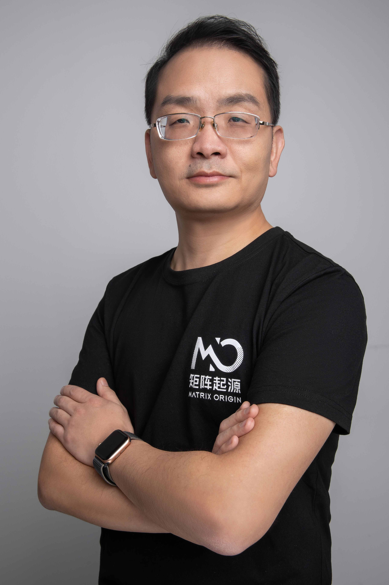
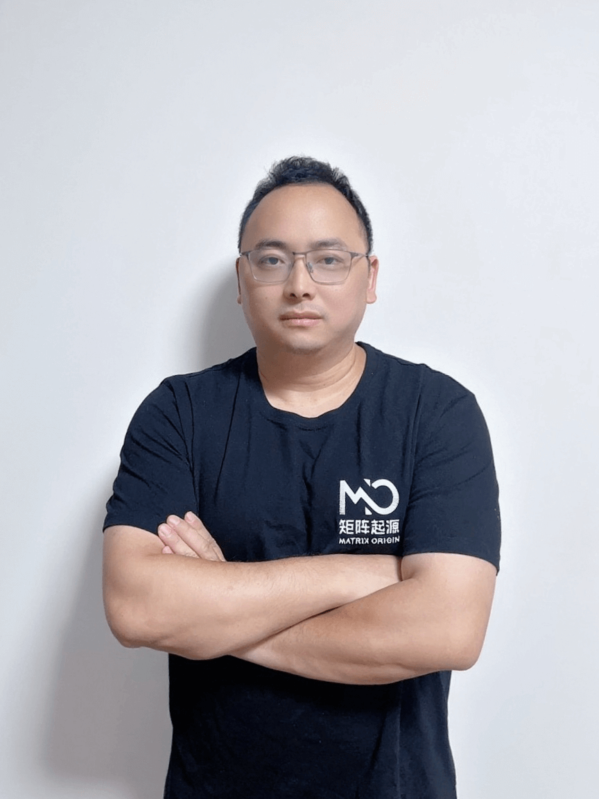
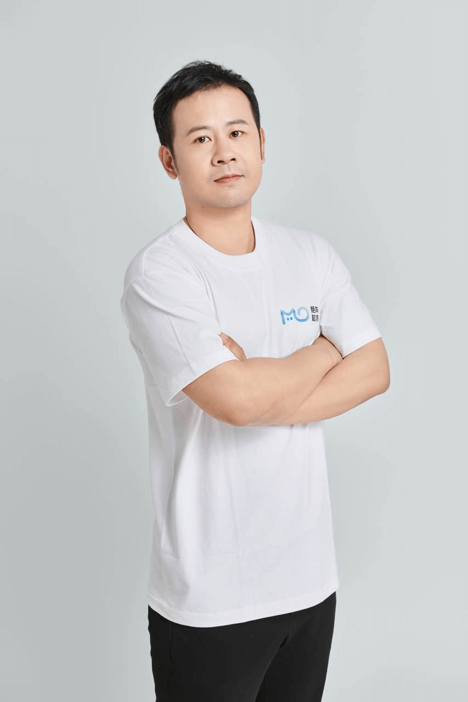
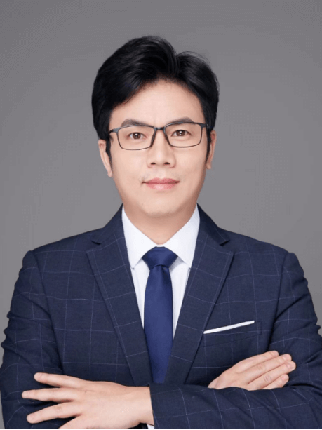
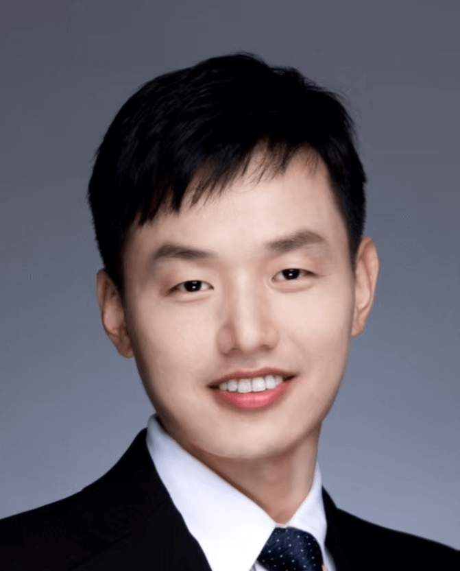
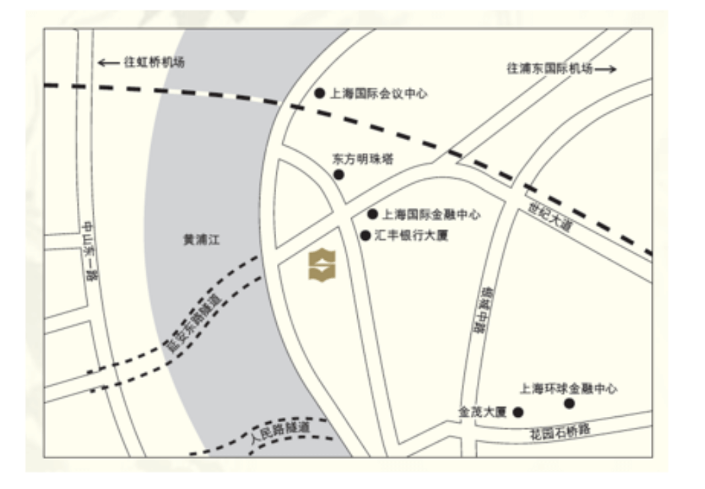
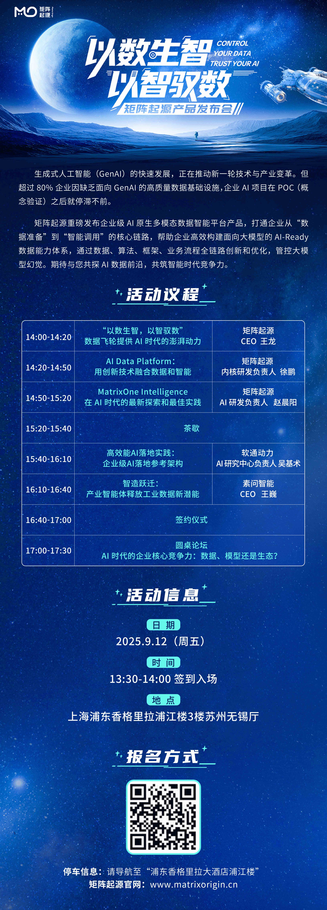

The rapid development of generative artificial intelligence (GenAI) is driving a new wave of technological and industrial transformation. But more than 80% of enterprises lack high-quality data infrastructure for GenAI, causing their enterprise AI projects to stall after POC.

On September 12 (this Friday), the **MatrixOrigin "From Data to Intelligence, from Intelligence to Data" Product Launch** will be held in Shanghai. This launch will, for the first time, systematically analyze how to deeply integrate "data" and "AI," build the core engine for sustained enterprise growth, the Data Intelligence Flywheel, and present reusable and quantifiable practical paths.

### Keynote Speaker Preview

**Wang Long -- CEO of MatrixOrigin**  
Graduated from Tsinghua University, has worked in multiple countries, and has a global vision. In 2021, he founded MatrixOrigin to provide high-quality data intelligence services for the implementation of traditional applications and large-model AI applications, accelerating the digital and intelligent transformation and upgrading of Chinese enterprises.

**Speech Topic:** "From Data to Intelligence, from Intelligence to Data": The Data Flywheel Provides Powerful Momentum for the AI Era

- Explore how a data intelligence foundation can break down barriers between traditional data and AI applications and promote a closed loop of enterprise digital and intelligent transformation.
- Share how MatrixOrigin's two core products continuously optimize AI model effectiveness and adaptation to real business scenarios through the "data flywheel" model.

**Xu Peng -- Head of MatrixOrigin Kernel R&D**  
Responsible for architecture design and R&D of the database core engine. He previously worked at Intel, Micron, Zilliz, and other companies, and is the original author of the open-source vector database Milvus.

**Speech Topic:** AI Data Platform: Integrating Data and Intelligence Through Innovative Technologies

- Analyze how unified storage and compute engines for multimodal data eliminate architectural fragmentation between traditional data warehouses and lakehouses, improving data-processing efficiency.
- Introduce the technical implementation and advantages of a hyper-converged HTAP architecture in supporting coordinated scheduling of structured and unstructured data.

**Zhao Chenyang -- Head of MatrixOrigin AI R&D**  
Graduated from Clark University and has engineering and platform-building experience at large Internet companies including Google and Shopee. He has long focused on image analysis, machine learning model R&D, and the design and implementation of large-scale data processing systems, and has deeply participated in the architecture construction and capability integration of data intelligence platforms.

**Speech Topic:** MatrixOne Intelligence's Latest Exploration and Best Practices in the AI Era

- Share how MatrixOne Intelligence systematically integrates a hyper-converged data foundation with large-model technologies to transform multimodal data into high-quality, AI-Ready data assets.
- Introduce newly released features such as the Agentic architecture, visual workflow design, and MCP support, demonstrating practical value in accelerating end-to-end enterprise intelligent solution implementation.

**Wu Jishu -- General Manager, Asia-Pacific Department, AI Research Center, Consulting and Innovation Business Group, iSoftStone**  
Has 20 years of extensive experience in IT services, Internet technology, retail, and FMCG, with expertise covering enterprise digital and intelligent transformation. At iSoftStone, he is mainly responsible for digitalization in the group's human resources field. In 2024, he established the AI Research Center and became head of the Asia-Pacific department, responsible for the company's Microsoft and NVIDIA technology cooperation ecosystem. He leads the promotion of iSoftStone's intelligent system and the development of the enterprise-grade AI platform Tianxuan MaaS.

**Speech Topic:** High-Efficiency AI Implementation Practice: Reference Architecture for Enterprise-Grade AI Implementation

- Starting from the practical needs of enterprise digital and intelligent transformation, propose reusable AI platform architecture and integration methodology.
- Emphasize implementation strategies for balancing technology ecosystem cooperation with autonomous and controllable capability construction in complex organizational environments.

**Wang Wei -- CEO of Suwen Intelligence**  
PhD in artificial intelligence from Paris-Saclay University, joint postdoctoral researcher at the LIP6 Laboratory of the French National Centre for Scientific Research and the University of California, Berkeley, member of the Chinese Language and Cognitive Computing Technical Committee, and former AI researcher at Huawei Noah's Ark Lab.

He won Huawei's Outstanding Contribution Award in 2017 and the first prize for Industrial Big Data from the China Academy of Information and Communications Technology in 2020. He has long focused on implementing the value of big data and AI solutions in industry. Since 2023, he has been building enterprise-grade data Agent service TechAgent to empower industrial enterprises in market, strategy, R&D, and other departments with data value.

**Speech Topic:** Intelligent Manufacturing Leap: Industrial Agents Unlock New Potential in Industrial Data

- Focus on how industrial Agents (TechAgent) deeply extract and empower data value in R&D, market, and strategic decision-making.
- Combine industrial big data and AI technologies to discuss implementation paths for Agents in improving industrial collaboration efficiency and innovation capability.

### Roundtable Forum: "Enterprise Core Competitiveness in the AI Era: Data, Models, or Ecosystem?"

This launch event will also include a roundtable forum on the theme "Enterprise Core Competitiveness in the AI Era: Data, Models, or Ecosystem?" Industry leaders from data, consulting, high technology, and other fields will discuss key technical challenges such as how enterprises can build sustainable Data + AI competitive moats, the key to differentiated competition in the AI era, the interaction between data flywheels and industry ecosystems, and the balance among data, models, and ecosystems.

### Time, Location, and Transportation

**Time:**  
September 12, 2025 (Friday), 14:00-17:30

**Location:**  
Suzhou-Wuxi Hall, 3rd Floor, River Wing, Pudong Shangri-La, Shanghai (No. 33 Fucheng Road, Pudong New Area, Shanghai)

**Transportation:**

- Metro: Exit 2 of Lujiazui Station on Line 2, about a 10-minute walk; Exit 9B of Lujiazui Station on Line 14, about a 5-minute walk.
- Taxi: Tell the driver to go to "Pudong Shangri-La River Wing" (No. 33 Fucheng Road, Pudong New Area).
- Driving: Navigate to "Pudong Shangri-La River Wing." The hotel's underground parking lot on B1/B2 is open for parking (22 yuan/hour).

**September 12, Shanghai**  
Join us to witness the foundational transformation of the intelligent era, starting from controlling data, and explore the new commercial future of GenAI.

---

### About MatrixOrigin

MatrixOrigin is an industry-leading provider of Data & AI platform technologies and services. Its core team comes from well-known technology companies in China and abroad and has broad industry and international vision. MatrixOrigin's core product, MatrixOne Intelligence, is an AI-native multimodal data intelligence platform for enterprises. It uses artificial intelligence technologies, including large models, and an innovative hyper-converged data foundation to help enterprises centrally manage and govern multimodal data and turn private-domain data into AI-Ready data assets. It has already served leading enterprises across industries, including StoneCastle, China Mobile IoT, Amway Nutrilite, Jiangxi Copper, and XCMG Hanyun, helping enterprises transform and upgrade from informatization and digitization to intelligence.
