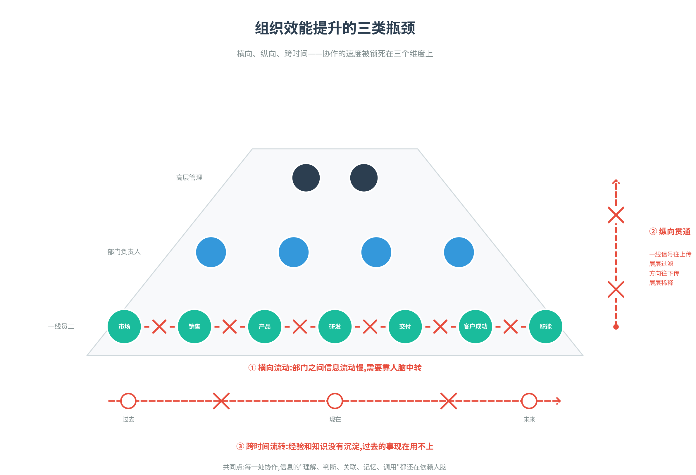
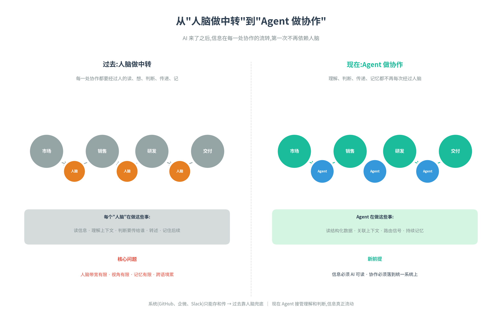
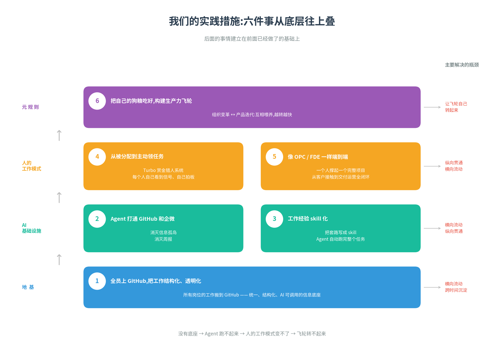
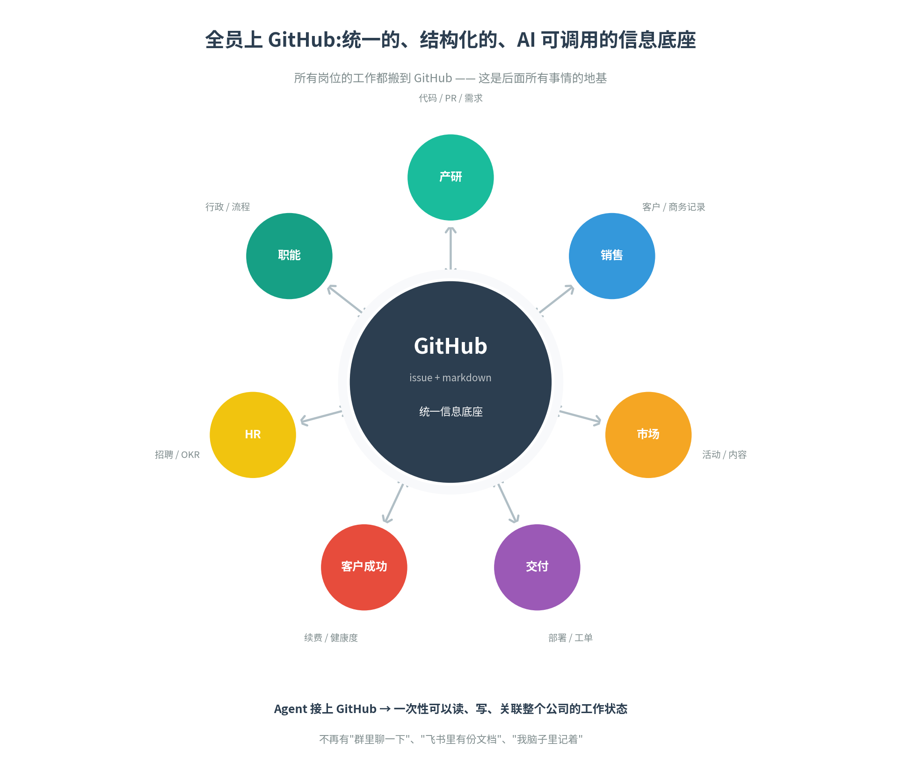
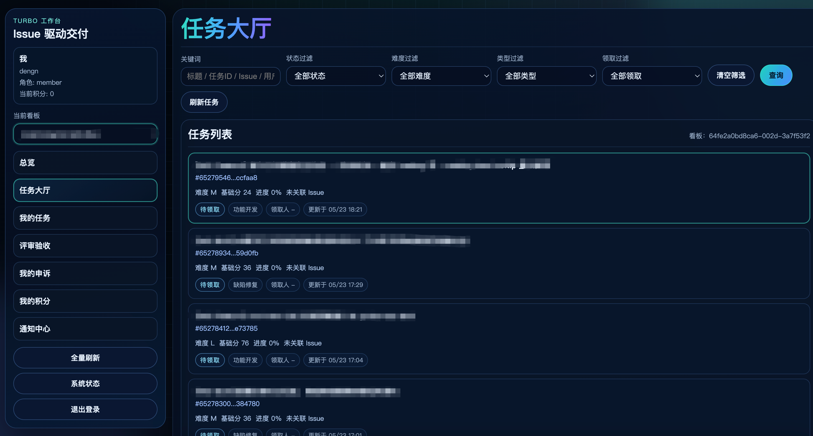
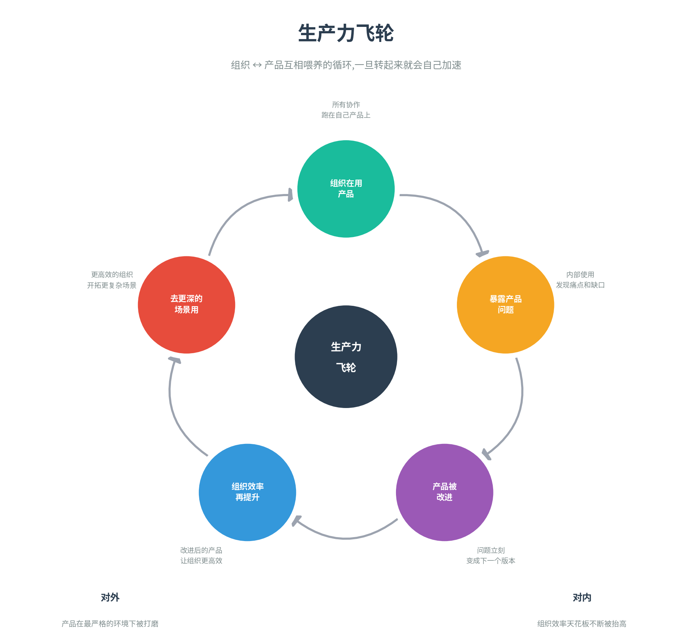

# 重写组织源代码,我们怎么走向 AI-Native


最近发了这个系列的两篇文章之后也是收到了很多同行和客户的反馈,大家最近对这个话题都有非常深刻的体会。我们也发现越来越多的公司开始加入调整自己的组织模型来适应新的生产力的情况。另外一边硅谷的裁员风也是愈演愈烈。前几天 Meta 又宣布裁员 8000 人,同时调岗 7000 人。这也加剧了大家最近的焦虑感,都感觉 AI-Native 的组织转型已经从 option 变成 must 了。


前面两篇文章已经讲了很多理论了,这篇我们更进一步的来分享一下我们自己的组织诊断以及实践措施,看看我们在这过去大半年的时间如何向 AI-Native 的组织转型靠拢。

## 矩阵起源这个组织的运作逻辑

要把个人生产力的提升转化成组织生产力的提升,首先得理解矩阵起源究竟是个什么样的组织,它是怎么运作的。

矩阵起源是一家 2B 的软件公司——也就是面向企业开发和销售软件。具体来说,我们做的是数据基础设施软件,主要客户是中大型企业,帮他们把数据存好、用好,然后在上面再去做 AI 应用。

2B 软件这门生意,跟做消费品、做 to C 应用很不一样。它的特点是:

1. **客户少,单价高,决策周期长**。一年可能就服务几十、几百个客户,但每个客户能签几十万到上千万。一个大客户的得失,直接影响公司一个季度的业绩。客户买 2B 软件不是看到广告就下单——要先听说我们,聊一聊,看 demo,做 POC,内部审批,然后签合同。这个过程短则几个月,长则一两年。

2. **签完合同不是结束,是开始**。东西要装到客户环境里、要培训、要保证跑得稳、出问题要有人接。这一套服务做不好,客户第二年就不续费了,前一年的投入全打水漂。客户也不会自动发现你、信任你、用好你——市场、销售、交付、客户成功,每一环都不能少。


围绕这门生意,公司的运转可以简单理解成一条链:**市场把潜在客户拉进来,销售把他们转成合同,研发把合同变成可用的软件,交付把软件装到客户那里跑起来,客户成功让客户持续用、用得更深、续费扩展**。这条链上任何一环跑不顺,前面所有努力都打折扣。

我们说 AI 带来了十倍生产力提升,看的是个体——研发的代码量产出、产品经理的 PRD 数量。但**对一家公司而言,个体提升要传导到这条链路的每一环上,才算真正变成了组织的生产力**。这就是我们做组织变革要回答的根本问题。


## 组织效能提升的核心卡点

上两篇文章里也说过了,我们明显感觉到个人效率的提升并没有真正带来组织整体的效率提升。每个人都觉得自己在飞,但公司层面的几个核心数字——签单数、收入、活跃客户、续费率——并没有同步飞起来。那为什么个体的提升传导不到这条链路上呢?

因为公司的整体输出,从来都不是"每个人的产出加总",而是每个协作环节衔接的总和。而我们公司虽然只有七十几人,但是整个组织过去的设计是按照传统金字塔式的结构设计,横向来说,我们有销售、市场、财务、人事、产品、研发、交付这样一些部门,纵向来说,我们有一线员工、部门负责人、高层管理的层级。

这种结构在 AI 之前是几乎所有公司的默认形态——分工清晰、责任明确、便于管理。但它的代价是,协作的速度被锁死在三个维度上:



**第一,信息横向流动的瓶颈**

只要一旦公司设立了部门这个东西,部门之间就一定会造成信息流动的隔阂。人天然有一种跟自己所属的组或者团队更亲近的倾向,一方面这是人性使然,另一方面也是因为技能和领域差异造成。

举个真实的场景:市场同学要写一篇关于我们产品新 feature 的内容,得知道这个产品过去三个月有什么新进展、最近哪些客户在用、用得怎么样。但市场看不懂代码、看不懂 commit 记录、也没人会主动告诉他客户的反馈。最后只能去找产品经理:"麻烦帮我整理一下产品最近的进展。"产品经理花一天时间和研发、销售各开一个会、翻一遍各种记录,整理成两页纸发回去。等市场拿到这个材料,可能已经过去很久了。

**第二,信息纵向贯通的瓶颈**

在纵向上,也就是金字塔的层级形状,也一样会造成信息流动的瓶颈。下级与上级的对话永远不是平等的,一方面是地位的差异,另一方面也是信息背景的差异。下级看到的是手头这件具体事的细节,上级看到的是几十件事捏在一起的全貌——两边看到的世界本来就不一样,沟通的时候各自只能讲自己看到的那部分,中间天然就有信息差。

举个真实的场景:某个一线工程师在做客户支持的时候,发现最近接连几个客户都问到同一个问题——某个功能在大数据量下表现不稳。他觉得这件事可能挺重要,在群里提了一句。但他的主管那段时间在忙别的事,没接住这个信号。两周后,这件事变成销售在群里的抱怨——"客户都在问这个事,我没法答"。又过了一周,信号才到产品负责人那里,变成一个需要排期的高优需求。这是从下往上的链路问题,而从上往下也一样,公司层面定了方向往下传,会被层层稀释、层层重新解读,到一线执行的时候就走样了。


**第三,信息跨时间流转的瓶颈**

横向和纵向是空间上的瓶颈,时间上还有一个。任何一个组织,每天都在产生大量的新信息——一次客户对话、一次方案讨论、一次踩坑复盘、一次跨部门协作。但这些信息大部分没有被沉淀下来,过一段时间就找不到了。组织的经验只活在当前在场的人的脑子里,人走了经验就走了,人忙了经验就堵了。

最常见的情况就是在这个公司待的时间长的人和时间短的人的差异。资深同事知道产品的边边角角、客户的真实状态、踩过哪些坑、走不通哪些路——这些知识有很大一部分留在他们的脑子里,没有沉淀成组织能调用的资产。新人来了要进入状态,只能靠"问"——问的对象就那几个资深同事。资深同事每天被新人和老问题来回打断,自己的事推不动;而另外一边新人成长的就会很慢,要花比较长的时间才能独立。

把这三类瓶颈放在一起看,共同点很明显:每一处协作,信息的"消费"都还在依赖人脑。



人脑读、人脑想、人脑判断、人脑传递、人脑记。虽然我们也有系统:企业微信、github、Slack 等等,但是这些系统只是信息的存储和传输管道,它们本身不"理解"信息,只能靠人脑。

在 AI 之前,这是没办法的事——只有人脑有跨语境的理解能力,只有人脑能做综合判断,只有人脑能记住经验。所以过去几十年的组织设计,本质上都是围绕"如何让人脑这个稀缺资源被更结构化地分摊"展开的——分层管理、矩阵汇报、敏捷流程、OKR、周报月报,都是为了在人脑带宽有限的前提下,把协作勉强跑起来。

但 AI 来了之后,这件事第一次有了根本性的可能:让信息在横向、纵向、跨时间这三个维度上,不再每次都经过人脑。

回到第一节那条协作链路——让个体的提升真正传导到链路的每一环,前提就是把这三个瓶颈打通。瓶颈不通,个体跑得再快也只是局部好看,公司整体跑不起来。


## 我们的实践措施

那这三个瓶颈具体怎么打破? 总得来说我们可以把他们总结成六点，这六点基本算是比较顶层和比较核心的措施，如果把整个AI-Native的改造当做建房子，那这六件事基本上是从下往上构建的一个过程。



### 1. 全员上 GitHub,把工作结构化、透明化

第一件,也是后面所有事情的地基:让公司里每一个人,不分岗位,都把自己的工作搬到 GitHub 上。除了本来就在上面的产研团队,其他的如市场、销售、智能团队也一样。

为什么是 GitHub?回到上一节那个核心判断:协作的瓶颈,根因是信息的"理解、判断、关联、记忆、调用"还在依赖人脑。要让 AI 接管这些动作,前提是信息得变成 AI 看得懂、能调用、能关联、能持续追踪的格式。而我们发现,其实产品和研发的协作是整个公司最大的协作,这个协作方式一直就是基于 GitHub 的,而本身 GitHub 的好处和意义就在于它将所有产品研发的工作结构化和任务化了。且 GitHub 的 issue + markdown 的格式——纯文本、结构化、有链接、有状态、有时间线,且 API 完善,任何 Agent 都能接上去读写。我们可以非常轻松的让 Agent 来帮助我们对齐信息,汇总信息,流动信息,自动化一些任务。所以 Github 是最容易成为整个公司的Context资产的核心载体。


具体落地的几件事:

* 每个项目、每个客户、每个跨部门协作,都开一个 repo 或者一组 issue。销售跑客户,开客户 issue;市场做活动,开活动 issue;HR 招聘,开招聘 issue;产品讨论需求,开需求 issue
* 重要的讨论和决策,都落到 issue 评论里。不再有"群里聊一下"——任何讨论如果不在 issue 里,等于没发生
* 所有文档都用 markdown。PRD、SOP、复盘、客户方案——一律 markdown,放进 repo
* 任务的 open / in progress / done,客户的潜在 / 谈判中 / 已签——用 label 和 project board 表达

这件事做好后不管是人还是 AI,第一次有了一个统一的、结构化的、可调用的信息底座。后面所有其他事,都建立在这个底座上。每个人可以通过 Agent 轻松的了解整个公司都在发生什么,也可以通过 Agent 的帮助快速识别瓶颈和问题点,以及跟自己有关的内容。



### 2. Agent 打通 GitHub 和企微,消灭信息孤岛

除了 GitHub 之外,我们公司还有一个很大的信息源就是企业微信,企微是我们获取即时消息的地方、是开会的地方、是沉淀临时讨论的地方,也是组织架构、人员信息、外部客户对接的地方。GitHub 上是"结构化的工作产出",企微上是"非结构化的实时协作和组织状态"。两边加起来,才是公司信息的真实全貌。

只让 Agent 接 GitHub 是不够的。GitHub 上能看到一个 issue 的进展,但看不到这个 issue 的相关同事在企微上正在讨论什么;能看到一个客户的对接记录;能看到一个项目的状态,但看不到这个项目相关的同事是谁、他们之间的协作关系。Agent 要真正理解公司在发生什么,必须同时接 GitHub 和企微。

所以我们做的事是——把企微也接进 Agent 体系,让 Agent 能跨这两个系统读、写、搬运、关联。具体在跑的几个 Agent:

* **信息搬运 Agent**:GitHub 上某个 issue 有进展,Agent 自动推送通知到相关人的企微;企微里有重要的讨论被点名,Agent 自动归档到对应的 GitHub issue 里;对于非技术的同事不太习惯怎么提 issue 的,也可以直接让 Agent 提
* **总结 Agent**:每个项目每周,Agent 自动汇总这个项目下所有 issue 的状态变化 + 相关企微讨论,生成项目状态简报
* **提醒 Agent**:某个 issue 长时间没动,Agent 在企微里 ping 负责人;某个客户上次接触超过两周,Agent 提醒销售;某个跨部门依赖卡住,Agent 自动催办

要老实说一句——企微并不容易打通。它的开放程度、API 完善度、对外部 Agent 的友好度,跟 GitHub 完全不在一个量级。至今都没有一个完整的 CLI 能支持到所有数据的调用。我们到今天也只打通了一部分数据,还有不少地方在啃。

这件事最直接、最简单的一个成果——我们消灭了周报。每个人的工作进展实时在 GitHub 上,讨论和决策实时在企微上,Agent 会定期汇总和推送。

### 3. 工作经验 skill 化,Agent 把任务自动化

数据和任务都透明化之后,我们发现一件事:公司里有大量的工作,其实是有套路的。很多无非就是从 A 地点拉一些数据、从 B 地点拉一些数据、把它们放到一起做个分析、或者按某种规则汇总一下,这件事就完成了。过去这些"有套路"的工作要靠人做,是因为没有别的载体能跨系统拉数据、能理解数据的语义、能做出分析判断。但现在不一样了——数据通了,Agent 能读;再把人脑子里的"套路"写成 skill,Agent 就能自动跑完整个任务。所以我们做的事是:梳理那些有套路的工作,把套路写成 skill,让 Agent 接管整个任务,而不只是接管中间某一步。

举两个我们实际跑起来的例子。

**第一个,CI bug 分析和修复**。过去研发流程里,CI 一旦跑挂了,要有人去看日志、定位是哪段代码引起的、判断是真 bug 还是环境问题、然后提 issue 给相关同事处理。现在这事完全被加载了人经验的 skill 的 Agent 替代了:

* **Bug 定位 Agent**:CI 一挂,它自动启动,一边看 CI 日志,一边交叉查代码 commit,定位出问题最可能在哪一段代码、是哪次 PR 引入的、影响哪些模块,然后直接在 GitHub 上提一个结构化的 bug issue,把分析结论、相关 commit、影响范围都写清楚
* **Fix 方案 Agent**:bug issue 一旦提出来,这个 Agent 接手,继续看日志和代码,直接提出修复方案——有时候是直接给一段补丁,有时候是给几个候选方案让人选

**第二个,根据代码发布更新用户手册**。过去版本一发布,文档要跟着更新——某个 API 改了、某个参数增加了、某个行为变了,这件事既繁琐又容易漏,经常版本发出去了文档还停留在上个版本。现在这件事也完全自动化了。Agent 监听代码仓库的发布事件,自动 diff 出本次发布相比上版改了什么,对照现有文档判断哪些章节需要更新,然后直接生成 PR 提到文档仓库里。另外一个审核 Agent 在一定范围内就直接通过,只有在感觉分歧很大的时候会请求人介入。

这些例子背后是同一个套路——识别任务、拆解套路、把套路 skill 化、让 Agent 串起来跑完。

### 4. 从被分配任务到主动领、主动主导任务

前面三条是把基础设施和 AI 能力都建好了。基础设施有了,人的工作模式也得变。

过去一个员工的典型一天:leader 派给我一个任务,我做完交付。再派一个任务,再做。我不太需要看大局,只要把手上的活做好就行。这套模式在老时代是高效的——每个人专注自己那段,管理者负责拼图。

现在信息透明之后,每个人都能看到大局。GitHub 上所有项目、所有客户、所有需求都是开放的,任何一个员工只要愿意花时间,可以看到公司当前在做什么、哪里卡了、哪里有机会。这种情况下,继续等 leader 派活就是浪费——leader 能看到的信号,你自己也能看到;leader 要花时间消化才能派下来的活,你自己直接领就行。

具体怎么做呢?我们针对研发开发了一套叫 **Turbo 的赏金猎人系统**。Turbo 上线之后,研发团队的工作模式发生了根本变化。所有要做的事情,都通过 issue + Turbo,不再有口头分配,也不再由 leader 派活。任何一个人——无论是 leader、PM、产品负责人、还是研发自己——发现一件该做的事,就在 GitHub 上创建一个 issue,打上 Turbo 标签。



Turbo 接住这个 issue 之后,自动评估难度,给它分配一个积分级别——简单的 bug 几分,中等的功能几十分,复杂的模块几百分。然后这个 issue 就进入 Turbo 的"赏金池",对所有研发开放。研发自己根据自己的兴趣、能力、当前负载,主动认领。任务完成之后,AI 自动评估完成度——代码质量、测试覆盖、是否真正解决了 issue 描述的问题——然后把积分发到认领者的账户里。

这套系统跑起来之后,带来的变化是结构性的:

* 管理者不用再操心"这个活派给谁"。他只要发现问题、把 issue 写清楚就行,剩下的交给系统
* 研发不再被动等活,而是主动逛赏金池找匹配自己能力和兴趣的事。一个对某个模块感兴趣的研发,会主动去认领那个模块的所有 issue,慢慢变成那个模块的实际 owner——而不是被指派去当 owner
* 跨模块的事第一次有了主动认领的可能。过去一个 issue 涉及多个模块,要等 leader 协调;现在感兴趣的研发自己就会去认领,边做边拉相关同事
* 绩效评估有了更客观的依据。一个研发这个季度积分多少、解了哪些 issue、AI 评估的完成度如何,都是实时透明的——比主管凭印象打分准得多

### 5. 像一个 OPC 或者 FDE 一样端到端

人的工作方式改变是全方面的,我们从公司文化上一直都在强调和鼓励端到端的重要性。可是以前这件事情被锁在人的能力带宽、技能带宽上,同时部门、岗位造成的信息瓶颈也限制了人的发挥空间。结果就是一个项目要经过五六个人的脑子接力,每个角色都专业,但每个交接处都是损耗。

而前面几条措施推下来之后,这两道锁开始松了。信息瓶颈被打开了——GitHub 把工作结构化、Agent 在企微和 GitHub 之间搬运,一个人现在能看到的不只是自己那段,而是整个项目的全貌、整个客户的历史、整个产品的状态。能力带宽也被打开了——一个原本只懂技术的研发,借助 AI 可以快速理解业务、可以做客户沟通、可以输出方案;一个原本只懂业务的销售,借助 AI 可以理解产品的技术细节、可以设计 POC 方案、可以做基础的部署。一个人借助 AI 变得足够"宽",足以承担过去四五个角色的工作。

我们强调的"端到端"文化实质上可以大规模的突破以前的边界。我们开始鼓励更激进的做法:**一个人撑起一个完整项目**。一个项目从客户初次接触、需求理解、POC 设计、方案开发、上线交付、后续运营,全部由同一个人主导。这个人不一定是销售、也不一定是研发——任何岗位的人,只要有意愿、有匹配的能力、AI 能补足他不够的部分,都可以做一个项目的 OPC。

这种模式跟最近行业热门的 **FDE** 其实是同一回事——Anthropic、OpenAI 都在大规模用。一个 FDE 就是一个客户的完整接口,所有需求、所有问题、所有交付,都在他这里闭环。我们现在希望人人都能是 FDE。

最先把这件事跑通的,是公司里一批年轻的工程师和产品经理。他们经验不算丰富,但冲劲十足、不给自己设边界——制度一打开,他们就主动从源头接触客户,把一个完整项目所有的环节都自己闭环下来。这些人身上,我们清楚地看到了端到端带来的两个本质变化。

* 第一,**响应速度比传统接力模式快几倍**。客户的问题很多直接在前端就被消化掉了,不需要在公司内部传几道。负责人自己听到反馈、自己判断、自己拍板、自己改
* 第二,**对最终结果的责任感完全不一样**。一个只管签单的销售,签完之后客户用得好不好和他无关;一个端到端的负责人,客户后面用得不好他自己要负责——所以从一开始的客户筛选、需求确认、方案设计就会更谨慎、更真实


### 6. 把自己的狗粮吃好,构建生产力飞轮

我们是一家软件公司,软件这个行业的 AI-Native 的天花板毫无疑问是 Anthropic 公司。最近 Anthropic 团队的一些公开分享,让整个行业都看到了吃自己狗粮的 AI-Native 能做到什么程度。Claude Code 产品负责人 Cat Wu 和创始工程师 Boris Cherny 在不同场合都讲过:**Anthropic 现在大约 90% 的生产代码,是由 Claude Code 自己写的**。最猛的一个例子:他们用 Claude 在 10 天里做出了 Claude Cowork——一个全新产品,10 天从零到能用。

这种迭代速度和交付速度是怎么做到的?核心不是模型本身,而是 **"用自己的东西把自己重写了一遍"** 之后,组织内部形成了一个不停加速的循环——产品被自己人用得最狠,问题被最快发现,新版本被最快试,然后又被用得更狠。

我们做的是数据基础设施 + Agent Infra——本质上,我们做的就是别人 AI Native 转型所需要的东西。这件事意味着一个再朴素不过的逻辑:**如果我们自己都没办法用我们的产品把组织重塑成 AI Native,那这套产品凭什么相信能帮别人做到**?

所以吃自己的狗粮,对我们来说不是文化口号,而是产品的生死线。

具体在矩阵起源,这件事是这么跑的——前面五条措施里所有的基础设施,全部跑在我们自己的产品上。GitHub 上的数据底盘怎么调用、Agent 在企微和 GitHub 之间怎么搬运、各种 skill 怎么管理、Turbo 系统怎么运行——背后的运行底座是我们自己的 Astra 和 MOI 平台,Agent 的记忆层是我们自己的 Memoria。我们一边用,一边发现问题;一边发现问题,一边改产品;一边改产品,一边又让组织效率再上一个台阶。

这就是我们想要的 **生产力飞轮**:

```
组织在用产品 → 用的过程暴露产品的问题和缺口 → 产品被改进 → 改进后的产品让组织效率再提升 → 组织又能在更深的场景里用产品
```



这个飞轮一旦转起来,就会自己加速。它不是一个会停下来的项目,而是一个会越转越快的循环。对外,我们的产品在最严格的环境下被打磨——一个我们自己每天用、用了一年的产品,客户上手成本会低得多;对内,我们的组织在 AI 的支撑下持续重塑,效率天花板不断被抬高。这是我们作为一家 AI Native 公司,在做的最重要也最长期的一件事。

## 我们踩过的坑

这大半年的实验并不是一帆风顺的,面对这种全方位的变革,我们踩的坑和取得的成果可以说一样多,说几个比较常见的坑。

* **人不适应的坑**。前面五条措施看起来逻辑顺,但具体推到每个人身上,适应程度差距很大。一些同事很快进入状态,Turbo 上认领、AI 协作、端到端跑项目都没问题;一些同事则一直转不过来——习惯了被分配任务、习惯了把活做完就完了、不愿意主动去看 GitHub 全貌、不愿意花时间和 AI 磨合。我们尝试过培训、配 mentor、给试错空间,几个月下来转不过来的,只能坦诚沟通。这件事我们做得并不温柔,但不做不行——一个团队里有人还停在旧模式,整个团队的节奏都会被拖慢

* **系统不支持的坑**。第二条讲过企微打通——到今天,我们也只打通了一部分。企微的开放程度、API 完善度跟 GitHub 完全不在一个量级,很多关键能力(比如稳定地读群消息、跨群关联、按角色拉取组织信息)要么没有、要么不稳定、要么要走非常曲折的接口。我们已经搭了一些 workaround,但很多场景下 Agent 拿到的还是不完整的视图。这件事短期解决不了,只能继续啃

* **Agent 本身的坑**。Agent 远没有想象中聪明。它会理解错意图、会拿错数据、会生成看起来对但其实有 bug 的代码、会在一长串任务里突然走偏。我们做的每一个 Agent,上线前都要反复调,上线后还要持续盯。让 Agent 真正稳定地在生产环境里跑,比"做出一个 demo"难十倍

* **客户侧人的坑**。我们公司内部的协作改造能控制——是我们自己的人、自己的流程、自己的工具。但客户那边的人和流程,我们改不了。一个跑通了 OPC 模式的同事,在公司里能十几分钟搞定的事,到了客户那里要等客户内部走完审批、等对接人有空、等基础环境到位——经常要等几周。客户侧的协作瓶颈,比我们公司内部还要重得多,这件事我们目前没有特别好的解法

## 离理想还有多远

老实说,还很远。理想中的 AI Native 组织,信息在横向、纵向、跨时间三个维度上都应该是自动流动的;每个人都借助 AI 端到端撑起一摊事;Agent 在每一处衔接上承担信息传递和初步决策;组织能在保持小规模的同时,撑起远超规模的产出。

我们当前的状态:GitHub 底座基本建好了;Agent 跑通了一部分但远没覆盖所有协作场景;能做 OPC 的人还是少数,大部分同事还在过渡;企微打通只完成了一部分;产研 AI-Native 程度比别的团队深,其他团队还没有太适应新的 GitHub 工作形态;Agent 稳定性还不够,关键场景下仍然要人兜底;面对客户那一侧的协作瓶颈,我们几乎还没开始解。

我们距离理想状态,大概只走了三成。但我们对方向已经非常确定——后面要做的事是把已经看清楚的路一步步走完,而不是再去找路。

## 总结

回到第一篇文章里我们说的那句话:**在十倍生产力的工具面前,留在原地就是退步**。这大半年的所有动作,都是为了不退步。

我们做得不完美。还有大量的人没真正进入状态,大量的环节还没被 Agent 接管,大量的瓶颈还在卡着。但我们不打算停——后面会继续把 GitHub 用得更深、把 Agent 跑得更稳、把端到端的人越带越多、把飞轮转得越来越快。

这一段时间走下来有一个最深的体会,那就是:**AI Native 不是一个目标状态,而是一种持续重写自己的能力**。模型在变、工具在变、客户的需求在变——一家公司能不能在 AI 时代活下去,不取决于它现在长什么样,取决于它有没有能力不断把自己重写一遍。我们这段时间最大的收获,不是已经变成了什么,而是**我们获得了重写自己的能力**。

后面的路还很长。我们将持续把各个环节、各个团队以及各个场景的实践进行分享。
