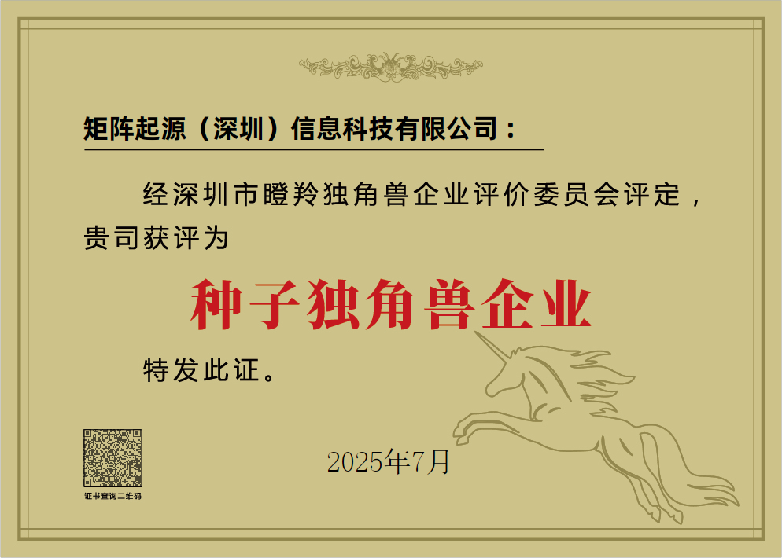

Recently, the 2025 China (Shenzhen) Unicorn Enterprise Conference, themed "New Quality Drives, Future Leads," concluded successfully in Shenzhen. The conference released a series of unicorn enterprise lists, and **MatrixOrigin (Shenzhen) Information Technology Co., Ltd. was named a "2025 Shenzhen Seed Unicorn Enterprise."** The *Shenzhen Unicorn Enterprises and Gazelle Enterprises Research Report 2025* was also released at the event.

The Shenzhen Seed Unicorn Enterprise title is jointly awarded by the Shenzhen Municipal Bureau of Industry and Information Technology and the SME Service Bureau. As a core evaluation for Shenzhen to cultivate new quality productive forces and discover new tracks in future industries, the Shenzhen unicorn enterprise list uses a strict tiered evaluation system and multiple rounds of screening to select **high-quality enterprises with true high growth potential and technical barriers**. This award marks dual recognition of MatrixOrigin's R&D strength and commercial potential from both policy and capital perspectives.

As a leading company in China's artificial intelligence field, MatrixOrigin will continue to take technological innovation as its driving force, fully promote development in the Data + AI field, accelerate the intelligent flywheel, and help enterprises transform and upgrade from informatization and digitization to intelligence.

Since 2024, the Shenzhen SME Service Bureau has established the Shenzhen Gazelle and Unicorn Enterprise Evaluation Committee to select and build Shenzhen's tiered pool of gazelle and unicorn enterprises. The research report shows that Shenzhen has accumulated 149 potential unicorn enterprises with a total valuation of about 350 billion yuan, **143 seed unicorn enterprises** with a total valuation of about 64.3 billion yuan, and 215 gazelle enterprises with total 2023 revenue of about 120 billion yuan. **36% of listed enterprises received support from Shenzhen government guidance funds. Shenzhen Capital Group, Shenzhen High-Tech Investment, and other Shenzhen state-owned enterprises have invested in more than 100 listed enterprises in total.**

About MatrixOrigin

MatrixOrigin is an industry-leading provider of Data & AI platform technologies and services. Its core team comes from well-known technology companies in China and abroad and has broad industry and international vision. MatrixOrigin's core product, MatrixOne Intelligence, is an AI-native multimodal data intelligence platform for enterprises. It uses artificial intelligence technologies, including large models, and an innovative hyper-converged data foundation to help enterprises centrally manage and govern multimodal data and turn private-domain data into AI-Ready data assets. It has already served leading enterprises across industries, including StoneCastle, China Mobile IoT, Amway Nutrilite, Jiangxi Copper, and XCMG Hanyun, helping enterprises transform and upgrade from informatization and digitization to intelligence.
