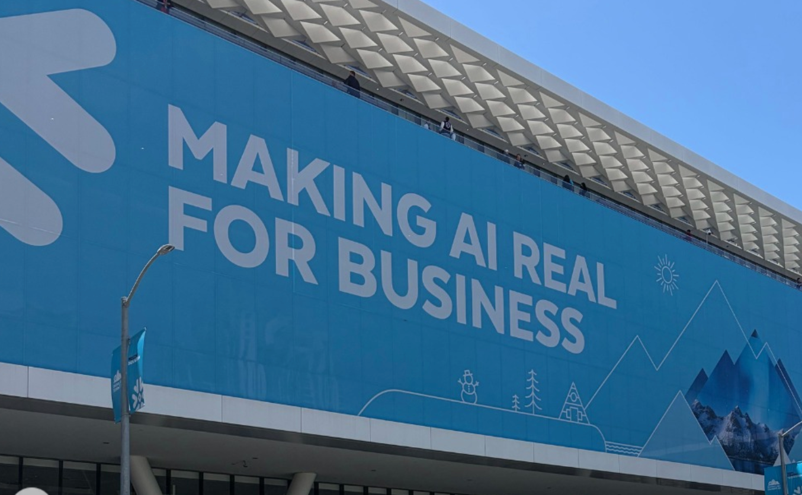
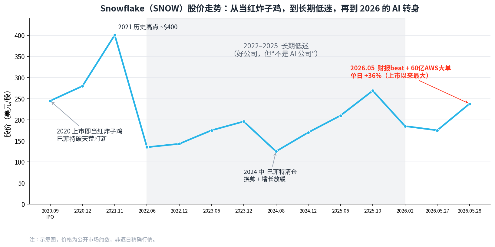
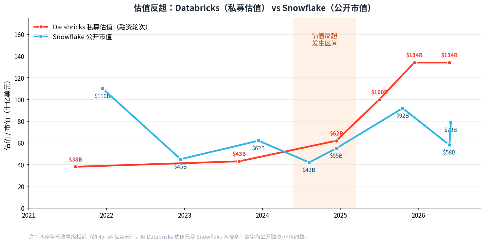
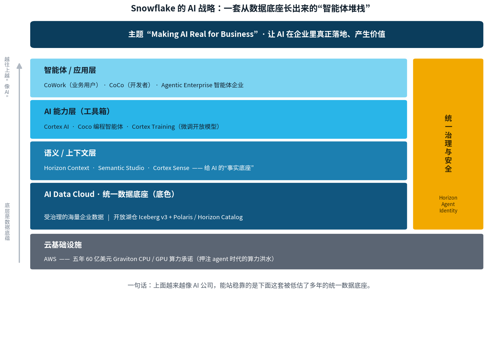
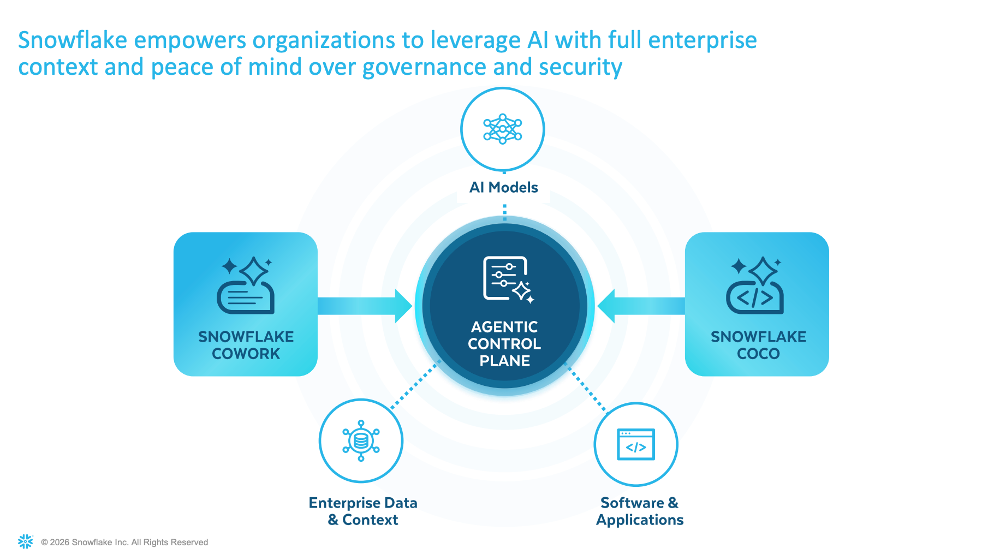
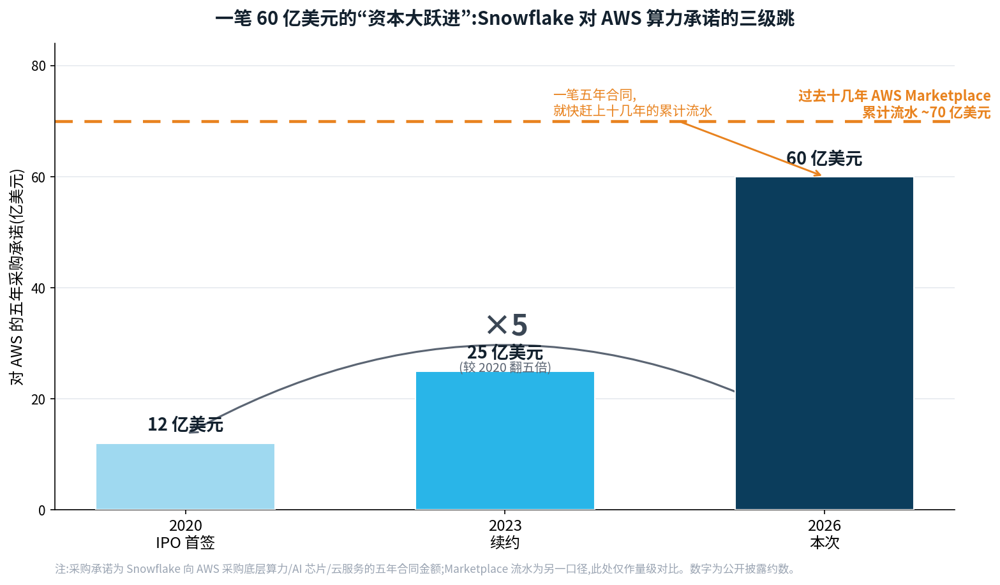

# Snowflake 的 AI 标签终于贴牢了，数据公司的底蕴也终于在 AI 浪潮下凸显了

## 一个老 Snowflake 人在 Summit 现场的感想和见闻

文 / 田丰（矩阵起源 CTO，前 Snowflake Chief Architect，文章皆为个人观点）

我是个老 Snowflake 人了，当年 19 年最早一届 Summit 的时候虽然也很热闹，但是远远没有今天这么火爆。两万多号人，把整个 Moscone 挤得满满当当。Summit 26 这两天，排队进 keynote 的长龙能绕一整层，展区里 AI、agent、Cortex 的牌子挂得满坑满谷，茶歇的时候你随便逮一个人聊，张口闭口都是“我们家 agent 上线了没”。见到我们一些老同事，大家也张口闭口都是 AI 话题，coding 哪家好用，模型要选什么，买啥 token plan 省钱。不知道的差点以为来的 OpenAI 或者 Anthropic 的 Summit。

其实这家公司前几年可没这么精神——股价蔫了好几年，大伙儿见面聊的还是“AI 会不会把咱给端了”。可这回不一样了：一礼拜前那份财报刚把股价干上去 36%，整个会场是踩着这股劲儿开的，空气里飘的全是“我们又行了”的那种松弛带点儿兴奋。

今年这届的主题，叫 **“Making AI Real for Business”**——让 AI 在企业里真正落地、真正产生价值。你把它跟前几年的 Summit 主题摆一块儿看，意思就出来了：2023 年是 generative AI 刚炸场，满世界“大模型要改变一切”；2024 年 Cortex AI 铺开，主题是“The Era of Enterprise AI”；到 2025 年，主题是 “Build the future of AI and apps”，还把 OpenAI 的 Sam Altman 请上台站台，那叫一个仰望星空。连着三年，主题一年比一年 AI、一年比一年往天上飘。可今年这句 “Making AI Real for Business”，明显**往地上落了一截**——它不再炫“AI 有多牛”，而是低下头来说：别整那些虚的了，咱聊聊怎么让 AI 在你真实的业务里赚到钱。一句话，从仰望星空，到低头看脚下的数据。接地气了。

看着老东家这几年的蹉跎，今年算是把身上的 AI 标签彻底贴牢了。但是最让我感慨的，其实不是它“变得多 AI”，而是绕了这么一大圈之后，**它身上那个“数据公司”的底蕴，反倒在 AI 时代头一回被凸显。**

先上一张全景图，这家公司这几年的“心电图”，基本都在这儿了：

*▲ Snowflake 股价：2020 上市高光、2021 见顶 ~$400，2022–2025 长期低迷，2026 年 5 月单日 +36% 完成 AI 转身（示意图，数据为公开市场约数）*

## 一、当红炸子鸡的那些年

Snowflake 起家是 cloud data warehouse——云上的数据仓库。当时在云上干数仓可是非常激进的事情，而且它不光只是用了云，还因为云的特性重新设计了一整套存算分离的架构。但是最终对企业来说说穿了也不复杂：把企业那些七零八碎的数据归拢到云上，你要查就开 warehouse，查完关掉，按用量付钱。但它把这事儿做得极其 elegant，体验吊打老一代 Teradata、Oracle 那一套。后来它逐步扩展到 Data Engineering，Machine Learning，Data Lake 以及 LLM，可 BI、analytics 这摊子，始终是它的看家本事。

2020 年它 IPO，那叫一个风光，史上最大的软件 IPO 之一，挂牌第一天股价直接翻倍。最出圈的是啥？**连巴菲特老爷子都进来打新了。** 你知道老爷子是出了名的不碰 IPO 的——伯克希尔上一回打新还得追溯到几十年前——结果他破天荒在 Snowflake 上下了注。这在当时简直等于给 Snowflake 盖了个“价值投资认证章”，当红炸子鸡，没有之一。

（不过这是后话了——老爷子 2024 年中把这一仓近十亿刀的 Snowflake 全清了，而且清在了一个挺尴尬的位置。咱后面再说。）

## 二、后来这几年，过得是真不顺

热闹没几年，Snowflake 就开始 struggle 了。一是美国疯狂加息，股票承受巨大的压力；二是 Cloud Data Warehouse 的概念已经逐步走到了成熟期，这个技术本身也没有那么强的秘密了，云厂商自己也都在推类似产品，其他创业公司在屁股后面追所以增长一直在放缓。三是 2022 年 OpenAI 的 ChatGPT 彻底把行业的目光吸走了，后面我们的行业就彻底在 LLM 引领的时代里了，而 Snowflake 一直给人的感觉就是好像跟不太上新的变化。

然后在 2024 年，Snowflake 的 leadership 也换人了。老帅 Frank Slootman——那是个杀气特别重的销售型 CEO——2024 年初退了，接棒的是 Sridhar Ramaswamy，一个印度裔，Google 广告出身，自己搞过个 AI 搜索创业 Neeva 被 Snowflake 收了，进来本就是管 AI strategy 的。这个换帅信号本身就很明确：董事会要 all in AI 了。

相比之下，在同一个赛道上，Snowflake 感觉像被市场抛弃了，但是它那个老冤家——Databricks 却成了新的当红炸子鸡。

这几年 DBK 靠着跟 AI 生态的深度捆绑，再加上疯了一样的 AI 并购，valuation 一路狂飙。到现在，DBK 私募市场估值干到了一千三百多亿刀；而 Snowflake 作为上市公司，市值一度跌到五六百亿。**俩家收入其实都在四五十亿刀这个量级上下晃，DBK 的估值却是 Snowflake 的两倍多。** 一个还没上市的，把上市的给反超了，还不是反超一点半点。对一家曾经的当红炸子鸡来说，这口气憋得是真难受。

*▲ 2021 年 Snowflake 还遥遥领先（1100 亿 vs 380 亿）；几年此消彼长，2024–2025 间被反超，如今 Databricks（约 1340 亿）已是 Snowflake 的两倍多*

## 三、Databricks 这小子，是咋一步步逆袭的

这儿我得多唠两句，因为这段历史特别有意思，也是看懂今天这盘棋的钥匙。

你别看 DBK 现在这么风光，它出身可算是比较偏门了。Snowflake 的核心创始人出自 Oracle，根正苗红的数据专家。DBK 的创始团队都是 Berkeley 的博士，它们主导发起了 Spark 项目，而 Spark 当年是拿来给 Hadoop 那套笨重的 MapReduce 当“快版替代品”的。Databricks 最早就是帮人 manage Spark 集群，服务的是一帮 data scientist……我跟你讲，DBK 刚起步那会儿，“data scientist” 这词儿都还没几个人听说过呢。

这就是它早年的尴尬：它伺候的那群搞 data science、调模型的人，**第一没钱（预算小），第二离 business 远（老板压根不懂他们在鼓捣啥）。** 而 Snowflake 伺候谁？伺候 BI、伺候报表、伺候 CFO 爱看的那些 dashboard——这玩意儿是 CEO、CFO 心甘情愿掏钱买单的东西。所以那些年，在“谁的预算更好拿”这件事上，Snowflake 对 DBK 是降维打击。

但 DBK 这帮从 Berkeley 出来的人，有个特别 sharp 的地方：它**早早就给自己贴了 “Data + AI” 这个标签**。搁十几年前，这标签在老一辈数据人眼里是 positioning 模糊、不知所云的——你到底是个数据库，还是个机器学习平台？DBK 也没少干“碰瓷”的勾当，早年为了刷存在感，逮着 Snowflake 各种 benchmark 对比、各种隔空喊话，流量蹭得飞起。甚至去年的 Summit，两家的时间直接撞车，让很多业内人很尴尬。

可它就这么一步一步，愣是把概念给趟出来了：先是 data lake，再是 lakehouse（湖仓一体，这词基本就是它造出来又 popularize 的），再往后是 Data Intelligence Platform。等 LLM 时代一到，它那一长串 AI 并购——MosaicML、Tabular（Iceberg 的创始团队）、Neon——啪，把这个憋了十年的 “Data + AI” 标签彻底给引爆了。

回头看，DBK 赌对了一件事：Data 和 AI 终将 converge。而 Snowflake 呢，数据仓库这块它是真强，强得没话说，可在 AI 这条线上，它一直没 DBK 那么 aggressive、那么敢押。结果就是——**股价好几年没怎么涨。** 市场的逻辑很冷酷：你是个好公司，但你不是个 AI 公司。

## 四、从去年起，Snowflake 也开始玩命往 AI 上卷

但 Snowflake 不是没看明白，它就是动手晚了点。

从去年开始，这家公司明显换挡了。一方面玩命往 AI 上堆产品；另一方面——这点特别有意思——它**反过来开始学 DBK 那套开放格式的湖仓形态**：拥抱 Iceberg、做开放 catalog（就是这次 GA 的 Iceberg v3 加 Polaris 那一套），不再死守自己那套封闭格式了。同时它也开始啃非结构化数据，开始做 Agent。等于说，把当年自己看不大上的 DBK 的打法，认认真真补了一遍课。

到今年，动作更狠。这届 Summit 上，它基本是把 AI 这个工具箱给**补齐**了：

- 做了个相当能打的 coding agent（内部叫 Coco 那个），而且已经 GA；
- 把语义管理这块大幅优化，Horizon Context、Semantic Studio、Cortex Sense 一套组合拳，把 context 层做扎实；
- 把原来的 Snowflake Intelligence 升级重做成了 CoWork，一个面向业务人员的 AI work agent。

你把这些摆一块儿看就明白了：Snowflake 已经不再是那个“只会数据仓库”的公司了。AI 该有的家伙什儿，它现在基本一样不缺。Snowflake 的 AI 品牌叫 Cortex。Coding Agent 叫 Cortex Code，没注意的话你还真会以为是 Claude Code，然后 CoWork 看起来碰瓷 Anthropic 的味道就更重了。

把今年这套打法画出来，大概就是下面这张“堆栈图”——你会发现，所有花哨的 AI 能力，最后全都踩在最底下那层“统一数据底座”上：

*▲ Snowflake 的 AI 战略：从 AWS 算力，到统一数据底座，到语义层、AI 工具箱，再到最上面的智能体；而整个堆栈被一套统一治理与安全框死*

## 五、可它的底色，始终是那个强大的数据平台——而这，偏偏是 2026 年最值钱的东西

开头我提了一句这次的主题词 “Making AI Real for Business”。这一节，我想把它揉碎了讲讲，因为它正好就是这篇标题的下半句。

你别把这句话当成寻常的市场口号。它精准戳中了过去两年整个行业最大的那块心病：**AI 的 demo 个个炫到飞起，可一搁到企业真实业务里，落地效果到底有几成？** 这是 Wall Street、是每一个 CFO 心里头最大的那个问号，也是 AI 这波最被质疑的地方——钱烧了一卡车，ROI 在哪儿？

而 Snowflake 这次给的答案，说穿了就一句：**数据，是企业最核心的资产；只有把你自己的数据用好了，企业的 AI 才能真正发挥作用。**

工具箱补齐固然要紧，但 Snowflake 真正的底色，从来不是那些花哨的 AI feature，而是它底下那个**沉淀了海量企业数据、又被统一治理起来的、强大的数据平台**。而 2026 年发生的一件大事是：**整个行业终于想明白了——agent 要落地，根本离不开数据，尤其离不开企业拿自己的数据去滋养它。**

这道理今年被反反复复验证。外面那些满天飞的 agent demo，为啥一进到企业里就拉胯？因为它们没喝过你这家公司的“水”——没你的业务数据、没你的口径、没你的历史。一个不懂你公司数据的 agent，再炫，也就是个**摆设**。

LLM 需要跑的好，需要的是精准的 Context，可是 Context 从哪来，其实就是从你自己精准的数据里来。本质上 LLM 是 CPU，是做计算的，但是它仍然需要内存、磁盘把精确的数据给它，它的疯狂计算才有意义。而 Context 这词，本质上其实就是数据的另外一种体现形式。

那 Snowflake 手里攥着啥？攥着的正是无数大企业这么多年沉淀在它平台上的、最真、最全、又治理得最干净的那摊数据。这，就是它的底蕴。

所以一旦它的 AI 工具箱成熟起来——尤其是有了那个极强的 coding agent 当 base——逻辑瞬间就跑通了：**把 agent loop 那套能力，直接套到企业自己的数据上去跑。** 你想想这个 picture：agent 不是在外头瞎编，而是在一个它完全 access 得到、又被一套 governance 框死的企业数据底座上，做推理、写代码、跑 workflow。这种长在自有数据上的 agent，准确率一上来，瞬间比外面那些 demo 高出一整个档次。而且——所有这一切还都跑在同一套 governance framework 里头，权限、血缘、审计，一个不落。

这就是为啥我说，Snowflake 越来越像 AI 公司的同时，它“数据公司的底蕴”反倒**因为 AI 才头一回真正凸显出来**。AI 不是来取代数据平台的；AI 恰恰让“谁手里有干净的、治理好的企业数据”这件事，第一次变得这么值钱。

顺带说个殊途同归的细节：你看 DBK 收 Neon 做 Lakebase、Snowflake 收 Crunchy 做 Snowflake Postgres，俩家不约而同去补 transactional 那一块——为啥？因为 agent 真要下场干活，光有分析型的“只读”数据不够，它得有能实时读写的状态。说白了，两家都在抢着给 agent 当那个“数据底座”。（而这块矩阵起源的底座其实比它们的更先进，因为 OLTP 能力也天然在我们的 MatrixOne 上。）

## 六、六十亿刀押向 AWS：一场算力上的“资本大跃进”

这回还有一颗重磅炸弹：**Snowflake 承诺未来五年，向 AWS 采购价值 60 亿美元的底层算力、AI 芯片和云基础设施服务。** 这是它史上最大的一笔基础设施 commitment。你感受一下这个量级——它 2020 年 IPO 那会儿跟 AWS 签的是 12 亿，2023 续约涨到 25 亿，这回直接干到 60 亿，是当年的五倍。更夸张的是，这一笔合同，跟它过去十几年在 AWS Marketplace 上卖出去的全部流水（七十来亿）都快一个量级了。

这么激进的“资本大跃进”，换两年前，Wall Street 早吓得用脚投票、把股价踩到地板上了——“你一个还没怎么盈利的公司，签这么大一笔开支，疯了吧？”可这回邪门了：市场不但没当它是负担，反倒当成利好，跟着股价一块儿往上抬。为啥？主要是两个原因。

**第一，算力消耗从“被动”变成了“主动”，而且是指数级的。** 过去数仓那个阶段（SQL 阶段），算力是线性的——你发一条 query，它算一下，你不查它就歇着，消耗跟着人的操作走，被动。可一进 agentic AI 时代，逻辑全变了：agent 是 24 小时不眠不休替人推理、调度、做 task orchestration 的，它自己会“动”，一个 agent 还能调起一串 agent。这种 workload 对底层算力的消耗，不是线性，是指数级往上窜。这里特别值得点一句 Graviton——AWS 那颗 Arm CPU。很多人以为 AI 就是烧 GPU，其实 agent 把海量数据搬来搬去、在多个 agent 之间做编排，吃的恰恰是 CPU 的通用算力。Meta 也在疯抢 Graviton，这趟车不是 Snowflake 一家在挤。所以这 60 亿，本质是 Snowflake 提前把 agent 时代那场算力洪水给“锁仓”了。

**第二，它手里有真实的单量在兜底，不是空头支票。** 官方数据摆在那儿：2025 年，客户在 AWS 上消耗的 Snowflake 业务量翻了一倍，干到了 20 亿美元——主要就是被 Cortex AI 这套东西拉起来的。一年 20 亿的真实消耗，再加上它账上那笔将近一百亿、同比还涨了 38% 的 RPO（remaining performance obligations，剩余履约义务，说白了就是已经签了、还没确认的合同收入）在那儿对冲——它敢签 60 亿的底层合同，是因为它清清楚楚地知道，客户那头有更庞大的签约盘子接得住。

说白了，这不是一次豪赌，是一次**基于真实需求的“以采购换增长”**：我提前把算力的量和价都锁死，客户的 agent 消耗越涨，我这笔买卖越划算。Wall Street 看懂的正是这一层——Snowflake 不是在赌 AI 会不会来，它是在用真金白银告诉你：agent 的算力洪水，已经在我的客户那头涨起来了。而且看看市场的另一面，越是疯狂投入算力和底层资源的公司，越是真正的 AI 公司，Anthropic、OpenAI 和 SpaceX 马上都要上市了，都是上万亿美元的估值，哪一个不是越砸算力越增长，越受市场的追捧。

## 七、财报和股价，已经替市场把票投了

回到上周那份 Q1 财报：AI 相关收入大幅提升，CFO 在 call 上明说，Coco 这个 coding agent 是这次上调指引的最大 driver。product revenue 同比涨 34%，operating margin 也实打实地扩了一截。投资人一看，啪，用脚投票——股价单日跳了 36%，IPO 以来最大单日涨幅，把今年跌出来的窟窿一口气填回去一大块。

这 36% 涨的是啥？涨的是市场终于肯**把 Snowflake 往“AI 公司”这个方向上，多拽一把**。它不再只是那个“很好、但不是 AI”的数据仓库了；它成了“手里攥着最值钱的企业数据、如今又备齐了 AI 工具、还敢砸钱锁算力”的那个玩家。

绕回开头那位老爷子。

巴菲特 2024 年中清仓 Snowflake 的时候，正赶上它换帅、增长放缓、被 DBK 压住的那段最难看的日子。纯从投资角度，老爷子割得不算亏，甚至挺果断。可要是搁今天回头看——他恰恰是在这家公司“数据底蕴即将被 AI 重新点亮”的前夜，下了车。

这两天在 Moscone，挤在两万人里头，看着台上一个接一个的 AI 发布，我心里那个感慨是：有时候一家公司最深的那条护城河，你非得等到环境变了，才看得出来它到底有多深。Snowflake 这口气，憋了好几年，如今总算顺过来了。

它越来越像个 AI 公司。可它能站稳，靠的还是当年那个被低估了好一阵子的——数据公司的老底子。
