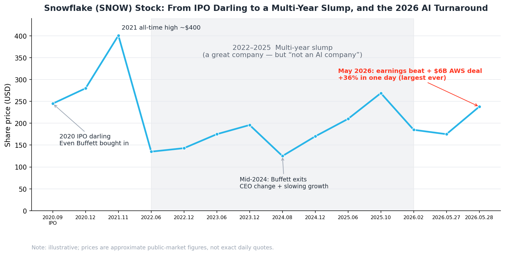
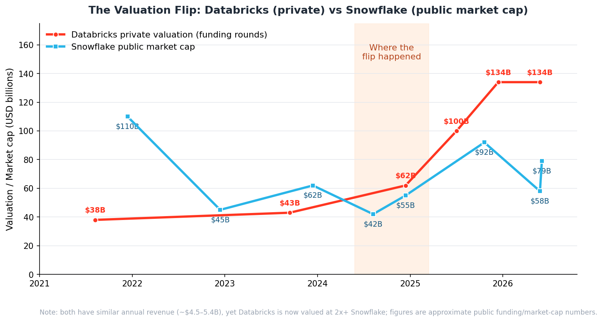
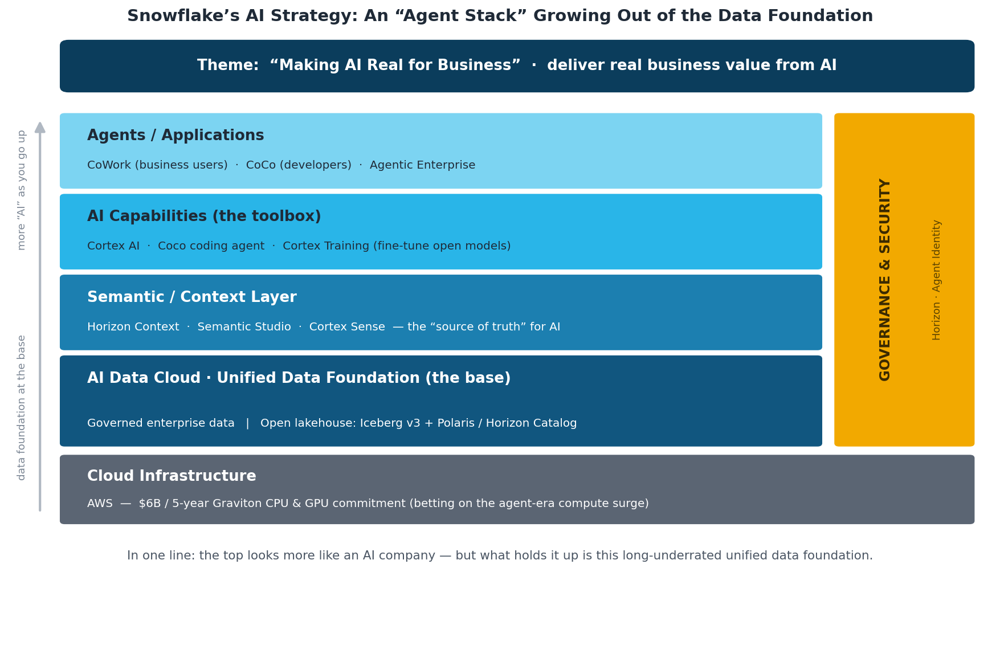
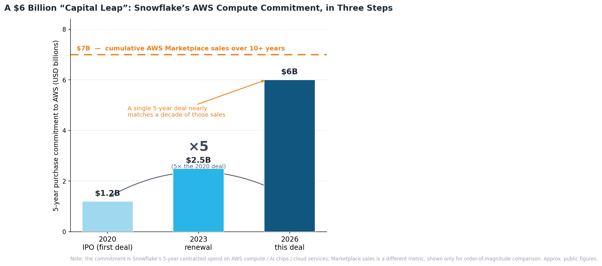

# Snowflake's AI Label Finally Sticks — and Its Data-Company Roots Finally Shine in the AI Era

## Notes from a longtime Snowflake hand on the Summit floor

By Tianfeng (CTO, MatrixOrigin; former Snowflake Chief Architect. Views are my own.)

I'm a longtime Snowflake hand. Back at the very first Summit in '19, it was lively enough — but nowhere near as electric as today. More than twenty thousand people, packing all of Moscone wall to wall. These two days at Summit '26, the line to get into the keynote wrapped around an entire floor; the expo was plastered with AI, agent, and Cortex signs everywhere you looked; and at coffee breaks, grab anyone at random and the first thing out of their mouth is "is your agent live yet?" Running into old colleagues, every conversation was about AI too — which coding tool is best, which model to pick, which token plan saves money. If you didn't know better, you'd have thought you'd wandered into OpenAI's or Anthropic's Summit.

Truth is, a few years ago this company didn't have nearly this much pep — the stock was listless for years, and when people met up they were still asking "is AI going to put us out of business?" But this time it's different: an earnings report a week ago had just jolted the stock up 36%, the whole event was riding that wave, and the air was full of that relaxed, slightly giddy "we're back" energy.

This year's theme is **"Making AI Real for Business"** — getting AI to truly land and create real value inside the enterprise. Line it up against the past few years' Summit themes and the trajectory pops right out: 2023 was generative AI just blowing up, with "large models will change everything" everywhere; 2024 was Cortex AI rolling out, themed "The Era of Enterprise AI"; by 2025 the theme was "Build the future of AI and apps," and they even put OpenAI's Sam Altman on stage — peak stargazing. Three years running, each theme more AI, each one floating a little higher into the clouds. But this year's "Making AI Real for Business" clearly **came down a notch toward the ground** — it's no longer flexing how amazing AI is; it lowers its head and says: enough with the vaporware, let's talk about how to actually make AI earn money in your real business. In a sentence: from gazing at the stars to looking down at the data under your feet. Grounded.

Watching my old employer stumble through these past few years, this is the year it finally got the AI label to stick for good. But what really struck me isn't how "AI" it's become — it's that after this whole long loop, **its "data company" pedigree is, for the first time, being thrown into relief by the AI era.**

Let's start with the big picture — this company's "EKG" over the past few years is basically all right here:

*▲ Snowflake's share price: an IPO-day high in 2020, an all-time high of ~$400 in 2021, a long 2022–2025 slump, then a +36% single-day move in May 2026 that completed its AI turn (illustrative; figures are approximate public-market numbers).*

## 1. The hot-shot years

Snowflake started life as a cloud data warehouse — a data warehouse in the cloud. Running a warehouse on the cloud was a pretty radical thing to do at the time, and it didn't just use the cloud — it redesigned a whole storage-compute-separation architecture around the cloud's characteristics. But to an enterprise, the pitch wasn't complicated: gather up all your scattered data in the cloud; when you need to query, spin up a warehouse; when you're done, shut it off; pay for what you use. And it did this with extraordinary elegance — the experience ran circles around the old Teradata / Oracle generation. Later it expanded step by step into Data Engineering, Machine Learning, Data Lake, and LLMs, but BI and analytics always remained its bread and butter.

In 2020 it IPO'd, and what a moment that was — one of the largest software IPOs ever, and the stock literally doubled on day one. The most talked-about part? **Even old man Buffett bought into the IPO.** You know Buffett is famously allergic to IPOs — the last time Berkshire bought into one you'd have to go back decades — and yet he made an exception and placed a bet on Snowflake. At the time that was basically a "value-investing seal of approval" stamped on Snowflake. The hot-shot, no contest.

(That's a story for later, though — Buffett dumped his entire ~$1B Snowflake position in mid-2024, and at a pretty awkward spot. More on that below.)

## 2. Then came a few genuinely rough years

The party didn't last long before Snowflake started to struggle. One, the U.S. went on a rate-hiking spree and the stock took huge pressure. Two, the Cloud Data Warehouse concept had gradually matured — the technology itself was no longer such a secret, the cloud vendors were all pushing similar products, and other startups were nipping at its heels, so growth kept slowing. Three, in 2022 OpenAI's ChatGPT pulled the entire industry's attention away, and from then on our whole field lived squarely in the LLM-led era — while Snowflake always gave off the feeling that it couldn't quite keep up with the new shifts.

Then in 2024, Snowflake's leadership changed too. The old commander Frank Slootman — a sales-driven CEO with a real killer streak — stepped down in early 2024, and the baton passed to Sridhar Ramaswamy: of Indian descent, out of Google advertising, who'd done his own AI-search startup Neeva that Snowflake had acquired, and who'd joined to run AI strategy in the first place. The signal in that handover was unmistakable: the board was going all in on AI.

By contrast, in the very same race, Snowflake felt like it had been left behind by the market — while its old nemesis, Databricks, became the new hot-shot.

Over these years DBK, riding a deep entanglement with the AI ecosystem plus a frankly insane run of AI acquisitions, saw its valuation rocket. By now, DBK's private-market valuation has hit north of $130B; meanwhile Snowflake, as a public company, saw its market cap fall to as low as $50–60B at one point. **Both companies' revenues actually hover around the same $4–5B range, yet DBK is valued at more than twice Snowflake.** The one that hasn't even gone public overtook the one that has — and not by a hair. For a former hot-shot, that's a hard one to swallow.

*▲ In 2021 Snowflake was still far ahead ($110B vs $38B); over a few years the two traded places — the flip landing across 2024–2025 — and today Databricks (~$134B) is worth more than 2x Snowflake.*

## 3. How this Databricks kid clawed its way to the top

I have to riff on this a bit, because this stretch of history is especially interesting — and it's the key to reading today's chessboard.

Don't let DBK's current glory fool you; its origins are fairly off-the-beaten-path. Snowflake's core founders came out of Oracle — pure-blooded data experts. DBK's founders were all Berkeley PhDs who'd led the launch of the Spark project, and Spark back then was meant as a "fast replacement" for Hadoop's clunky MapReduce. Databricks started out just helping people manage Spark clusters, serving a crowd of data scientists … and let me tell you, when DBK was getting off the ground, hardly anyone had even heard the term "data scientist."

That was its early awkwardness: the data-science, model-tuning crowd it served was, **first, broke (small budgets), and second, far from the business (the bosses had no clue what they were tinkering with).** And who did Snowflake serve? BI, reports, the dashboards CFOs love to look at — the kind of thing CEOs and CFOs happily pay for. So in those years, on the question of "whose budget is easier to get," Snowflake had a dimensional advantage over DBK.

But these Berkeley folks at DBK had one especially sharp move: **they slapped the "Data + AI" label on themselves early.** A dozen-plus years ago, to the old guard of data people that label looked like fuzzy, nonsensical positioning — are you a database, or a machine-learning platform? DBK also did plenty of "clout-chasing," and in its early days, to make noise, it latched onto Snowflake with all sorts of benchmark comparisons and long-distance jabs, milking attention like crazy. Last year the two even scheduled their Summits at the same time, which put a lot of people in the industry in an awkward spot.

But step by step, it actually blazed the concept into existence: first data lake, then lakehouse (a term it basically coined and popularized), and later the Data Intelligence Platform. When the LLM era arrived, its long string of AI acquisitions — MosaicML, Tabular (the Iceberg creators), Neon — bang, finally detonated that "Data + AI" label it had been sitting on for ten years.

In hindsight, DBK bet correctly on one thing: Data and AI would eventually converge. And Snowflake? On the data-warehouse front it's genuinely strong, no argument, but on the AI line it was never as aggressive as DBK, never as willing to push its chips in. The result — **the stock went years without really moving.** The market's logic is cold: you're a good company, but you're not an AI company.

## 4. Since last year, Snowflake has been grinding on AI for dear life

But it's not that Snowflake didn't see it — it just moved a little late.

From last year, the company clearly shifted gears. On one hand it piled on AI products like mad; on the other — and this part is especially interesting — it **turned around and started learning DBK's open-format lakehouse playbook**: embracing Iceberg, building an open catalog (the Iceberg v3-plus-Polaris bundle that just went GA), no longer clinging to its own closed format. At the same time it started chewing on unstructured data and building agents. In effect, it carefully went back and made up the homework on the very DBK playbook it once looked down on.

This year, the moves got bolder. At this Summit it basically **completed** the AI toolbox:

- Built a genuinely capable coding agent (the one internally called Coco), already GA;
- Heavily optimized semantic management — Horizon Context, Semantic Studio, and Cortex Sense as a combo punch — to make the context layer solid;
- Reworked the old Snowflake Intelligence into CoWork, an AI work agent aimed at business users.

Put these together and it's clear: Snowflake is no longer that "only-good-at-data-warehouse" company. Whatever AI is supposed to have, it now basically has. Snowflake's AI brand is Cortex. The coding agent is called Cortex Code — if you weren't paying attention you'd genuinely mistake it for Claude Code — and then CoWork makes the whiff of riffing-on-Anthropic even stronger.

Draw out this year's playbook and you roughly get the "stack diagram" below — and you'll notice every flashy AI capability ultimately stands on that bottommost layer, the "unified data foundation":

*▲ Snowflake's AI strategy: from AWS compute, up through a unified data foundation, the semantic layer and the AI toolbox, to the agents on top — with the whole stack boxed in by one unified governance-and-security framework.*

## 5. But its true color was always that powerful data platform — and in 2026 that's exactly the most valuable thing

At the start I mentioned this year's theme phrase, "Making AI Real for Business." In this section I want to break it down, because it's precisely the second half of this article's title.

Don't take that line as an ordinary marketing slogan. It nails the single biggest sore spot of the entire industry over the past two years: **AI demos are all dazzling, but once you drop them into a company's real business, how much actually lands?** That's the biggest question mark in the mind of Wall Street and of every CFO, and it's where this AI wave has drawn the most skepticism — a truckload of money burned, so where's the ROI?

And Snowflake's answer this time, boiled down, is one line: **data is the enterprise's most core asset; only when you use your own data well can your enterprise AI truly work.**

Filling out the toolbox matters, sure, but Snowflake's true color was never those flashy AI features — it's the **powerful data platform underneath, which has accumulated massive enterprise data and brought it under unified governance.** And the big thing that happened in 2026 is: **the whole industry finally figured it out — for an agent to land, it can't be separated from data, and especially not from an enterprise feeding it its own data.**

This was proven over and over this year. Why do all those agent demos flying around out there fall flat the moment they enter a company? Because they've never drunk this company's "water" — none of your business data, none of your definitions, none of your history. An agent that doesn't understand your company's data, however flashy, is just **a decoration.**

For an LLM to run well, what it needs is precise Context — and where does Context come from? From your own precise data. Fundamentally an LLM is a CPU, a thing that computes; but it still needs memory and disk to hand it the precise data, or its frantic computation is meaningless. And the word "Context," fundamentally, is just another manifestation of data.

So what is Snowflake holding? Exactly the truest, most complete, and most cleanly governed pile of data that countless large enterprises have accumulated on its platform over the years. That, right there, is its pedigree.

So once its AI toolbox matures — especially with that very strong coding agent as a base — the logic instantly closes: **take that whole agent-loop capability and run it directly on the enterprise's own data.** Picture it: the agent isn't making things up out in the wild; it's reasoning, writing code, and running workflows on an enterprise data foundation it can fully access and that's boxed in by governance. An agent grown on its own data, once accuracy climbs, is instantly a whole tier above those demos out there. And — all of it still runs inside one and the same governance framework: permissions, lineage, audit, not one missing.

This is exactly why I say that as Snowflake looks more and more like an AI company, its "data-company pedigree" is, **because of AI, being thrown into real relief for the first time.** AI isn't here to replace the data platform; AI is precisely what made "who holds clean, well-governed enterprise data" matter this much for the first time.

A "different roads, same destination" detail while I'm at it: look at DBK buying Neon to build Lakebase, and Snowflake buying Crunchy to build Snowflake Postgres — both rushing to shore up the transactional piece. Why? Because for an agent to actually get to work, read-only analytical data isn't enough; it needs state it can read and write in real time. Put plainly, both are scrambling to be that "data foundation" for the agent. (And on this front MatrixOrigin's foundation is actually more advanced than either of theirs, because OLTP capability lives natively in our MatrixOne too.)

## 6. $6 billion poured into AWS: a "great leap forward" in compute

There was another bombshell this time: **Snowflake committed to buying $6 billion worth of underlying compute, AI chips, and cloud infrastructure services from AWS over the next five years.** It's the largest infrastructure commitment in its history. Feel the magnitude — the deal it signed with AWS around its 2020 IPO was $1.2B, the 2023 renewal climbed to $2.5B, and this time it jumped straight to $6B, five times the original. More striking still: this single contract is nearly the same order of magnitude as the entire ~$7B in flow it sold through the AWS Marketplace over the past decade-plus.

A "capital great leap" this aggressive — two years ago, Wall Street would have been scared into voting with its feet and stomping the stock into the floor: "You, a company that's barely profitable, signing an outlay this big — are you nuts?" But this time it was bizarre: the market not only didn't treat it as a burden, it took it as good news and lifted the stock right along with it. Why? Mainly two reasons.

**First, compute consumption flipped from "passive" to "active" — and exponentially so.** In the old warehouse phase (the SQL phase), compute was linear — you fire a query, it computes once; you don't query, it idles; consumption follows human actions, passively. But step into the agentic-AI era and the logic flips entirely: an agent reasons, schedules, and orchestrates tasks for you 24/7 without rest; it "moves" on its own, and one agent can spin up a whole chain of agents. This kind of workload drives underlying compute consumption up not linearly but exponentially. Worth singling out here is Graviton — AWS's Arm CPU. Many assume AI just means burning GPUs, but when an agent hauls massive data around and orchestrates across multiple agents, what it eats is precisely general-purpose CPU compute. Meta is also scrambling for Graviton; Snowflake isn't the only one crowding onto this train. So that $6B is essentially Snowflake locking in, ahead of time, the compute flood of the agent era.

**Second, it has real order volume backing it up — this isn't a blank check.** The official numbers are right there: in 2025, customer consumption of Snowflake on AWS doubled, hitting $2 billion — driven mainly by the Cortex AI suite. With $2B a year of real consumption, plus the nearly $10B of RPO on its books (remaining performance obligations — contracted revenue that's signed but not yet recognized), up 38% year over year, as a hedge, it dares to sign a $6B underlying contract because it knows full well there's an even bigger book of signed business on the customer side to absorb it.

Put plainly, this isn't a gamble; it's a demand-backed "buy growth with procurement": I lock in both the volume and the price of compute ahead of time, and the more customers' agent consumption grows, the better this deal gets for me. What Wall Street understood is exactly this layer — Snowflake isn't betting on whether AI will come; it's telling you with cold hard cash that the agent compute flood is already rising on its customers' side. And look at the other side of the market: the companies pouring most madly into compute and underlying resources are the ones that are truly AI companies — Anthropic, OpenAI, and SpaceX are all about to go public, at trillion-dollar valuations, and every one of them grows more the more it spends on compute, and the more the market chases it.

## 7. The earnings and the stock have already cast the market's vote

Back to last week's Q1 earnings: AI-related revenue jumped sharply, and the CFO said outright on the call that Coco, the coding agent, was the biggest driver of the raised guidance. Product revenue rose 34% year over year, and operating margin genuinely widened a notch too. Investors took one look and voted with their feet — the stock leapt 36% in a single day, the biggest one-day gain since the IPO, filling back a big chunk of the hole dug out this year in one breath.

What is that 36% rising on? It's the market finally willing to **drag Snowflake a little further in the "AI company" direction.** It's no longer just that "great, but not AI" data warehouse; it's become the player that "holds the most valuable enterprise data, has now stocked the full AI toolkit, and dares to spend big locking in compute."

Back to that old man at the start.

When Buffett cleared out his Snowflake position in mid-2024, it was right in the ugliest stretch — the leadership change, slowing growth, getting pinned down by DBK. Purely as an investment, he didn't really lose, and it was even decisive. But looking back from today — he got off the train precisely on the eve of this company's "data pedigree about to be relit by AI."

These two days at Moscone, packed in among twenty thousand people, watching one AI announcement after another from the stage, what struck me was this: sometimes a company's deepest moat — you only see how deep it really is once the environment changes. Snowflake held its breath for years, and now it's finally caught it again.

It looks more and more like an AI company. But what lets it stand firm is still that old foundation — undervalued for quite a while — of a data company.
