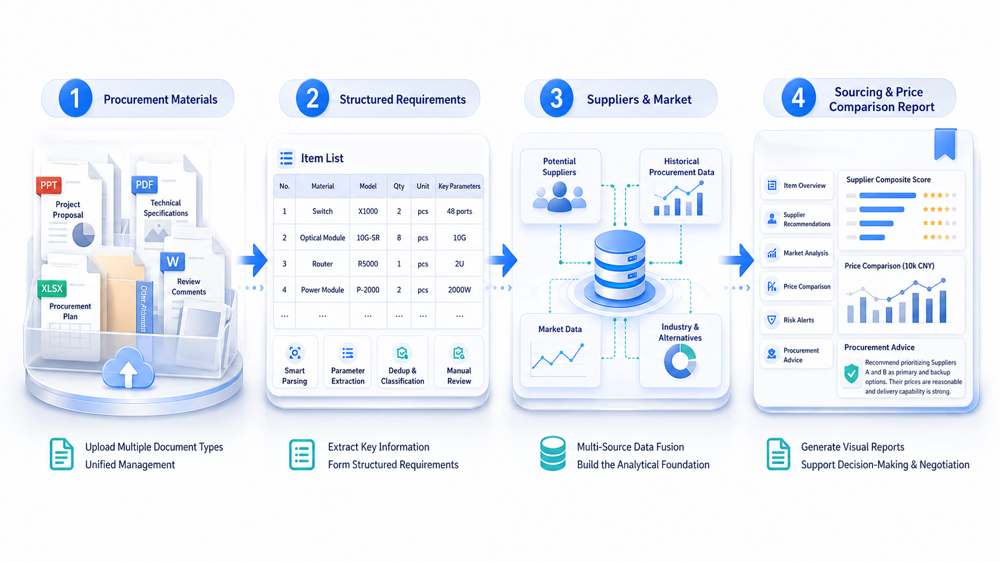
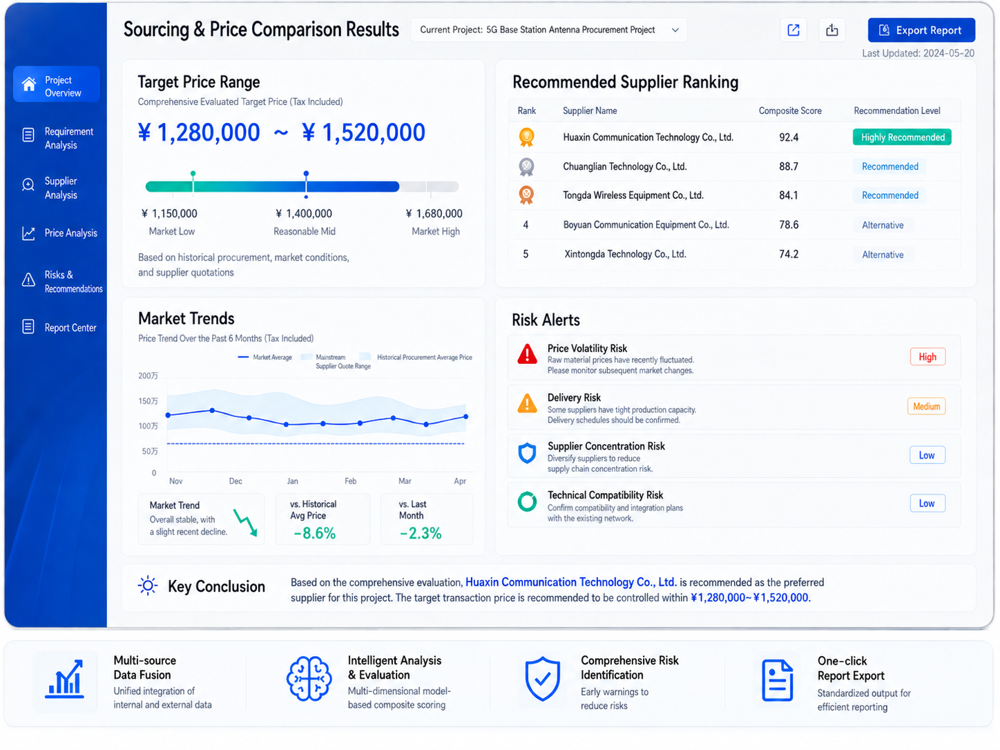

# When Sourcing and Price Comparison No Longer Depend on Manual Stitching: How MOI Turns Procurement Analysis into a Complete Intelligent Workflow

_From a pile of materials to an intelligent workbench, the real difficulty in procurement analysis has never been just too much information. It is that information cannot be quickly organized and used._

In many enterprises, sourcing and price comparison is a task that looks familiar but feels heavy in practice. After a procurement project starts, procurement staff often need to face large amounts of material: project initiation documents, technical specifications, procurement plans, historical project records, supplier lists, market price information, and more. The problem is not lack of data. The problem is that data is scattered across different files, systems, and standards. What truly consumes team time is often not the final report, but the long series of repetitive, trivial, and error-prone preparation tasks before that report.

So we often see the same scenario: procurement staff read documents while copying parameters; check internal historical projects while supplementing market information from external platforms; compare suppliers while worrying whether budget, price, delivery, and risk dimensions have been missed. The whole process depends heavily on experience and on individuals, and the results are difficult to reuse consistently.

## The Customer's Real Problem Is Not Just "Too Much Work"

If sourcing and price comparison is broken down, this type of business usually gets stuck at four levels.

First, procurement requirements are hard to structure quickly. Procurement materials are mostly PPTs, PDFs, Word documents, Excel files, and sometimes images and scanned copies. Project names, target items, specifications, quantities, and key technical parameters are often scattered across different pages, tables, and attachments. Manual extraction is slow and easy to miss.

Second, there is a lot of data, but it is hard to use in a unified way. Internally there are historical procurement projects, potential suppliers, secondary procurement prices, and budget data. Externally there are market trends, supply-demand changes, and alternative models. The problem is that this data does not naturally exist in one view, nor does it naturally form directly comparable analysis results.

Third, the analysis process lacks consistency. Different procurement staff may approach the same type of sourcing and price comparison with completely different focus areas, analytical standards, and output formats. Some focus on price, some on supplier qualifications, and others on experience-based judgment. The quality of the final report can vary greatly.

Fourth, result output is slow and weak in reuse. Much time is spent on collection and organization, while time for judgment and decision-making is compressed. Even after a report is created, its rules, standards, and data workflow are hard to preserve as reusable capabilities for the next project.

## The Core Difficulty Is That Procurement Analysis Has Not Formed a Complete Workflow

On the surface, this is a document parsing problem, a data access problem, and a report generation problem. But from a business perspective, it is a workflow problem from raw materials to procurement judgment. Solving only one point cannot truly make sourcing and price comparison lightweight.

If there is only document parsing without subsequent data fusion and analysis, procurement staff still need to query systems and stitch together results themselves. If there is only supplier recommendation without accurate requirement parameter extraction, the recommendation basis may be wrong. If there is only final report generation, while upstream data governance and rule judgment remain disconnected, the report can easily become material that is well written but weakly supported.

What customers truly need is not one or two isolated functions, but a capability that connects requirement parsing, data connection, rule judgment, intelligent analysis, and result output into a closed loop.

_For procurement teams, the real value is not a single feature, but a complete loop from documents to structured requirements, then to supplier and price analysis, and finally to report output._

## MOI's Solution: Turning Sourcing and Price Comparison into an Orchestratable, Traceable, and Reusable Intelligent Process

MOI does not simply build a procurement assistant that can chat. Instead, it breaks sourcing and price comparison into executable business steps and reorganizes them into a complete intelligent workflow.

1. **First, turn unstructured requirements into structured input**
   After procurement staff upload project initiation PPTs, technical specifications, procurement plans, and other materials, MOI uses multimodal document parsing to automatically identify key information such as project names, target items, specifications, models, quantities, and parameters, then organizes them by material dimension. Users can continue to manually correct, supplement, and confirm the information, ensuring that subsequent analysis is based on correct requirements.

2. **Bring scattered data sources into the same analysis workflow**
   MOI does not stop at reading documents. It continues to use confirmed target item information as the analysis thread, linking internal data such as historical procurement projects, potential suppliers, secondary procurement prices, and historical budgets, while combining external market trends, industry resources, and alternative model information to form a unified analysis view for the current project.

3. **Use business rules and Agent capabilities for real comparison and recommendation**
   MOI builds supplier profiles across dimensions such as historical performance, market share, overall strength, and key capabilities, and conducts multidimensional evaluations of different suppliers. It also combines historical procurement prices, budget prices, market prices, and quotation samples to form target price ranges, risk alerts, and procurement strategy recommendations.

4. **Organize results into outputs the business can actually use**
   In the end, procurement staff do not see a pile of scattered data, but a clearly structured and conclusion-oriented Sourcing and Price Comparison Report that can be reviewed and exported. It includes target item summaries, supplier recommendations, market analysis, price comparisons, risk alerts, and procurement suggestions.

## MOI Does More Than Analysis: It Organizes Capabilities

When many people think about AI applications, they imagine a model that answers final questions. But in enterprise scenarios such as sourcing and price comparison, what truly matters is not whether the model can answer, but whether the platform can organize data, rules, and intelligence into a stable business process that can land in production. This is exactly where MOI's value lies.

MOI acts both as the data entry point and as an intelligent orchestration platform. On one hand, it can receive raw business materials and turn information in documents, tables, and images into structured input. On the other hand, it can orchestrate internal and external data sources, rule engines, model reasoning, report generation, and other capabilities into one workflow, giving every step clear inputs, processing logic, and outputs.

More importantly, MOI makes the process traceable and reusable. After one sourcing and price comparison task ends, what remains is not only a final report, but a reusable set of rules, data mappings, prompt logic, and analysis paths. As usage increases, what the enterprise accumulates is not only more reports, but increasingly mature procurement intelligence capability.

_When requirements, data, rules, and analysis are organized together, the final output is no longer just charts, but procurement results that directly support judgment and negotiation._

## What Are the Most Direct Benefits for Customers?

First, efficiency improves. Work that previously required procurement staff to switch back and forth between documents, systems, and web pages can now be completed through one unified entry point. Requirement parsing, data query, analysis organization, and report output are all significantly shortened.

Second, analysis quality becomes more stable. After MOI standardizes key steps such as target item identification, supplier evaluation, price comparison, and risk alerts, results no longer depend excessively on individual experience. Consistency and completeness of outputs improve significantly.

Third, decision evidence becomes more sufficient. In the past, many procurement judgments stopped at "experience suggests this is more suitable." Now, the team can answer more clearly: why this supplier is recommended, why the target price falls within this range, which risks require attention, and which data supports the strategic suggestion.

Fourth, capabilities can be accumulated. For enterprises, the most valuable outcome is not just doing less manual organization a few times. It is gradually turning procurement analysis that used to depend on individual experience into platform capability, rule capability, and data capability. This means that when similar projects arise in the future, teams can move faster and judge more steadily.

## Final Notes

Sourcing and price comparison has never been a simple price-checking action. It is complex work spanning requirement understanding, data integration, supplier evaluation, risk judgment, and strategy output. The more complex it is, the less it should rely on manual stitching. The more critical it is, the more it needs a truly connected intelligent workflow.

MOI's significance lies in building this workflow: procurement materials are no longer just materials, data is no longer just data, and reports are no longer just results. Instead, the entire procurement analysis process becomes a sustainable and reusable intelligent capability for the enterprise.

When sourcing and price comparison changes from "one person doing many things alone" to "a platform organizing data and intelligent capabilities to collaborate," the enterprise gains not only a faster report, but a stronger procurement judgment system.
