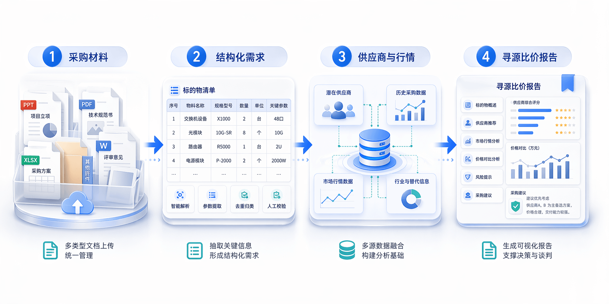
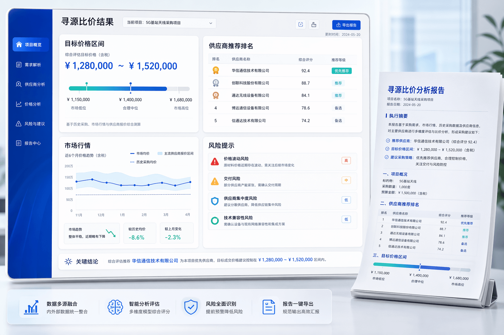

# 当寻源比价不再靠“人肉拼接”，MOI 如何把采购分析变成一条完整智能链路

_从“材料堆”到“智能工作台”，采购分析的真正难点从来不只是信息太多，而是信息无法被快速组织和利用。_

在很多企业里，寻源比价是一件“看起来熟悉，做起来很重”的工作。一个采购项目启动后，采购人员往往先要面对立项材料、技术规范书、采购方案、历史项目记录、供应商名单、市场价格信息等大量资料。问题不是没有数据，而是数据散落在不同文件、不同系统、不同口径之中。真正消耗团队时间的，往往不是最后那份报告，而是报告之前那一长串重复、琐碎、容易出错的整理工作。

于是我们经常看到同一种场景：采购人员一边翻文档，一边抄参数；一边查内部历史项目，一边去外部平台补行情；一边对比不同供应商，一边又担心预算、价格、交付、风险这些维度有没有漏掉。整个过程高度依赖经验，强依赖个人，结果也很难稳定复用。

## 客户真正遇到的问题，不只是“工作量大”

如果把寻源比价拆开来看，这类业务通常会卡在四个层面。

第一，采购需求难以快速结构化。采购材料大多是PPT、PDF、Word、Excel，甚至夹杂图片和扫描件。项目名称、标的物、规格型号、数量、关键技术参数往往分散在不同页、不同表、不同附件里，人工提取既慢又容易漏。

第二，数据虽然很多，但很难被统一利用。内部有历史采购项目、潜在供应商、二采价格、预算数据，外部还有市场行情、供需变化、替代型号等信息。问题在于这些数据并不天然在一个视图里，更没有天然形成一套可直接比较的分析结果。

第三，分析过程缺乏一致性。不同采购人员做同一类寻源比价，关注点、分析口径和输出方式可能完全不同。有人偏重价格，有人偏重供应商资质，有人重经验判断，最后形成的报告质量波动很大。

第四，结果产出慢，而且复用性弱。很多时间被花在“收集”和“整理”上，真正用于判断和决策的时间反而被压缩。即使做出了一版报告，里面的规则、口径和数据链路也很难沉淀成下一次还能复用的能力。

## 难点的本质，是采购分析没有形成一条完整链路

从表面上看，这是文档解析问题、数据接入问题、报告生成问题；但从业务本质上看，它是一个“从原始资料到采购判断”的链路问题。只解决其中一个点，并不能真正把寻源比价做轻。

如果只有文档解析，没有后续的数据融合与分析，采购人员依然要自己继续查系统、拼结果；如果只有供应商推荐，没有把需求参数抽准，推荐的基础就可能偏掉；如果只有最终报告生成，而前面的数据治理与规则判断没有打通，报告也很容易沦为一份“写得漂亮但依据不稳”的材料。

所以，客户真正需要的，不是一两个孤立功能，而是一套把需求解析、数据连接、规则判断、智能分析和结果输出串成闭环的能力。

_对采购团队来说，真正有价值的不是某一个单点功能，而是“从文档到结构化需求，再到供应商与价格分析，最后到报告输出”的完整闭环。_

## MOI 给出的解法：把寻源比价变成一个可编排、可追溯、可复用的智能流程

MOI 的切入点，不是简单做一个“会聊天的采购助手”，而是把寻源比价这件事拆成可落地的业务环节，再把这些环节重新组织成一条完整的智能流程。

1. **先把非结构化需求变成结构化输入**
   采购人员上传立项PPT、技术规范书、采购方案等材料后，MOI 通过多模态文档解析能力，自动识别项目名称、标的物、规格型号、数量、参数等关键信息，并把它们按物料维度整理出来。用户可以继续人工修正、补充和确认，保证后续分析建立在正确的需求基础之上。

2. **把分散的数据源拉到同一条分析链路里**
   MOI 不是停留在“把文档读出来”，而是继续把确认后的标的物信息作为分析主线，联动内部历史采购项目、潜在供应商、二采价格、历史预算等数据，同时结合外部市场行情、行业资源和替代型号信息，形成面向当前项目的统一分析视图。

3. **用业务规则和智能体能力来做真正的比较与推荐**
   MOI 会围绕历史表现、市场份额、总体实力、关键能力等维度构建供应商画像，对不同供应商进行多维评价；同时结合历史采购价、预算价、市场价和报价样本，形成目标价格区间、风险提示和采购策略建议。

4. **把结果组织成业务真正能用的输出**
   最终，采购人员看到的不是一堆散乱数据，而是一份结构清晰、结论明确、可以继续审阅和导出的《寻源比价报告》：里面既有标的物概述，也有供应商推荐、市场分析、价格对比、风险提示和采购建议。

## MOI 在其中发挥的作用，不只是“做分析”，更是把能力组织起来

很多人理解 AI 应用时，容易把它看成一个最终回答问题的模型。但在寻源比价这种企业级场景里，真正重要的不是模型会不会回答，而是整个平台能不能把数据、规则和智能能力组织起来，形成稳定可落地的业务过程。这里恰恰是 MOI 的价值所在。

MOI 既承担了数据入口的角色，也承担了智能编排的平台角色。一方面，它能够接住原始业务材料，把文档、表格、图片中的信息转成结构化输入；另一方面，它又能够把内部与外部数据源、规则引擎、模型推理、报告生成等能力统一编排在一个流程里，让每一步都有明确输入、处理逻辑和输出结果。

更关键的是，MOI 让这个过程具备了可追溯和可复用的能力。一次寻源比价结束之后，留下的不只是一个最终报告，而是一整套可以复用的规则、数据映射、提示词逻辑和分析路径。随着使用次数增加，企业沉淀下来的不只是更多报告，而是越来越成熟的采购智能能力。

_当需求、数据、规则和分析被组织到一起，最终呈现的就不再只是“图表”，而是可直接支撑判断与谈判的采购结果。_

## 对客户来说，最直接的收益是什么？

第一，是效率提升。原来需要采购人员来回切换文档、系统、网页完成的工作，现在可以在统一入口中完成。需求解析、数据查询、分析整理和报告输出的时间都被显著压缩。

第二，是分析质量更稳定。MOI 把标的物识别、供应商评价、价格比较、风险提示等关键环节标准化之后，不再过度依赖个别人的经验，输出结果的一致性和完整性会明显提升。

第三，是决策依据更充分。过去很多采购判断停留在“经验上觉得这样更合适”，现在可以更清晰地回答：为什么推荐这个供应商、为什么目标价格落在这个区间、哪些风险需要重点关注、策略建议基于哪些数据。

第四，是能力可以沉淀。对于企业来说，最有价值的不只是少做几次手工整理，而是把原本靠个人经验完成的采购分析过程，逐步沉淀成平台能力、规则能力和数据能力。这意味着未来做类似项目时，团队可以跑得更快、判断得更稳。

## 写在最后

寻源比价从来不是一个单纯的“查价格”动作，而是一项横跨需求理解、数据整合、供应商评估、风险判断和策略输出的复杂工作。越是复杂，越不能依赖“人肉拼接”；越是关键，越需要一条真正打通的智能链路。

MOI 的意义，就在于把这条链路搭起来：让采购材料不再只是材料，让数据不再只是数据，让报告不再只是结果，而是让整个采购分析过程真正变成企业可持续复用的智能能力。

当寻源比价从“一个人埋头做很多事”，变成“平台组织数据和智能能力来协同完成”，企业得到的也就不只是更快的一份报告，而是更强的一套采购判断系统。
