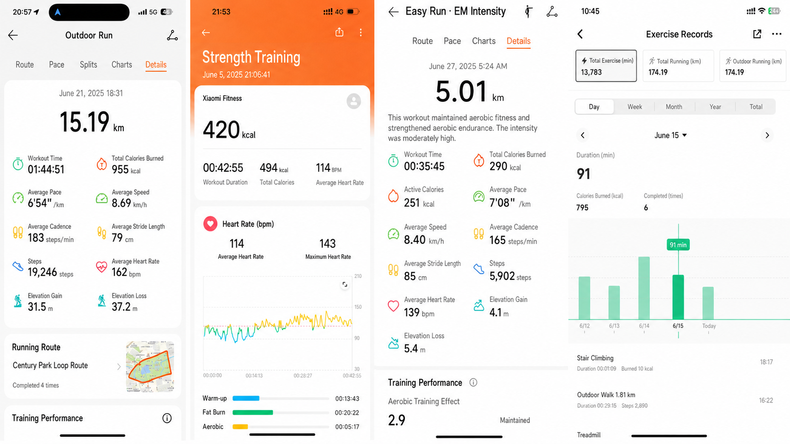
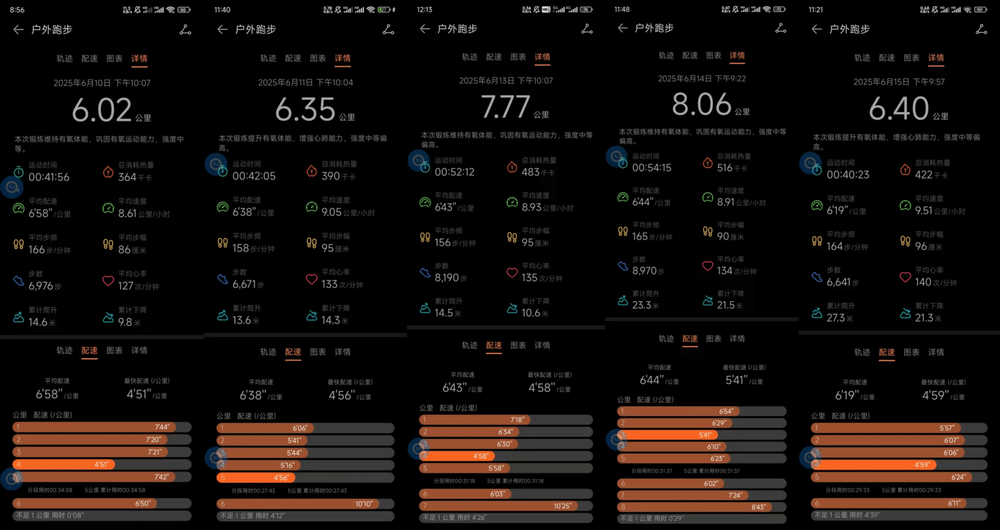
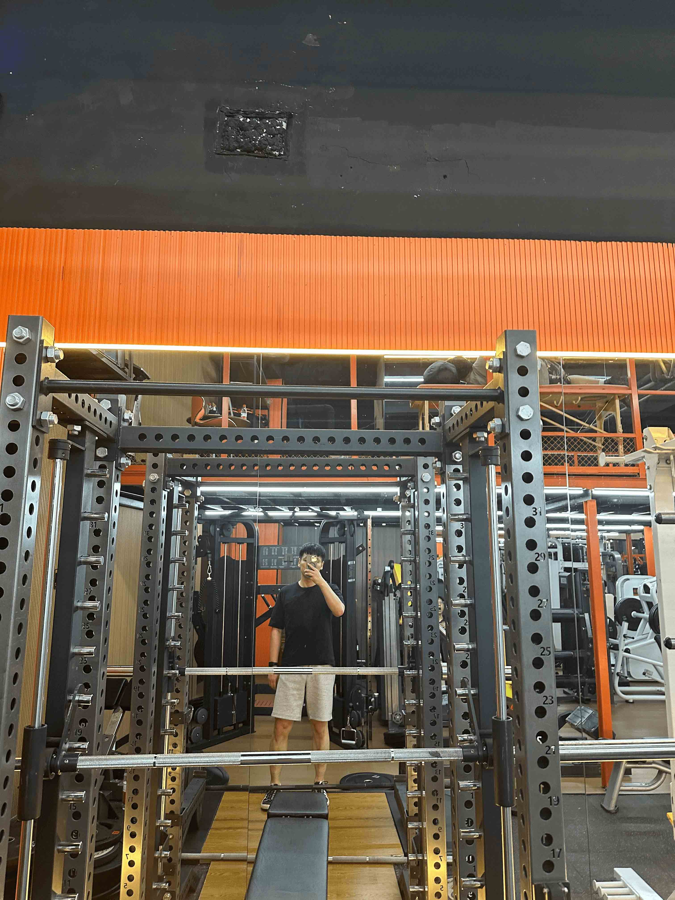
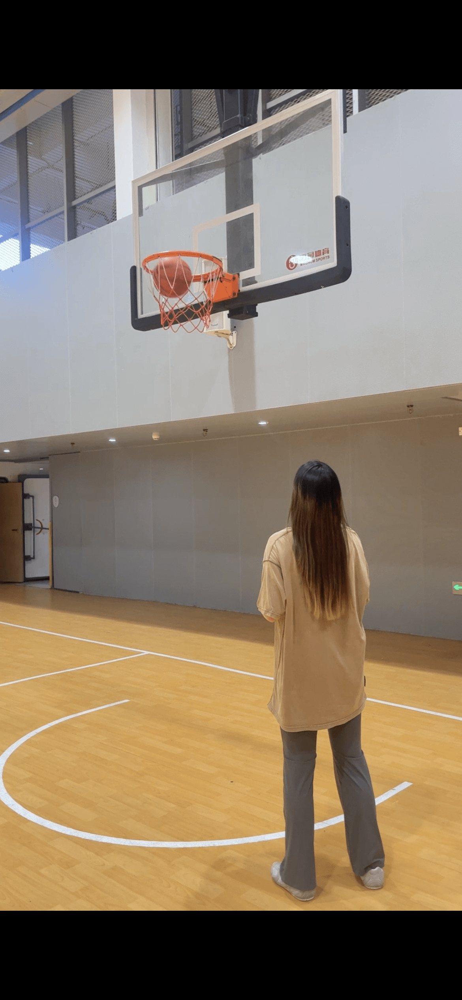
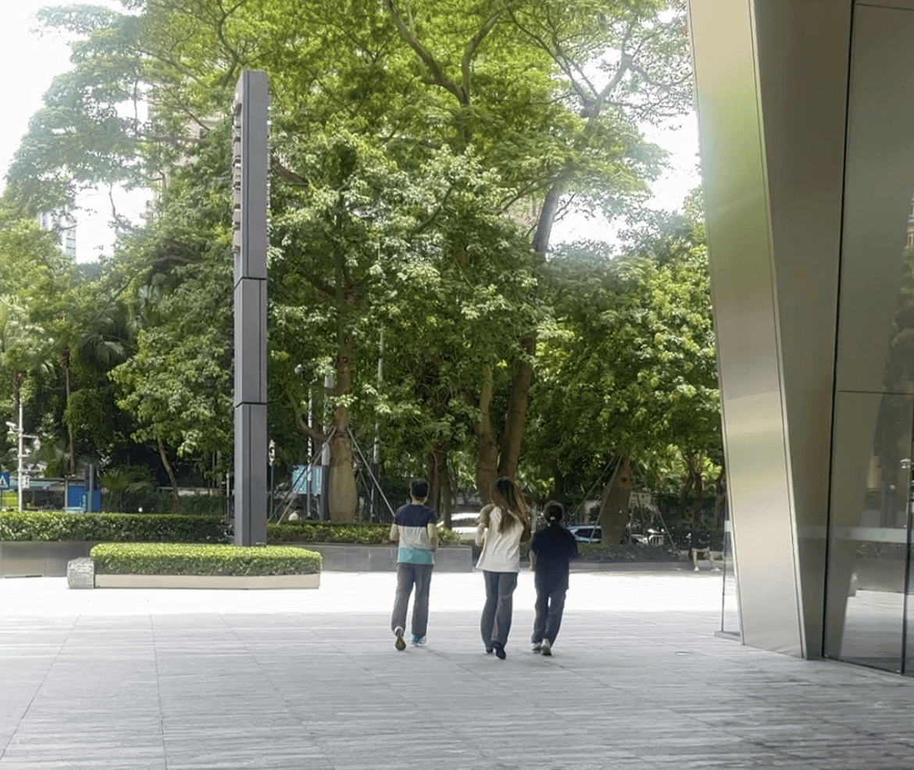

June brought not only cicadas and blazing sun, but also the energetic presence and sweat of MOers. The month-long Sports Month has officially come to a close. This was not a competition, but a collective journey centered on health, persistence, and vitality. Let us relive this sports celebration for everyone.

### Passion Behind the Numbers

More than 20 teammates participated enthusiastically, crossing departmental boundaries for the same goal: get moving.
Nearly 300 check-ins were a promise and a breakthrough to oneself.
More than 13,000 minutes of total exercise time captured countless mornings, evenings, weekends, sweat, and laughter.

No limits, endless possibilities: from morning walks in the sunrise, after-work runs, badminton battles, and basketball collisions, to weight training in the gym and free rides on city greenways. Walking, running, badminton, basketball, weight training, cycling, and more. Every colleague expressed the infinite possibilities and pure joy of exercise in the way they love most. There are no fixed answers on the sports field. As long as you move, it is a full score.

### Medals of Persistence and Teamwork

Every act of persistence deserves applause. Whether you were a full-attendance "perseverance champion" or a newcomer taking your first steps, every teammate who kept exercising and surpassing themselves was one of the brightest stars in June. Every drop of your sweat added to health and vitality.

The light of teamwork shone on the road ahead. We were delighted to see spontaneously formed exercise groups, such as the outstanding running club, where members encouraged one another and moved forward together. This spontaneous cohesion and warm companionship were among the most precious outcomes of the Sports Month. Exercise brought us closer and took us further.

### Rewards Are Recognition and Encouragement

To honor this widespread enthusiasm and steady effort, MO rewarded representatives who showed outstanding persistence and teamwork, including individuals with top points and active clubs, with sports gear and funds for team activities. These rewards were both recognition of excellence and sincere encouragement for everyone to keep exercising.

### Beyond the Event, Into Daily Life

June Sports Month has ended, but the spark it lit continues to burn:

It let us experience the dopamine released by exercise, a natural source of joy.
It gave us the irreplaceable sense of achievement after challenging ourselves.
It showed us the warmth of standing together as a team, the strongest support on the road to persistence.
It strengthened our belief that health is one of the most worthwhile investments in life, and that exercise is the best recipe for staying energetic.
It also became a starting point, encouraging everyone to turn exercise from an "event task" into a "life habit." There is no need to pursue extremes. What matters is consistency. Let exercise become a way to relax during work breaks, a weekend or holiday choice, and a daily nourishment for body and mind.

### Keep Moving, Stay Healthy Together

Thank you to every MOer who participated. Your actions proved that the company is not only a battlefield for hard work, but also a supporter and companion for healthy living. The closing of Sports Month is not the end, but the beginning of a new healthy lifestyle.

May the sports enthusiasm awakened in June continue to light up our every day. Whether it is simple stretching next to your desk, a game with colleagues after work, or running and cycling alone, keep your passion alive and keep moving so that health and vitality become our shared background.

MO will keep moving with everyone and stay healthy together.
