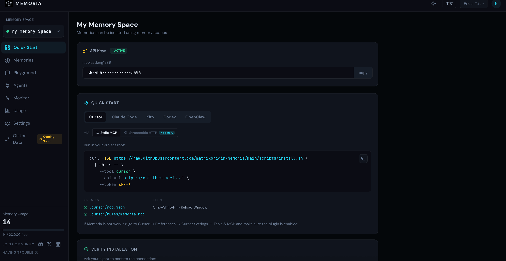
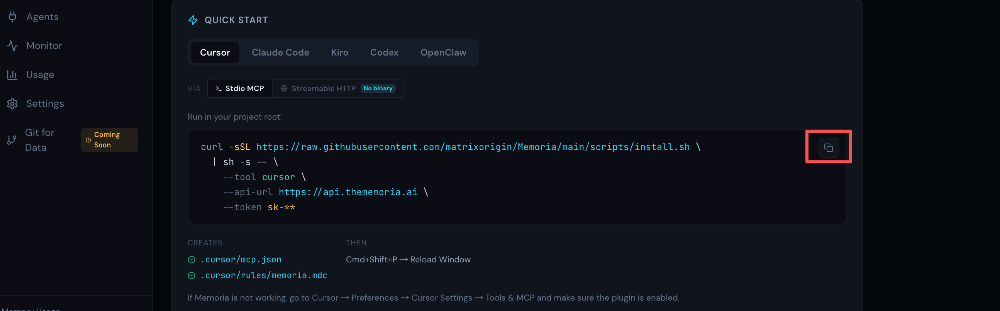
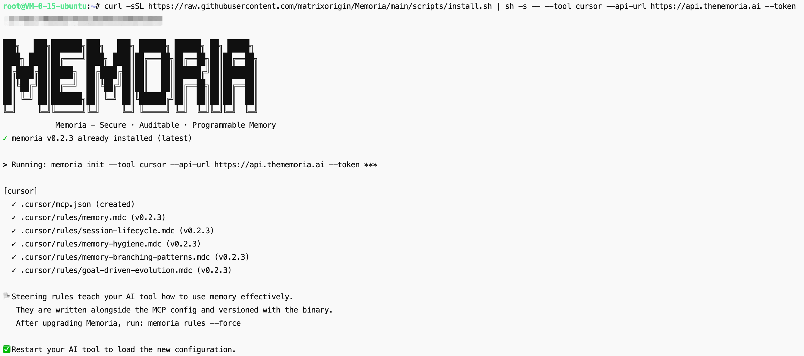
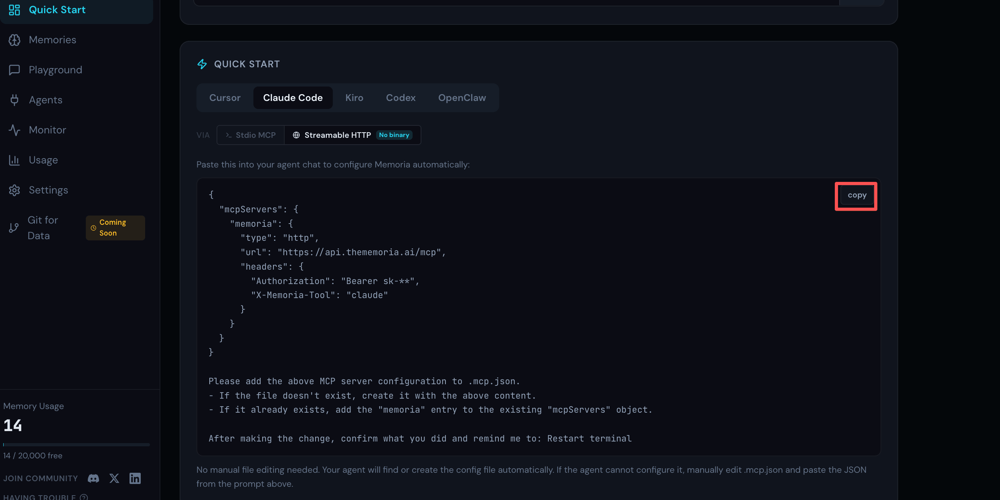
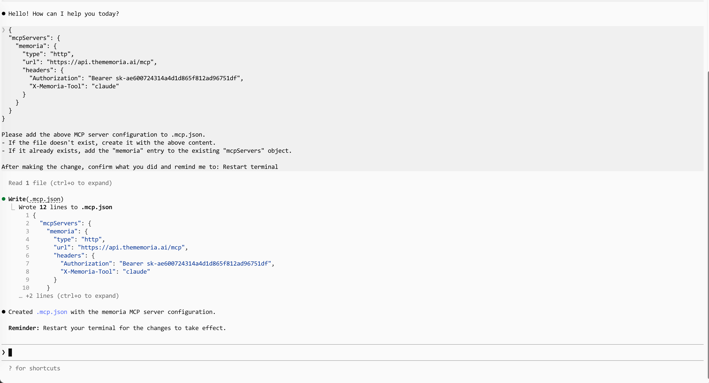
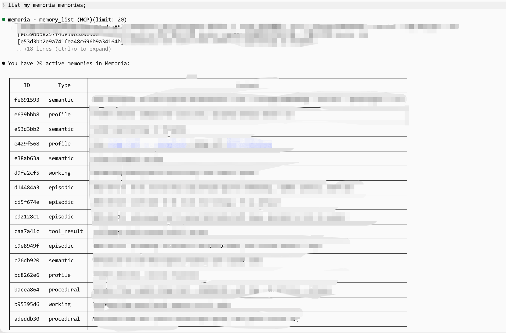

# Get Started in 1 Minute: Connect Your Coding Agent to Memoria

> Persistent memory with a single command. Compatible with Cursor, Claude Code, Codex, and Kiro.

---

## Why You Need It

Coding Agents are powerful, but they forget everything.

**Long tasks are forced to stop**: A complex refactoring task may span multiple sessions. The Agent crashes, the context window fills up, or you simply close your laptop. When you come back, the Agent has no idea what it was doing, which approaches were tried, or what decisions were made. You can only start over.

**You use multiple Agents**: Many developers switch between tools such as Cursor, Kiro, and Claude Code to compare coding quality. But every time you switch, you have to repeat the same context: project conventions, preferred libraries, and architectural decisions. This is tedious and error-prone.

Memoria solves both problems. It provides a shared persistent memory layer for all coding Agents. Information stored in one session can be accessed in the next session and by any Agent.

**The entire setup takes less than 1 minute**: log in, copy your key, paste a snippet, and you are done.

---

## Step 1: Get an API Key and Install the Script

Visit [thememoria.ai](https://thememoria.ai), log in with one click (GitHub or Google account), and copy your API key from the console.

No database configuration is required, and no backend service needs to be run.



---

## Step 2: Connect Your Agent

There are two installation methods: run a one-line command in the terminal, or paste a configuration snippet into the Agent chat window (no binary installation required).

### Method A: One-Line Terminal Command (Stdio MCP)

Copy the script for the corresponding Agent and run it in the project root directory. Cursor is used as an example:

**Cursor**

```bash
curl -sSL https://raw.githubusercontent.com/matrixorigin/Memoria/main/scripts/install.sh \
  | sh -s -- \
  --tool cursor \
  --api-url https://api.thememoria.ai \
  --token sk-xxxxx
```





After the command finishes, reload or restart your coding Agent.

### Method B: Paste into the Agent Chat Window (Streaming HTTP, No Binary)

Copy the JSON configuration from the quick-start page on [thememoria.ai](https://thememoria.ai) and paste it directly into the Agent chat window. The Agent will automatically write it into the configuration file for you. Claude Code is used as an example:

**Claude Code**



```
{
  "mcpServers": {
    "memoria": {
      "type": "http",
      "url": "https://api.thememoria.ai/mcp",
      "headers": {
        "Authorization": "Bearer sk-**",
        "X-Memoria-Tool": "claude"
      }
    }
  }
}

Please add the MCP server configuration above to the .mcp.json file.
- If the file does not exist, create it and write the content above.
- If the file already exists, add the "memoria" entry to the existing "mcpServers" object.

After the modification is complete, tell me the result and remind me to restart the terminal.
```



---

## Step 3: Verify That It Works

Send the following instruction to your Agent:

```
List my Memoria memory contents
```

If Memoria MCP is connected successfully, the Agent will call the tool and return the number of your memory entries. It may be empty on first use.

> **Seeing an empty list on first use?** Go to the [Memoria Playground](https://thememoria.ai/playground) and store a few simple memories first, such as your name, commonly used programming languages, or the project you are developing. Then return here and send the instruction to the Agent again. You will see that it can retrieve the content you stored, indicating that the end-to-end connection is working.



---

## All Set

Persistent memory is now available with a single command. You no longer need to repeat context, and context across sessions and Agents will not be lost.

Now you can confidently complete that refactoring task across three sessions. Your Agent will remember where you paused last time.
