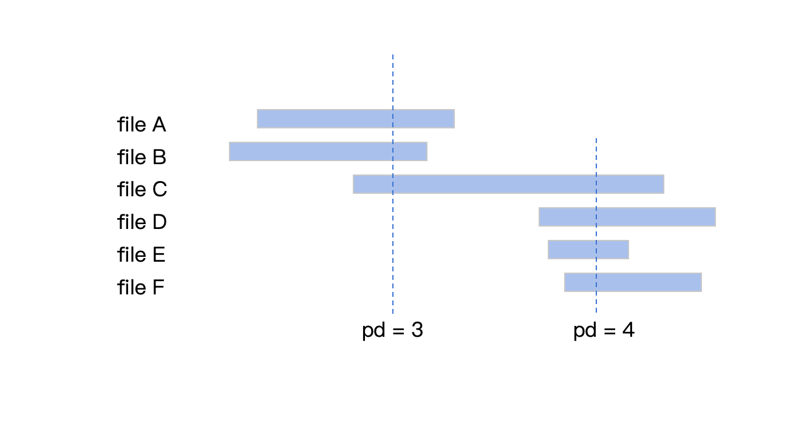
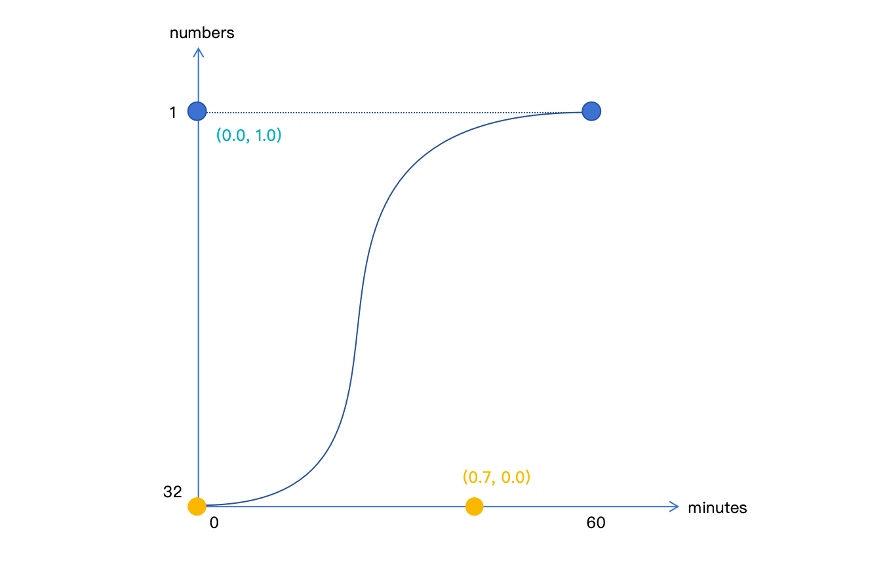
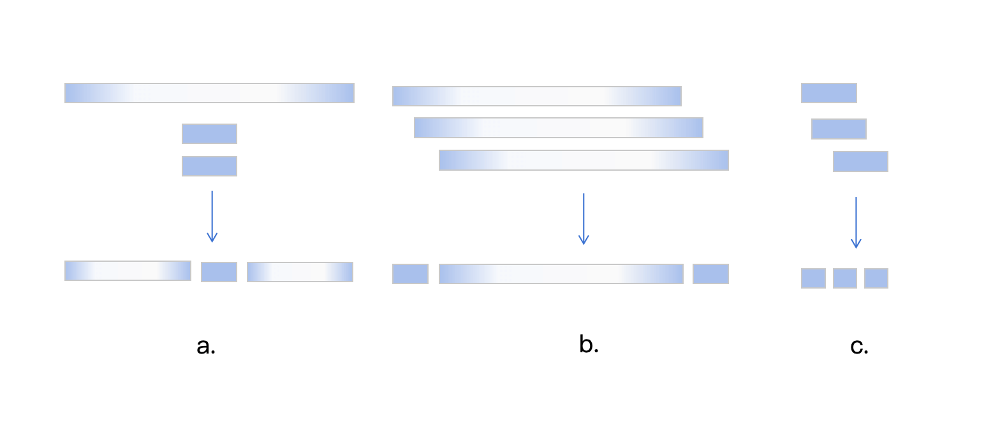
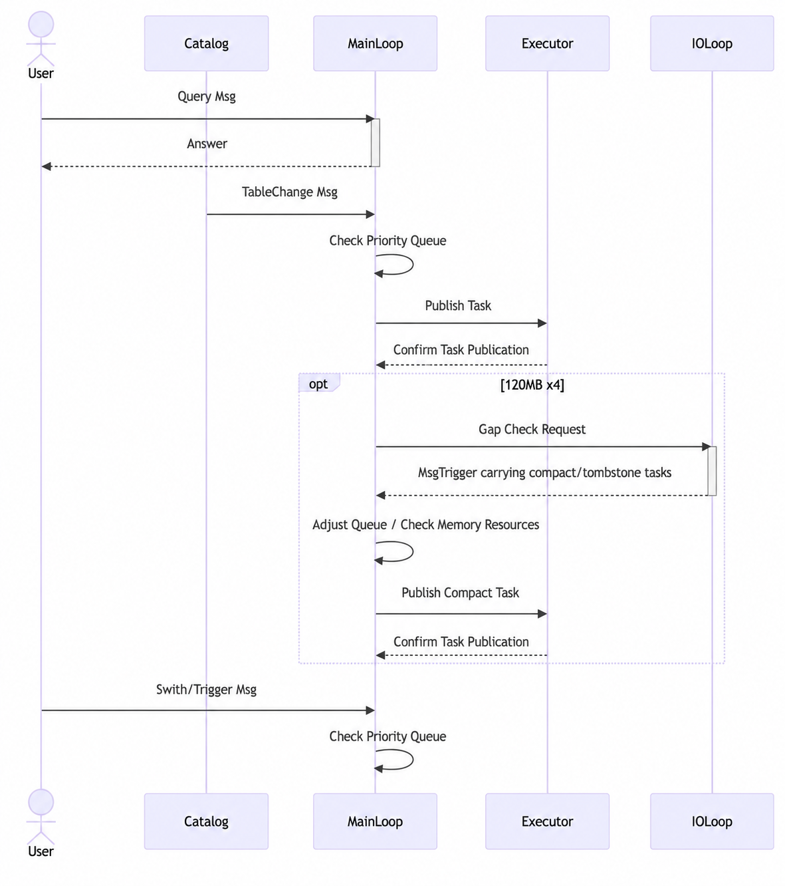
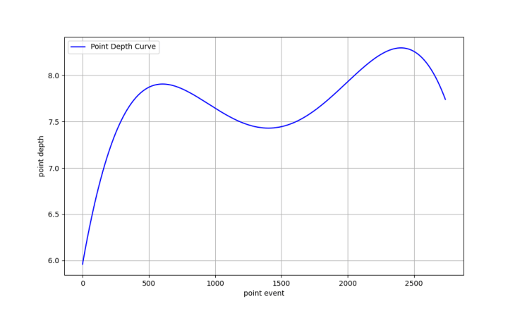

LSM-like (Log-Structured Merge Trees) databases usually rely on data merging to clean storage hollows, reduce file overlap, maintain data ordering, and improve query efficiency. Existing merge scheduling technologies generally use fixed-threshold trigger strategies or manual intervention. They use histograms to collect file overlap statistics, such as discrete interval distribution of point depth (pd).

However, these solutions face significant limitations in HTAP (Hybrid Transactional/Analytical Processing) scenarios:

1. Insufficient automation for non-KV scenarios: traditional methods rely too much on database administrators manually identifying merge timing and triggering tasks. In non-KV scenarios in particular, when flushed file sizes are uncontrollable, the operations burden increases sharply.
2. Weak adaptation to HTAP scenarios: frequent random updates from TP data rapidly degrade data distribution, causing sharp increases in hollow rate and overlap. At the same time, low-density data flowing into lower levels triggers chain merges, causing excessive write amplification.
3. Inefficient data distribution representation: commonly used histograms require at least 16 parameters to describe file overlap states. These parameters are redundant and cannot restore distribution shape features such as peak location and fluctuation trends, leaving operations decisions without precise evidence.

These limitations severely constrain automated operations capability and resource utilization efficiency in HTAP scenarios. MatrixOne improves storage optimization in four areas:

1. An improved merge strategy that introduces concepts such as independent level 0, span, and hollow analysis to control write amplification in HTAP scenarios while maintaining data health.
2. Event-driven merge scheduling, which avoids polling overhead, focuses more on active tables, and provides more flexible operations interaction.
3. Polynomial fitting-based data representation. By replacing histograms with linear fitting, MatrixOne can show data overlap distribution shape, peak location, fluctuation trends, and other information more intuitively with fewer parameters.
4. A Merge simulator. Through collection and simulation, it can run experiments based on real data and continuously improve merge strategies.

### Optimization Strategy

Before introducing MatrixOne's current optimization strategy, several concepts need to be clarified. First are existing industry concepts:

- Data file: a file storing written data. The metadata of each file stores the maximum and minimum values of the table's sort key. Metadata usually resides in memory.
- Merge file level: data files are organized by level. As levels increase, the expected gap between the maximum and minimum values of a single file becomes smaller and tighter.
- File overlap: the max-min intervals of two files intersect.
- Point depth (pd): for a table containing multiple files, the depth of a point value is defined as the number of files the value passes through. For a single file, pd is defined as the maximum depth among all values it contains. A single file without overlap with other files has pd of 1.
- Overlap count (oc): the number of files that overlap with a file. A single file without overlap with other files has oc of 0.
- Constant file: a file whose maximum and minimum values are the same. Such files usually no longer participate in data merges because they are already in the tightest state.



Next are new concepts added in MatrixOne for HTAP scenario optimization:

- Level 0: In MatrixOne, table data is organized as much as possible into 128 MB files. Smaller files are placed in level 0, which uses an independent merge strategy.
- Cluster: Within the same level, if one group of files and another group of files have no overlap at all, they are separate clusters.
- Span: $span = \frac{oc}{pd}$. Files are divided by span into wide (10 < span), medium (2 < span < 10), and narrow (span < 2).
- Tombstone file hollow rate: tombstone files record which rows in data files have been deleted. If the data file corresponding to a row has itself been deleted, this is called a miss. Missed rows form hollows in tombstone files. Therefore:
  $$
  vacuumPercent = \frac{missedRowCount}{totalRowCount}
  $$
- Data file hollow score: when rows in a data file are deleted, hollows are also formed. When calculating the hollow rate of a data file, merge possibilities must be considered. If this file can easily trigger a normal merge, there is no need to process it separately. Therefore, two factors are considered: size and level. The smaller the size and the lower the level, the easier it is to merge. These two factors are each assigned 50% weight. The data file score is calculated as follows, with default MaxSize = 128 MB and MaxLevel = 8:
  $$
  vacuumScore = \frac{DelRowCount}{RowCount}\left( 0.5\frac{Size}{MaxSize} + 0.5\frac{Level+1}{MaxLevel}\right)
  $$

#### Level 0: Balancing Write Amplification and the Number of Small Files

Because MatrixOne organizes data at the table level, it cannot fix the number of memtables in memory like KV storage. As a result, it cannot guarantee the size of files flushed from memory. To avoid merging small files with large files and increasing write amplification, level 0 is created specifically to handle files smaller than 128 MB. At the same time, timely merging is needed to avoid too many small files, which would increase metadata processing time and IO fragmentation and affect query efficiency.

The level 0 merge strategy is as follows:

1. If the total memory size of all files in this level exceeds 128 MB, execute merge immediately to ensure timeliness.
2. The maximum number of files allowed in level 0 decays with the time since the last merge. This avoids overly frequent merges while ensuring that, under load, more small files can accumulate as much as possible to reduce write amplification. The decay process is as follows: initial value 32, final value 1, full decay duration 1 hour. The decay process is controlled by a Bezier curve represented by control points (0,0), (0.70, 0.0), (0.0, 1.0), and (1,1).



The dynamic decay mechanism balances two goals: in the early stage, it allows small files to accumulate and reduces merge frequency, lowering write amplification; in the later stage, it tightens thresholds to avoid metadata expansion that affects query efficiency.

#### Span Determines Component Propagation: Avoiding Data Distribution Disturbance

Outside level 0, the default merge strategy is:

1. Traverse data files in each level and identify all clusters whose maximum pd is greater than or equal to 3.
2. For each cluster, divide its data files into wide-span, medium-span, and narrow-span groups. If the number of data files in a group is greater than or equal to 3, collect it as a task. Only data files produced by narrow-span group merge tasks are placed into the next level. Merge outputs from wide-span and medium-span groups remain in the current level.
3. Multiple tasks generated by one merge analysis can be executed concurrently.

Because most data files in MatrixOne are 128 MB, the span value is inversely related to the compactness of file data. Only files produced by narrow-span group merges meet the expectation of higher density and can be moved to the next level. Conversely, if lower-density data enters the next level, many files in that level will exceed the pd threshold and trigger tasks. This trigger continues to propagate until repeated execution occurs in the last level, generating meaningless merge consumption and causing severe write amplification. Grouping avoids decreased data file density and prevents chain reactions, greatly reducing write amplification.

In the figure below, group a represents a mixed wide-span and narrow-span merge. It does not produce denser data files, but instead spreads originally compact data into new data files and dilutes density. In group b, wide-span files merge with wide-span files, and high-density data files are squeezed out from both ends and remain in the current level for the next merge. In group c, narrow-span files merge with narrow-span files, forming denser files that can be pushed to the next level.



#### Hollow Analysis: More Proactive Redundancy Cleanup

Compared with data files, the merge strategy for tombstones is relatively simple:

1. Files smaller than 8 MB are merged every 4 files.
2. Files larger than 8 MB are merged every 2 files.
3. Files larger than 128 MB wait for hollow analysis.

Hollow analysis involves IO and requires reading completed tombstone content, so frequent invocation must be avoided. The current trigger strategy is:

1. When a table accumulates 4 merge tasks larger than 120 MB, trigger one hollow analysis. The consideration here is that hollow analysis mainly handles large tombstones. Only when data files are deleted is there a relatively high probability that the hollow rate of these tombstones will increase quickly. Therefore, attention is usually focused on merges outside level 0. However, there is a special case: if written data is completely ordered, such as when the sort key is an auto-increment column, no merge occurs outside level 0, but data hollows still need to be analyzed; otherwise, large tombstones accumulated by updates will not be processed.
2. Globally, all tables are analyzed for hollows once every hour as a fallback strategy.

Hollow analysis calculates two values for the table: tombstone file hollow rate and hollow scores for all data files.

1. If the tombstone file hollow rate exceeds 50%, merge all tombstone files to remove hollows.
2. Select individual data files whose hollow score exceeds a threshold for independent merge to clean hollows. This operation is called compact. The threshold decays linearly with the longest survival time of tombstones: the longer a tombstone exists, the stronger the motivation to clean it, and the way to do so is to use more compacts to increase tombstone hollow rate. The linear decay starts at 60, ends at 10, and lasts 40 minutes. After compact is triggered, some data files are deleted, tombstone hollows increase, and once they exceed 50%, condition 1 is triggered, ultimately reducing the overall hollow rate.

### Merge Scheduler

The Merge Scheduler is event-driven. The scheduler core consists of two processing goroutines: one handles the event loop, and the other handles IO.

The IO loop handles hollow checks to avoid blocking the event loop.

Events currently come from three message sources:

1. A priority queue containing tables to be processed, ordered by expiration time. When a table in the priority queue expires, merge analysis is performed and tasks are created. If no task is generated after one analysis, the table's next expiration time is doubled. Otherwise, it remains the default 5 seconds later.
2. Messages received from the message channel. These messages adjust a table's position in the priority queue or read and update auxiliary state. For example, if a table creates 5 new objects, the table should be moved toward the front of the queue for timely analysis. Manual task triggering moves the table to the front of the queue and updates auxiliary parameters required for analysis, often used for internal hollow-rate-related tasks.
3. A fixed heartbeat every 10 seconds, forcing a check of whether any table in the priority queue can be processed, preventing missed analysis due to abnormal logic. It also refreshes memory, CPU, and other resource information as constraints for task generation. For example, when estimated task memory usage exceeds the limit, the participating files are actively halved until the memory limit is met or no files remain and the task is canceled.

| Message type | Function | Description |
| --- | --- | --- |
| MMsgKindSwitch | Controls start/stop switch | Enables or disables automatic merge globally or for a single table |
| MMsgKindQuery | Queries state | Queries the state of a single table |
| MMsgKindTableChange | Notifies table changes | New table, new data files for a table, or table merge task completion |
| MMsgKindTrigger | Triggers tasks | Triggers tiered data file tasks, tombstone tasks, hollow analysis, and others |
| MMsgKindConfig | Configures table strategy parameters | Temporarily changes merge behavior for a single table |
| MMsgKindConfigBootstrap | Reads startup configuration | IO reads persisted table configuration when the scheduler starts |



### Visualization Based on Polynomial Fitting

Existing databases, such as Snowflake, often use histograms to represent file overlap conditions, recording the number of files whose pd falls into intervals such as (0, 1, 2, ..., 15, 16, 32, 64, ... 2^n). This representation outputs many parameters, at least 16, and loses overlap shape information.

MatrixOne uses polynomial fitting to present overlap conditions. With the default configuration, a fourth-degree polynomial $pd(x)=a_{0} +a_{1}x+a_{2}x^2 +a_{3}x^3+a_{4}x^4$ fits the file pd sequence sorted by the maximum value of the file sort key. The output requires only 5 floating-point parameters, significantly fewer than the 16 used by histograms. With drawing code, the fitted graph can be restored, making the data distribution state more intuitive. As shown below, function fitting replaces traditional histograms and converts the position-pd sequence of 2,800 files into a continuous curve. With only 5 parameters, it intuitively shows data overlap distribution shape, peak location, fluctuation trends, and other information. For example, peaks at both ends of the curve indicate overlap concentrated on both sides of the sort-key value range, roughly showing areas of dense data writes.



### Merge Simulator

To continuously iterate merge strategies, MatrixOne includes a built-in simulator that helps preliminarily evaluate strategy performance on real data.

This feature mainly consists of data collection and simulation.

#### Log Collection

During daily operation, built-in operations commands can enable trace for specific tables. This feature records two types of events through logs. First, generation of new level 0 data files, from TN flush or CN direct commit. Second, generation of new tombstone files, from TN flush or CN direct commit. When recording tombstones, the following information is also collected by level:

1. Data of hit objects
2. Ratio of hit object count to the current level
3. Average hit rows in objects
4. Variance of hit rows in objects

#### Simulation

Simulation mainly replaces the underlying clock to accelerate the time flow perceived by the merge scheduler. In the example below, a unit test simulates the `stock` table in TPCC 100 warehouses, with an actual test time of 30 minutes. In the code, `player.ResetPace(10*time.Millisecond, 3*time.Second)` sets a `1:300` ratio between real time and simulator time. `ExtractFromLokiExport` analyzes object and tombstone events from log collection results and uses them as the simulator's driving source.

```go
func TestSimulatorOnTPCC100Stock(t *testing.T) {
	player := NewSimPlayer()
	player.ResetPace(10*time.Millisecond, 3*time.Second)
	sdata, stombdesc, _ := ExtractFromLokiExport("tpcc100-stock.json", player.sclock.Now())
	player.SetEventSource(sdata, stombdesc)
	player.Start()
	defer player.Stop()
	player.WaitEventSourceExhaustedAndHoldFor(3 * time.Minute)
	t.Logf("report: %v", player.ReportString())
}
```

The final simulation result is shown by the following output and is mainly divided into two parts. The first part contains overall statistics. For example, the total number of data generation events is 233, merge count is 47, write amplification is 1.3, tombstone generation events total 189, merge count is 76, and write amplification is 6.2. The second part shows overlap statistics and hollow conditions for each level.

```sh
report: {
      "next_sched_check": "1m20s",
      "last_merge": "2m48s",
      "last_vacuum_check": "6m21s",
      "vacuum_check_count": 9,
      "input_data_size": "9.226GiB",
      "input_tombstone_size": "456.6MiB",
      "data_merged_size": "12.03GiB",
      "tombstone_merged_size": "2.778GiB",
      "data_wa": 1.3035256492867446,
      "tombstone_wa": 6.230343106859288,
      "data_merge_count": 47,
      "tombstone_merge_count": 76,
      "data_source_progress": "233/233",
      "tombstone_source_progress": "189/189"
}
level 0 basic stats  : Count: 6, AvgSize: 20.84MiB, AvgRows: 36911, OSizeDist: [0 0 0 0 0 6 0 0], Tolerance: 32
level 1 overlap stats : AvgPointDepth: 2.29, AvgOverlapCnt: 2.24, Obj(s,c,u): 42-0-0, EventsCnt: 84, Clusters: [{2 3}]
level 2 overlap stats : AvgPointDepth: 2.00, AvgOverlapCnt: 1.20, Obj(s,c,u): 5-0-0, EventsCnt: 8, Clusters: []
level 3 overlap stats : AvgPointDepth: 1.00, AvgOverlapCnt: 0.00, Obj(s,c,u): 2-0-0, EventsCnt: 4, Clusters: []
level 4 overlap stats : AvgPointDepth: 1.69, AvgOverlapCnt: 0.92, Obj(s,c,u): 13-0-0, EventsCnt: 18, Clusters: []
level 5 overlap stats : AvgPointDepth: 1.00, AvgOverlapCnt: 0.00, Obj(s,c,u): 2-0-0, EventsCnt: 3, Clusters: []
level 6 no data
level 7 no data
vacuum stats : TotalSize: 341.8MiB, TotalRows: 5600250, HistoSize: [0 0 0 0 0 0 0 3], HistoCreateAt: [0 1 2 0]
     HistoVacuumScore: [25 42 0 0 0],
     DataVacuumPercent: 35.40%,
     DelVacuumPercent: 6.40%,
     DataVacuumScoreToCompact: 25
     TopHollow[0]: 201056fdc75d_0, 127.9MiB, lv1, 35
     TopHollow[1]: 552524a808ed_0, 127.9MiB, lv1, 35
     TopHollow[2]: 9ed39b7850c6_0, 129.5MiB, lv1, 35
     TopHollow[3]: 24f1015143e9_0, 129.5MiB, lv1, 35
     TopHollow[4]: 82b2c3de1e65_0, 127MiB, lv1, 35
     TopHollow[5]: 51a08df26c0c_0, 127MiB, lv1, 35
     TopHollow[6]: 92e6055e0cfc_0, 129.5MiB, lv1, 37
     TopHollow[7]: 15f2772060a0_0, 129.5MiB, lv1, 37
     TopHollow[8]: ee51be10380f_0, 127.1MiB, lv1, 37
     TopHollow[9]: 092d66e5b599_0, 129.5MiB, lv1, 38
```

Through simulation, the scheduler functionality can be tested, and the strategy's performance on real data can also be observed preliminarily. However, it must be acknowledged that the current merge simulator is still at a basic stage and does not accurately reflect reality. For example, for tombstones, current collection and simulation do not accurately characterize tombstone data distribution. It is only represented simply with a normal distribution, and deleted hit objects are selected randomly. When simulating data merges, data is also distributed evenly, without reflecting tendencies toward dense or sparse data. These are directions for future improvement.
