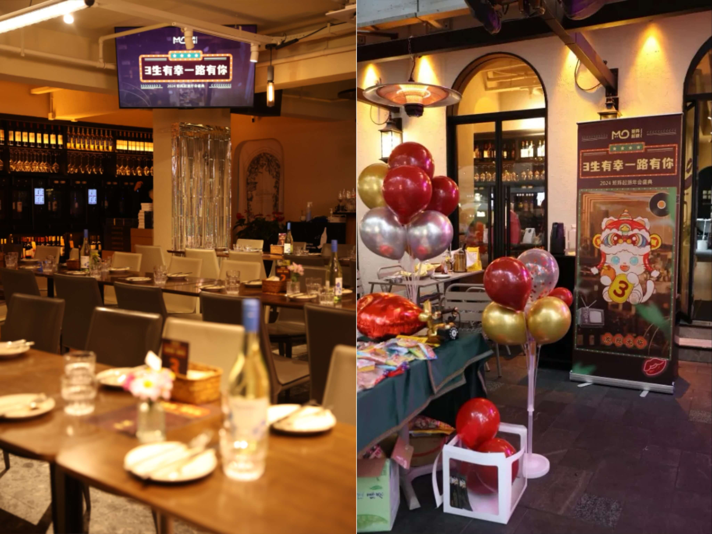
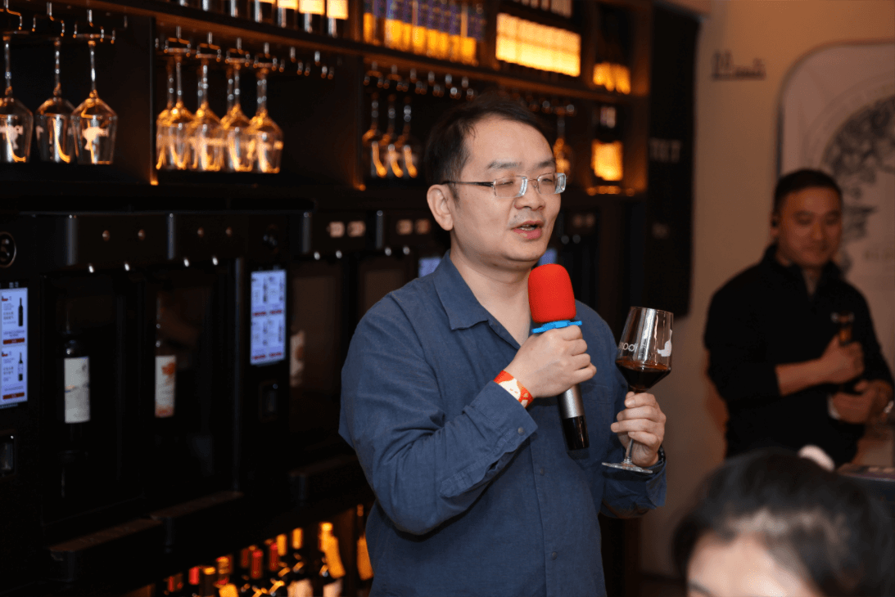
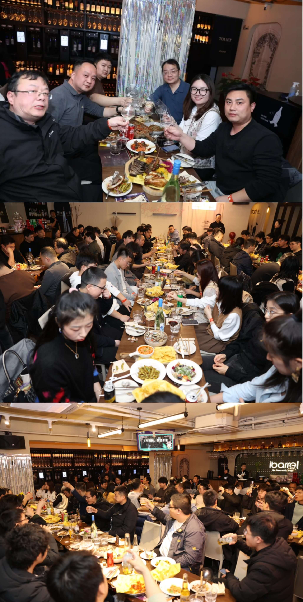
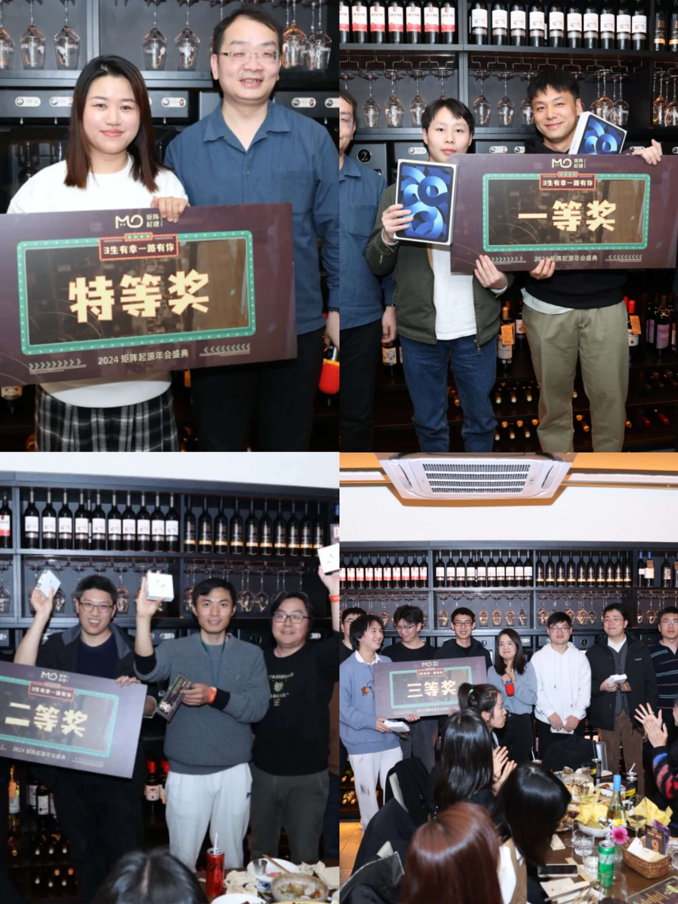

## 2024: A New Chapter with the Turning of the Years

A remarkable 2023 witnessed the growth journey of MO.

In the blink of an eye, we have entered 2024, and MatrixOrigin has celebrated its third birthday.

MOers gathered together, raised their glasses, talked freely, looked back on the past, strengthened their convictions, and spent an unforgettable evening together.

## CEO Speech

Founder and CEO Mr. Wang Long first summarized the company's **achievements and breakthroughs** over the past year, including major projects, customer cases, and market feedback. He also **introduced the company's future product update plans, market positioning, and market strategy.**

At the same time, he encouraged team members to **continue innovating, learning, and trying new technologies** to adapt to the changing market and technology environment. Finally, he thanked the team members for their hard work and looked forward to facing new challenges and opportunities together.

## A Feast of Food and Wine

The food at the annual meeting was mouthwatering. Delicate desserts, tempting barbecue, fragrant wine. Every dish was carefully selected and prepared to satisfy everyone's taste buds. We enjoyed the food and the feast, as if the whole world had become sweeter.

## Game Night at the Annual Meeting

In addition to the food, games were another highlight of the annual meeting. Ping-pong ball challenges, pitch-pot games, and screaming chicken push-ups tested both skill and wit, while igniting the atmosphere. Colleagues came on stage to show their talents, drawing laughter and applause.

## Lucky Draws and Surprises

There were many prizes and surprises. The most exciting part of the annual meeting was the lucky draw. As the host announced the winners one by one, lucky colleagues came on stage to receive generous prizes.

Some received long-awaited electronic products, while others received beautiful souvenirs. Everyone's face was filled with happy smiles.

Lucky to have you along the way for our third year. The 2024 MatrixOrigin Annual Celebration came to a close. Let us cherish this precious time and begin a new chapter in the new year.

Together, we look forward to **MatrixOrigin creating even more miracles in the future!**
