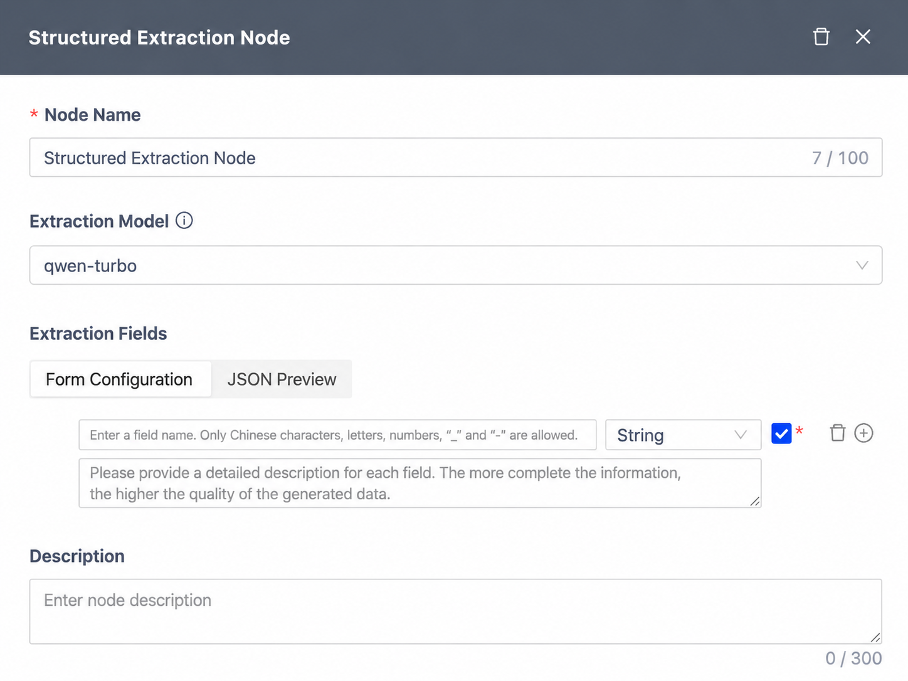
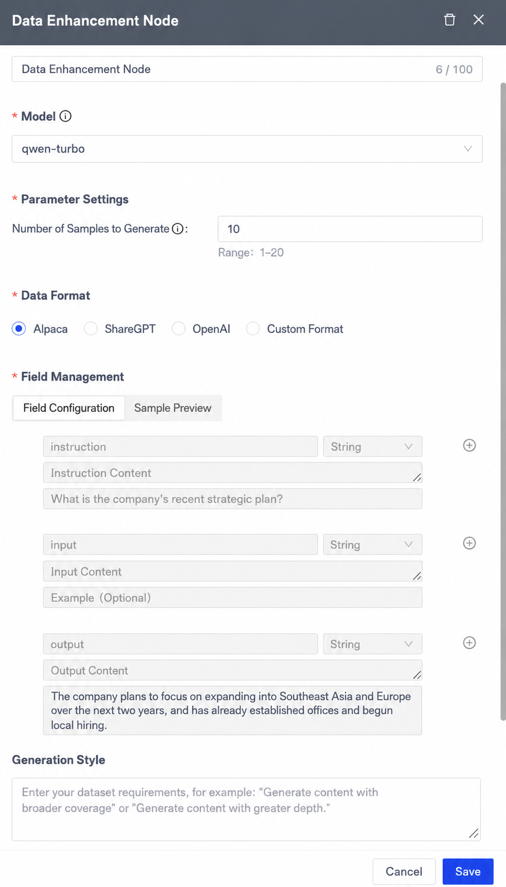
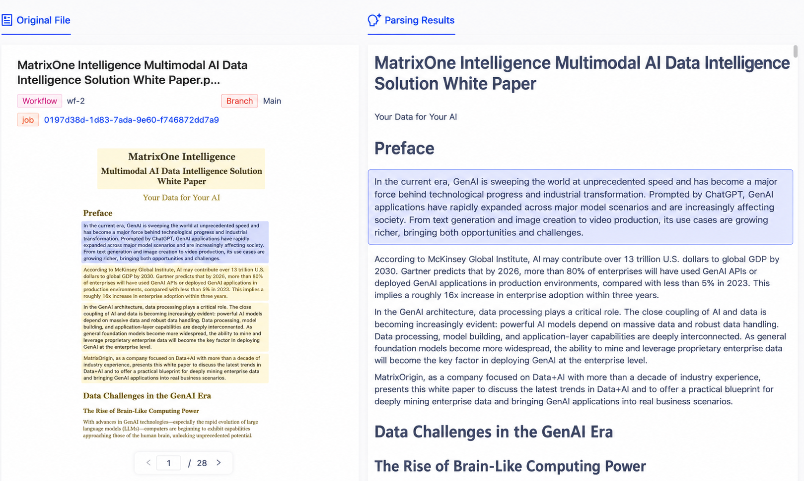
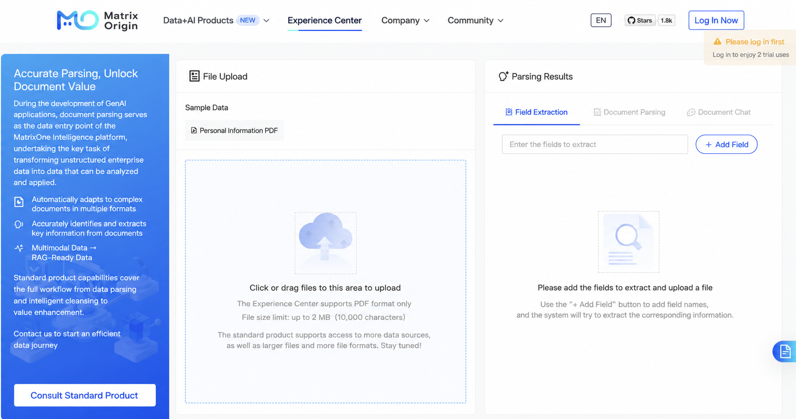
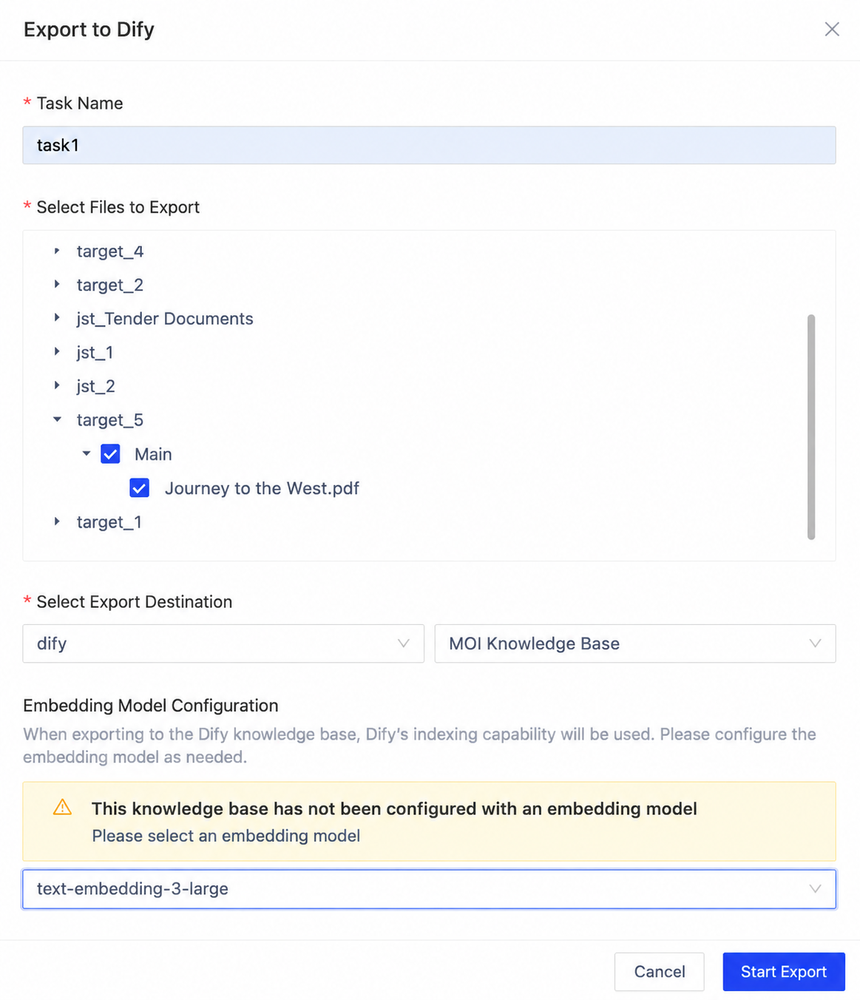

### Introduction to MatrixOne Intelligence

MatrixOne Intelligence is an AI data intelligence platform for multimodal data, designed to help enterprises address challenges such as data fragmentation, complex multimodal data integration, and difficult GenAI application implementation. Through data access, intelligent parsing, data workflows, and a hyper-converged lakehouse foundation, MatrixOne Intelligence provides enterprises with a one-stop end-to-end platform that turns internal proprietary data into AI-Ready data for GenAI applications. Based on an innovative cloud-native architecture and compute-storage separation design, the platform supports unified management and efficient processing of structured and unstructured data, with highly flexible deployment capabilities across public cloud, private cloud, and on-premises data center environments.

MatrixOne Intelligence is committed to helping enterprises fully explore and release the potential of private-domain data, allowing enterprise private data to be fully used in the AI era and become a key source of unique competitiveness.

#### 1. Comprehensive Workflow Upgrade: More Flexible and More Intelligent

To improve modularity and flexibility in data processing, the new version focuses on strengthening workflow nodes:

- **New structured extraction node**: This node combines LLMs with the JSON Schema standard to intelligently identify and extract fields from unstructured text, automatically generating standardized structured data and significantly improving processing efficiency. Users can use it to automate transformation from raw documents into data that can be directly used for analysis, retrieval, or system integration, reducing manual processing costs and accelerating business automation. A related quick-start API has also been launched to help enterprises quickly implement structured data applications.

- **Independent text embedding node**: The text embedding capability from the original parsing node has been split into an independent text embedding node, improving modularity and flexibility in parsing workflows and making it easier for users to combine and invoke capabilities as needed.
- **Data augmentation node supports more dataset formats**: Support has been added for ShareGPT Format, OpenAI Format, and custom format outputs, while also supporting generated style definitions. Users can configure this flexibly through the visual interface and quickly build datasets that meet different model training requirements. This capability significantly lowers the technical barrier for data preparation, improves data generation efficiency and flexibility, helps users achieve higher-quality data-driven training across diverse downstream tasks, shortens model iteration cycles, and accelerates AI application implementation.

- **More diverse text segmentation methods**: The text segmentation node now supports segmentation by single delimiter, multiple delimiters, and custom identifiers, enabling more precise and efficient text splitting.

#### 2. Smarter GenAI Workspace and Automated Task Processing

The GenAI workspace now fully supports the MCP protocol. This means models can call platform APIs in a standardized way through MCP, automatically identify intent, decompose tasks, and intelligently schedule multiple capabilities to complete complex task chains. Platform intelligence has been further improved. Users only need to enter a target to drive multiple tools to collaborate on data processing.

#### 3. Upgraded Parsing Results: Enhanced Visualization and More Convincing Results

In terms of explainability and accuracy of processing results, the new version focuses on improving the intuitive presentation of parsing results:

- **Enhanced document title recognition**: The new version significantly improves title structure recognition accuracy. In addition to accurately identifying first-level titles, it can also recognize second- and third-level titles in some complex documents, effectively restoring document hierarchy and providing a solid foundation for subsequent content extraction and knowledge construction.
- **Original-text highlight comparison**: Users can highlight corresponding field content in the original PDF document, enabling intuitive comparison between parsing results and page layout, quickly locating potential issues, judging model performance, and improving transparency and trust in data processing.

#### 4. Official Website Experience Center Launched: Try Core Capabilities with Zero Barriers

To help you understand the powerful document parsing capabilities of MatrixOne Intelligence more quickly, the first demo in the official website experience center is now live.

- **Three core features available for trial**: We have integrated three core features: structured extraction, document parsing, and document chat. You can use sample data without logging in and intuitively experience how the system accurately extracts key fields, deeply parses complex documents, and quickly obtains information through intelligent conversation.
- **Quick registration and login with mobile phone number**: Want to upload your own data for testing? You can quickly register with only a mobile phone number, log in, upload documents, and immediately experience the full process of converting data into AI capabilities.

#### 5. New Data Export Capability: Seamless Integration with Dify Knowledge Bases

A new data export connector feature has been added, now supporting one-click export of platform-processed data to Dify knowledge bases. Through seamless integration with Dify, users can efficiently build and continuously update knowledge bases without complex format conversion or manual migration. This feature not only significantly shortens the knowledge base construction cycle, but also improves automation in data flow, helping users apply high-quality data more quickly to intelligent Q&A, knowledge retrieval, and other scenarios, greatly improving knowledge productivity and usage efficiency.

#### 6. Comprehensive User Experience Optimization: Details Define Experience

The new version includes multiple refinements in operation experience, comprehensively improving interaction smoothness:

- Workflow interface optimization for smoother operation
- Creation process validation logic optimization to improve standardization and stability
- Local file upload interface adjustments for a more intuitive and clearer experience
- Text segmentation node display optimization to better reflect `type` and `level` information
- API usage process optimization to improve understanding from the user's perspective, with new alert-related APIs added
- OCR and image description switches added to file and image parsing nodes, supporting Chinese-English switching for image descriptions and making multimodal data processing more flexible and controllable
