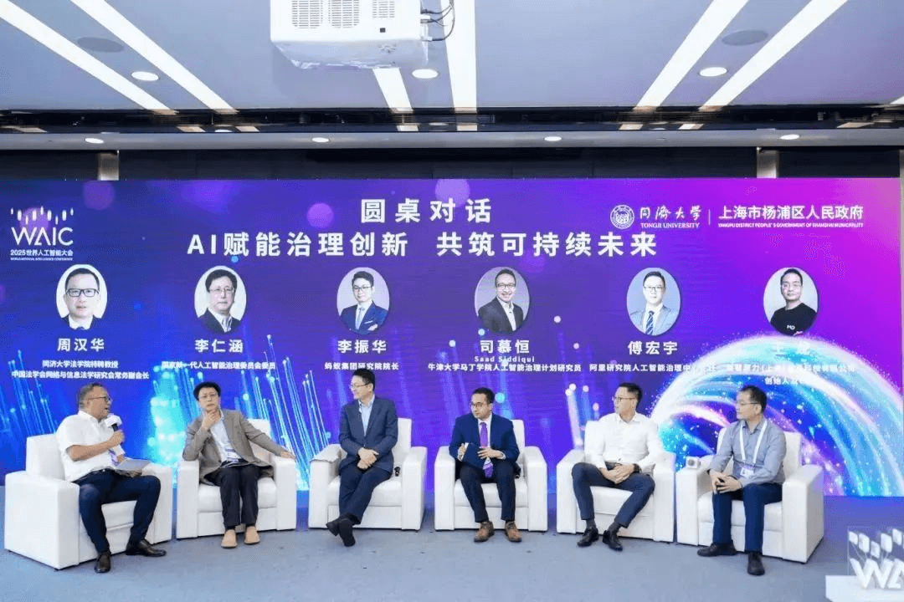
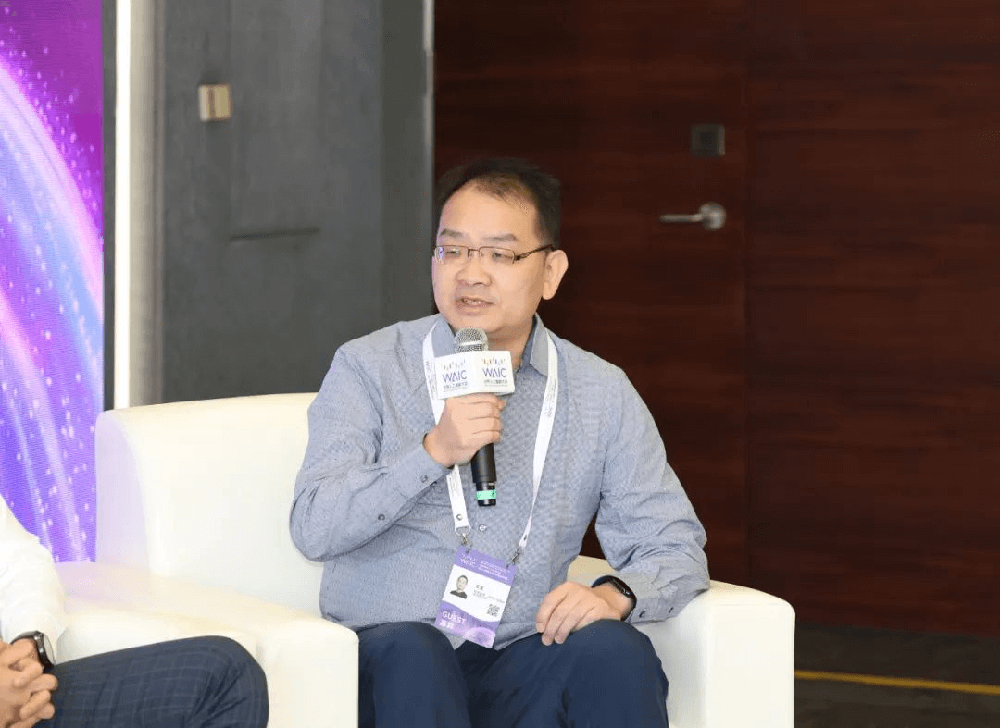

### AI Empowerment for a Sustainable Future | MatrixOrigin CEO Wang Long Invited to Join the WAIC 2025 Roundtable

On July 27, 2025, at the Intelligent Society Forum of the World Artificial Intelligence Conference (WAIC) held at the Shanghai World Expo Center, MatrixOrigin founder and CEO Wang Long was invited to participate in a high-level roundtable forum with experts from Oxford University, Ant Group, Alibaba Research Institute, and others to discuss **"AI Empowerment for Governance Innovation and a Sustainable Future."**

---

**Multi-Agent Collaboration to Reduce Energy Consumption Together**

In this exchange focused on the future development of AI and social sustainability, Wang Long responded to a practical but long-underestimated issue: **the energy bottleneck of AI**. He reviewed the six waves of AI development and pointed out that each wave has shown different characteristics in terms of energy consumption and output. Wang Long believes that future AI applications will not be driven by a single technology, but by the integrated use of the past six waves of AI technologies. More importantly, **future society will be a world where multiple AI Agents collaborate**. This kind of Multi-Agent collaboration will not only bring stronger capabilities, but also has the potential to improve energy alignment overall through better task allocation and resource scheduling, thereby improving energy efficiency. He firmly believes that AI development is a gradual process, and in this process, **energy utilization efficiency will continue to improve.**

**Breaking Data Silos and Building a Flowing Ecosystem**

At the forum, participants also **discussed how to solve the "data silo" problem and build an efficient, flowing data ecosystem**. Wang Long explained his deeper philosophy and vision. The "Matrix" in MatrixOrigin comes from the classic sci-fi film The Matrix. The inspiration is to imagine that humans themselves may also have been "created" by a higher form of intelligence. So how would these potential "creators" plan our development path?

Wang Long projected this line of thought into AI. He believes that as creators of the current intelligent civilization, humans must have a broader vision and foresight when designing and promoting AI development. His view is that **the progress of intelligent civilization cannot be chaotic. It needs a solid underlying order to ensure orderly development, while also creating a suitable environment, such as a safe, open, and efficient data platform (database).** Wang Long emphasized the need to provide a more tolerant environment that allows AI to explore and evolve more freely while following basic rules, so that it can fully realize its greatest potential.

---

**About WAIC**

The **2025 World Artificial Intelligence Conference International Cooperation Forum on Artificial Intelligence Standardization (WAIC)** is one of the most influential events in the global AI field. It aims to build a high-end global dialogue platform for AI and deepen international exchange and cooperation in AI standardization. The event attracted more than 200 guests and representatives from international organizations, governments, universities, research institutions, and leading enterprises to discuss topics such as technical standard setting, ethical governance, and global collaboration, promoting a global consensus framework for AI standardization.

---

**About MatrixOrigin**

MatrixOrigin is a **leading provider of data intelligence (Data & AI) platform technologies and services**. Its core team members come from well-known technology companies in China and around the world, with broad industry and international perspectives as well as forward-looking vision. MatrixOrigin aims to build and use world-class IT technologies and products to help enterprises transform and upgrade from informatization and digitization to intelligence.

MatrixOrigin's core product, **MatrixOne Intelligence**, is an AI-native multimodal data intelligence platform for enterprises. Using artificial intelligence technologies including large models and an innovative hyper-converged data foundation, it helps enterprises uniformly manage and govern structured, semi-structured, and unstructured multimodal data, transforming private-domain data into AI-Ready data assets. Through open source, ecosystem co-building, and collaborative solutions, MatrixOrigin helps enterprises rapidly realize data- and intelligence-driven transformation and upgrading.
