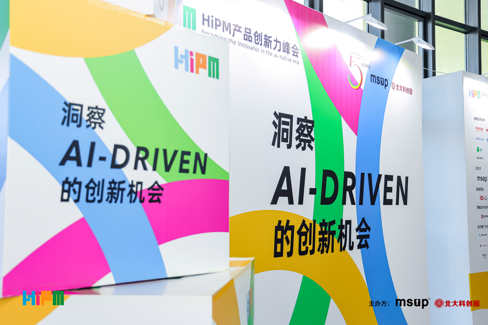
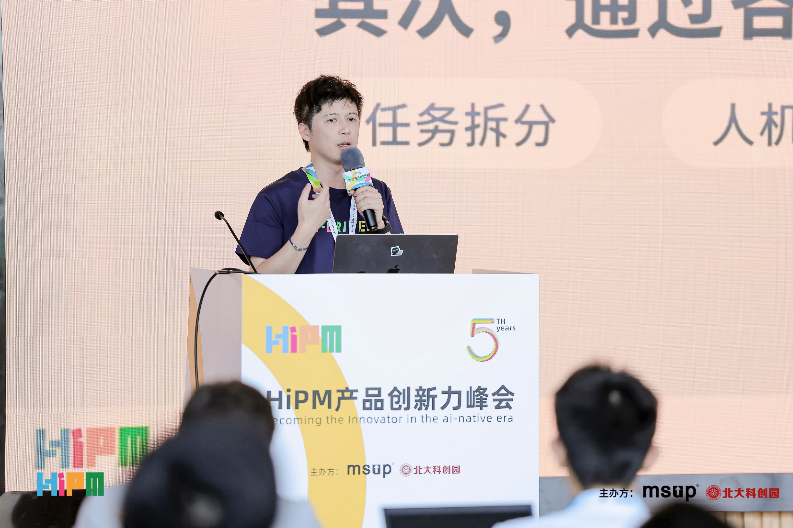
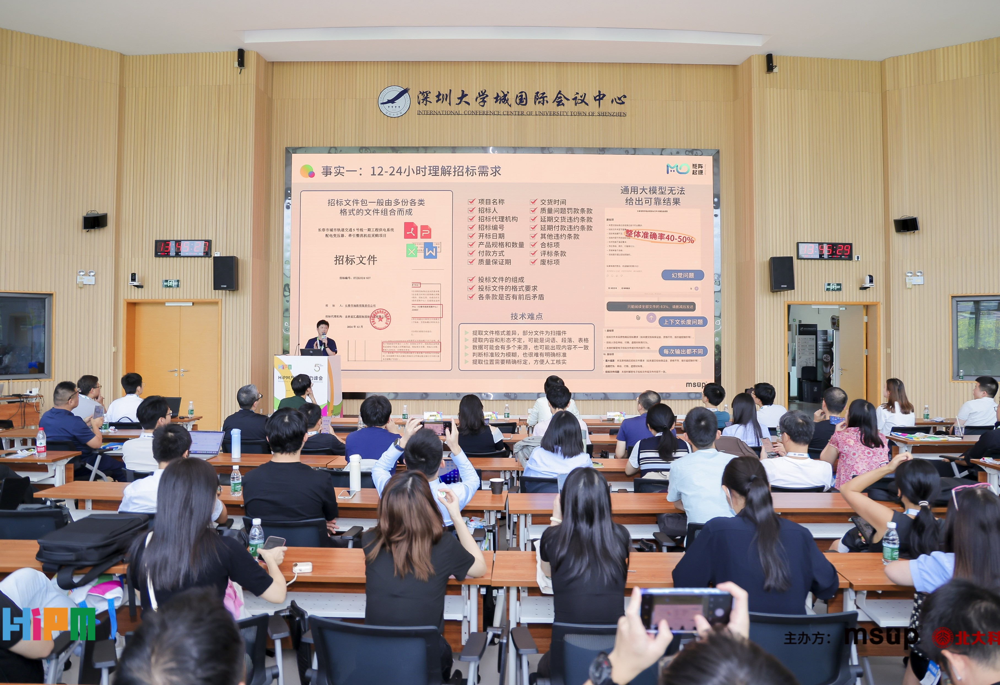
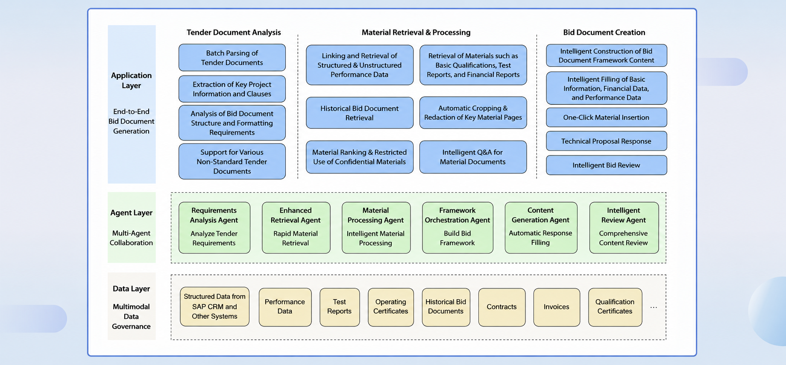
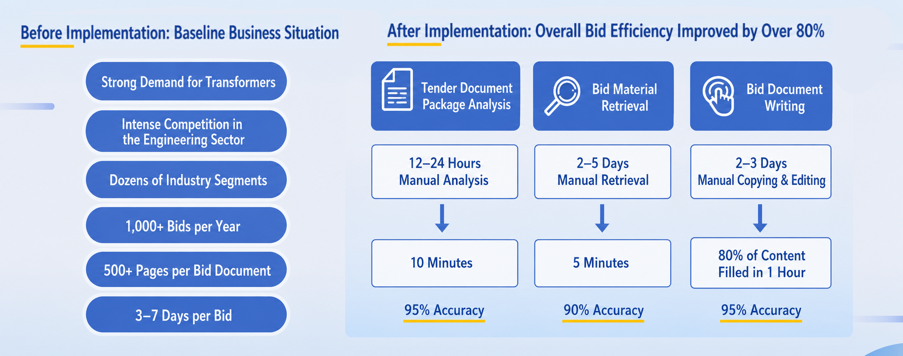
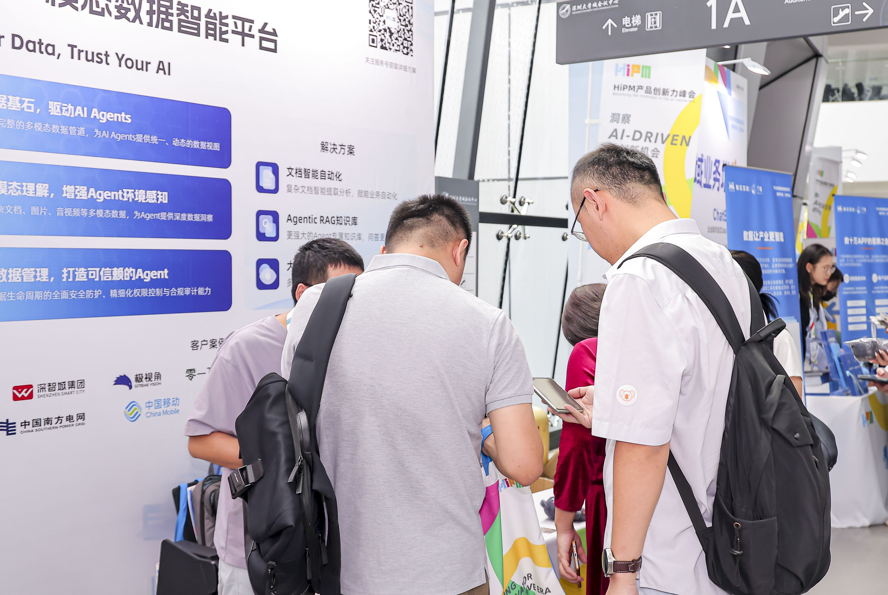

On October 17-18, the 5th HiPM Product Innovation Summit was successfully held in Shenzhen. The summit brought together many top domestic technology companies and industry experts to discuss the latest trends and practices of AI Agents in multimodal and productization scenarios. As a pioneer in enterprise AI Agent solutions, MatrixOrigin was invited to attend this event. MatrixOrigin senior product expert Wei Xudong delivered a keynote speech titled "Building a Trustworthy Enterprise-Grade Agent Solution," sharing deep insights and successful experience from real-world business scenarios.

## Moving Past "One-Click Generation" and Facing Real Enterprise Data Pain Points

Faced with the common situation where many enterprises are seeing big talk but little action in AI transformation, Wei Xudong pointed out that what really blocks enterprise AI implementation is often not weak large-model capability, but messy internal data.

He said that enterprise private-domain data contains large amounts of multimodal files with different formats and standards, and there is often a "relationship gap" between structured and unstructured data. If enterprises ignore data governance at the beginning and directly introduce AI applications, it is like building a tower on sand. It is difficult to establish trust and create value in real production environments.

## Practical Results Through the "Bid Document Agent"

In his speech, Wei Xudong used MatrixOrigin's "bid document Agent" for a large manufacturing enterprise to show how AI Agents can truly be integrated into core business. In the bidding process, enterprises often suffer from complicated tender documents, scattered internal and external materials, and tedious manual operations, which consume time and energy and lead to low efficiency. Manual work often takes 12 to 24 hours just to understand the tender requirements.

For this scenario, MatrixOrigin's solution does not pursue "one-click generation." Instead, it relies on core capabilities such as MOI and uses standardized processes such as semantic parsing and information linking to deeply govern scattered multimodal data such as contracts and invoices, turning them into high-value "data assets" that AI can accurately call upon. On this solid data foundation, a collaborative system composed of multiple specialized Agents is then deployed. Each Agent has a clear role, accurately calls governed data to complete specific tasks, and finally uses process collaboration to ensure automation and high reliability in business flow.

Through this process, MatrixOrigin helped enterprises shorten what used to be a 3-7 day bid document preparation process so that more than 80% of the work could be completed within a few hours, with significant efficiency gains overall. This real-world case clearly shows the path from "flashy demo" to practical AI Agent implementation.

## Strong On-Site Interaction and Continued Engagement at the Booth

During the summit, MatrixOrigin's dedicated booth also drew heavy foot traffic, attracting many visitors from finance, manufacturing, media, and other industries. Our technical experts had in-depth discussions with on-site visitors about enterprise data asset activation, AI Agent scenario customization, and other topics. Many attendees highly recognized MatrixOrigin's philosophy of governing data from the source.

In the wave of technological transformation, MatrixOrigin has always believed that the value of AI is not a magic trick of "one-click generation" or "instant success," but comes from a deep understanding of business and solid data governance. We look forward to working with more industry partners to truly bring trustworthy and reliable AI value into enterprise scenarios.

---

## About MatrixOrigin

MatrixOrigin is a leading provider of data intelligence (Data & AI) platform technologies and services. Its core team comes from well-known technology companies in China and around the world, with broad industry and international perspectives. MatrixOrigin's core product, MatrixOne Intelligence, is an enterprise-oriented AI-native multimodal data intelligence platform. By using artificial intelligence technologies, including large models, and an innovative hyper-converged data foundation, it helps enterprises uniformly manage and govern multimodal data and transform private-domain data into AI-Ready data assets. It has already served leading enterprises across industries, including StoneCastle, China Mobile IoT, Amway Nutrilite, Jiangxi Copper, and XCMG Hanyun, helping enterprises transform and upgrade from informatization and digitization to intelligence.
