# 什么是AI Native的组织，它该具备什么样的特点

上一篇讲了我们公司这几年一路探索 AI 的历程。最近跟圈内朋友、伙伴包括客户聊下来，大家其实都看到了类似的情况：个人的生产力已经被 AI 拉得很高,但组织的效率根本没跟上。而且既然认定了在我们的生意模式下，组织仍然有必要存在，我们不会变成 OPC 公司，那就必须得仔细思考，新型的组织究竟该变成什么样，或者大家所谓的 AI-Native 的组织形态又该具体是什么内涵。我们今年的全员大会就花了一天的时间来讨论这个问题，也得到了我们的一些答案，这篇文章我们就来深入探讨这个问题。

## 一、	问题的根源：生产力和生产关系错位了

现在行业当前发生的现象，其实本质上都可以回归到那个我们最熟悉的马克思政治经济学理论上：生产力和生产关系的不匹配。这件事在人类历史上其实已经出现过很多次了，往古老了说，像铁器的出现，让农业生产力大增，一家一户就能独立开垦和耕种土地，直接导致原本依靠贵族统治奴隶的庄园社会，变成了以家庭为单位的小农社会。第一次工业革命，蒸汽机的应用让生产力大增，直接淘汰了松散的家庭手工作坊，逼迫组织进化为高度分工的现代工厂制，而后面的电气化时代，信息化时代到互联网时代，每次新的生产力革命其实都带来了生产关系的革命，这件事是整个社会的事，不光是某个企业还是某个个人，它是大势，拦都拦不住的。

而每次当生产力革新的时候，生产关系其实并没有那么快的能跟上，从个人、企业到整个社会，其实大家都还会有一种惯性，习惯于过去的路径。在这个转换的过程中，我们就会看到很多类似今天看见的问题，可能再过十年回过头来看，我们会嘲笑今天的自己，怎么还在干这么蠢的事呢。而在当下来说，这就是实实在在在每个企业都正在发生的故事。

Hebbia 的创始人 George Sivulka 今年 3 月在 X 上写过一篇文章——Institutional AI vs Individual AI（https://x.com/gsivulka/status/2031797989908627849）,副标题叫"高效的个人不等于高效的组织"。他举了个例子，我们可以从中看出这种生产关系的转换其实并没有那么容易完成。他说的是19 世纪末的电气化革命，新英格兰的纺织厂第一时间用电动机替换了蒸汽机,所有人都以为生产力会立刻爆发。结果电气化之后整整三十年,这些工厂的产量几乎没有增长。直到 1920 年代,工厂的厂房布局、装配线、每一台设备的电机配置全部按电气化重新设计了一遍,生产力才真正爆发出来。也就是真正出现了“流水线”这个东西才真正从生产关系上彻底适应了电气时代。
 
 
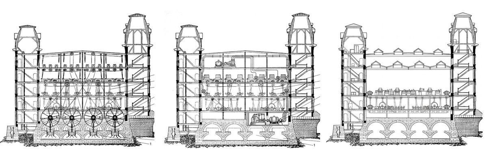
洛厄尔（Lowell）纺织厂的三次演进。从左到右依次为：1890年的蒸汽机动力工厂、1900年的电动机动力工厂，以及最后1920年的单元动力工厂，即彻底重构的电气化流水线。

同时代的另外一个故事想必大家更加熟悉，也就是亨利福特的故事。其实汽车这东西 1880 年代就已经诞生了，最早是德国和法国作为主要的发明和生产区域，可是他们在长达二三十年的时间里完全依赖技术精湛的工匠在作坊里纯手工生产，产量极其有限，直到福特到 1913 年发明了流水线这个更加适应大规模制造的生产关系的时候，汽车才真正变成了一个日用品。德法早期的老牌车企因为拥有大量手艺精湛的工匠，传统的师徒制/作坊制生产关系形成了巨大的历史包袱，导致他们很难自我革命。这和今天企业面对大家探讨的AI-Native新型组织形态时的焦虑与被迫转型，逻辑是完全一致的。

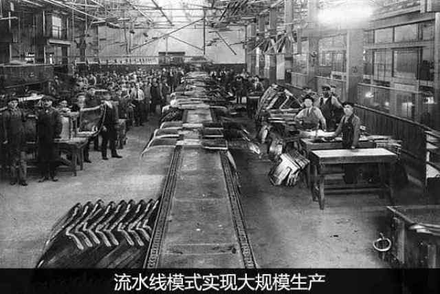

## 二、	这事比想象中的更急迫和严重

这次 AI 革命本质上也一样，新的生产力必然需要有新的生产关系。只是这次有一点不太一样，它来的实在太快了。大家可以回想一下，从大模型真正进入公众视野（ChatGPT 时刻），到今天它真切地变成你我生活和工作离不开的日常生产力工具，满打满算其实也就过去了三年左右的时间。

这三年里发生的质变，其实是非常恐怖的。在过去，无论是蒸汽机还是电力，从底层技术的突破，到应用普及，再到终于有人摸索出与之匹配的“福特流水线”，往往需要二三十年甚至几代人的时间去试错。德法的老牌车企和新英格兰的纺织厂都有几十年的缓冲期去慢慢适应。但这次 AI 的进化速度快的让人难以置信，三年从聊天工具进化到能取代程序员干活，它快速凭实力把计算机从超热门的顶流专业打到了现在人人自危的程度。生产力不仅爆发得异常猛烈，而且普及速度之快，根本没有给组织留下喘息和自然演进的时间。硅谷的行动已经在用最残酷的方式给出回应了。

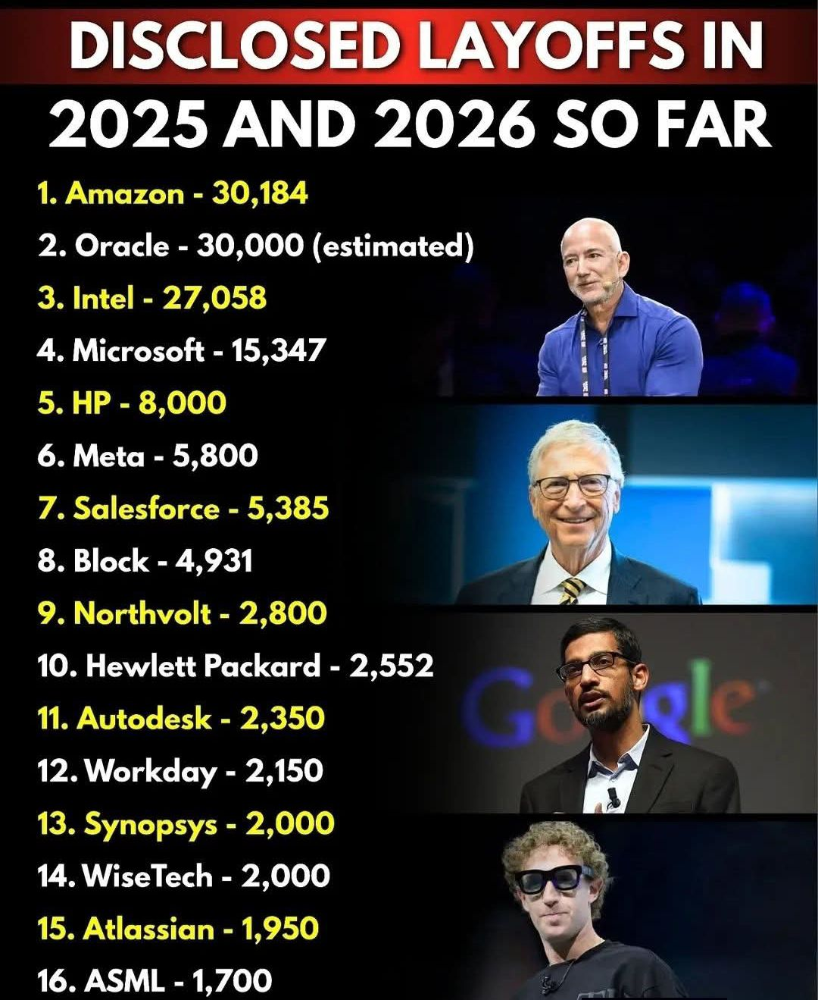

大家如果关注行业新闻就会发现，过去这一段时间，硅谷科技大厂的裁员潮几乎是一波接着一波，Meta，Amazon，Salesforce，而且都极其坚决。这一波最干脆的案例,是 Block(Square、Cash App 的母公司)。2026 年 2 月,Block 一口气宣布裁掉 4000 人——从一万多人砍到不到 6000 人,接近一半。关键更狠的是 Block 其实并不是有什么困境，他们盈利还在增长。Jack Dorsey 在给员工的信里说得非常直白:
"智能工具已经改变了'建一家公司、运营一家公司'这件事本身。一个明显更小的团队,用我们正在构建的工具,能做得更多,做得更好。 我不觉得我们做这件事算早,我觉得大多数公司都晚了。" 

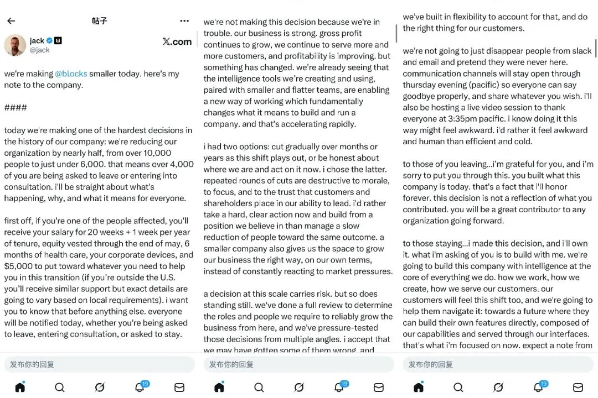

他们在裁掉大量非核心的执行层、中间层以及传统的初级代码岗位，转而把腾出来的巨额资金投入到 AI 的基建和核心技术上。为什么？因为科技巨头是最早感知到生产力溢出的那拨人。当他们发现，几个超级个体叠加 AI 工具，就能完成过去一个庞大研发团队或设计团队的工作量时，原本臃肿的层级组织不仅显得极其多余，甚至成了拖累信息流转的阻碍。

硅谷的裁员潮，本质上就是旧有生产关系在急剧膨胀AI新生产力面前，开始断裂、崩塌的实证。它残酷地表明：当个人的生产力被无限放大的时候，如果组织结构不变轻、变薄，这些冗余节点就会被市场淘汰。

## 三、我们从一团乱麻中寻找 AI-Native 的轮廓

从矩阵起源的角度来说，一方面我们非常强烈的感受到整个行业转变的风向，另一方面我们自身的组织形态在 AI 生产力的冲击下也变得乱七八糟。所以我们今年年初的全员大会也就是在这样的背景下深刻的剖析自己，理解问题，试图寻找如何构建 AI-Native 组织的答案。

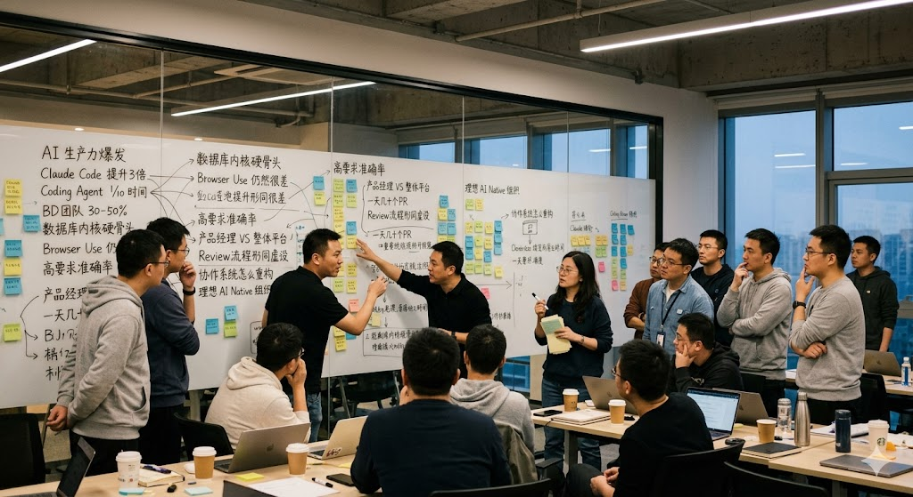

在那一整天的白板推演和激烈争论中，大家抛开了那些fancy的概念，就是对着日常工作里的痛点深入讨论。我们把这些看似一团乱麻的现状梳理下来，发现了几个极其真实且割裂的现象：

首先，每个个体、每个团队都或多或少感受到了 AI 的生产力爆发带来的收益。对于产品经理来说，每个人画原型、写 PRD、产出用户文档的效率起码提升了 3 倍以上。就拿我自己举例，我其实非常不擅长画交互和原型，可是我能描述清楚我想要什么，我能判断出来什么是我要的什么不是我要的，以前我得吩咐一个产品经理替我画出我大体的想法，然后我们再做很多讨论看符不符合预期，现在直接让Claude Code 就可以把活全干了。对于研发来说，那就感受更深了，Coding Agent 基本上把写代码和写单测的时间已经压缩到了以前的十分之一。但是也有一些团队，对 AI提效的感受没有那么强烈，像我们的 BD 团队，交付团队，他们觉得 AI 提效的幅度也就在 30-50% 左右。

其次，大家也都强烈感受到了 AI 的能力边界问题。像我们数据库内核的研发，对代码质量要求很高，AI 现在确实很能干，但是真正碰到硬骨头问题的时候，即使是最好的 Coding Agent，来回折腾好几个礼拜也没法真正自闭环的解决问题。测试团队的情况是，面对后端的功能 API的测试，AI 已经胜任的很好，可是对于面向用户使用的Web 前端测试，即使 AI有 Browser Use 这样的 tool，也仍然完成的非常差。而面向客户交付的各种场景，一旦涉及到高要求的准确率问题，所谓的 AI 生产力立马就打了很大折扣，比如各类复杂版式的文档解析和内容抽取，再比如对于隐含了各种业务语义的自然语言问答，其实要完全相信 AI 的结果都有很大的挑战。

第三，几乎每个涉及到 AI 接入的协作环节都不太适应。每个产品经理都跟自己的某个 AI 工具沟通，以极高的效率产出了自己的 feature 设计文档和交互原型，可是产品是一个整体，却没有一个 AI 在负责整体平台的交互和协调。经常出现你设计的东西跟我设计的东西单独来看都没问题，可是合在一块就发现这里冲突了，那里走不通。研发工程师也是一样的困惑，以前研发一天提几个 PR，现在借助 Agent 一天能提交几十个、动辄上万行的 PR，Review 流程根本无从下手，直接形同虚设。在很多关键节点上，我们不光没有看见效率提升，由于过去的协作流程，反而导致效率被拖累。

对着这满墙密密麻麻的线索，我们的组织也充满了冲突、争吵和焦虑。AI 看起来好，越用越爽，越爽却却越乱。到底什么样的组织形态，才配得上今天的生产力？也就是我们接下来要谈的——理想的 AI Native 组织。

## 四、那理想的 AI Native 组织,长什么样?

我们在白板前争论了一整天,反复来回拆解每一个具体的痛点之后,逐步捋出了一条清晰的脉络。AI Native 的组织,本质上不是一个新物种,它仍然是建立在企业组织最核心的三要素之上的——人、知识、流程。只是这三个要素的内涵,在 Agent 这个新主体的进入之下,被彻底重写了。

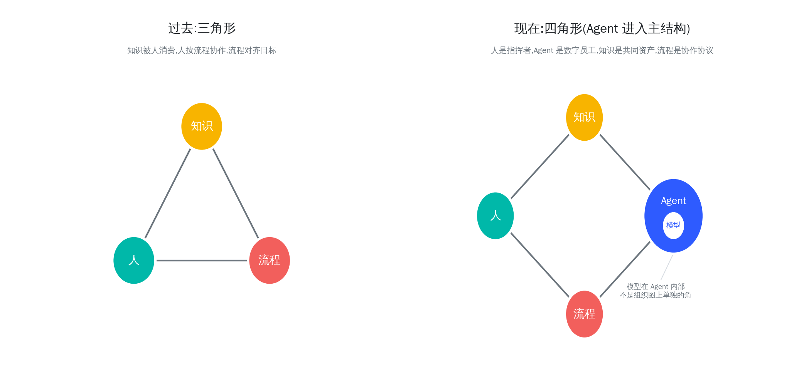

人是干活和做决定的主体;知识是公司的家底——脑子里的经验、文档里的沉淀、数据库里的记录;流程是把人和知识攒在一起出活的方式——SOP、审批、PR review、项目同步会。这三件事的关系很长时间以来都很简单:知识被人消费,人按流程协作,流程对齐目标。这个结构无论是做软件的还在做零售的,底层逻辑都一样。当前个人提效没有带来组织提效的核心症结就在于这个三角关系没有适应新的生产力。

在动手谈理想之前,我们想先把两个前提明确一下，以免得到的结论对不齐。

第一,AI 还远远不是万能的。我们前面已经讲过自己的体感——数据库内核里那 5% 真正难的硬骨头,Agent 来回折腾几个礼拜也搞不定;面向高准确率交付,AI 一旦碰到都会大幅打折。理想的 AI Native 组织,绝不是"AI 取代人",而是"人和 Agent 各司其职"。承认 AI 的边界,跟承认它的能力同样重要。我们离万能的 AGI 还很遥远。

第二,组织仍然必须存在。OPC(One Person Company,一人公司)这个概念这两年被吹得很响,但我们越想越清楚——对任何一个有真实复杂度的生意来说,纯靠超级个体是不行的。专业分工、跨域协作、长期的客户关系、复杂的工程系统,这些事情没办法一个人扛。AI 让"小团队完成大事"成为可能,但它不会消灭组织,只会改变组织的形态。我们这里讨论的 AI Native 组织,前提就是:它仍然是一个组织,只是是一个新形态的组织。

在这两个前提的基础上,我们再说 Agent 进入组织之后,人、知识、流程这三个要素具体怎么变。

## 五、人如何 AI-Native -- 从演奏者变成指挥家

前面提到我们公司有的同学对 AI 感受非常深，有几倍提升，有的感受就一般。我们后来想明白了,核心区别一是因为个人对新技术的心态和实践，另外一条也跟客观现实有关，这个岗位是跟机器打交道多,还是跟人打交道多。研发同学跟代码、文档、测试这些"机器世界"的东西打交道,Coding Agent 一上手,生产力直接十倍起;产品经理画原型、写 PRD,产出的也基本是给机器读的产物,Claude Code 出马,效率三倍五倍轻轻松松。可是 BD、交付、市场这些岗位,工作的核心是跟人打交道——客户怎么想、合作伙伴关系怎么维护、内部跨团队怎么对齐——这些场景里,AI 提效的天花板就明显低了。因为瓶颈不在他们手上的活,瓶颈在他们要协作的那些"人"身上——在那些还没有 AI Native 化的同事、客户、合作伙伴身上。

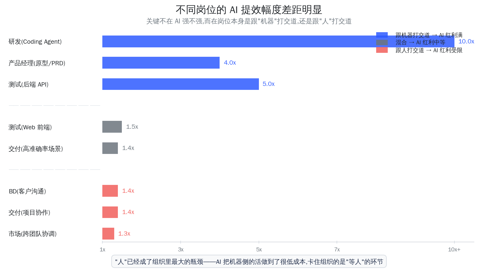

这件事反过来说就是:在今天的组织里,"人"本身已经成了三角形里最大的瓶颈。AI 已经把内容生产、信息处理、代码编写这些环节的成本压到很低了,剩下卡住整个组织的,就是那些"必须等人响应"、"必须人和人对齐"、"必须人去协调"的环节。每多一个人在链条上,就多一段等待时间,多一处信息损耗。

那这个瓶颈怎么破?唯一的办法,就是让 Agent 真正进到组织里来,接走那些原本卡在"等人"上的环节,而不只是给人当个工具。

但 Agent 进来,得是以"组织成员"的身份进来,不是以"个人手里的辅助工具"的身份进来。这是个挺反直觉但很关键的区分。今天大多数公司用 AI 的方式,还是后者——你用 Cursor、他用 Claude,各自为战,Agent 的产出全部封闭在某个员工的浏览器里,组织层面看不见也管不到。这种模式下 Agent 永远进不了主结构,只能在外圈给单个员工放大产能,无法真正解决"组织瓶颈"这件事。

只有把 Agent 当成真正的组织成员——给它自己的岗位职责、自己的上下文、自己的问责机制——它才能真正接管那些"等人"的环节,才能成为组织里和真人员工平起平坐的另一类主体。

而对于"人"这一边来说,角色本身也要发生根本的转变——从执行者变成指挥者、培养者、最终责任人。你不再需要亲自写每一行代码,但你得能判断这些代码对不对、够不够好、方向对不对。这个转变对人的要求其实更高了,不是更低了。

这个转变看似简单一句话,但落到组织里其实意味着对"人"这件事的深度重塑——什么样的人会被淘汰、什么样的人会变得更值钱、组织对人才的画像都得重新写。我们这一年的体感是,这个洗牌过程已经开始了,而且速度比想象的快。这里面有几条值得展开讲清楚。

**第一,只会被动执行的人,被淘汰得最快。** AI 已经把"按指令执行"这件事做到了几乎零成本。一个清晰的任务交给 Agent,几分钟就有结果;但一个清晰的任务交给一个只会执行的人,要花一天、还可能做错。组织对人的要求第一次回归到了"判断力"这件事本身——能想清楚问题、能拆解任务、能指挥 AI、能审核结果。过去靠"听话+勤奋"就能站住脚的岗位,正在被快速压缩。这一点不是危言耸听,是已经在硅谷大量裁员潮里实实在在发生的事。

**第二,领域专家比以前更重要。** 很多人以为 AI 来了之后,行业知识就不重要了——AI 自己什么都懂。这是非常大的误解。事实正好相反:AI 能产出大量内容、写大量代码、给大量建议,但**判断这些产出对不对、有没有价值、能不能落地,只有真正懂业务、懂行业的人能干**。一个不懂业务的运营人员配上 AI,产出的可能都是"看起来对其实错"的东西——文字漂亮、逻辑自洽、就是不解决真问题。一个懂业务的人配上 AI,可以一个人完成过去十个人的工作。**判断力的稀缺,直接放大了领域专家的价值**——他们成了 AI 时代组织里最值钱的一类人。

**第三,组织里"最值钱的能力"正在悄悄变化——从"做出来"变成"想清楚"。** 过去最值钱的能力是把方案落地、能写代码、能交付。AI 时代,"做出来"这件事的成本被快速压低,变成了 Agent 的活。最值钱的反而变成了"想清楚"——架构师、产品架构师、能把模糊战略翻译成清晰任务的人。一个好的架构师过去可能放大 5 个工程师的产能,现在他能放大 50 个 Agent 的产能。同样一个人,在 AI 时代的价值被指数级放大了。这也意味着:**组织如果还按"执行人头数"来评估产出,会严重低估真正在创造价值的那一小撮人**。

**第四,个人的"端到端能力"从加分项变成了核心竞争力。** 过去的组织依赖分工——一个 feature 要产品定需求、研发写代码、测试做验证、运维上线、市场推广,各自接力,中间靠流程衔接。但 AI 时代,有些个体配上 Agent 之后,可以独立完成大部分原本需要团队协作的事情。一个超级个体 + 一群 Agent,产出能顶过去一个小团队。这种"端到端选手"在过去是少数,在 AI 时代会成为越来越重要的一类人。这反过来对组织的意义是:**部门墙、协作壁垒会被这种人冲掉**——因为他们不需要那么多协作就能产出。组织得给这种人留出空间和路径,而不是把他们卡在传统的分工体系里。

**第五,人和 Agent 之间的关系,本身需要被设计出来。** 这一点很多公司还没意识到。过去人和工具的关系很简单——工具是手里的延伸,用得好不好看个人。但 Agent 不是工具,是某种意义上的"协作者"。每个人其实都需要学会几件新事:怎么给 Agent 下清晰的指令、怎么审核它的产出、什么时候相信它什么时候不相信、怎么把自己的经验沉淀给它让它越来越懂自己的活。这些都是新的"软技能",过去的职业训练里完全没有。组织得帮人完成这个适应过程,不是把 Agent 丢给员工就完事。组织也得学会训练 Agent，如何让一个初级 Agent 训练成专家 Agent，再把 Agent 复制到各个细分场景上，甚至反过来让 Agent 来训练人。

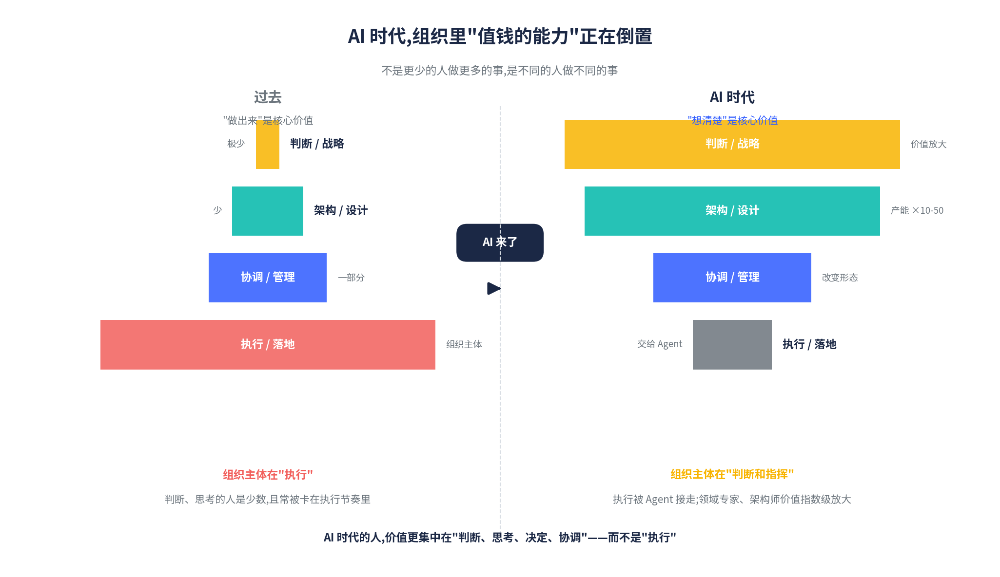

把这些放在一起其实能看到同一件事——**AI 时代的人,价值更集中在"判断、思考、决定、协调"这些环节,而不是"执行"**。这不是什么遥远的未来,是已经在发生、并且会越来越快的过程。组织能不能完成这次对"人"的重新认识、重新定义,直接决定了它能不能在 AI 时代活下来——因为最终决定一家公司天花板的,还是它把什么样的人聚在一起、把这些人的什么能力放大了。

## 六、知识如何AI-Native:从给人读的档案,变成 Agent 能直接消费的资产

AI 的某个活干的好不好,一部分固然是 AI 本身能力的天花板所致,还有另外一个重要原因就在于它在那些活上没有足够的"上下文"可以依赖。尤其针对一些业务语言的问答,准确率不够理想。这事对于人来说,人已经有很多隐含在背后的一些语境逻辑和共同认知,换句话说就是共同的上下文。可是这一类东西在我们的组织里几乎从来没被结构化过——因为过去面对的全是人,人不需要这些被显式写出来。这就是"知识"这个角在 AI 时代的核心问题:我们公司的知识,从来就不是给 Agent 准备的。

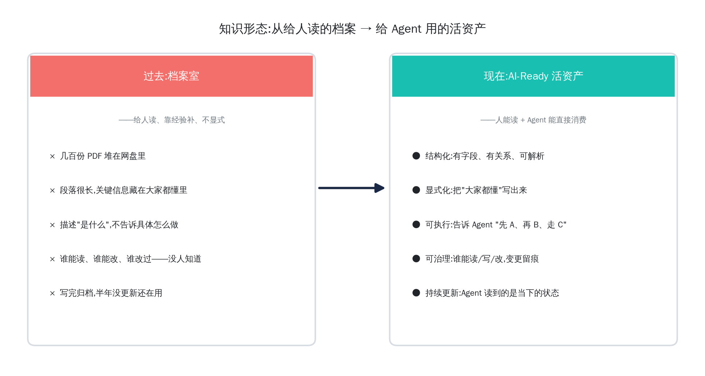

过去的知识是写给人看的——段落很长、隐含前提很多、关键信息往往藏在"大家都懂"的地方。文档的标准是"人读得顺",而不是"机器拿走就能干活"。这种知识在人主导的组织里没问题——员工靠经验、靠会议、靠师徒带教,把那些没明说的东西补全。但 Agent 不行,Agent 一旦缺上下文就开始瞎猜。前面说的那些 AI 能力缺陷的现象,本质上就是知识没准备好的现象。

不过当我们真去捋这件事的时候,会发现一个更深的问题——大多数公司想到"知识"两个字,默认就只想到文档，但是其实完全不是这样。但等你真把组织里所有要喂给 Agent 的东西都摊开看,你会发现"知识"这件事可以从一个更朴素的角度来切:**按这些信息存在哪里**——一类是已经落盘在企业各种系统里的,一类是还藏在人脑里的。这两类东西,在 AI 时代都得变成 Agent 能消费的资产,而它们各自要做的事完全不一样。

**第一类:落盘的数据——已经在企业系统里的那些。**

这是公司体量最大的一块知识资产,而且过去从来没人把它当作完整的"知识"看待过——因为它分散在很多很多地方。

最大头的是各种**业务系统里的数据**——ERP、CRM、HR、订单系统、财务系统、生产系统、供应链系统……这里面有客户档案、订单流水、合同记录、库存、员工信息、供应商数据等等。这一块大部分是结构化的(数据库表),也有一部分是半结构化和非结构化的(合同 PDF、客户邮件、扫描件、各种业务系统产生的日志和指标)。

第二块是大家通常意义上理解的**文档型资料**——产品文档、技术规范、SOP、案例库、政策制度。主要是非结构化的文本。

这两块东西的共同点是都已经落盘了,区别在于过去人能消费多少。结构化的业务数据靠 BI 报表、靠数据团队代写 SQL 能用一部分,但取数门槛挺高、跨系统串联很难;文档靠人翻还能用一些,但前提是写得好且没过期。整体来看,**过去人能消费的,只是落盘数据中很小的一部分**——绝大多数数据虽然存着,但要么取数成本太高、要么量太大没人看得过来,实际上从来没被组织真正消费过。

AI 进来之后,这件事发生了根本性变化。AI 并没有改变"它们是落盘数据"这件事,但**Agent 把人能消费的数据范围极大地扩展了**——过去因为门槛高、因为量太大、因为跨系统串联难而没法用起来的数据,现在第一次有了被消费的可能。

* **业务系统数据**——过去要写 SQL、要做报表才能用,现在 Agent 可以基于自然语言直接查询、还能跨系统串联("这个客户最近一年所有订单 + 投诉记录 + 合同状态"一句话出结果)。即使是过去因为量太大、太散而消费不起的数据,Agent 也能在出问题的瞬间把所有相关数据一把捞出来、串到一起,几分钟就给出答案——这种问题以前不是因为它隐蔽看不出来,是因为人没那个带宽把那么多数据串到一起去看
* **文档资料**——过去靠人翻,现在 Agent 直接消费。前提是格式得 AI Native 化:得有条理(结构化:别把几百个 PDF 往网盘里一扔,得把数据掰碎了、理清关系);得能照着做(可执行:写成"先去系统 A 查、再判断 B、走流程 C"这种带动作的指令,而不是干巴巴的条款);得管得住(可治理:谁能看、谁改过、底下的账得清清楚楚);得是热乎的(持续更新:文档发布之后必须自己跟着代码、产品同步刷新,而不是等人手动维护——这一条最容易被忽视,绝大多数文档项目都死在"发布一次再没人维护"上)

讲到这里其实有一件事值得点出来——**让"落盘数据"真正能被 Agent 消费,工程量比想象中大得多**。它不是只把几份文档结构化就完事,它涉及到把企业里散落在 ERP、CRM、各种业务系统、各种观测系统里的数据,统一接入到一个 Agent 能 access、能统一查询、能跨系统串联的数据底座上来。这件事的本质,其实是企业级 AI Native 数据基础设施的重做——它远不只是知识管理的事,是数据架构的事，也是我们 MatrixOne Intelligence 平台要解决的核心问题。

**第二类:人脑里的数据——还没落盘的那些。**

这一类的特点是它**不在任何系统里**——它在某些资深员工的脑子里,而且公司里没人把它当作"知识"管过。我们捋下来发现,这一类内部其实又能分成两种,落地难度和承载形式都不一样。

**(a) 第一种:Know-how 型——"怎么做"的处理动作链。**

这是过去几乎完全没法管的东西——某个老员工碰到一类问题时,脑子里那一套"先看 A、再查 B、然后判断 C、最后操作 D"的处理流程。

举个我们自己最常见的例子。性能下降了怎么排查?在以前的组织里,这件事的答案藏在某个资深工程师的脑子里:他会先去看监控的某几个核心指标,然后去查那段时间的运行时 profile,再翻一下那个时间段的日志,最后回到代码库里找最近几个可疑的 commit,做一次二分定位。这一连串动作,过去靠的是"师傅带徒弟"——新人盯着老人做几遍,慢慢就会了。

这种"会做事"的知识,在过去是没法显式管理的——你写在文档里没人会读、读了也很难照着做,因为它不是知识点,是一连串带判断的动作。但 Agent 来了之后,这一类知识第一次有了承载它的容器,我们叫它 **skill**——把那一套"先看 A、再查 B、然后判断 C"的处理路径直接写成 Agent 可执行的指令,告诉它需要什么数据在哪、怎么调、调出来怎么判断。

写一份 skill 比写一份文档难得多——因为它要求你真正把"怎么做"显式化,而不是"做什么"。但一旦写出来,效果是质变的:那个老员工脑子里的 know-how 第一次真正属于公司,而不属于他个人。他在不在,组织都能稳定地、按这一套动作处理同一类问题。更进一步,skill 之间还可以互相调用、可以版本化、可以共享。一个团队写好的 skill,另一个团队拿来直接就能用。这件事在过去的组织里基本不可能发生——经验是没法"复制粘贴"的。但写成 skill 之后,经验真的就可以在组织里流通了。

**(b) 第二种:语义型——"在说什么"的业务语言。**

这一种是更隐蔽、也更容易被忽视的一类知识——它的本质是**业务语言和实际落盘数据之间的 gap**。

举几个具体的例子就清楚了。落盘数据里有一张表叫 `t_cust_status`,里面有个字段叫 `status_cd`,取值是 `1`、`2`、`3`、`9`。可是业务上大家说的是"活跃客户"、"流失客户"、"高价值客户"——谁知道 `status_cd=2` 是"流失客户"?**只有在公司干了几年的业务人员脑子里。** 再比如客户问"我们公司本月销售额多少"——这个问题听起来再朴素不过,可它至少藏着五六个隐性定义:按订单创建时间还是按完成时间?含税还是不含税?是否扣除退款?跨币种怎么折算?销售部门和财务部门口径还经常不一样——而**真正的"公司口径"只在某几个老员工脑子里**。再比如客户问"我们公司哪些客户算 KA"——KA 这个标签没有任何字段直接标识,它是综合"过去 12 个月营收 > X + 多次复购 + 战略合作伙伴名单"的一套隐性规则,而**这套规则只在销售总监脑子里**。

这一类东西过去为什么没人意识到它是知识?**因为人和人之间沟通时,这种翻译是隐式发生的**——业务问"上个月活跃客户多少",数据团队凭经验翻译成 SQL,中间那层翻译压根没有被显式化。可 Agent 不行,Agent 看到的是表和字段,它根本不知道你说的"活跃客户"对应哪段 SQL,不知道你说的"销售额"该按哪个口径算。这层 gap 不补上,所有"自然语言查数据"的尝试都会翻车——客户问的话听起来都对,Agent 给的答案也看起来都对,可两者根本没对上。

**这就是语义型知识的核心问题——业务语言和实际落盘数据之间的桥梁,过去靠人脑做翻译,现在必须显式化下来给 Agent 用。**

承载这层语义的具体形式有几种主流做法:**指标定义系统**(把"活跃客户"、"销售额"、"KA"这种业务概念定义成可被 Agent 调用的 SQL/规则)、**metric layer / semantic layer**(在数据底座之上加一层语义层,把字段名、表关系、业务概念都显式化)、**术语字典**(业务词汇到数据字段的对照表)。本质上都是同一件事——**把业务语言到数据的翻译规则,从"在某些老员工脑子里"变成"在系统里、可被 Agent 调用"**。

这一层的工程量经常被低估。很多公司投了很多钱做"AI 数据助手",做完发现 Agent 老是给错答案,排查下来才发现根本不是模型不行,是这层语义层没补上。其实这件事我们做数据这么多年的人非常熟悉——传统做 BI、做数据仓库的时候本来就有"指标平台"、"数据建模"、"主数据管理"这些概念,只不过那时候这些工作主要是给数据团队和 BI 报表服务的。AI 时代,**它们的服务对象变成了 Agent**——而且必须做得比过去更显式、更完备、更易被机器消费。

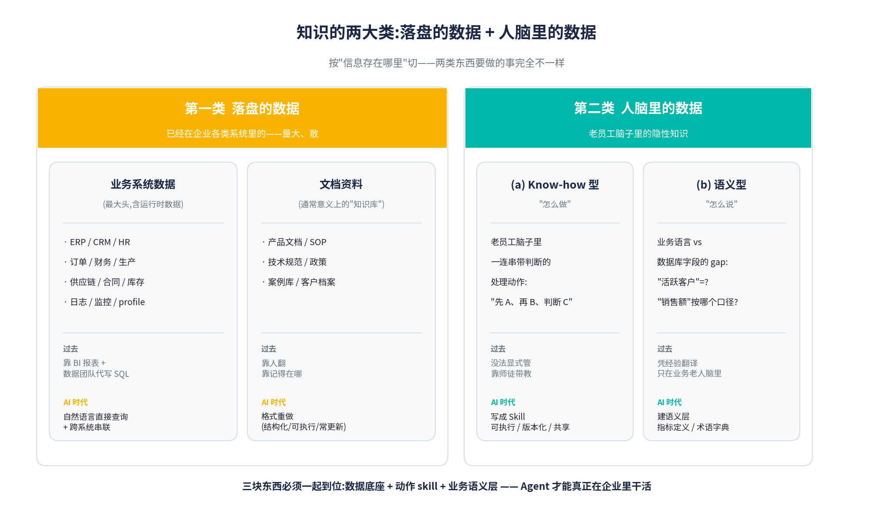

**两类知识合起来,才是 AI Native 组织里"知识"的完整内涵。**

落盘那一类要让 AI 能直接消费——业务系统数据要能被语义查询和跨系统串联,文档要 AI Native 化,运行时暗数据要被点亮。这件事的工程量大,涉及整个企业数据基础设施的重做。

人脑那一类要把它"掏出来"显式化——know-how 写成 skill,语义规则做成指标定义/语义层。这件事的工程量看起来小,但实际更难——因为它要求老员工愿意把"自己脑子里的东西"拿出来,还得把它讲清楚到机器能消费的颗粒度。

只做第一类不做第二类的公司,Agent 有数据但不知道怎么处理(没 know-how),也不知道用户在说什么(没语义层);只做第二类不做第一类的公司,skill 写得再好也调不到数据,跑不起来。两件事是一体的,缺哪一边都不行。

## 七、流程如何AI-Native:从人之间的协作约束,变成人和 Agent 的协作协议

第三大变化在流程。这块是最被低估的,也是讨论最激烈的。

过去所有的流程,都是为人和人之间的协作设计的——PR review 是给人看的,文档规范是给人写的,聊天群是给人聊的。AI 一进来,这一套全部成了瓶颈。这不是流程要加快,是流程要重做。理想的 AI Native 组织里,流程不再只是人和人之间的协作约束,而是人和 Agent 一起干活的协作协议。这个协议得对人和对 Agent 同样自然——人能用,Agent 也能直接消费和执行。

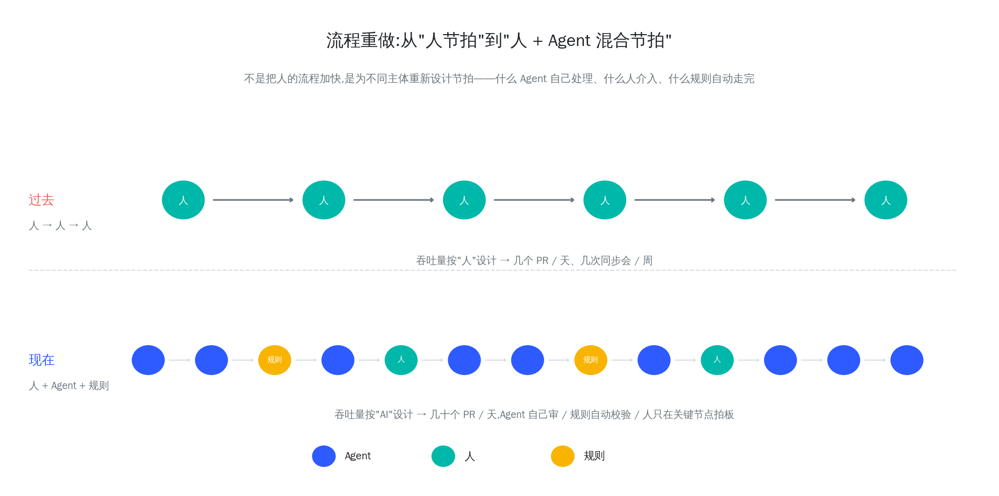

这件事比想象的更深。它不只是说"流程要为 AI 做适配",它意味着整个流程的设计前提变了:

* 过去流程的设计前提是"做事的是人,所以流程的吞吐量和粒度都按人来设计"。每天几个 PR、每周几次同步会、每天看几次企微——这些都是按人的处理能力来定的节拍。
* 现在做事的是人和 Agent 一起,Agent 的处理速度和粒度跟人完全不一样。你必须重新设计这个节拍:哪些 Agent 自己处理、哪些人介入、哪些通过规则自动走完——这是另一套流程,不是原来那套流程的"加速版"。

更深一层说,组织里所有的协作产物——文档、规范、任务卡片、决策记录——都不再只是"沟通工具",它们变成了组织的代码:被 Agent 直接执行,所以必须像代码一样严谨、像代码一样有版本、像代码一样可被审计。否则在生产力大幅提升的基础上出问题的概率其实也会大幅提升,如何规避风险,界定清楚责任就是真正能驾驭 AI Agent 的核心关键。

讲到这里,我们又踩到了流程改造里另一个更根本的转变,有必要单独拎出来讲一讲。这一条比"按人节拍 vs 按 AI 节拍"更深,叫做**流程的主动性**。

过去的流程,本质上是被动的——它是一套等人触发的步骤。CI 跑出错了,等工程师去看;有人提了个 issue,等被分配的人去处理;客户发来了反馈,等客服去 follow up。"等人"是过去流程默认的运行模式,因为执行主体是人,人有带宽限制,所有动作都得排队等人来。

但当执行主体变成"人 + 一群 Agent"之后,流程不需要再等人触发了——它可以由 Agent 主动驱动起来。我们自己内部跑下来,有两个非常具体的场景体感最强。

**第一个是"出问题"这件事。** 过去的流程是 CI 跑挂了 → 工程师收到通知 → 上去看日志 → 凭经验判断哪儿出了问题 → 修。这一整条链路是被动的,而且每一步都卡在"等人"上——等工程师有空、等他翻日志、等他想清楚。

现在的流程是 CI 跑挂的瞬间,就有一个 Agent 自动接管:它根据 skill 里的指引,把那一段时间的日志、profile、metrics、最近的 commit 全部捞出来串到一起,跑一遍分析,直接给出最可能的原因和位置,甚至直接拉出一个候选 PR。等工程师介入的时候,他不再是"从零开始查",而是"对着 Agent 给的初步结论拍板"。整条链路的节拍完全变了。

**第二个是"接 issue"这件事。** 过去的流程是有人提 issue → 项目负责人分配 → 被分配的人评估 → 写代码 → 提 PR → review → 合。这一整套也是被动的,而且经常卡在"评估"和"分配"两步上——issue 信息不全得反复问;评估之后有的人忙不过来,issue 就堆着没人接。

现在我们尝试的流程是有 Agent 自动接管 issue 的初步处理:它先评估这个 issue 信息够不够,不够的话直接把它打回,告诉提单人需要补什么;信息够了,就给出一个难度等级和工时估算。再往下,低于某个难度阈值的 issue,Agent 直接全程处理——拉相关上下文、写设计、过设计 review、写代码、跑 CI、提 PR;高于阈值的才转给人。这种模式下,人的时间从"评估、分配、写"上整体抽离了出来,转移到"审、定、改方向"这种真正需要判断的环节。

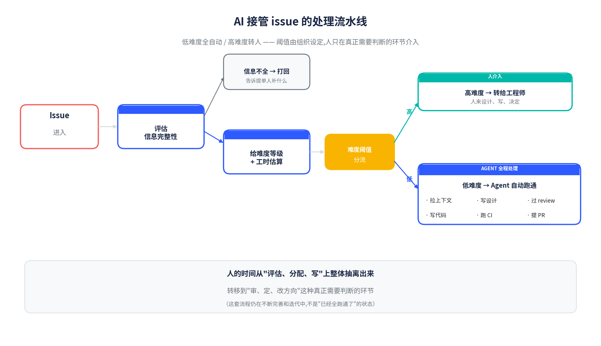

我们坦诚地说,这两个场景我们内部目前都还在不断完善和迭代——不是"已经全跑通了"的状态。但它们让我们清楚地看到了流程的一个新形态:**从"等人触发"变成"AI 驱动 + 人审核"**。

这两件事合在一起,也勾勒出了 AI Native 流程的一个底层特征:它不再以"人的处理能力"为节拍,而是以"事件的真实发生节奏"为节拍。事件发生了,Agent 立刻响应;响应到关键节点,人介入决策。中间不再有"积压"和"排队",因为不需要"等人"了。

这一点对老组织来说是反直觉的——大家习惯了"流程慢一点没关系,可以排期"。但在 AI Native 的组织里,流程必须能跟得上事件的速度,否则你就在为 Agent 创造新的等待。这个观念上的转变,可能比任何具体动作都更难,但也更核心。

## 八、AI Native 组织进化的路径

啰啰嗦嗦讲了这么多，用一句话总结下理想的 AI Native 组织, 就是:

公司的组织必须围绕着 AI Agent 的特点重构。人不再只是执行者,是 Agent 的指挥者和最后拍板的人。Agent 是用模型把知识变成价值的数字员工。知识是人与 Agent 协作和消费的共同资产。流程不再是人之间的协作约束,是人和 Agent 一起干活的协作协议。最终个人生产力的放大可以跟组织的生产力提升完全对齐，彻底进入 AI 时代。

要达到这个状态不是一蹴而就的。我们判断，AI Native 组织的演进大概会经历三个阶段。

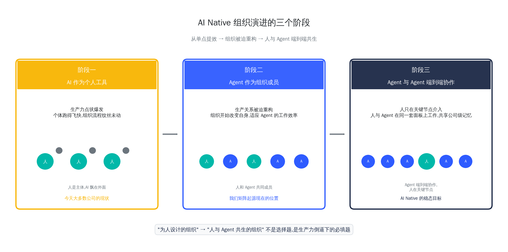

第一阶段：AI 作为个人工具，生产力点状爆发。 组织仍然是传统形态，一切机制默认执行主体是人。但个体开始用 AI 武装自己——产品经理用 Claude 画原型，研发用 Coding Agent 写代码，效率成倍提升。这个阶段的关键词是单点提效，每个人在自己的工位上跑得飞快，但组织流程纹丝未动。这是今天多数公司的现状，也是我们前面描述的全部痛点的起点：人已经变了，系统还没变。

第二阶段：Agent 作为组织成员，生产关系重构。 当个体的 AI 生产力溢出到一定程度，旧流程开始大面积断裂——PR 堆成山、Review 形同虚设、跨部门信息拼不起来。这时组织被迫承认一个事实：Agent 已经是事实上的执行主体了，不能再用管人的方式管它。于是，开始改变组织本身以适应Agent的工作效率。我们内部对自己在这个阶段的定位很清醒：知道该往哪走，也知道自己现在还远没走完，但这个阶段必须完成，而且越快越好。

第三阶段：Agent 与 Agent 端到端协作，人只在关键节点介入。 当生产关系正式适配生产力之后，组织进入稳态。Agent 之间可以串起完整链路——从需求理解、方案设计、执行交付到效果验证，人不卡在中间做信息转发，而只出现在真正需要判断力的节点：定方向、设边界、承担最终责任。这时候，公司的形态也趋于明朗：它不是消失，而是退后一步，变成资源平台和孵化器。关系这个阶段的人和 Agent，在同一套协作面板上工作，共享同一套公司级记忆，管理者不再问“谁在加班”，只问“结果怎么流、瓶颈在哪”。

今天绝大多公司（包括我们自己）还在第一阶段往第二阶段爬，离第三阶段还有很长一段路。但方向已经清楚了：从“为人设计的组织”走向“人与 Agent 共生的组织”，不是一道选择题，而是生产力倒逼下的必填题。

这场变革的残酷之处在于，它不等任何人。电气化时代的纺织厂花了三十年才完成流水线重构，而那时的技术扩散本身也需要时间。今天 AI 的进化是以天为单位的，留给组织演进的时间窗口远没有当年那么宽裕。但反过来想，这也意味着，谁能先把这道题答出来，谁就能在新的生产力周期里拿到定义权。这是我们今年全员花一整天讨论这件事的根本原因，也是我们今年公司的一项重大改革。

下一篇我们将更详细的分享我们面向组织架构重塑所做的一些战略决策以及一些实践案例。敬请期待。