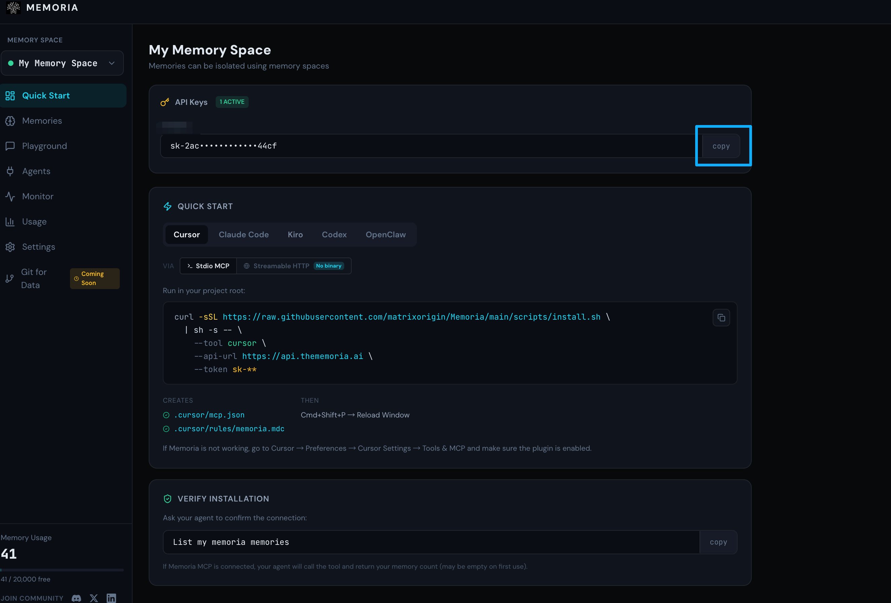
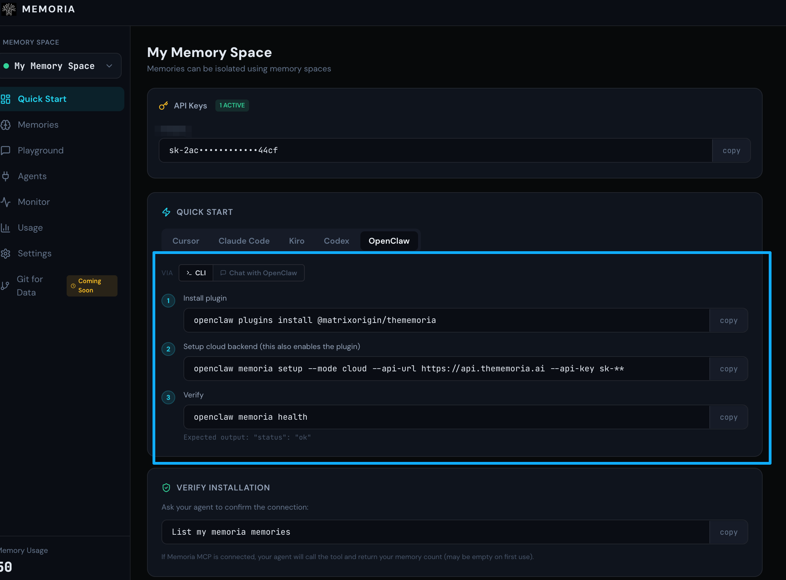
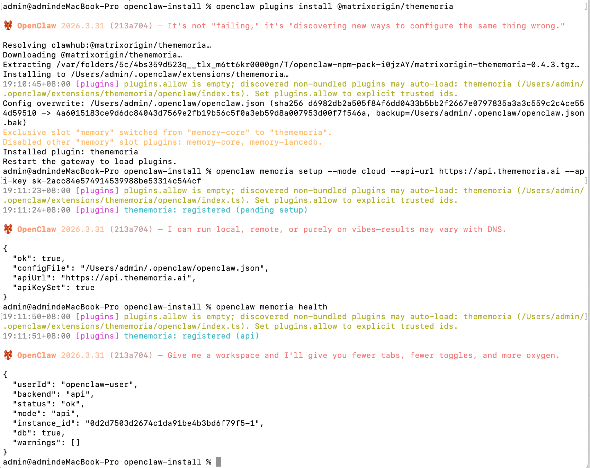
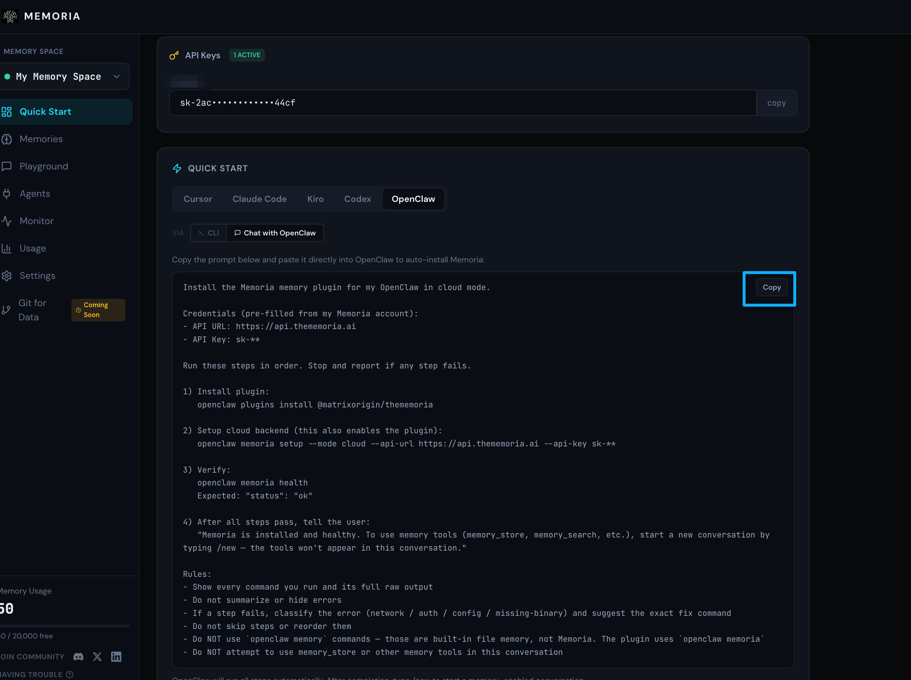
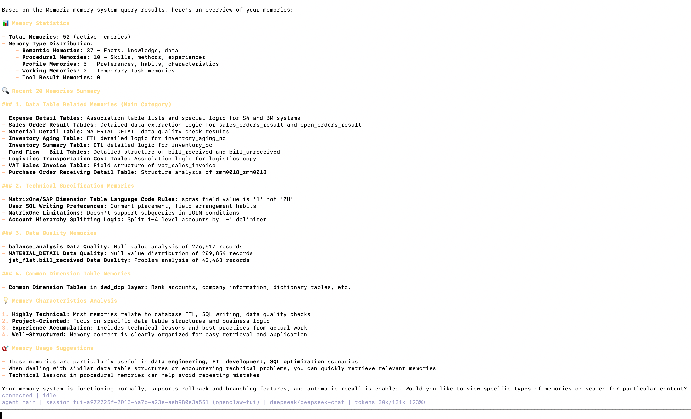

# Get Started in 1 Minute: Connect Memoria to OpenClaw

> One command. Smarter memory. Cut token usage by 70%+.

---

## Why You Need This

OpenClaw's built-in memory works — until it starts costing you.

**It loads everything, every time.** OpenClaw's default memory system loads `MEMORY.md` and related files into the context window at the start of every session. The more you use it, the more you accumulate: past preferences, old decisions, stale context. All of it gets injected whether it's relevant or not. Every session pays the full token bill.

**Files hit a ceiling — and fail silently.** Memory files have character limits. Once exceeded, content is truncated without warning. The agent doesn't tell you. It just forgets.

**Retrieval breaks down over time.** Write "Alice manages the auth team" on Monday, then ask "who handles permission issues?" on Friday — OpenClaw's default search surfaces both chunks but can't connect them. Relational reasoning isn't something keyword + vector search handles well at scale.

**Context compaction quietly destroys memory.** When long sessions trigger compaction, memory file contents injected into the context window can be rewritten or dropped entirely. You lose what you thought was saved.

Memoria fixes all of this. It replaces full-file loading with on-demand semantic retrieval — only the memories relevant to your current task get injected. The result: **70%+ reduction in memory-related token usage**, with better recall accuracy and no silent data loss.

**The whole setup takes under 1 minute.** Sign in, copy your key, run one command — done.

---

## Step 1 — Get Your API Key



Go to [thememoria.ai](https://thememoria.ai), sign in with one click (GitHub / Google), and copy your API key from the dashboard.

No database to set up. No backend to run.

Then confirm OpenClaw is running:
```bash
openclaw status
```

---

## Step 2 — Connect Memoria

Two ways to install: run a command in terminal, or paste a prompt into your OpenClaw chat.

### Option A: Terminal



Run the following in your terminal:
```bash
openclaw plugins install @matrixorigin/thememoria
```

Then configure the cloud backend:
```bash
openclaw memoria setup \
  --mode cloud \
  --api-url https://api.thememoria.ai \
  --api-key sk-YOUR_API_KEY
```

Verify the connection:
```bash
openclaw memoria health
```

You should see `"status": "ok"`.



### Option B: Paste into OpenClaw chat



Copy the prompt below, replace `sk-YOUR_API_KEY` with your actual key, and send it directly to OpenClaw. The agent will run every step and report back.
```
Install the Memoria memory plugin for my OpenClaw in cloud mode.
Credentials (pre-filled from my Memoria account):
- API URL: https://api.thememoria.ai
- API Key: sk-YOUR_API_KEY
Run these steps in order. Stop and report if any step fails.
1) Install plugin:
   openclaw plugins install @matrixorigin/thememoria
2) Setup cloud backend (this also enables the plugin):
   openclaw memoria setup --mode cloud --api-url https://api.thememoria.ai --api-key sk-YOUR_API_KEY
3) Verify:
   openclaw memoria health
   Expected: "status": "ok"
4) After all steps pass, tell the user:
   "Memoria is installed and healthy. To use memory tools (memory_store, memory_search, etc.), start a new conversation by typing /new — the tools won't appear in this conversation."
Rules:
- Show every command you run and its full raw output
- Do not summarize or hide errors
- If a step fails, classify the error (network / auth / config / missing-binary) and suggest the exact fix command
- Do not skip steps or reorder them
- Do NOT use `openclaw memory` commands — those are built-in file memory, not Memoria. The plugin uses `openclaw memoria`
- Do NOT attempt to use memory_store or other memory tools in this conversation
```

If any step fails, the agent will classify the error and suggest the exact fix — no manual debugging needed.

---

## Step 3 — Verify It Works

In any OpenClaw conversation, type:
```
List my memoria memories
```

If Memoria is connected, your agent will call the memory tool and return your current memory count (empty on first use is normal).



> 💡 **Seeing an empty list?** Head to the [Memoria Playground](https://thememoria.ai/playground) and store a few memories — your name, preferred language, or current project. Then come back and ask your agent again. You'll see it recall exactly what you stored, confirming the connection works end-to-end.

---

## That's It

One command. Smarter retrieval. No more token bloat, no more lost context, no more repeating yourself across sessions.