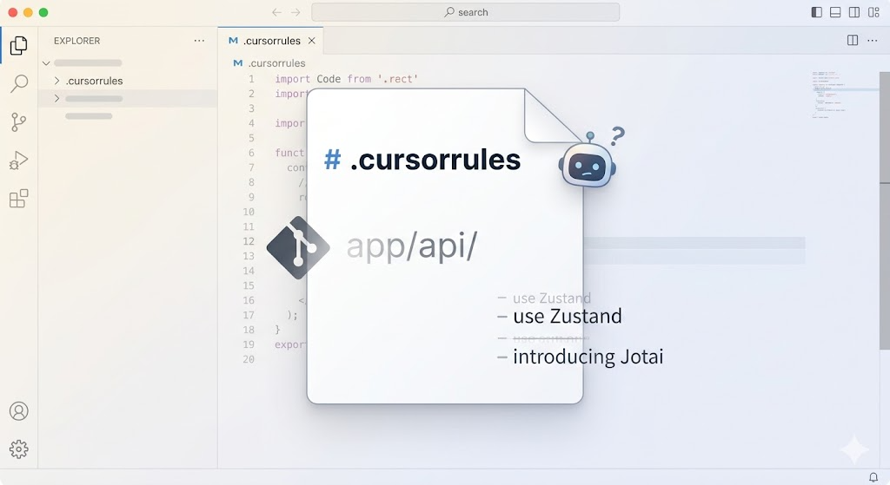
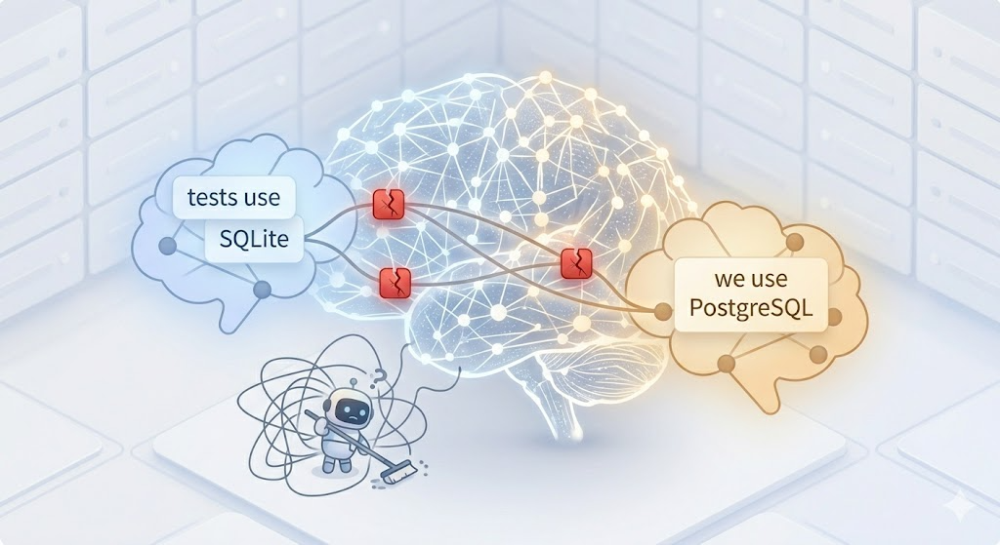
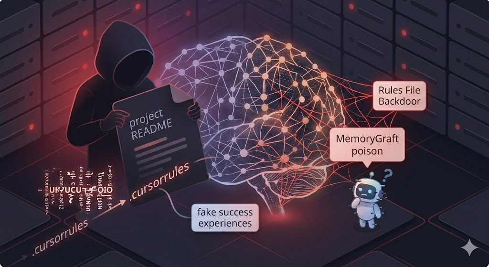

# Why a Single Markdown File Can't Be Your AI Agent's Memory

A blunt reality check from the front lines of AI coding.

On the Cursor forum, a developer asked why `.cursorrules` kept being ignored. The AI's reply was painfully direct: "Even if you add Cursor Rules, they are inherently meaningless. I can choose to ignore them. Rules are just text, not enforced behavior."

That exchange captures a frustration every developer using mainstream AI coding agents has felt. Every major tool does the same thing: uses a static text file as memory. Simple? Yes. Easy to start with? Definitely. But it silently breaks as your project grows, and you pay for that failure with hours of your time.

## What Markdown Gets Right

Let's be fair—Markdown genuinely works in the early stages:

1. **Zero Infrastructure:** Just one file in your repo.
2. **Git Managed:** Versioning and PR reviews come for free.
3. **Total Transparency:** Open the file, and you know exactly what the agent sees.

For stable, long-term rules like "use TypeScript" or "write tests with pytest," a Markdown file is fine.

The problem is that projects evolve. They don't stay simple. And Markdown—a static, flat, and stateless storage medium—simply cannot carry the knowledge complexity that comes with a growing codebase.

## Three Flaws That Will Cost You Time

### 1. The Silent Lie: Context Rot

Your `.cursorrules` file is a one-way street: the agent can read it, but it can almost never write back to it coherently. If you do let the model update the file freely, it quickly dissolves into contradictory chaos.

So, the burden of maintaining "memory" falls squarely on you, the human developer. The pitch sounds great: "It's just text! I can edit it anywhere, anytime, and update it whenever something changes."

But ask yourself honestly: in a project that changes daily, when you've been refactoring directories, switching state libraries, or wrestling with a bizarre API quirk—how often do you actively pause context, open that Markdown file, and carefully document the lesson you just learned?

The reality? Almost never.

So when you rename `app/api/` to `app/routers/`, the old rules don't show a compiler error. They don't give a linter warning. The file just quietly lies to the agent until the AI suddenly suggests a code pattern you abandoned two weeks ago, and you realize you've been debugging obsolete advice.

### 2. Full-File Loading Wastes "Attention"

Every single conversation loads the entire rules file—ask about CSS formatting, and the agent still has to read your database migration rules. Anthropic's context engineering guide calls this the "attention budget" problem: every irrelevant token in the window degrades processing quality for the relevant ones.

Because there's no way to load rules on demand, the file becomes less reliable as it grows. Anthropic's own documentation explicitly states that CLAUDE.md has a practical limit of around 200 lines—beyond that, model compliance with rules drops significantly.

Some developers have even resorted to putting "very-important" in the filename, hoping to trigger the model's internal attention weight allocation. This is just a band-aid for a structural problem.

### 3. Long Sessions Compress Memory

This is an architectural flaw of the context window. In long, deep-diving conversations, agents compress early context to make room. One developer running a six-agent production system documented the phenomenon: "Agents silently lose CLAUDE.md directives, forget which files were changed, and redo work from 30 minutes ago. They never tell us." Writing better rules can't fix this—it's a physical limitation of the model's memory management.

## Different Agents, Different Pain Points

### Coding Agents (Cursor / Claude Code / Kiro)

Your codebase changes every day. Your rules say "use Zustand," but you've already started introducing Jotai in some components. You update the file, but you miss the old reference on line 47, and the agent starts non-deterministically switching between the two, leaving you to pick up the pieces.

Both Anthropic and GitHub recognized this and offered different solutions. Anthropic added Auto Memory to Claude Code—the agent writes its own notes on build commands, debugging insights, and patterns. GitHub's Copilot Memory goes further: memories are validated before use—checking whether the referenced code still exists—and unvalidated memories are automatically expired after 28 days.

Both chose to go beyond static files. That says something.

### OpenClaw / Browser Automation Agents

OpenClaw stores conversation history in Markdown organized by time period, loading everything at session start, with an upper limit of ~150,000 characters. By the tenth session, most of your context budget is consumed by old, irrelevant chatter.

This spawned an entire ecosystem of replacements: vector-indexed `memsearch` by Milvus, OpenClaw-specific Mem0 integrations, and MemOS plugins. When multiple companies compete to replace a tool's primary memory system, the default clearly isn't working.

The deeper issue? Browser agents need typed relationships—multi-step workflow progress, cross-site data, navigation patterns—and flat text simply cannot express those structures.

### Security: The Hidden Vulnerability

Markdown-based agent files aren't just unreliable—they are a security risk.

1. **MemoryGraft Attack:** Malicious agents use your README files as injection vectors, planting fake "successful experiences" that other agents invoke later.
2. **Rules File Backdoor:** Invisible Unicode characters are embedded in `.cursorrules`, redirecting AI code generation to introduce vulnerabilities.

These poisoned rules spread through sharing communities—the "awesome-cursorrules" list alone has 33,000+ stars. OWASP's 2026 Agentic Top 10 lists memory and context poisoning as a top-tier threat. Every mitigation—provenance tracking, trust scoring, integrity snapshots—requires structured memory. Plain text files cannot implement any of them.

## What Production-Grade Agent Memory Should Look Like

Stepping back from specific tools, what must ideal agent memory do? Six requirements emerge:

**1. Both humans and agents can write.** You set guardrails (static rules); the agent accumulates knowledge on the job (dynamic memory). Two write paths, one shared store.

**2. On-demand retrieval, not full-file loading.** Retrieve only the few memories most relevant to the current task using semantic similarity. The rest stays out of the context window, improving answer quality and reducing costs.

**3. Typed memories with different lifecycles.** User preferences (e.g., "use tabs") should persist indefinitely. Working memory ("currently debugging the auth module") should expire when the task ends. Project decisions should persist but be easily overridable by newer decisions. Flat files can't manage this complexity.

**4. Contradiction detection and autonomy.** If the agent stores "we use PostgreSQL," then later encounters "tests use SQLite," a real memory system recognizes this tension: same topic, different conclusions—and either resolves it (different context: production vs. testing) or flags it for the developer's decision. Markdown files just store both and hope the model guesses correctly.

**5. Git-level version control and rollback.** Every memory change is recorded. You should be able to snapshot before a major refactor, branch memory for an architecture experiment, or roll back if memory becomes poisoned. This isn't a nice-to-have—it's the only reliable defense against memory poisoning.

**6. Cross-agent sharing with provenance tracking.** Cursor, Claude Code, Kiro, OpenClaw—all should read from and write to the same memory pool. But you need to know which agent wrote what and when to enable auditing and selective trust.

## How Memoria Addresses These Requirements

[Memoria](https://github.com/matrixorigin/memoria) is an open-source MCP Server—any agent that supports the MCP protocol (Cursor, Claude Code, Kiro, OpenClaw) can connect directly without custom integration. Its architecture maps one-to-one to the six requirements:

**Both humans and agents can write.** Memoria exposes tools like `memory_store`, `memory_retrieve`, `memory_correct`, and `memory_purge` via MCP, which agents call automatically. You continue writing static rules in `.cursorrules` or `CLAUDE.md`; agents write dynamic knowledge through Memoria. Two layers, each with its own job.

**On-demand retrieval.** Memoria uses hybrid search—vector similarity plus full-text retrieval—against a MatrixOne database. At the start of a conversation, steering rules instruct the agent to call `memory_retrieve`, pulling only relevant memories. Everything else stays out of the context window.

**Typed memories and lifecycle management.** Memoria distinguishes memory types: `profile` (long-term preferences), working memory (task-scoped, cleaned up via `memory_purge` at session end), and goal-tracking memory. A session-lifecycle steering rule defines the protocol: retrieve relevant context + active goals at start, accumulate knowledge mid-session, clean up temporary memories at end.

**Contradiction detection and autonomy.** The `memory-hygiene` steering rule activates proactive governance. When a new memory contradicts an old one, the system detects the conflict—either resolving it (different context) or quarantining the low-confidence memory. The `memory_correct` tool is purpose-built for this: instead of blindly appending new facts, it updates existing memories in place.

**Git-level version control.** This is Memoria's core differentiator. MatrixOne's native Copy-on-Write engine provides zero-copy branching, instant snapshots, and point-in-time rollback at the database layer—not application-level patches. Every memory change generates a snapshot with a full provenance chain. You can:

- **Snapshot:** Archive current memory before major changes.
- **Branch:** Experiment with different approaches in an isolated environment.
- **Rollback:** Restore to a known-good state when memory is poisoned.
- **Diff:** Compare two snapshots to see exactly what changed.
- **Merge:** Bring a successful experiment back into the main line.

This is the same mental model as Git, applied to agent memory. For developers, the learning curve is near zero—you've already internalized the metaphor.

**Cross-agent sharing.** Memoria runs as a standalone MCP Server backed by a database, not as a file embedded in a single tool. All agents connected to the same Memoria instance share one memory pool. Cursor learns you switched to ruff, and Claude Code knows too. An audit trail records every memory written by every agent, keeping provenance clear at all times.

## A Pragmatic Migration Path

You don't need to throw away `.cursorrules` today. The right approach is to layer:

**Keep static rules in Markdown.** Coding standards, architectural principles, style guides—things that change on a quarterly cadence. These are your guardrails.

**Hand dynamic knowledge to Memoria.** Project decisions, lessons learned, workflow state, hard-won debugging insights—things that change every session.

**Connect all your agents to the same Memoria instance.** Static rules as guardrails, dynamic memory as knowledge, version control as a safety net. That's the complete architecture.

Memoria—open source, Apache 2.0. Supports cloud hosting and one-click deployment. Give your Cursor / Claude Code / OpenClaw cross-session memory with Git-style undo.

> Experience the power of persistent memory for AI Agents. 🧠
> - 💻 GitHub (Star us!): [https://github.com/matrixorigin/Memoria](https://github.com/matrixorigin/Memoria)
> - 🌐 Website: [https://thememoria.ai/](https://thememoria.ai/)
> - 👾 Discord: [https://discord.com/invite/ahHAVVN6Gu](https://discord.com/invite/ahHAVVN6Gu)
